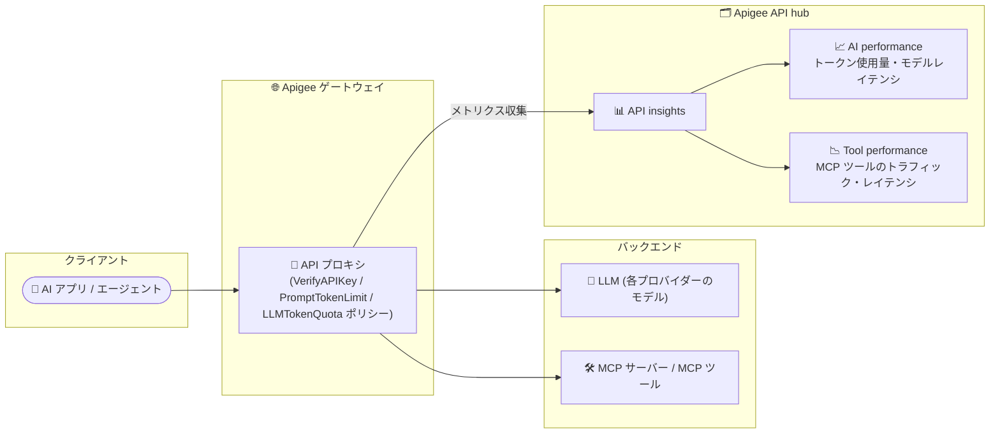

# Apigee API hub: API insights の AI performance / Tool performance ダッシュボード

**リリース日**: 2026-09-30

**サービス**: Apigee API hub

**機能**: API insights における AI performance / Tool performance ダッシュボード

**ステータス**: Feature (新機能)

📊 [このアップデートのインフォグラフィックを見る](https://takech9203.github.io/google-cloud-news-summary/20260930-apigee-api-hub-ai-tool-performance-dashboards.html)

## 概要

Apigee API hub の API insights に、AI・エージェントトラフィック向けの 2 つの新しいダッシュボード「AI performance」と「Tool performance」が追加されました。API insights は、API hub に接続されたすべてのゲートウェイ (またはプラグインインスタンス) を横断して API トラフィックとパフォーマンスを統合的に可視化する機能で、従来は Gateway performance、API performance、API error analysis、Latency analysis、Target performance の各ダッシュボードを提供していました。

**AI performance** ダッシュボードは、ゲートウェイ経由で呼び出される大規模言語モデル (LLM) のトークン使用量とモデルレイテンシをレポートし、モデルとプロバイダーによるフィルタリングが可能です。**Tool performance** ダッシュボードは、Model Context Protocol (MCP) ツールのトラフィック、スループット、ペイロードサイズ、レイテンシをレポートし、MCP サーバー、デプロイメント、ツール名によるフィルタリングが可能です。

生成 AI アプリケーションや AI エージェントのバックエンドとして Apigee をゲートウェイに採用している組織にとって、LLM のトークンコスト管理と MCP ツールの運用監視を API hub 上で一元的に行えるようになる重要なアップデートです。

**アップデート前の課題**

- API insights のダッシュボードは通常の API トラフィック (ゲートウェイ、API、エラー、レイテンシ、ターゲット) の分析が中心で、LLM 呼び出しに特化したトークン使用量やモデル別レイテンシを可視化する専用ダッシュボードがなかった
- AI エージェントが利用する MCP ツールのトラフィックやスループット、ペイロードサイズを API hub 上で分析する手段がなかった
- モデル別・プロバイダー別、あるいは MCP サーバー別・ツール別といった AI 特有の切り口でのフィルタリングができなかった

**アップデート後の改善**

- AI performance ダッシュボードで、ゲートウェイ経由の LLM 呼び出しについて、トークン使用量 (プロンプト/レスポンス)、アプリ別トークン消費、モデルレイテンシ (p50/p90/p99)、モデル別エラー率を可視化できるようになった
- Tool performance ダッシュボードで、MCP ツールのトラフィック量、TPS、リクエスト/レスポンスペイロードサイズ、レスポンスタイム、リクエスト/レスポンス処理レイテンシ (いずれも p50/p90/p99) を可視化できるようになった
- Model / Provider (AI performance)、MCP server name / Deployment name / MCP tool name (Tool performance) などのフィルターで、AI・エージェントトラフィックを詳細に絞り込めるようになった

## アーキテクチャ図

AI アプリやエージェントからのトラフィックが Apigee ゲートウェイを経由して LLM や MCP ツールに到達し、その際に収集されたメトリクスが API hub の API insights に集約され、新しい 2 つのダッシュボードで可視化されます。

## サービスアップデートの詳細

### 主要機能

1. **AI performance ダッシュボード**
   - ゲートウェイ経由で呼び出される LLM のトークン使用量とパフォーマンスを可視化
   - フィルター: Gateway name、Gateway type、Model、Provider
   - サマリースコアカード: Total tokens (総トークン数)、Prompt token share (プロンプトトークン比率)、Response token share (レスポンストークン比率)、Avg. model latency (平均モデルレイテンシ)
   - チャート: Prompt tokens by model / Response tokens by model (モデル別トークン数の時系列)、Tokens usage by app (アプリ別トークン使用量テーブル)、Model latency (p50/p90/p99)、Model error rate (%) by model

2. **Tool performance ダッシュボード**
   - MCP ツールのトラフィックとパフォーマンスを可視化
   - フィルター: Gateway name、Gateway type、MCP server name、Deployment name、MCP tool name
   - サマリースコアカード: Total traffic (総トラフィック)、Avg. response time (平均レスポンスタイム)、Avg. TPS (平均 TPS)
   - チャート: Transactions per second (TPS) per tool、Top tools by total traffic、Request/Response payload size (bytes) (p50/p90/p99)、Response time (ms) (p50/p90/p99)、Request/Response processing latency (ms) (p50/p90/p99)

3. **AI performance ダッシュボードのデータ収集ポリシー**
   - LLM をフロントする API プロキシに以下の 3 つのポリシーをアタッチすることでダッシュボードにデータが投入される
   - **VerifyAPIKey**: 呼び出し元アプリを識別し、Tokens usage by app テーブルのデータ源となる (未設定でも総トークン数は表示されるが、アプリ別内訳は空になる)
   - **PromptTokenLimit**: プロンプト (入力) トークン数を記録し、Prompt tokens by model チャートとサマリースコアカードのプロンプトトークン部分のデータ源となる
   - **LLMTokenQuota**: モデル名とレスポンス (出力) トークン数を記録し、Response tokens by model、Model latency、Model error rate の各チャートおよび Model / Provider フィルターのデータ源となる

## 技術仕様

### ダッシュボード比較

| 項目 | AI performance | Tool performance |
|------|----------------|------------------|
| 対象トラフィック | ゲートウェイ経由の LLM 呼び出し | MCP ツール呼び出し |
| フィルター | Gateway name / Gateway type / Model / Provider | Gateway name / Gateway type / MCP server name / Deployment name / MCP tool name |
| 主要メトリクス | トークン使用量、モデルレイテンシ、モデル別エラー率 | トラフィック、TPS、ペイロードサイズ、レスポンスタイム、処理レイテンシ |
| パーセンタイル | Model latency: p50 / p90 / p99 | ペイロードサイズ・レスポンスタイム・処理レイテンシ: p50 / p90 / p99 |
| 前提ポリシー | VerifyAPIKey、PromptTokenLimit、LLMTokenQuota | (公式ドキュメントに特別なポリシー要件の記載なし) |

**注**: パーセンタイルチャートは全モデル / 全 MCP ツールを横断してプールされたデータで計算されます。個別のモデルやツールのパーセンタイルを見るには、Model フィルターまたは MCP tool name フィルターを適用します。

### 必要な IAM ロール

API insights を閲覧するには、**API hub API Insights Viewer** (`roles/apihub.apiInsightsViewer`) ロールが必要です。このロールには `apihub.locations.getApiInsights`、`apihub.apis.list`、`monitoring.dashboards.get` などの権限が含まれます。

なお、API insights の IAM ロールはゲートウェイ単位ではなく、構成済みのすべてのゲートウェイに横断的に適用される点に注意が必要です。

## 設定方法

### 前提条件

1. API hub がプロビジョニングされていること (Apigee のプロビジョニングと合わせて API hub をプロビジョニングした場合、関連する Apigee ランタイムプロジェクトは自動的にアタッチされ、API insights のデータ収集・分析が自動で行われる)
2. 閲覧するプリンシパルに `roles/apihub.apiInsightsViewer` などの必要な IAM ロールが付与されていること
3. Apigee hybrid の場合はバージョン 1.14.0 以降であること
4. プラグインインスタンスを作成する場合、Apigee 組織で Data Residency (DRZ) が有効化されていないこと (DRZ 有効時はプラグインインスタンスの作成がサポートされない)

### 手順

#### ステップ 1: ゲートウェイを API hub に接続する

- **Apigee / Apigee hybrid**: ランタイムプロジェクトを API hub にアタッチする。既存のランタイムプロジェクトをアタッチ済みでもデータが表示されない場合は、プロジェクト関連付け設定を編集して必要な API アセットを API hub にインポートする
- **Apigee Edge Public Cloud / Private Cloud (OPDK)**: プラグインインスタンスを作成し、対応するコネクタをセットアップする (OPDK は 4.52.02.xx / 4.53.00.xx のみサポート)

#### ステップ 2: (AI performance の場合) LLM フロントプロキシにトークンポリシーをアタッチする

LLM をフロントする API プロキシに VerifyAPIKey、PromptTokenLimit、LLMTokenQuota の 3 つのポリシーをアタッチします。すべてのチャートとフィルターにデータを表示するには、3 つすべてのアタッチが推奨されています。分析目的のみでトークンポリシーを使う構成については、公式チュートリアル「[Get started with LLM token policies](https://docs.cloud.google.com/apigee/docs/api-platform/tutorials/using-ai-token-policies)」を参照してください。

#### ステップ 3: ダッシュボードを表示する

Google Cloud コンソールで **API hub > API insights** ページに移動し、**AI performance** タブまたは **Tool performance** タブを選択します。

## メリット

### ビジネス面

- **LLM コストの可視化**: トークン使用量をモデル別・アプリ別に把握できるため、生成 AI 利用のコスト配分やチャージバックの基礎データとして活用できる
- **AI エージェント運用の統制**: MCP ツールの利用状況をツール単位で把握でき、エージェントエコシステム全体のガバナンス強化につながる

### 技術面

- **一元的な監視**: 通常の API トラフィックと AI・エージェントトラフィックを、同じ API insights 画面で横断的に監視できる
- **パーセンタイルベースの分析**: モデルレイテンシや MCP ツールのレスポンスタイムを p50/p90/p99 で分析でき、テールレイテンシの問題を発見しやすい
- **詳細なフィルタリング**: Model / Provider / MCP server name / MCP tool name などの AI 特有のディメンションでドリルダウンできる

## デメリット・制約事項

### 制限事項

- 時系列チャートとテーブルは上位 50 リソースまでの表示に制限される
- API insights は Apigee、Apigee hybrid、Apigee Edge Public Cloud、Apigee Edge Private Cloud (OPDK) のみをサポート (カスタムプラグインと API observations からのデータ取り込みは非サポート)
- API insights のデータは API 経由でのアクセスができない
- BigQuery、Cloud Storage、Data Studio などの他の Google Cloud サービスへのメトリクスデータのエクスポートはサポートされない

### 考慮すべき点

- AI performance ダッシュボードのデータを完全に表示するには、LLM フロントプロキシへの 3 つのポリシー (VerifyAPIKey / PromptTokenLimit / LLMTokenQuota) のアタッチが必要。ポリシーが不足するとチャートの一部が空になる
- パーセンタイルチャートは全モデル / 全ツールのプールされたデータで計算されるため、個別分析にはフィルターの適用が必要
- API insights の IAM ロールはゲートウェイ単位の権限分離ができず、付与されたユーザーはすべてのゲートウェイのデータを閲覧できる

## ユースケース

### ユースケース 1: 生成 AI アプリのトークンコスト管理

**シナリオ**: 複数の社内アプリケーションが Apigee ゲートウェイ経由で複数プロバイダーの LLM を呼び出しており、どのアプリ・どのモデルがトークンを多く消費しているか把握したい。

**実装例**: LLM フロントプロキシに VerifyAPIKey、PromptTokenLimit、LLMTokenQuota ポリシーをアタッチし、AI performance ダッシュボードで Tokens usage by app テーブルと Prompt/Response tokens by model チャートを確認する。Provider フィルターでプロバイダー別の使用量も比較する。

**効果**: アプリ別・モデル別のトークン消費が可視化され、コストの多いワークロードの特定やモデル選定の最適化に活用できる。

### ユースケース 2: AI エージェント基盤の MCP ツール監視

**シナリオ**: AI エージェントが多数の MCP ツールをゲートウェイ経由で呼び出しており、特定ツールの遅延やペイロード肥大化がエージェント全体の応答性に影響していないか監視したい。

**効果**: Tool performance ダッシュボードの Response time (p50/p90/p99) や Request/Response payload size チャートで、遅延の大きいツールやペイロードの大きい呼び出しを特定できる。MCP tool name フィルターで個別ツールのパーセンタイル分析も可能。

## 料金

API hub は無償のサービスとして提供されています (2025 年 7 月 22 日付の API hub リリースノートに「API hub remains a free service」と明記)。ただし、API insights のデータ源となる Apigee ゲートウェイ自体の利用には、環境タイプや API 呼び出し数に応じた Apigee の料金が発生します。

詳細は [Apigee の料金ページ](https://cloud.google.com/apigee/pricing) を参照してください。

## 利用可能リージョン

公式リリースノートおよびドキュメントにリージョン固有の記載は確認できませんでした。API hub のサポートリージョンは [API hub locations](https://docs.cloud.google.com/apigee/docs/apihub/locations) を参照してください。

## 関連サービス・機能

- **Apigee API Analytics**: API insights は Apigee の API analytics を拡張し、API hub 上で複数ゲートウェイを横断した統合ビューを提供する
- **Apigee LLM トークンポリシー (PromptTokenLimit / LLMTokenQuota)**: AI performance ダッシュボードのデータ源となるポリシー。トークン数の制限・クォータ管理と分析の両方に利用できる
- **Cloud Monitoring**: API insights の閲覧権限には `monitoring.dashboards.get` などの Cloud Monitoring 関連権限が含まれ、ダッシュボード基盤として連携している

## 参考リンク

- 📊 [インフォグラフィック](https://takech9203.github.io/google-cloud-news-summary/20260930-apigee-api-hub-ai-tool-performance-dashboards.html)
- [公式リリースノート](https://docs.cloud.google.com/release-notes#September_30_2026)
- [API insights dashboards](https://docs.cloud.google.com/apigee/docs/apihub/api-insights-dashboard)
- [API insights overview](https://docs.cloud.google.com/apigee/docs/apihub/api-insights-overview)
- [Configure API insights](https://docs.cloud.google.com/apigee/docs/apihub/configure-api-insights)
- [Get started with LLM token policies](https://docs.cloud.google.com/apigee/docs/api-platform/tutorials/using-ai-token-policies)
- [料金ページ (Apigee)](https://cloud.google.com/apigee/pricing)

## まとめ

Apigee API hub の API insights に AI performance / Tool performance ダッシュボードが追加され、LLM のトークン使用量・レイテンシと MCP ツールのトラフィック・パフォーマンスを API hub 上で一元的に監視できるようになりました。Apigee を AI ゲートウェイとして利用している組織は、LLM フロントプロキシへのトークンポリシー (VerifyAPIKey / PromptTokenLimit / LLMTokenQuota) のアタッチを検討し、AI・エージェントトラフィックの可視化を始めることを推奨します。

---

**タグ**: Apigee, API hub, API insights, AI performance, Tool performance, LLM, MCP, 生成 AI, モニタリング
