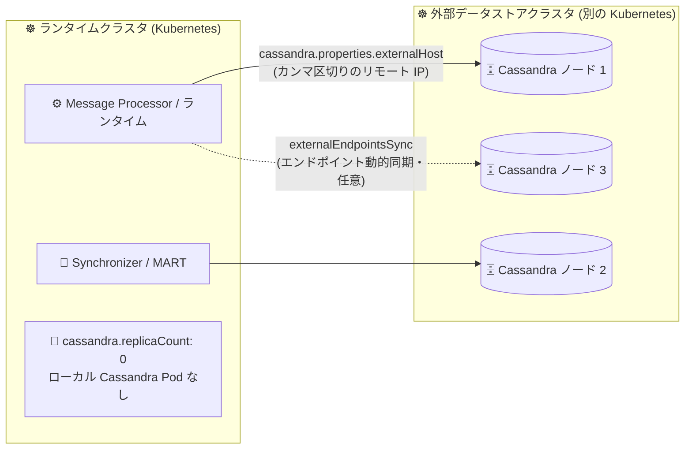

# Apigee hybrid: v1.17.1 リリース - 外部 Cassandra データストアのサポート

**リリース日**: 2026-09-30

**サービス**: Apigee hybrid

**機能**: v1.17.1 パッチリリース (外部 Cassandra データストアモードのサポート)

**ステータス**: リリース済み (v1.17.1)

📊 [このアップデートのインフォグラフィックを見る](https://takech9203.github.io/google-cloud-news-summary/20260930-apigee-hybrid-v1-17-1.html)

## 概要

2026 年 9 月 30 日、Apigee hybrid v1.17.1 がリリースされました。本リリースは Helm チャートと統合されたコンテナイメージを含むパッチリリースであり、あわせて重要な新機能として「外部 Cassandra データストア (external datastore mode)」のサポートが追加されました。

外部データストアモードでは、Apigee hybrid のランタイムクラスタを、別の Kubernetes クラスタで稼働する Cassandra データストアに接続できます。ランタイムクラスタ側は `cassandra.replicaCount: 0` に設定してローカルの Cassandra Pod を持たず、`cassandra.properties.externalHost` (カンマ区切りのリモート Cassandra IP アドレス) を通じてリモートの Cassandra リングに接続します。オプションの `cassandra.properties.externalEndpointsSync` プロパティにより、エンドポイントの動的な同期にも対応します。

Cassandra は Apigee hybrid のランタイムプレーンにおいて KMS (API キー、OAuth トークン)、KVM、キャッシュなどの永続データを保持する中核コンポーネントです。ステートフルな Cassandra とステートレスなランタイムコンポーネントを別クラスタに分離できるようになったことで、大規模運用におけるクラスタ設計の柔軟性が向上します。あわせて、Apigee オペレーターの Kubernetes マネージャーロールに core `endpoints` 権限が追加される変更が含まれています。

**アップデート前の課題**

- ランタイムクラスタ内に Cassandra Pod (StatefulSet) を同居させる構成が前提であり、ステートレスなランタイムコンポーネントとステートフルなデータストアを同一クラスタで一体として運用する必要があった
- Cassandra を別の Kubernetes クラスタに切り出してランタイムクラスタから接続する、公式にサポートされた構成がなかった

**アップデート後の改善**

- ランタイムクラスタを `cassandra.replicaCount: 0` で稼働させ、ローカル Cassandra Pod なしで別クラスタの Cassandra リングに接続できるようになった (external datastore mode)
- `cassandra.properties.externalHost` にリモート Cassandra の IP をカンマ区切りで指定するだけで接続先を構成できるようになった
- オプションの `cassandra.properties.externalEndpointsSync` により、リモート Cassandra エンドポイントの動的な同期が可能になった
- コンテナイメージが Helm チャートと統合されたパッチリリースとして提供され、Helm ベースの標準手順でアップグレードできる

## アーキテクチャ図



v1.17.1 の外部データストアモードでは、ランタイムクラスタはローカル Cassandra Pod を持たず (`replicaCount: 0`)、`externalHost` で指定した別 Kubernetes クラスタ上の Cassandra リングに接続してデータを読み書きします。

## サービスアップデートの詳細

### 主要機能

1. **外部 Cassandra データストアのサポート (external datastore mode)**
   - Apigee hybrid ランタイムを、別の Kubernetes クラスタで稼働する Cassandra データストアに接続できる
   - ランタイムクラスタは `cassandra.replicaCount: 0` で稼働し、ローカルの Cassandra Pod を持たない
   - `cassandra.properties.externalHost` にリモート Cassandra の IP アドレスをカンマ区切りで指定して接続する
   - オプションの `cassandra.properties.externalEndpointsSync` プロパティで、エンドポイントの動的な同期に対応

2. **Helm チャートと統合されたパッチリリース**
   - v1.17.1 はコンテナイメージが Helm チャートと統合されたパッチリリースとして提供される
   - マイナーバージョンアップグレード (1.16 → 1.17) とパッチアップグレード (1.17.0 → 1.17.1) は同じ手順で実施できる

3. **Apigee オペレーターの権限変更**
   - Apigee オペレーターの Kubernetes マネージャーロールに、core API グループの `endpoints` 権限が追加された

### v1.17 系の主な機能 (参考)

アップグレードドキュメントによると、v1.17 系では以下の機能も利用できます。

- **Model Context Protocol (MCP) サポート**: エージェント型 AI アプリケーションが API をツールとして利用できるマネージド MCP エンドポイントに対応
- **ルート CA 証明書のローテーション**: ランタイムコンポーネント間の TLS 通信を支えるルート CA 証明書を、段階的な手順でダウンタイムなしに交換可能
- **TLS 1.3 サポート**: Ingress ゲートウェイで TLS 1.3 を構成可能
- **AI ポリシーのフォワードプロキシ対応**: Model Armor やセマンティックキャッシュポリシーのアウトバウンド呼び出しを HTTP フォワードプロキシ経由でルーティング可能
- **セマンティックキャッシュの Private Service Connect (PSC) エンドポイント対応**

## 技術仕様

### 外部データストアモードの構成プロパティ

| プロパティ | 説明 |
|------|------|
| `cassandra.replicaCount` | 外部データストアモードでは `0` を設定し、ランタイムクラスタ内にローカル Cassandra Pod を作成しない |
| `cassandra.properties.externalHost` | リモート Cassandra リングの IP アドレス (カンマ区切りで複数指定) |
| `cassandra.properties.externalEndpointsSync` | (オプション) リモート Cassandra エンドポイントの動的な同期を有効化 |

### 設定例 (overrides.yaml)

```yaml
cassandra:
  replicaCount: 0  # ローカル Cassandra Pod を作成しない
  properties:
    externalHost: "10.0.0.10,10.0.0.11,10.0.0.12"  # リモート Cassandra の IP (カンマ区切り)
    externalEndpointsSync: true  # オプション: エンドポイントの動的同期
```

### Cassandra が保持するデータ

Apigee hybrid の Cassandra はランタイムプレーンのローカル永続ストレージとして、KMS (API キー、OAuth トークン)、KVM、キャッシュのデータを保持します。

## 設定方法

### 前提条件 (v1.17.1 へのアップグレード)

1. Apigee hybrid v1.16 以降が稼働していること (v1.15 以前からは、先に v1.16 へのアップグレードが必要)
2. Helm v3.14.2 以降
3. Kubernetes プラットフォームバージョンに対応したサポート対象の `kubectl`
4. サポート対象バージョンの cert-manager

### 手順

#### ステップ 1: チャートバージョンの指定

```bash
export CHART_VERSION=1.17.1
```

Helm チャートのバージョンとして 1.17.1 を指定します。

#### ステップ 2: Helm によるアップグレードの適用

```bash
# 例: オペレーターのアップグレード
helm upgrade operator apigee-operator/ \
  --namespace apigee-system \
  --atomic \
  -f overrides.yaml
```

公式ドキュメント「[Upgrading Apigee hybrid to v1.17.1](https://docs.cloud.google.com/apigee/docs/hybrid/v1.17/upgrade)」の手順に従い、バックアップの取得後に各コンポーネントを Helm でアップグレードします。マイナーアップグレードとパッチアップグレードは同じ手順です。

## メリット

### ビジネス面

- **クラスタ設計の柔軟性向上**: ステートフルな Cassandra とステートレスなランタイムを別クラスタに分離でき、組織のクラスタ運用ポリシーに合わせた構成が取りやすくなる
- **運用の分離**: データストアクラスタとランタイムクラスタのライフサイクル (スケーリング、メンテナンス) を独立して管理できる

### 技術面

- **ランタイムクラスタの軽量化**: `cassandra.replicaCount: 0` によりランタイムクラスタからステートフルワークロードを排除できる
- **シンプルな接続構成**: `externalHost` にカンマ区切りで IP を指定するだけでリモート Cassandra リングに接続できる
- **エンドポイントの動的同期**: `externalEndpointsSync` により、リモート側のエンドポイント変化に動的に追従できる

## デメリット・制約事項

### 制限事項

- 1 つの Apigee 組織配下のすべての Kubernetes クラスタ / リージョンは、単一の統合された Cassandra リングに参加する必要がある。同一組織で複数の独立した Cassandra リングを運用する構成 (スプリットブレイン状態) はサポートされない
- Cassandra のバックアップ / リストアはバージョン混在では機能しない (例: v1.16 のバックアップを v1.17 インスタンスのリストアに使用できない)

### 考慮すべき点

- v1.17.1 への Apigee コントローラーのアップグレード時には、すべての Apigee デプロイメントがローリング再起動される。本番環境では 2 つ以上のクラスタを稼働させ、トラフィックを片方に寄せてから順次アップグレードすることが推奨されている
- v1.15 以前からアップグレードする場合は、先に v1.16 へのアップグレードが必要
- 外部データストアモードではランタイムクラスタと Cassandra クラスタ間のネットワーク到達性 (IP 指定での接続) を確保する必要がある

## ユースケース

### ユースケース 1: データストアとランタイムのクラスタ分離運用

**シナリオ**: 大規模な Apigee hybrid 環境で、ステートフルな Cassandra を専用の Kubernetes クラスタで集中管理し、API トラフィックを処理するランタイムクラスタはステートレスに保ちたい。

**実装例**:
```yaml
# ランタイムクラスタ側の overrides.yaml
cassandra:
  replicaCount: 0
  properties:
    externalHost: "10.0.0.10,10.0.0.11,10.0.0.12"
    externalEndpointsSync: true
```

**効果**: ランタイムクラスタのノード構成を API 処理に最適化しつつ、Cassandra はストレージ要件 (SSD、リソース) に最適化した専用クラスタで運用できる。

### ユースケース 2: ランタイムクラスタの入れ替え・再構築の容易化

**シナリオ**: ランタイムクラスタの再構築や Kubernetes バージョン更新を行う際、永続データを保持する Cassandra を別クラスタに分離しておきたい。

**効果**: 永続データが外部データストアクラスタ側にあるため、ランタイムクラスタをステートレスに扱え、クラスタ運用の自由度が高まる。

## 料金

Apigee hybrid 自体の料金体系に関する本アップデートによる変更は、リリースノートには記載されていません。Apigee の料金は以下の公式ページを参照してください。

- [Apigee 料金ページ](https://cloud.google.com/apigee/pricing)

なお、外部データストアモードでは Cassandra 用の Kubernetes クラスタを別途運用するため、そのインフラコストは利用者側の環境 (GKE、他クラウド、オンプレミス) に依存します。

## 関連サービス・機能

- **Google Kubernetes Engine (GKE)**: Apigee hybrid のランタイムクラスタおよび外部 Cassandra データストアクラスタの稼働基盤の 1 つ
- **Apache Cassandra**: Apigee hybrid ランタイムプレーンの永続データストア。KMS (API キー、OAuth トークン)、KVM、キャッシュデータを保持
- **Helm**: v1.17.1 のコンテナイメージは Helm チャートと統合されており、インストール / アップグレードは Helm (v3.14.2+) で行う
- **cert-manager**: Apigee hybrid の TLS 証明書管理に必要なコンポーネント

## 参考リンク

- 📊 [インフォグラフィック](https://takech9203.github.io/google-cloud-news-summary/20260930-apigee-hybrid-v1-17-1.html)
- [公式リリースノート](https://docs.cloud.google.com/release-notes#September_30_2026)
- [Upgrading Apigee hybrid to v1.17.1](https://docs.cloud.google.com/apigee/docs/hybrid/v1.17/upgrade)
- [Apigee hybrid v1.17 構成プロパティリファレンス](https://docs.cloud.google.com/apigee/docs/hybrid/v1.17/config-prop-ref)
- [Apigee hybrid のマルチリージョンデプロイ](https://docs.cloud.google.com/apigee/docs/hybrid/v1.17/multi-region)
- [料金ページ](https://cloud.google.com/apigee/pricing)

## まとめ

Apigee hybrid v1.17.1 は、外部 Kubernetes クラスタ上の Cassandra リングにランタイムを接続できる外部データストアモードを導入したパッチリリースです。ステートフルなデータストアとステートレスなランタイムをクラスタ単位で分離できるため、大規模環境でのクラスタ設計と運用の柔軟性が大きく向上します。Apigee hybrid を運用中のチームは、公式のアップグレード手順 (ローリング再起動やバックアップのバージョン互換性に注意) を確認のうえ、v1.17.1 への計画的なアップグレードを検討してください。

---

**タグ**: #ApigeeHybrid #Cassandra #Kubernetes #Helm #APIManagement #Datastore
