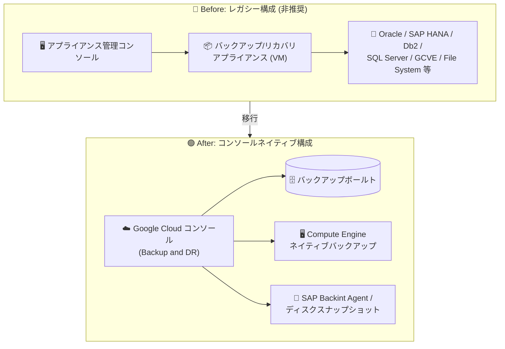
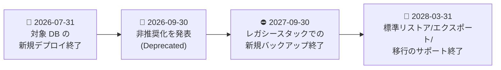

# Backup and DR: レガシーアプライアンス管理コンソールの非推奨化

**リリース日**: 2026-09-30

**サービス**: Backup and DR Service

**機能**: レガシーアプライアンス管理コンソールで管理されるワークロードのバックアップ・リストアサポートの非推奨化

**ステータス**: Deprecated (非推奨)

📊 [このアップデートのインフォグラフィックを見る](https://takech9203.github.io/google-cloud-news-summary/20260930-backup-and-dr-legacy-console-deprecation.html)

## 概要

Google Cloud は 2026 年 9 月 30 日付で、Backup and DR Service のレガシーアプライアンス管理コンソール (appliance management console) を介して管理されるワークロードのバックアップおよびリストアのサポートを非推奨 (Deprecated) にすると発表しました。これは、アプライアンスベースの旧アーキテクチャから、Google Cloud コンソールネイティブでアプライアンス不要のバックアップ (バックアップボールト方式) への移行を促す大きな転換点となるアップデートです。

主要なマイルストーンは 2 つです。**2027 年 9 月 30 日以降はレガシースタックを使用した新規バックアップの実行ができなくなり**、**レガシーアプライアンス管理コンソールを使用した標準リストア・エクスポート・移行のサポートは 2028 年 3 月 31 日まで継続**されます。また、公式の非推奨ドキュメントによると、2026 年 7 月 31 日以降は対象データベースのアプライアンス管理コンソールへの新規デプロイもサポートされません。

重要な点として、**Google のファーストパーティマネージドサービス (Compute Engine VM、Persistent Disk、Cloud SQL、AlloyDB for PostgreSQL、Filestore) のコンソールネイティブなバックアップは今回の非推奨化の影響を一切受けません**。影響を受けるのは、レガシーアプライアンス管理コンソール経由で管理されているワークロードのみです。

**アップデート前の課題**

レガシーアプライアンス管理コンソールを利用した従来の構成には、以下の特徴・課題がありました。

- バックアップ/リカバリアプライアンス (Compute Engine VM として稼働) のデプロイと運用管理が必要だった
- アプライアンス管理コンソールで管理されるワークロードは、Google Cloud コンソールネイティブのバックアップボールト方式とは異なる構成モデルを持ち、管理体系が分離していた
- Oracle、SAP HANA、Db2 などのユーザー管理データベースのバックアップがアプライアンスベースのレガシースタックに依存していた

**アップデート後の改善 (移行後の姿)**

今回の非推奨化により、Google Cloud はアプライアンス不要のネイティブバックアップへの移行パスを提示しています。

- Compute Engine は [Backup and DR for Compute Engine](https://docs.cloud.google.com/backup-disaster-recovery/docs/cloud-console/compute/compute-instance-backup) によるネイティブでアプライアンス不要のバックアップに移行できる
- ユーザー管理データベース (Oracle、Db2 など) は guest-flush フレームワークとカスタムスクリプトを組み合わせたアプリケーション整合性のある VM/Persistent Disk バックアップを利用できる
- SAP HANA は GCP SAP Backint Agent またはディスクスナップショットによるバックアップ・リカバリに移行できる

## アーキテクチャ図

1 つ目の図はレガシーアプライアンス構成からコンソールネイティブ構成への移行の全体像、2 つ目の図は非推奨化の主要マイルストーンのタイムラインを示しています。

## サービスアップデートの詳細

### 主要マイルストーン

1. **非推奨化の発表 (2026 年 9 月 30 日)**
   - レガシーアプライアンス管理コンソールで管理されるワークロードのバックアップ・リストアのサポートが非推奨に
   - 2026 年 7 月 31 日以降、対象データベースのアプライアンス管理コンソールへの新規デプロイはサポート対象外

2. **新規バックアップのサポート終了 (2027 年 9 月 30 日)**
   - この日以降、レガシースタックを使用した新規バックアップの実行が不可能になる

3. **標準リストアのサポート終了 (2028 年 3 月 31 日)**
   - レガシーアプライアンス管理コンソールを使用した標準リストア、エクスポート、移行のサポートはこの日まで継続
   - 保持したいバックアップデータは、この期限までにリストア・移行を完了する必要がある

### 影響を受けるワークロード

公式ドキュメントによると、以下のワークロード (レガシーアプライアンス管理コンソール経由で管理されるもの) が影響を受けます。

| 分類 | 対象ワークロード |
|------|-----------------|
| コンピュート | Compute Engine (レガシーアプライアンス管理コンソール管理のもの)、Google Cloud VMware Engine (GCVE) |
| データベース | Oracle Database、Db2 Instance、SAP HANA、Microsoft SQL Server |
| その他 | Generic App、Consistency Group、File System、System State、NFS、CIFS などのユーザー管理アプリ |

**影響を受けないもの**: Compute Engine VM、Persistent Disk、Cloud SQL、AlloyDB for PostgreSQL、Filestore など Google ファーストパーティマネージドサービスのコンソールネイティブバックアップは完全に無関係です。

### 関連する先行の非推奨化 (2026 年 7 月発表)

今回の発表とは別に、SAP ASE、SAP IQ、SAP MaxDB、MariaDB、MySQL、PostgreSQL のアプライアンス管理コンソールでのバックアップは、2026 年 7 月 31 日付で先行して非推奨化されています (新規バックアップ終了: 2027 年 7 月 31 日、移行期限: 2027 年 12 月 30 日)。

## 移行方法 (推奨される代替手段)

公式ドキュメントで案内されている移行先は以下のとおりです。

| 現在のワークロード | 推奨される移行先 |
|-------------------|-----------------|
| Compute Engine | [Backup and DR for Compute Engine](https://docs.cloud.google.com/backup-disaster-recovery/docs/cloud-console/compute/compute-instance-backup) によるネイティブでアプライアンス不要のバックアップ |
| ユーザー管理データベース (Oracle、Db2 など) | [guest-flush フレームワーク](https://cloud.google.com/compute/docs/disks/creating-linux-application-consistent-pd-snapshots)と[カスタムスクリプト](https://docs.cloud.google.com/backup-disaster-recovery/docs/cloud-console/compute/application-consistent-backups-for-self-managed-databases)を用いた Compute Engine VM / Persistent Disk バックアップ |
| SAP HANA | [GCP SAP Backint Agent](https://cloud.google.com/sap/docs/agent-for-sap/latest/backint-backup-recovery) または[ディスクスナップショット](https://cloud.google.com/sap/docs/agent-for-sap/latest/disk-snapshot-backup-recovery) |
| MySQL / PostgreSQL | Cloud SQL または AlloyDB for PostgreSQL などのフルマネージドデータベースサービスへの移行 |
| 汎用 VM / その他 | [ネイティブディスクスナップショット](https://cloud.google.com/compute/docs/disks/create-snapshots)または [Google Cloud Marketplace](https://console.cloud.google.com/marketplace) のサードパーティソリューション (Veeam、Cohesity など) |

### 移行完了後のデコミッション手順 (概要)

移行が完了したら、公式の[デコミッションガイド](https://docs.cloud.google.com/backup-disaster-recovery/docs/configuration/decommission)に従い、以下を実施します。

1. すべてのアプリケーションからバックアッププランを削除
2. マウント中のイメージをすべてアンマウント
3. 保護対象アプリケーションのバックアップを期限切れ (expire) に設定
4. アプライアンス管理コンソールからバックアップ/リカバリアプライアンスを削除
5. アプライアンス VM、ファイアウォールルール、サービスアカウント、暗号鍵、不要になった Cloud Storage バケット / バックアップボールトを削除
6. 不要になった API を無効化

## メリット

### ビジネス面

- **運用コストの削減余地**: アプライアンス VM の運用・管理が不要になるネイティブバックアップへ移行することで、インフラ管理の負担を軽減できる
- **明確な移行スケジュール**: 発表から新規バックアップ終了まで 1 年、リストア終了まで 1 年半の猶予があり、計画的な移行が可能

### 技術面

- **アプライアンスフリーのアーキテクチャ**: Compute Engine のネイティブバックアップやバックアップボールトはアプライアンスのデプロイが不要
- **管理体系の統一**: Google Cloud コンソールネイティブの構成モデルに一本化され、アプライアンス管理コンソールとの二重管理が解消される

## デメリット・制約事項

### 制限事項

- 2027 年 9 月 30 日以降、レガシースタックでの新規バックアップは実行不可
- 2028 年 3 月 31 日以降、レガシーアプライアンス管理コンソールでの標準リストア・エクスポート・移行はサポート対象外
- SAP ASE、SAP IQ、SAP MaxDB、MariaDB などのデータベースには Google の直接的なファーストパーティ代替は提供されず、ネイティブのバックアップユーティリティ (mysqldump、pg_dump、SAP のバックアップツールなど) やサードパーティソリューションの利用が推奨される

### 考慮すべき点

- レガシーアプライアンスで取得した既存バックアップのうち保持が必要なデータは、期限までにライブ環境へのリストアなどで退避する必要がある
- ユーザー管理データベースの移行先 (ネイティブスナップショット + スクリプト、Backint Agent、サードパーティ製品など) はワークロードごとに検討が必要で、バックアップ方式や整合性保証のレベルが従来と異なる場合がある
- サードパーティソリューションの利用には追加コストとベンダー管理が発生する

## ユースケース

### ユースケース 1: レガシーアプライアンスで保護している Compute Engine VM の移行

**シナリオ**: レガシーアプライアンス管理コンソール経由で Compute Engine VM のバックアップを運用している企業が、2027 年 9 月の新規バックアップ終了前に移行する。

**効果**: Backup and DR for Compute Engine のネイティブバックアップ (バックアップボールト方式) に移行することで、アプライアンス VM の運用が不要になり、Google Cloud コンソールから一元的にバックアップを管理できる。

### ユースケース 2: SAP HANA バックアップの Backint Agent への移行

**シナリオ**: アプライアンス経由で SAP HANA のバックアップを取得している SAP 利用企業が、移行期限を見据えて代替方式を検討する。

**効果**: GCP SAP Backint Agent またはディスクスナップショットによるバックアップ・リカバリに移行することで、レガシースタック廃止後も SAP HANA のデータ保護を継続できる。

## 料金

今回のアップデートは非推奨化の発表であり、料金体系の変更に関する情報はリリースノートに含まれていません。Backup and DR の料金は公式料金ページを参照してください。

- [Backup and DR の料金](https://cloud.google.com/backup-disaster-recovery/pricing)

## 関連サービス・機能

- **Backup and DR (バックアップボールト)**: コンソールネイティブなバックアップ保管先。Compute Engine、Cloud SQL、AlloyDB、Filestore などをアプライアンスなしで保護
- **Compute Engine (ディスクスナップショット / guest-flush)**: ユーザー管理データベースや汎用 VM のアプリケーション整合性バックアップの代替手段
- **Google Cloud's Agent for SAP (Backint)**: SAP HANA のバックアップ・リカバリの移行先
- **Cloud SQL / AlloyDB for PostgreSQL**: MySQL / PostgreSQL ワークロードの移行先として推奨されるフルマネージドデータベース
- **Google Cloud Marketplace**: Veeam、Cohesity などサードパーティのバックアップソリューションの入手先

## 参考リンク

- 📊 [インフォグラフィック](https://takech9203.github.io/google-cloud-news-summary/20260930-backup-and-dr-legacy-console-deprecation.html)
- [公式リリースノート](https://docs.cloud.google.com/release-notes#September_30_2026)
- [Backup and DR の機能非推奨情報 (Deprecations)](https://docs.cloud.google.com/backup-disaster-recovery/docs/deprecations)
- [レガシーデータベースバックアップの移行ガイド](https://docs.cloud.google.com/backup-disaster-recovery/docs/deprecations/migrating-legacy-databases)
- [Backup and DR for Compute Engine](https://docs.cloud.google.com/backup-disaster-recovery/docs/cloud-console/compute/compute-instance-backup)
- [Backup and DR のデコミッション手順](https://docs.cloud.google.com/backup-disaster-recovery/docs/configuration/decommission)
- [料金ページ](https://cloud.google.com/backup-disaster-recovery/pricing)

## まとめ

Backup and DR のレガシーアプライアンス管理コンソールが正式に非推奨となり、新規バックアップは 2027 年 9 月 30 日まで、標準リストアは 2028 年 3 月 31 日までという明確な期限が設定されました。Oracle、SAP HANA、Db2、SQL Server、GCVE などをアプライアンス経由で保護している場合は、影響範囲の棚卸しを早急に行い、ワークロードごとに推奨される移行先 (ネイティブバックアップ、Backint Agent、サードパーティソリューションなど) への移行計画を策定することを推奨します。

---

**タグ**: #BackupAndDR #Deprecation #DisasterRecovery #Migration #SAP #Oracle #ComputeEngine
