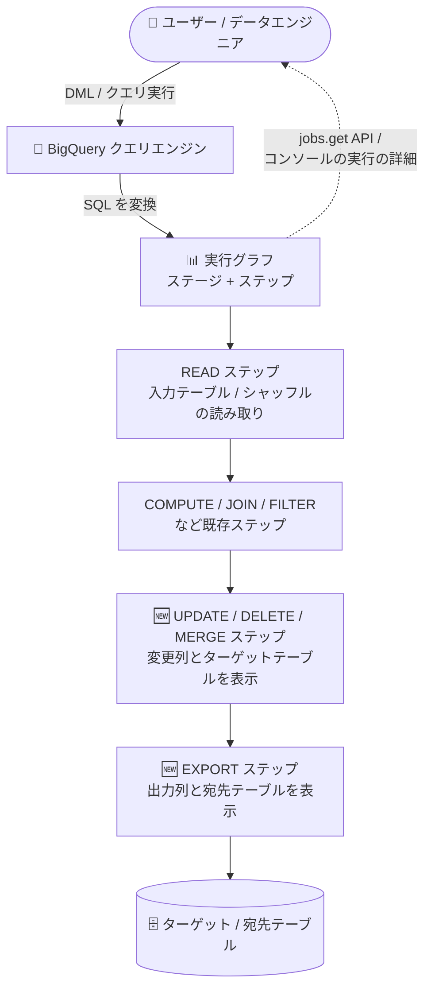

# BigQuery: クエリプランで UPDATE / DELETE / MERGE / EXPORT 実行ステップの表示に対応

**リリース日**: 2026-09-30

**サービス**: BigQuery

**機能**: クエリプランにおける UPDATE、DELETE、MERGE、EXPORT 実行ステップの表示

**ステータス**: Feature

📊 [このアップデートのインフォグラフィックを見る](https://takech9203.github.io/google-cloud-news-summary/20260930-bigquery-query-plan-dml-export-steps.html)

## 概要

BigQuery のクエリプラン (query plan) で、**UPDATE、DELETE、MERGE、EXPORT の実行ステップを表示できる**ようになりました。これにより、データ操作言語 (DML) ステートメントや、結果を宛先テーブルへマテリアライズするクエリについても、どのステージでどのような操作が実行されたのかをステップレベルで確認できます。

BigQuery はクエリを実行する際、SQL を「ステージ (stage)」で構成される実行グラフに変換します。各ステージは「ステップ (step)」と呼ばれる基本操作で構成され、これまでも READ、WRITE、COMPUTE、FILTER、SORT、AGGREGATE、JOIN などのステップカテゴリがクエリプランに表示されていました。今回のアップデートで、DML ステートメントの実行を表す UPDATE / DELETE / MERGE ステップと、宛先テーブルへの出力を表す EXPORT ステップがクエリプランに加わり、DML 中心のワークロードでも実行の内訳を詳細に分析できるようになります。

クエリプランの情報はクエリジョブに埋め込まれており、`jobs.get` などの API レスポンスから取得できるほか、Google Cloud コンソールの「実行の詳細 (Execution Details)」/ 実行グラフ (Execution graph) から視覚的に確認できます。DML を多用するデータエンジニアや、クエリのパフォーマンスチューニングを行う管理者にとって有用なアップデートです。

**アップデート前の課題**

- クエリプランのステップカテゴリには READ、WRITE、COMPUTE、FILTER、SORT、AGGREGATE、LIMIT、JOIN、ANALYTIC_FUNCTION、USER_DEFINED_FUNCTION などが表示されていたが、UPDATE、DELETE、MERGE、EXPORT の各実行ステップは表示できなかった
- UPDATE / DELETE / MERGE などの DML ステートメントについて、ターゲットテーブルへの変更操作がどのステージで実行されたかをステップレベルで追跡しにくかった

**アップデート後の改善**

- クエリプラン上で UPDATE、DELETE、MERGE の各ステップを表示でき、変更対象の列やターゲットテーブルを確認できるようになった
- EXPORT ステップにより、DML ステートメントや宛先テーブルへの結果出力において、出力列と宛先テーブルを確認できるようになった
- 実行グラフと組み合わせて、DML を含むクエリのボトルネック分析・最適化がステップレベルで行えるようになった

## アーキテクチャ図



DML ステートメントの実行グラフにおいて、新たに UPDATE / DELETE / MERGE / EXPORT のステップが表示され、API やコンソールからステップレベルで実行内容を確認できる流れを示しています。

## サービスアップデートの詳細

### 主要機能

1. **UPDATE / DELETE / MERGE ステップの表示**
   - ターゲットテーブルに対して DML ステートメントを実行するステージに表示される
   - ステップ詳細には通常、以下のサブステップが含まれる
     - **Columns**: ターゲットテーブルから読み取られた列、または書き込まれた列
     - **Target table**: ステートメントによって変更されるターゲットテーブル (UPDATE / DELETE ステップでは `FROM`、MERGE ステップでは `INTO` で表記)

2. **EXPORT ステップの表示**
   - 出力データを宛先テーブルに書き込むステップで、INSERT、UPDATE、DELETE、MERGE などの DML ステートメントの最終ステージや、結果を宛先テーブルにマテリアライズするクエリで一般的に表示される
   - ステップ詳細には通常、以下のサブステップが含まれる
     - **Output columns**: 宛先テーブルに書き込まれる変数のリスト
     - **Destination table**: エクスポートされた行を受け取る宛先テーブル (`TO` で表記)

3. **既存のクエリプラン分析機能との統合**
   - Google Cloud コンソールの「実行グラフ (Execution graph)」タブで、ステージをノード、ステージ間で交換されるシャッフルメモリをエッジとして可視化
   - ステージをクリックすると、統計情報とステップ詳細 (擬似コード形式のサブステップ) を確認可能
   - `jobs.get` などの API レスポンスからも診断用のクエリプラン・タイミング情報を取得可能

## 技術仕様

### クエリプランのステップカテゴリ (DML / 出力関連)

| ステップカテゴリ | 説明 |
|------|------|
| UPDATE | UPDATE ステートメントによりターゲットテーブルの既存行を変更。変更された列とターゲットテーブルを含む |
| DELETE | DELETE ステートメントによりターゲットテーブルから行を削除。参照された列とターゲットテーブルを含む |
| MERGE | MERGE ステートメントによりターゲットテーブルの行を変更。変更された列とターゲットテーブルを含む |
| EXPORT | DML ステートメントまたはクエリ結果のエクスポートで、出力列を宛先テーブルに書き込む |

### クエリプラン情報の取得

| 項目 | 詳細 |
|------|------|
| 取得方法 (API) | `jobs.get` などの API レスポンスに診断用のクエリプラン・タイミング情報が含まれる |
| 取得方法 (コンソール) | 完了したクエリの「実行の詳細 (Execution Details)」ボタン、または「実行グラフ (Execution graph)」タブ |
| 統計の更新 | 長時間実行クエリでは統計が定期的に更新される (通常 30 秒間隔より高頻度にはならない) |
| 対象外のジョブ | ドライラン、キャッシュ結果から返されるクエリなど、実行リソースを使用しないジョブには診断情報は含まれない |
| サブステップの表記 | 擬似コード形式。変数は `$` + 一意の番号で表記され、変数番号はステージ間で共有されない |
| 制限 | 実行グラフが複雑な場合、ペイロードサイズの問題を避けるためにサブステップが切り詰められることがある |

## 設定方法

### 前提条件

1. BigQuery でクエリジョブを実行していること (ドライランやキャッシュ結果のみのジョブは対象外)
2. クエリプランを確認するためのジョブ情報へのアクセス権があること

### 手順

#### ステップ 1: DML ステートメントを実行する

```sql
-- 例: MERGE ステートメントの実行
MERGE dataset.target_table T
USING dataset.source_table S
ON T.id = S.id
WHEN MATCHED THEN
  UPDATE SET T.value = S.value
WHEN NOT MATCHED THEN
  INSERT (id, value) VALUES (S.id, S.value);
```

UPDATE / DELETE / MERGE などの DML ステートメントを実行します。

#### ステップ 2: コンソールまたは API でクエリプランを確認する

```bash
# API でジョブの詳細 (クエリプランを含む) を取得
bq show --format=prettyjson -j <JOB_ID>
```

Google Cloud コンソールでは、完了したクエリの「実行の詳細」から「実行グラフ」タブを開き、ステージをクリックすると UPDATE / DELETE / MERGE / EXPORT を含むステップ詳細を確認できます。

## メリット

### ビジネス面

- **運用の透明性向上**: DML 中心の ELT / データメンテナンス処理についても実行内容をステップレベルで把握でき、トラブルシューティングの時間を短縮できる
- **コスト・パフォーマンス管理の強化**: クエリプランによるボトルネック分析の対象が DML ステートメントにも広がり、スロット消費の多いステージの特定に役立つ

### 技術面

- **DML 実行の可視化**: どのステージでターゲットテーブルの変更 (UPDATE / DELETE / MERGE) が行われたか、どの列が読み書きされたかを確認できる
- **出力先の明確化**: EXPORT ステップにより、出力列と宛先テーブル (`TO`) が明示され、結果のマテリアライズ処理を追跡しやすい
- **既存ワークフローとの親和性**: 既存の実行グラフ・`jobs.get` API によるクエリプラン分析フローにそのまま組み込まれるため、追加の設定は不要

## デメリット・制約事項

### 制限事項

- ドライランリクエストやキャッシュ結果から返されるクエリジョブなど、実行リソースを使用しないジョブには診断用のクエリプラン情報が含まれない
- 実行グラフが複雑な場合、ペイロードサイズの問題を避けるためにサブステップが切り詰められることがある

### 考慮すべき点

- ステップ詳細に表示されるサブステップは「通常含まれる」内容であり、クエリの内容によって表示される情報は異なる
- 長時間実行クエリの統計更新は通常 30 秒間隔より高頻度にはならない

## ユースケース

### ユースケース 1: MERGE を使った大規模な差分更新処理のボトルネック分析

**シナリオ**: 日次バッチで MERGE ステートメントを使ってターゲットテーブルへ差分更新を行っているが、処理時間が長くなっており原因を特定したい。

**実装例**:
```sql
MERGE analytics.daily_summary T
USING staging.daily_updates S
ON T.date = S.date AND T.key = S.key
WHEN MATCHED THEN UPDATE SET T.metric = S.metric
WHEN NOT MATCHED THEN INSERT ROW;
```

実行後、コンソールの実行グラフで MERGE ステップ (変更列・`INTO` のターゲットテーブル) と EXPORT ステップ (出力列・`TO` の宛先テーブル) を確認し、スロット時間の大きいステージ (グラフ上で濃い赤のノード) を特定します。

**効果**: MERGE 処理のどのステージに時間がかかっているかをステップレベルで把握し、パーティショニングやクラスタリングなどの最適化判断に役立てられる。

### ユースケース 2: DELETE / UPDATE ステートメントの実行内容監査

**シナリオ**: データ保持ポリシーに基づく定期的な DELETE や UPDATE 処理について、どの列が参照され、どのテーブルが変更されたかを事後的に確認したい。

**効果**: `jobs.get` API やコンソールのステップ詳細から、DELETE / UPDATE ステップの参照列とターゲットテーブル (`FROM`) を確認でき、処理内容の検証やトラブルシューティングが容易になる。

## 料金

クエリプランと実行グラフの情報はクエリジョブに埋め込まれた診断情報として提供されます。BigQuery のクエリ料金の詳細は、以下の料金ページを参照してください。

- [BigQuery の料金](https://cloud.google.com/bigquery/pricing)

## 関連サービス・機能

- **BigQuery 実行グラフ (Execution graph)**: Google Cloud コンソールでクエリプランを視覚的に分析する機能。今回追加されたステップもここで確認できる
- **BigQuery jobs API (`jobs.get`)**: クエリプランとタイミング情報を API 経由で取得する手段
- **BigQuery ジョブエクスプローラ**: 同日 (2026-09-30) にレイアウトとフィルタリングの改善が GA となっており、ジョブの特定からクエリプラン分析までの流れを補完する

## 参考リンク

- 📊 [インフォグラフィック](https://takech9203.github.io/google-cloud-news-summary/20260930-bigquery-query-plan-dml-export-steps.html)
- [公式リリースノート (September 30, 2026)](https://docs.cloud.google.com/release-notes#September_30_2026)
- [クエリプランとタイムラインの説明 (公式ドキュメント)](https://docs.cloud.google.com/bigquery/docs/query-plan-explanation)
- [BigQuery の料金](https://cloud.google.com/bigquery/pricing)

## まとめ

BigQuery のクエリプランに UPDATE / DELETE / MERGE / EXPORT のステップが追加され、DML ステートメントや宛先テーブルへの出力を含むクエリの実行内容をステップレベルで可視化できるようになりました。DML 中心のバッチ処理やデータメンテナンス処理を運用している場合は、実行グラフやジョブ API でこれらのステップを確認し、ボトルネック分析や処理内容の検証に活用することを推奨します。

---

**タグ**: BigQuery, クエリプラン, DML, UPDATE, DELETE, MERGE, EXPORT, パフォーマンス分析, 実行グラフ
