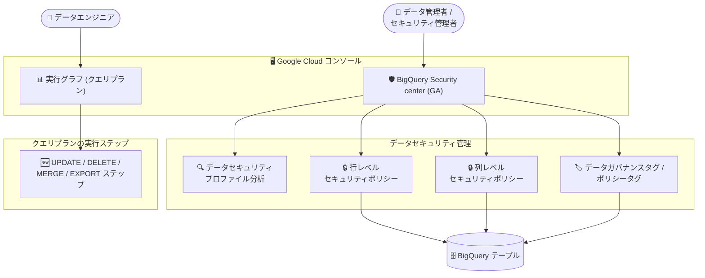

# BigQuery: Security center が GA、クエリプランに DML/EXPORT 実行ステップを追加

**リリース日**: 2026-09-30

**サービス**: BigQuery

**機能**: Security center (GA) / クエリプランの UPDATE・DELETE・MERGE・EXPORT 実行ステップ表示

**ステータス**: GA (Security center) / 新機能 (クエリプラン実行ステップ)

📊 [このアップデートのインフォグラフィックを見る](https://takech9203.github.io/google-cloud-news-summary/20260930-bigquery-security-center-ga.html)

## 概要

2026 年 9 月 30 日、BigQuery に 2 つの機能強化が発表されました。1 つ目は **BigQuery Security center** が Google Cloud コンソールで一般提供 (GA) になったことです。Security center を使用すると、データセキュリティプロファイルの分析、行レベル・列レベルのセキュリティポリシーの作成と管理、データガバナンスタグおよびポリシータグの設定と管理を行うことができます。データ管理者やセキュリティ管理者が、BigQuery のデータ保護に関する設定を一元的に扱えるようになります。

2 つ目は、クエリプラン (実行グラフ) に **UPDATE、DELETE、MERGE、EXPORT の実行ステップ**が表示されるようになったことです。従来、クエリプランのステップカテゴリとして公開されていたのは READ、WRITE、COMPUTE、FILTER、SORT、AGGREGATE、LIMIT、JOIN、ANALYTIC_FUNCTION、USER_DEFINED_FUNCTION などでした。今回のアップデートにより、DML (データ操作言語) ステートメントやエクスポート処理がクエリプラン上でステップとして可視化され、これらの処理のパフォーマンス分析やトラブルシューティングがしやすくなります。

いずれも、BigQuery を本番運用するデータエンジニア・データ管理者・セキュリティ担当者にとって、ガバナンス強化と運用可視性の向上に直結するアップデートです。

**アップデート前の課題**

- 行レベルセキュリティ、列レベルアクセス制御 (ポリシータグ)、データガバナンスタグなどのデータ保護機能は、それぞれ個別の画面や手順で設定・管理する必要があった
- 自社データのセキュリティ状況 (セキュリティプロファイル) を BigQuery コンソール上でまとめて分析する専用の場所がなかった
- クエリプランで公開されるステップカテゴリは READ / WRITE / COMPUTE / JOIN などが中心で、UPDATE・DELETE・MERGE といった DML やエクスポートの実行ステップは個別のステップとして確認できなかった

**アップデート後の改善**

- Google Cloud コンソールの Security center から、データセキュリティプロファイルの分析、行レベル・列レベルのセキュリティポリシーの作成・管理、データガバナンスタグとポリシータグの設定・管理を一元的に行えるようになった (GA)
- Security center が GA となったことで、本番環境でのデータガバナンス運用に組み込める安定した機能として利用できるようになった
- クエリプランで UPDATE、DELETE、MERGE、EXPORT の実行ステップを確認できるようになり、DML やエクスポート処理のボトルネック分析が可能になった

## アーキテクチャ図



Security center は行レベル・列レベルのセキュリティポリシーとガバナンスタグの管理、セキュリティプロファイル分析をコンソール上で一元化します。また、クエリプラン (実行グラフ) では DML とエクスポートの実行ステップが新たに可視化されます。

## サービスアップデートの詳細

### 主要機能

1. **BigQuery Security center (GA)**
   - Google Cloud コンソールで利用可能になったデータセキュリティ管理のためのハブ
   - データセキュリティプロファイルの分析が可能
   - 行レベル・列レベルのセキュリティポリシーの作成と管理が可能
   - データガバナンスタグとポリシータグの設定と管理が可能

2. **行レベル・列レベルセキュリティとの連携**
   - 列レベルアクセス制御では、ポリシータグ (Data Catalog ベース) またはデータガバナンスタグ (Resource Manager タグベース) を使って機密性の高い列へのアクセスをクエリ実行時にチェックできる
   - 列レベルアクセス制御は動的データマスキングと組み合わせて、実際の値の代わりに null・デフォルト値・ハッシュ値を返すことも可能
   - 列レベルアクセス制御はデータセット ACL に加えて適用されるため、ユーザーはデータセットの権限とポリシータグの権限の両方が必要

3. **クエリプランの UPDATE / DELETE / MERGE / EXPORT 実行ステップ**
   - クエリプラン (実行グラフ) で UPDATE、DELETE、MERGE、EXPORT の実行ステップを確認できるようになった
   - コンソールの「実行の詳細 (Execution Details)」/「実行グラフ (Execution graph)」タブ、または `jobs.get` などの API レスポンスからクエリプラン情報を取得できる
   - ステージはステップ (クエリロジックを実行する個々のオペレーション) で構成され、擬似コード形式のサブステップで処理内容を確認できる

## 技術仕様

### クエリプランのステップカテゴリ (主なもの)

| ステップカテゴリ | 説明 |
|------|------|
| READ | 入力テーブルまたは中間シャッフルからの列の読み取り |
| WRITE | 出力テーブルまたは中間シャッフルへの列の書き込み |
| COMPUTE | 式の評価と SQL 関数の実行 |
| FILTER | WHERE、OMIT IF、HAVING 句で使用 |
| JOIN | JOIN の実装 (結合タイプ・結合条件を含む) |
| AGGREGATE | GROUP BY や COUNT などの集計 |
| **UPDATE / DELETE / MERGE / EXPORT** | **今回のアップデートで表示されるようになった DML / エクスポートの実行ステップ** |

### 行レベル・列レベルセキュリティ関連の主なロール

| ロール | 用途 |
|------|------|
| Data Catalog Policy Tag Admin (`datacatalog.categoryAdmin`) | タクソノミーとポリシータグの作成・管理、ポリシータグへの IAM ポリシー設定 |
| BigQuery Data Policy Admin (`bigquerydatapolicy.admin`) / BigQuery Admin / BigQuery Data Owner | データポリシーの作成・管理 (タクソノミーへのアクセス制御適用時に使用) |
| Data Catalog Fine-Grained Reader (`datacatalog.categoryFineGrainedReader`) | ポリシータグで保護された列のデータへのアクセス |

## メリット

### ビジネス面

- **ガバナンス運用の一元化**: 行レベル・列レベルのセキュリティポリシー、データガバナンスタグ、ポリシータグの管理をコンソールの Security center に集約でき、データガバナンス体制の整備・監査対応がしやすくなる
- **GA による本番利用の安心感**: Security center が一般提供となり、本番環境のデータ保護運用に組み込める

### 技術面

- **セキュリティ状況の可視化**: データセキュリティプロファイルの分析により、自社データの保護状況を把握できる
- **DML・エクスポート処理の可視化**: UPDATE / DELETE / MERGE / EXPORT がクエリプランのステップとして確認できるため、DML ジョブやエクスポートジョブのパフォーマンス分析・最適化の手がかりが増える

## デメリット・制約事項

### 制限事項 (関連機能である列レベルアクセス制御の主な制限)

- 1 つの列に割り当てられるポリシータグは 1 つのみ
- 1 テーブルあたり最大 1,000 個の一意なポリシータグ
- ポリシータグの階層はルートから最下位サブタグまで最大 5 レベル
- 列レベルアクセス制御を有効にしたテーブルではレガシー SQL は使用不可
- 列レベル・行レベルアクセス制御を有効にしたテーブルはリージョンをまたぐテーブルコピーが不可
- タクソノミーとテーブルは同じリージョンに存在する必要がある (タクソノミーは他リージョンへ複製可能)
- 一部の BigQuery エディションで作成した予約では利用できない場合がある

### 考慮すべき点

- クエリプランの診断情報は、ドライランやキャッシュから返される結果など実行リソースを使用しないクエリジョブには含まれない
- 実行グラフが複雑な場合、ペイロードサイズの問題を避けるためにサブステップが切り詰められることがある

## ユースケース

### ユースケース 1: 機密データを含むテーブルのアクセス制御を一元管理

**シナリオ**: 個人情報 (SSN など) を含むテーブルに対し、データスチュワードが分類タクソノミーを定義し、特定のグループにのみ機密列へのアクセスを許可したい。

**実装例**:
```
1. Security center からタクソノミーとポリシータグ (例: High / Medium) を作成
2. 機密列 (例: employee_ssn) に High ポリシータグを割り当て
3. タクソノミーにアクセス制御を適用
4. High タグに対して特定グループへ Fine-Grained Reader ロールを付与
```

**効果**: 少数の分類ポリシータグを管理するだけで、多数の列へのアクセスをきめ細かく制御できる。Security center によりこれらの操作をコンソール上で一元的に行える。

### ユースケース 2: 大規模 MERGE ジョブのパフォーマンス分析

**シナリオ**: 日次バッチで実行している大規模な MERGE ステートメントの実行時間が長く、ボトルネックを特定したい。

**効果**: クエリプランの実行グラフで MERGE の実行ステップを確認できるようになり、どのステージ・ステップに時間がかかっているかをスロット時間ベースの色分けやステージ統計 (読み取り・計算・書き込み時間など) と合わせて分析できる。

## 料金

今回のリリースノートに料金に関する記載はありません。クエリプランの診断情報はクエリジョブに含まれる統計情報として提供されます。なお、ポリシータグを使った列レベルアクセス制御は BigQuery と Data Catalog の両方を使用するため、それぞれの料金体系が適用されます。

- [BigQuery の料金](https://cloud.google.com/bigquery/pricing)
- [Data Catalog の料金](https://docs.cloud.google.com/dataplex/pricing#data-catalog-pricing)

## 関連サービス・機能

- **行レベルセキュリティ / 列レベルアクセス制御**: Security center で作成・管理できるポリシーの基盤機能。列レベルアクセス制御はポリシータグまたはデータガバナンスタグで実現する
- **動的データマスキング**: 列レベルアクセス制御と組み合わせて、機密列の値を null・デフォルト値・ハッシュ値に置き換えて返すことができる
- **Sensitive Data Protection**: データプロファイルを生成して機密性・リスクの高いデータの所在を特定でき、どの列にポリシータグを付与すべきかの判断に活用できる
- **IAM (Identity and Access Management)**: ポリシータグやデータポリシーへのアクセス制御は IAM ロールで管理する

## 参考リンク

- 📊 [インフォグラフィック](https://takech9203.github.io/google-cloud-news-summary/20260930-bigquery-security-center-ga.html)
- [公式リリースノート](https://docs.cloud.google.com/release-notes#September_30_2026)
- [列レベルアクセス制御の概要](https://docs.cloud.google.com/bigquery/docs/column-level-security-intro)
- [行レベルセキュリティの概要](https://docs.cloud.google.com/bigquery/docs/row-level-security-intro)
- [クエリプランとタイムラインの説明](https://docs.cloud.google.com/bigquery/docs/query-plan-explanation)
- [BigQuery の料金](https://cloud.google.com/bigquery/pricing)

## まとめ

BigQuery Security center の GA により、データセキュリティプロファイルの分析と、行レベル・列レベルセキュリティポリシーやガバナンスタグ・ポリシータグの管理をコンソール上で一元的に行えるようになりました。あわせて、クエリプランで UPDATE / DELETE / MERGE / EXPORT の実行ステップが可視化され、DML やエクスポート処理の分析が容易になります。機密データを扱う組織は Security center でのポリシー管理への移行を検討し、大規模な DML ジョブを運用しているチームは実行グラフでの新ステップ表示をパフォーマンス分析に活用することをおすすめします。

---

**タグ**: BigQuery, Security center, 行レベルセキュリティ, 列レベルアクセス制御, ポリシータグ, データガバナンス, クエリプラン, DML, GA
