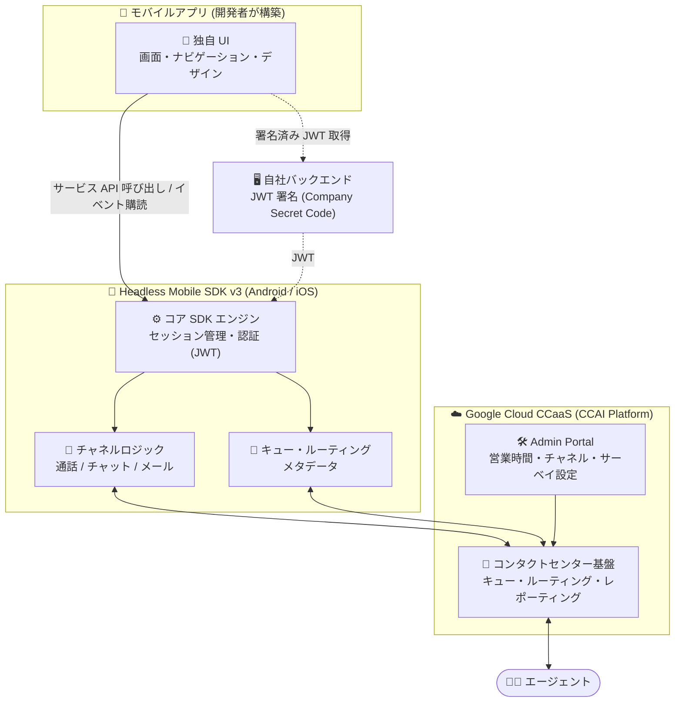
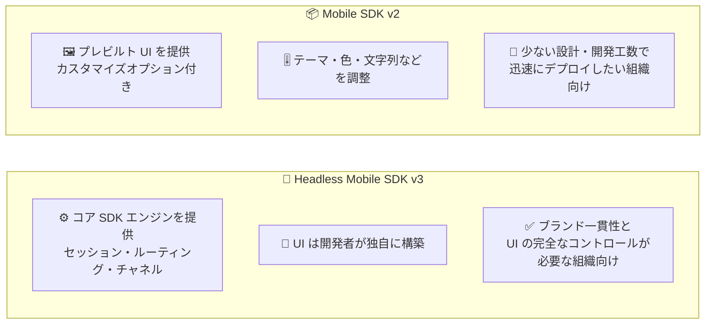

# Google Cloud Contact Center as a Service (CCaaS): ヘッドレスモバイル SDK (Headless Mobile SDK v3) の提供開始

**リリース日**: 2026-09-30

**サービス**: Google Cloud Contact Center as a Service (CCaaS) / CCAI Platform

**機能**: Headless Mobile SDK v3 (Android / iOS)

**ステータス**: 提供開始 (Announcement)

📊 [このアップデートのインフォグラフィックを見る](https://takech9203.github.io/google-cloud-news-summary/20260930-ccaas-headless-mobile-sdk.html)

## 概要

Google Cloud Contact Center as a Service (CCaaS) に、Android および iOS 向けの**ヘッドレスモバイル SDK (Headless Mobile SDK v3)** が登場しました。この SDK を利用すると、Google Cloud CCaaS のコンタクトセンター機能をモバイルアプリに組み込みつつ、UI の設計・実装を完全に自社でコントロールできます。SDK は音声通話 (スケジュール通話を含む)、チャット、メールのチャネルをサポートします。

従来の Mobile SDK v2 は、カスタマイズオプション付きのプレビルト UI を提供するアプローチで、少ない設計・エンジニアリング工数で迅速にデプロイしたい組織に適しています。一方、今回提供されたヘッドレスモバイル SDK は、CCaaS がコア SDK エンジン (セッション管理、ルーティング、チャネルロジックなど) を提供し、UI は開発者が自社のデザインとコンポーネントで構築する方式です。ブランドの一貫性とモバイルアプリのルック & フィールの完全なコントロールを必要とする組織に最適です。

対象ユーザーは、自社モバイルアプリにカスタマーサポート機能 (アプリ内チャット、音声通話、メール導線など) を組み込みたい開発チームです。特に、既存のデザインシステムに沿った UI を維持したまま CCaaS のコンタクトセンター基盤 (キュー、ルーティング、エージェント接続、レポーティング) を活用したいケースに適しています。

**アップデート前の課題**

- Mobile SDK v2 はプレビルト UI (CCAI Platform ブランドのウィジェット) を前提としており、カスタマイズはテーマ・色・フォント・文字列などの範囲に限られていた
- 自社アプリのデザインシステムやナビゲーションに完全に統合した独自 UI を構築する公式な手段がなく、ブランド一貫性の要件が厳しい組織では採用が難しかった
- チャット画面や通話画面のレイアウト・フローそのものを変更することはできなかった

**アップデート後の改善**

- CCaaS がセッション、ルーティング、チャネルロジックなどのコアエンジンを SDK として提供し、UI 層 (画面、ナビゲーション、ビジュアルデザイン) を開発者が自由に構築できるようになった
- 音声通話 (スケジュール通話を含む)、チャット、メールのチャネルを独自 UI から利用できるようになった
- スマートアクション、添付ファイル、画面共有、セッション後フロー (CSAT、アンケート、バーチャルエージェント) などの機能も SDK のサービス API 経由で利用できるようになった

## アーキテクチャ図



ヘッドレスモバイル SDK では、UI 層は開発者が完全にコントロールし、SDK がセッション・ルーティング・チャネルロジックを担い、CCaaS プラットフォームがコンタクトセンター基盤 (キュー、エージェント接続、レポーティング) を提供するという 3 層構成になります。



リリースノートに記載された 2 つの SDK の比較です。UI を完全に自社構築するか、プレビルト UI で迅速に導入するかで選択します。

## サービスアップデートの詳細

### 主要機能

1. **コア SDK エンジンの提供 (UI レス)**
   - CCaaS がセッション管理、ルーティング、チャネルロジックなどのコアエンジンを提供
   - JWT (JSON Web Token) によるエンドユーザー認証
   - キューとチャネルのルーティングメタデータ (チャット、音声通話、メール、外部デフレクションリンク) の取得
   - サービスオブジェクト (`chatService`、`queueMenuService` など) によるリアルタイムのセッション状態管理
   - デフレクションロジック (営業時間外・キャパシティ超過時の迂回) とセッション後フローの評価

2. **マルチチャネル対応**
   - 音声通話: インスタントコール、スケジュール通話、ボイスメール、着信処理に対応。iOS では CallKit 統合と VoIP プッシュ処理を SDK が担当
   - チャット: チャットセッションの開始・管理、トランスクリプトのダウンロード、Web フォームのカスタム描画 (`webFormInterface`) に対応
   - メール・デフレクション: メール導線、スケジュール通話、外部デフレクションリンクの提示が可能

3. **スマートアクション・添付ファイル・画面共有**
   - スマートアクション、ファイル添付、画面共有のセキュアなトランスポートパイプラインを SDK が提供
   - 画面共有はアプリ内共有と、iOS では ReplayKit (Broadcast Extension) を使ったフルデバイス共有に対応
   - 画面共有サービスはセッションのライフサイクル管理 (`create`、`activate`、`end` など) と、リモートコントロール有効化などの設定メソッドを提供

4. **セッション後フロー**
   - CSAT、サーベイ、バーチャルエージェントなどのポストセッションフローをサポート

5. **Admin Portal 設定の活用**
   - CCAI Platform Admin Portal で管理者が設定したルール (営業時間、利用可能チャネル、待ち時間しきい値、サーベイ) を SDK が読み取り、生データとイベントとしてアプリに公開
   - 設定をどのように画面に反映するかは開発者が決定

## 技術仕様

### Android の要件

| 項目 | 詳細 |
|------|------|
| 最小 Android バージョン | Android 6.0 (API level 23) 以降 |
| Compile SDK | 36 (推奨) |
| 対応言語 | Kotlin (推奨) または Java |
| Java 互換性 | Java 17 以上 |
| Kotlin バージョン | 1.6.0 以上 |
| 非同期処理 | Kotlin Coroutines と Flow によるイベント購読 |
| プッシュ通知 | Firebase Cloud Messaging (FCM)。Firebase プロジェクトと `google-services.json` が必要 |
| 主な権限 | インターネット/ネットワーク状態、マイク (音声通話)、通知 (FCM)、ストレージ/メディア (添付)、カメラ (スマートアクション)、画面キャプチャ (MediaProjection、画面共有) |

### 認証フロー (JWT)

SDK は 2 ステップの非同期認証フローを採用しています。

1. SDK が認証を必要とすると `CCAIDelegate` の `ccaiShouldAuthenticate()` (suspend 関数) を呼び出す
2. アプリは自社バックエンドで Company Secret Code を使って JWT に署名し、`CCAI.authService?.authenticate(jwt)` で認証トークンに交換して SDK に返す

```kotlin
class MyCCAIDelegate : CCAIDelegate {
    override suspend fun ccaiShouldAuthenticate(): String? {
        return try {
            val jwt = MyBackendApi.getSignedJwt() ?: return null
            CCAI.authService?.authenticate(jwt)
        } catch (e: Exception) {
            null
        }
    }
}
```

**重要**: JWT の署名は必ずバックエンドサーバーで行います。Company Secret Code をアプリに埋め込むことは重大なセキュリティ脆弱性となるため禁止されています。

JWT の `custom_data` にコンテキストデータ (string / number / date / url / boolean 型) を含めてエージェントの CRM に渡すことができ、`invisible_to_agent: true` でエージェントには非表示のルーティング用データも送信できます。また、`reserved_verified_customer`、`reserved_bad_actor`、`reserved_repeat_customer` などの予約キーでプラットフォームの組み込み動作 (VIP フラグ等) をトリガーできます。

## 設定方法

### 前提条件

1. CCAI Platform インスタンスへのアクセス権 (Admin Portal の管理者アカウント)
2. Admin Portal の **Settings > Developer settings** から以下を取得
   - Company key (アプリで使用)
   - Company secret code (バックエンドでの JWT 署名に使用)
   - Host URL (例: `your_subdomain.ccaiplatform.com`)
3. CCaaS エンドポイントおよび構成済み音声プロバイダーエンドポイントへのアウトバウンド通信許可
4. (Android) Firebase プロジェクトと FCM の設定

### 手順 (Android の例)

#### ステップ 1: コア SDK の初期化

アプリケーションクラスで `CCAI` シングルトンを初期化します。

```kotlin
class MainApplication : Application() {
    private val delegate = MyCCAIDelegate()

    override fun onCreate() {
        super.onCreate()
        val initOptions = InitOptions(
            key = "YOUR_COMPANY_KEY",
            urlHost = "your_subdomain.ccaiplatform.com",
            languageCode = "en",   // 任意: ISO 639 コード
            delegate = delegate
        )
        CCAI.initialize(context = this, options = initOptions)
    }
}
```

#### ステップ 2: チャネルモジュールの初期化

モジュラーアーキテクチャのため、コア初期化後に利用するチャネルプロバイダーを登録します。

```kotlin
// チャット (最小構成)
CCAI.initializeChat(context = this)

// 音声・スケジュール通話を使う場合は必須
CCAI.initializeCall(context = this)

// 画面共有 (任意)
CCAI.initializeScreenShare(
    context = this,
    options = ScreenShareOptions(key = "YOUR_COMPANY_KEY")
)
```

#### ステップ 3: 独自 UI の構築

エントリーポイント (ヘルプタブ、お問い合わせボタンなど)、キューメニュー、セッション中 UI (チャットバブル、通話画面、コントロール) を自社デザインで実装し、SDK のサービス API でセッションを開始・終了し、Kotlin Coroutines / Flow でイベントを購読して画面遷移を制御します。音声チャネルでは `VoiceCallChannel` の `instantEnabled`、`scheduleEnabled`、`recordingOption`、`deflected` などのフィールドを確認して、表示するエントリーポイントを判断します。

## メリット

### ビジネス面

- **ブランド一貫性の確保**: CCaaS ブランドのウィジェットではなく、自社のデザインシステムに完全に沿ったサポート体験を提供できる
- **CX の差別化**: サポート導線をアプリの UX に自然に溶け込ませることで、顧客体験を自社でデザインできる
- **選択肢の拡大**: 迅速なデプロイを優先する場合は Mobile SDK v2、完全なコントロールを求める場合はヘッドレス SDK と、要件に応じた使い分けが可能になった

### 技術面

- **関心の分離**: コンタクトセンターロジック (ルーティング、キュー、チャネル、設定、レポーティング) は CCaaS が担い、アプリは UI とフローに集中できる
- **モジュラーアーキテクチャ**: コア + チャット + 通話 + 画面共有をモジュール単位で初期化でき、必要な機能だけを組み込める
- **モダンな API 設計**: Kotlin Coroutines / Flow (Android)、async/await (iOS) ベースの非同期 API とイベント駆動の状態管理
- **セキュアな認証**: バックエンド署名の JWT による認証と、CRM へのコンテキストデータ受け渡しの標準化

## デメリット・制約事項

### 制限事項

- UI (画面、ナビゲーション、同意プロンプト、通知 UI など) をすべて自社で設計・実装する必要があり、Mobile SDK v2 より設計・エンジニアリング工数が大きい
- Android は Android 6.0 (API level 23) 以降、Kotlin 1.6.0 以上、Java 17 以上などのプラットフォーム要件がある
- プッシュ通知 (Android は FCM) の設定、通知 UI・着信 UI の実装はアプリ側の責務
- iOS のフルデバイス画面共有には ReplayKit を使った Broadcast Extension の実装が必要

### 考慮すべき点

- CCAI Platform インスタンスと Admin Portal の設定 (チャネル、営業時間、サーベイ等) が前提となる
- JWT 署名用のバックエンドサーバーが必要 (Company Secret Code をアプリに埋め込んではならない)
- 認証トークンのキャッシュ (`cacheAuthToken`、デフォルト有効) を利用する場合、ログアウトやユーザー切り替え時に `updateAuthToken(null)` でトークンをクリアしないと、前のユーザーのセッションで認証されるリスクがある
- 必要な権限 (マイク、カメラ、画面キャプチャ等) のランタイムリクエスト処理を OS ガイドラインに沿って実装する必要がある

## ユースケース

### ユースケース 1: ブランド重視の金融・小売アプリへのサポート組み込み

**シナリオ**: 自社デザインシステムが厳格に定義されている金融・小売アプリで、サポートチャットと通話をアプリ内のヘルプタブに統合したい。CCaaS ブランドのウィジェットは UI ガイドライン上使用できない。

**実装例**:
```kotlin
// キューメニューを取得して自社 UI で表示し、チャネル可否を判定
val menu: QueueMenu = /* queueMenuService から取得 */
val voice = menu.channels?.voiceCall
callNowButton.isVisible = (voice?.instantEnabled == true) && (voice.deflected != true)
```

**効果**: 自社ブランドの UI のまま、CCaaS のキュー・ルーティング・エージェント接続・レポーティングをフル活用できる。

### ユースケース 2: 既存の Mobile SDK v2 利用組織の高度化

**シナリオ**: Mobile SDK v2 のプレビルト UI で迅速に導入したが、アプリの成長に伴い、チャット画面のレイアウトやサポート導線のフローを自社 UX に合わせて再設計したい。

**効果**: Admin Portal の設定 (キュー、チャネル、営業時間、サーベイ) はそのままに、UI 層のみを独自実装に置き換えられる。ヘッドレス SDK はこれらの設定を生データとイベントとして公開するため、既存のコンタクトセンター運用を変えずに UI の自由度を獲得できる。

## 料金

ヘッドレスモバイル SDK 固有の料金は Release Notes には記載されていません。CCaaS (CCAI Platform) の料金体系については公式の料金ページを参照してください。

- [Google Cloud CCaaS 料金](https://cloud.google.com/solutions/contact-center-ai-platform)

## 関連サービス・機能

- **CCAI Platform Admin Portal**: 営業時間、利用可能チャネル、待ち時間しきい値、サーベイなどの運用ルールを設定。SDK はこの設定を読み取ってアプリに公開する
- **Mobile SDK v2 (Standard Mobile SDK)**: カスタマイズオプション付きのプレビルト UI を提供する既存 SDK。迅速なデプロイを優先する場合の選択肢
- **Web SDK**: Web サイト向けの CCaaS ウィジェット。モバイルアプリ以外のチャネルで補完的に利用
- **Firebase Cloud Messaging (FCM)**: Android での着信通知、スマートアクション関連メッセージ、バックグラウンド時の状態維持に使用
- **バーチャルエージェント / サーベイ / CSAT**: セッション後フローとして SDK から利用可能

## 参考リンク

- 📊 [インフォグラフィック](https://takech9203.github.io/google-cloud-news-summary/20260930-ccaas-headless-mobile-sdk.html)
- [公式リリースノート](https://docs.cloud.google.com/release-notes#September_30_2026)
- [Headless Mobile SDK for iOS: Get started](https://docs.cloud.google.com/contact-center/ccai-platform/docs/headless-mobile-sdk-ios-getting-started)
- [Headless Mobile SDK for Android: Get started](https://docs.cloud.google.com/contact-center/ccai-platform/docs/headless-mobile-sdk-android-getting-started)
- [Headless Mobile SDK for iOS: Voice calls](https://docs.cloud.google.com/contact-center/ccai-platform/docs/headless-mobile-sdk-ios-voice)

## まとめ

ヘッドレスモバイル SDK v3 の提供により、CCaaS のモバイル統合は「プレビルト UI で迅速に導入する (Mobile SDK v2)」か「コアエンジンだけを使い UI を完全に自社構築する (ヘッドレス SDK)」かを要件に応じて選択できるようになりました。ブランド一貫性やアプリ UX の完全なコントロールが求められる組織は、Android / iOS それぞれの Get started ドキュメントを確認し、JWT 署名用バックエンドの準備と必要チャネルモジュールの選定から着手することを推奨します。

---

**タグ**: #CCaaS #CCAIPlatform #ContactCenter #MobileSDK #Android #iOS #HeadlessSDK
