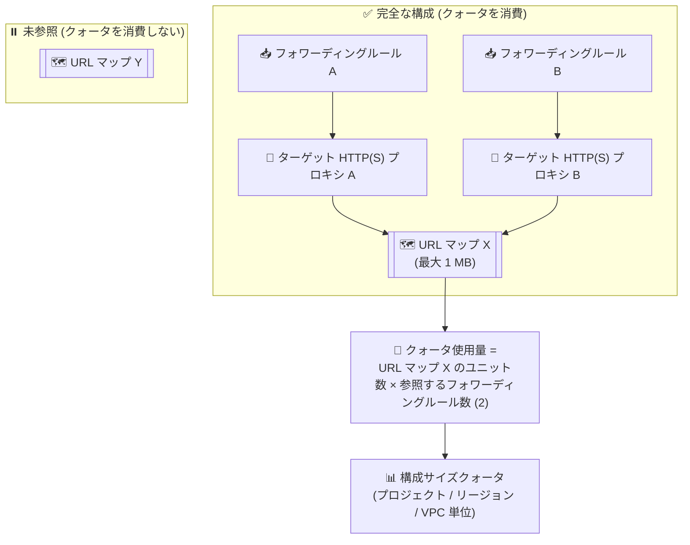

# Cloud Load Balancing: Application Load Balancer の構成サイズを管理する新クォータシステムが GA (URL マップ上限 1 MB に拡大)

**リリース日**: 2026-09-30

**サービス**: Cloud Load Balancing

**機能**: Application Load Balancer 構成サイズの新クォータシステム (URL マップサイズ上限の 1 MB への拡大)

**ステータス**: GA (一般提供)

📊 [このアップデートのインフォグラフィックを見る](https://takech9203.github.io/google-cloud-news-summary/20260930-cloud-load-balancing-url-map-quota-ga.html)

## 概要

Application Load Balancer (ALB) の構成サイズを管理する新しいクォータシステムが一般提供 (GA) になりました。このアップデートにより、個別の URL マップのサイズ上限が従来の 64 KB および 128 KB から **1 MB** に引き上げられます。対象はグローバル外部、リージョン外部、および内部 Application Load Balancer で、従来型 (Classic) Application Load Balancer は引き続き 64 KB に制限されます。

新しいクォータシステムでは、ロードバランサのルーティング構成サイズが「クォータユニット (quota units)」という単位で計測されます。クォータユニットは URL マップの複雑さ (ホストルール、パスマッチャー、ルールの数など) を反映し、ルールが少なくマッチャーが短い構成は消費が少なく、多数のルール・ホスト名・パスマッチャーを持つ複雑な構成はより多くのユニットを消費します。また、フォワーディングルールから参照されている URL マップのみがクォータ使用量にカウントされる「アクティブ消費」の考え方が採用されています。

大規模なマルチテナント環境や多数のホスト・パスベースのルーティングルールを運用する組織にとって、URL マップサイズの制約が大幅に緩和されるとともに、構成サイズの計測・管理がより合理的になるアップデートです。

**アップデート前の課題**

- 個別の URL マップのサイズが 64 KB または 128 KB に制限されており、多数のホストルールやパスマッチャーを持つ大規模なルーティング構成ではサイズ上限に到達しやすかった
- サイズ上限に達した場合、URL マップを複数のロードバランサに分割するなどの回避策を検討する必要があった

**アップデート後の改善**

- グローバル外部・リージョン外部・内部 Application Load Balancer の個別 URL マップサイズ上限が 1 MB に拡大され、より大規模で複雑なルーティング構成を単一の URL マップで表現できるようになった
- クォータユニットによる複雑さベースの計測が導入され、構成の複雑さに応じた合理的なクォータ管理が可能になった
- フォワーディングルールから参照されている (完全な構成の一部である) URL マップのみがクォータを消費するため、未使用の URL マップがクォータを圧迫しなくなった
- `gcloud beta compute url-maps describe` の `status.quotaUsage` で、URL マップごとのクォータユニット使用量を確認できるようになった

## アーキテクチャ図



フォワーディングルール → ターゲットプロキシ → URL マップという完全な構成チェーンを持つ URL マップのみがクォータを消費し、使用量は「URL マップのクォータユニット数 × 参照するフォワーディングルール数」で計算されます。

## サービスアップデートの詳細

### 主要機能

1. **複雑さベースのクォータ (Complexity-based quota)**
   - クォータユニットは URL マップの構成の複雑さを表す
   - ユニット数は、ホストルール数、パスマッチャー数、および各パスマッチャーの内容 (ルール、ホスト名など) に依存する
   - ルールが少なくマッチャーが短い構成は消費ユニットが少なく、多数のルール・ホスト名・パスマッチャーを持つ複雑な構成は消費ユニットが多い

2. **スコープ別の計測 (Scoped measurement)**
   - Application Load Balancer のタイプに応じて、プロジェクト単位、リージョン単位、または VPC 単位でクォータが計測・適用される
   - 例: グローバル外部 ALB と従来型 ALB はプロジェクト単位、リージョン外部 ALB とリージョン内部 ALB は VPC ネットワークのリージョン単位

3. **アクティブ消費 (Active consumption)**
   - フォワーディングルールから (ターゲット HTTP/HTTPS プロキシ経由で) 参照されている URL マップのみがクォータ使用量に寄与する
   - フォワーディングルール → ターゲットプロキシ → URL マップの参照関係が存在しない URL マップは、構成サイズクォータを消費しない

4. **URL マップサイズ上限の 1 MB への拡大**
   - 新クォータが有効なプロジェクトでは、グローバル外部・リージョン外部・内部 Application Load Balancer の個別 URL マップサイズ上限が 1 MB に拡大
   - 従来型 (Classic) Application Load Balancer は引き続き 64 KB に制限

## 技術仕様

### クォータ使用量の計算式

```
クォータ使用量 = 単一 URL マップのクォータユニット数の合計
              × (ターゲット HTTP/HTTPS プロキシ経由でその URL マップを参照する
                 フォワーディングルールの数)
```

例: 1 つのフォワーディングルールから参照される URL マップが 50,000 クォータユニットを使用する場合、同じ URL マップが 3 つのフォワーディングルールから参照されると 150,000 ユニットを使用します。

### 構成サイズクォータのスコープ

| ALB タイプ | クォータのスコープ | クォータ名 |
|------|------|------|
| グローバル外部 ALB / 従来型 ALB | プロジェクト単位 | `GLOBAL_EXTERNAL_PROXY_LB_CONFIG` |
| リージョン外部 ALB | VPC ネットワークのリージョン単位 | `REGIONAL_EXTERNAL_PROXY_LB_CONFIG_PER_REGION_PER_VPC_NETWORK` |
| クロスリージョン内部 ALB | VPC ネットワーク単位 | `CROSS_REGIONAL_INTERNAL_PROXY_LB_CONFIG_PER_REGION_PER_VPC_NETWORK` |
| リージョン内部 ALB | VPC ネットワークのリージョン単位 | `REGIONAL_INTERNAL_PROXY_LB_CONFIG_PER_REGION_PER_VPC_NETWORK` |

### 個別 URL マップのサイズ上限

| ALB タイプ | 上限 (今回のアップデート後) |
|------|------|
| グローバル外部 Application Load Balancer | 1 MB |
| リージョン外部 Application Load Balancer | 1 MB |
| 内部 Application Load Balancer | 1 MB |
| 従来型 (Classic) Application Load Balancer | 64 KB (変更なし) |

### クォータ使用量の変動要因

- **URL マップの更新**: ホストルール、パスマッチャー、ルートルールの追加・削除により、その URL マップが使用するクォータユニット数が変化する
- **ターゲットプロキシの更新**: ターゲットプロキシが別の URL マップを参照するように更新され、元の URL マップを参照するターゲットプロキシがなくなった場合、元の URL マップはクォータを消費しなくなる
- **フォワーディングルールの作成・削除**: URL マップを使用するターゲットプロキシに紐づくフォワーディングルールを作成するとクォータ消費が増加し、削除すると減少する

## 設定方法

### クォータ使用量の確認

既存の URL マップが使用するクォータユニット数は、以下の gcloud CLI コマンドで確認できます。

```bash
gcloud beta compute url-maps describe URL_MAP_NAME \
    [--region=REGION_NAME | --global] \
    --format="value(status)"
```

- `URL_MAP_NAME`: URL マップの名前
- `REGION_NAME`: ロードバランサが定義されているリージョン

出力には読み取り専用の `status.quotaUsage` オブジェクトが含まれ、その URL マップに対して計算されたユニットの合計数と、その URL マップを使用しているフォワーディングルールの数が表示されます。

### クォータの確認 (Google Cloud コンソール)

構成サイズクォータの現在の使用量と上限は、Google Cloud コンソールの [IAM と管理] → [割り当てとシステム上限] で、`compute.googleapis.com` サービスの上記クォータ名 (例: `GLOBAL_EXTERNAL_PROXY_LB_CONFIG`) を検索して確認できます。

## メリット

### ビジネス面

- **大規模構成への対応**: URL マップサイズ上限が 1 MB に拡大されたことで、多数のテナントやサービスを単一のロードバランサ構成で扱う大規模環境の設計が容易になる
- **回避策の削減**: サイズ上限を理由とした URL マップの分割や複数ロードバランサへの分散といった回避策の必要性が減り、運用の複雑さを低減できる

### 技術面

- **合理的なクォータ計測**: バイト数ではなく構成の複雑さ (ルール、ホスト名、パスマッチャーの数) を反映したクォータユニットにより、実態に即した容量管理ができる
- **アクティブ消費モデル**: フォワーディングルールから参照されていない URL マップはクォータを消費しないため、未使用リソースがクォータを圧迫しない
- **可視性の向上**: `status.quotaUsage` により URL マップ単位のクォータ消費を定量的に把握でき、キャパシティプランニングに活用できる

## デメリット・制約事項

### 制限事項

- 従来型 (Classic) Application Load Balancer の URL マップは引き続き 64 KB に制限され、1 MB 拡大の対象外
- 1 MB の新しい URL マップサイズ上限は、新クォータシステムが有効なプロジェクトに適用される

### 考慮すべき点

- クォータ使用量は「URL マップのユニット数 × 参照するフォワーディングルール数」で計算されるため、同一 URL マップを多数のフォワーディングルールで共有する構成ではクォータ消費が乗算的に増加する
- フォワーディングルールの追加やターゲットプロキシの付け替えなど、URL マップ自体を変更しない操作でもクォータ使用量が変動する点に注意が必要
- クォータ使用量を確認する `gcloud` コマンドは現時点で `beta` トラック (`gcloud beta compute url-maps describe`) で提供されている

## ユースケース

### ユースケース 1: マルチテナント SaaS のホストベースルーティング

**シナリオ**: 数百のテナントごとにホスト名とパスベースのルーティングルールを定義している SaaS 事業者が、従来の 64 KB / 128 KB の URL マップサイズ上限に近づいており、ロードバランサの分割を検討していた。

**実装例**:
```bash
# URL マップの現在のクォータユニット使用量を確認
gcloud beta compute url-maps describe saas-url-map \
    --global \
    --format="value(status)"
```

**効果**: URL マップサイズ上限が 1 MB に拡大されたことで、単一の URL マップでより多くのテナント向けルーティングルールを収容でき、ロードバランサ分割による運用負荷を回避できる。

### ユースケース 2: クォータ消費の定期監視と最適化

**シナリオ**: 複数チームが同一プロジェクトでグローバル外部 ALB を運用しており、プロジェクト単位の構成サイズクォータ (`GLOBAL_EXTERNAL_PROXY_LB_CONFIG`) の消費状況を把握したい。

**効果**: `status.quotaUsage` を利用して URL マップごとのユニット消費と参照フォワーディングルール数を定期的に確認することで、クォータ逼迫の予兆を検知できる。また、未使用の URL マップはクォータを消費しないため、ターゲットプロキシの参照を整理するだけでクォータ使用量を削減できる。

## 料金

このアップデートはクォータ・上限の変更であり、Cloud Load Balancing の料金体系の詳細は公式の料金ページを参照してください。

- [Cloud Load Balancing の料金](https://cloud.google.com/vpc/network-pricing)

## 関連サービス・機能

- **Compute Engine (フォワーディングルール / ターゲットプロキシ)**: URL マップはターゲット HTTP/HTTPS プロキシとフォワーディングルールを通じて参照されることでクォータを消費する。構成サイズクォータは `compute.googleapis.com` のクォータとして管理される
- **Virtual Private Cloud (VPC)**: リージョン外部 ALB・内部 ALB の構成サイズクォータは VPC ネットワーク (またはそのリージョン) 単位で計測される
- **Cloud Service Mesh**: ロードバランシング API を利用する構成では URL マップに独自の上限が適用される (Cloud Service Mesh の URL マップサイズ上限は別途定義)

## 参考リンク

- 📊 [インフォグラフィック](https://takech9203.github.io/google-cloud-news-summary/20260930-cloud-load-balancing-url-map-quota-ga.html)
- [公式リリースノート](https://docs.cloud.google.com/release-notes#September_30_2026)
- [URL map size and quota units](https://docs.cloud.google.com/load-balancing/docs/url-map-size-quota)
- [Quotas and limits (Cloud Load Balancing)](https://docs.cloud.google.com/load-balancing/docs/quotas)
- [料金ページ](https://cloud.google.com/vpc/network-pricing)

## まとめ

Application Load Balancer の URL マップサイズ上限が 1 MB に拡大され、構成の複雑さを反映したクォータユニットベースの新しい管理モデルが GA になりました。大規模なルーティング構成を運用している場合は、`gcloud beta compute url-maps describe` の `status.quotaUsage` で現在のクォータ消費を確認し、フォワーディングルール数との乗算的なクォータ消費を考慮した構成設計を検討することをお勧めします。

---

**タグ**: Cloud Load Balancing, Application Load Balancer, URL マップ, クォータ, GA, ネットワーキング
