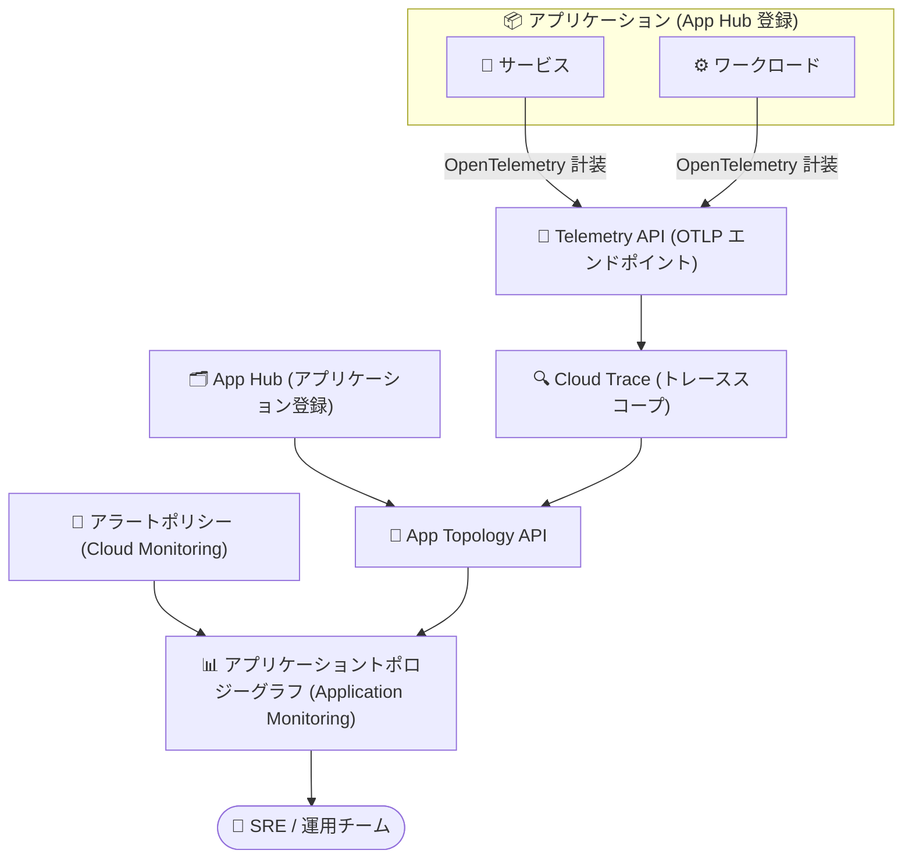

# Cloud Monitoring: アプリケーショントポロジーグラフが一般提供 (GA) に

**リリース日**: 2026-09-30

**サービス**: Cloud Monitoring

**機能**: アプリケーショントポロジーグラフ (Application Topology Graph)

**ステータス**: GA (一般提供)

📊 [このアップデートのインフォグラフィックを見る](https://takech9203.github.io/google-cloud-news-summary/20260930-cloud-monitoring-application-topology-graph-ga.html)

## 概要

Cloud Monitoring (Application Monitoring) のアプリケーショントポロジーグラフが一般提供 (GA) になりました。このグラフは、アプリケーション、サービス、ワークロード間の関係性を可視化し、アプリケーションのコンテキストの中でトラフィックフローとインシデントを把握できるインタラクティブなビューを提供します。

トポロジーグラフは、App Hub に登録されたアプリケーションについて、アプリケーション単位のトポロジーに加えて、アプリケーション管理境界 (Application Management Boundary) レベルのトポロジーも表示できます。これにより、アプリケーションが外部のサービスやワークロードとどのように相互作用しているかを理解できます。ノードを選択すると属性や関連アラートを、ノード間の接続 (コネクション) を選択するとエラー率や 95 パーセンタイルレイテンシといった主要メトリクスを確認できます。

マイクロサービスや分散アプリケーションを運用する SRE・運用チームにとって、障害発生時に「どのサービス間のトラフィックで問題が起きているか」「どのアプリケーションにアラートが紐づいているか」をひと目で把握できる機能であり、トラブルシューティングの初動を大幅に効率化します。

**アップデート前の課題**

- サービスやワークロード間の依存関係を把握するには、複数のダッシュボードやトレースデータを個別に確認する必要があった
- インシデントやアラートが「どのアプリケーションのどのコンポーネントに影響しているか」というアプリケーションコンテキストでの把握が難しかった
- サービス間トラフィックのエラー率やレイテンシを、依存関係の全体像と関連付けて確認する統合ビューがなかった

**アップデート後の改善**

- アプリケーション、サービス、ワークロードの関係性とトラフィックフローを 1 つのインタラクティブなグラフで俯瞰できるようになった
- ノードや接続を選択するだけで、アラート、属性、エラー率、95 パーセンタイルレイテンシなどの情報をフライアウトで確認できるようになった
- App Hub に登録済みのリソースだけでなく、管理境界内で検出された (discovered) サービス・ワークロードも含めて可視化されるようになった
- GA となったことで、本番環境の運用フローに正式に組み込める品質・サポートレベルに到達した

## アーキテクチャ図

OpenTelemetry で計装したトレースデータを Telemetry API 経由で送信し、App Hub のアプリケーション登録情報と組み合わせることで、Application Monitoring のトポロジーグラフにサービス間の依存関係・トラフィック・アラートが統合表示されます。

## サービスアップデートの詳細

### 主要機能

1. **インタラクティブなトポロジー可視化**
   - ズームイン / ズームアウト、ノードの再配置、アプリケーション (青い円) の折りたたみ / 展開が可能
   - 青い円は App Hub に登録された各アプリケーションを表し、展開すると配下のサービス・ワークロードが表示される
   - ノードのアイコンで種別 (エージェント、MCP サーバー、サービス、ワークロード) を判別できる

2. **アプリケーションコンテキストでのアラート表示**
   - アプリケーションやノードを選択すると、属性と関連アラートの情報がフライアウトに表示される
   - 検出された (discovered) サービス・ワークロードについては、リソースラベルを使用してアラートが識別される

3. **トラフィックメトリクスの表示**
   - ノード間の接続を選択すると、エラー率や 95 パーセンタイルレイテンシなどの主要メトリクスを確認できる
   - レイテンシとエラー率の情報は直近 1 時間のデータから算出される

4. **2 つの表示レベル**
   - **アプリケーションレベル**: App Hub に登録された個別アプリケーションのトポロジーを表示
   - **アプリケーション管理境界レベル**: アプリケーションが外部のサービス・ワークロードとどう相互作用するかを表示

## 技術仕様

### 前提条件と必要な構成

| 項目 | 詳細 |
|------|------|
| 計装 | OpenTelemetry でアプリケーションを計装し、トレースデータを Telemetry API (OTLP エンドポイント) に送信 |
| アプリケーション登録 | App Hub へのアプリケーション登録が必要 (トレースデータにアプリケーション固有のラベルが付与される) |
| 有効化する API | Observability API、App Topology API、Cloud Trace API、Telemetry API |
| 必要な IAM ロール | App Topology 閲覧者 (`roles/apptopology.viewer`) |
| 必要な権限 | `apptopology.discoveredResourcesTopologies.generate`、`apptopology.sreDomainTopologies.generate` |
| トレーススコープ | デフォルトのトレーススコープに、トレースデータを保存するすべてのプロジェクトを含める |
| 表示場所 | Google Cloud コンソールの「Application monitoring」ページ →「Topology」タブ (ホストプロジェクトまたは管理プロジェクトを選択) |

### 制限事項

| 項目 | 制限内容 |
|------|----------|
| メトリクスの時間範囲 | 接続のレイテンシ・エラー率は直近 1 時間のデータから算出 (時間範囲の変更は不可) |
| アラートの表示範囲 | 過去 24 時間のアラートのみ表示 |
| グラフの規模 | 最大 1,000 ノードまたは接続まで表示 |
| 検出リソース | サポート対象の App Hub リージョンごとに、検出されたサービス最大 100 個、ワークロード最大 100 個まで表示 |
| アラートポリシー | 登録済みリソースでは、リソースラベルを持つアラートポリシーのアラートのみ表示 (アプリケーションラベルを使うポリシーは非表示) |
| 一部リソースの接続表示 | Firestore、Spanner、Cloud Storage、Google Cloud MCP サーバーは、App Hub の登録ステータスが「discovered」の場合のみ接続が表示される |
| 操作上の制約 | ノードを青い円にドラッグしてもアプリケーションへの登録はできない (円は視覚的なガイド) |

## 設定方法

### 前提条件

1. [Application Monitoring のセットアップ](https://docs.cloud.google.com/monitoring/docs/setup-application-monitoring)を完了し、App Hub にアプリケーションを登録していること
2. アプリケーションを OpenTelemetry で計装し、トレースデータを OTLP エンドポイント (Telemetry API) に送信していること
3. Observability、App Topology、Cloud Trace、Telemetry の各 API が有効化されていること (`serviceusage.services.enable` 権限が必要)
4. 閲覧ユーザーに `roles/apptopology.viewer` が付与されていること

### 手順

#### ステップ 1: トポロジーグラフを表示する

1. Google Cloud コンソールで「**Application monitoring**」ページに移動する (検索バーを使う場合は、サブヘッディングが「Monitoring」の結果を選択)
2. プロジェクトピッカーでホストプロジェクトまたは管理プロジェクトを選択する
3. 管理境界全体を見る場合はそのまま「**Topology**」タブをクリック、特定アプリケーションを見る場合はリストからアプリケーションを選択してから「**Topology**」タブをクリックする

#### ステップ 2: グラフを操作して調査する

- ズーム・ノードの再配置・青い円の折りたたみ / 展開で表示を調整する
- アプリケーション (青い円) やノードを選択して属性・アラートを確認する
- 接続を選択してエラー率・95 パーセンタイルレイテンシなどのトラフィックメトリクスを確認する

## メリット

### ビジネス面

- **障害対応時間の短縮**: インシデントの影響範囲をアプリケーションコンテキストで即座に把握でき、根本原因の特定までの時間 (MTTR) を短縮できる
- **本番運用への正式採用が可能**: GA 到達により、エンタープライズの本番運用プロセスに組み込む際の安心材料となる

### 技術面

- **依存関係の自動可視化**: OpenTelemetry のトレースデータからサービス間の依存関係とトラフィックフローが可視化され、手動でのアーキテクチャ図メンテナンスを補完できる
- **メトリクスとトポロジーの統合**: エラー率・レイテンシといったメトリクスを、依存関係グラフ上の文脈で直接確認できる
- **登録済み + 検出リソースの統合ビュー**: App Hub に登録済みのリソースと、管理境界内で検出されたリソースの両方が表示される

## デメリット・制約事項

### 制限事項

- トラフィックメトリクスは直近 1 時間、アラートは過去 24 時間に固定されており、過去に遡った時系列分析には使えない
- トポロジー生成には OpenTelemetry 計装 + Telemetry API (OTLP エンドポイント) への送信 + App Hub 登録が必須であり、未計装のアプリケーションでは利用できない
- トレース接続は、App Hub プロジェクトと同じ組織内のトレーススコーププロジェクトからのみ表示される

### 考慮すべき点

- **料金モデルの変更が予定されている**: 2026 年 10 月 15 日から、App Topology API は使用量ベースの課金モデルに移行する (Cloud Monitoring 内で生成されるトポロジーグラフも対象)。日次の無料枠を超えた利用には課金が発生するため、大規模環境では事前にコストを試算しておくことを推奨
- 大規模環境では最大 1,000 ノード / 接続、リージョンあたり検出サービス・ワークロード各 100 個の上限に注意が必要

## ユースケース

### ユースケース 1: マイクロサービス障害のトリアージ

**シナリオ**: EC サイトのチェックアウト処理でエラー率が上昇。複数のマイクロサービスが関係しており、どのサービス間の通信が原因か切り分けたい。

**実装例**: Application monitoring ページの Topology タブを開き、アラートが表示されているノードを特定。該当ノードへの接続を選択し、エラー率と 95 パーセンタイルレイテンシを確認して問題のあるサービス間通信を絞り込む。

**効果**: 複数ダッシュボードを行き来せずに、依存関係の文脈で障害箇所を特定でき、初動対応が高速化する。

### ユースケース 2: アプリケーションと外部依存の把握

**シナリオ**: App Hub に登録したアプリケーションが、管理境界内のどの外部サービス・ワークロードと通信しているかを棚卸ししたい。

**効果**: アプリケーション管理境界レベルのトポロジーを表示することで、登録済みリソースに加えて検出された (discovered) サービス・ワークロードとの通信も可視化され、依存関係の棚卸しや App Hub への追加登録の判断材料になる。

## 料金

トポロジーグラフのデータを提供する App Topology API は、2026 年 10 月 15 日に日次無料枠付きの使用量ベース課金モデルへ移行します。この課金モデルは、Cloud Hub、Gemini Enterprise Agent Platform、Cloud Monitoring 内で生成されるトポロジーグラフを含む、すべての App Topology API の使用に適用されます。

### 料金例 (2026 年 10 月 15 日以降)

| 項目 | 日次無料枠 (プロジェクトあたり) | 超過分の料金 |
|--------|-----------------|-----------------|
| クエリ | 100 クエリ | $0.01 / クエリ |
| トポロジーグラフのノード | 15,000 ノード | $0.00075 / ノード |

詳細は [App Topology pricing](https://docs.cloud.google.com/hub/docs/app-topology#pricing) を参照してください。

## 利用可能リージョン

トポロジーグラフに表示される検出リソースはサポート対象の App Hub リージョンに依存します。詳細は [App Hub のロケーション](https://docs.cloud.google.com/app-hub/docs/locations)を参照してください。

## 関連サービス・機能

- **App Hub**: アプリケーション・サービス・ワークロードの登録と管理境界の定義を担う。トポロジーグラフの表示単位 (青い円) は App Hub に登録されたアプリケーション
- **Cloud Trace / Telemetry API**: OpenTelemetry で計装したトレースデータの受け口。トポロジーの接続情報の源泉となる
- **App Topology (Cloud Hub)**: カスタムクエリを作成し、アラート・トラフィックデータをセキュリティやデプロイなど他のデータと相関分析できる。より高度な探索が必要な場合はこちらを利用
- **Cloud Monitoring アラートポリシー**: リソースラベルを持つアラートポリシーのアラートがトポロジーグラフ上に表示される
- **Gemini Cloud Assist**: App Topology がリソースと関係性のコンテキストを Gemini Cloud Assist の調査 (investigations) に提供し、根本原因分析の精度向上に寄与する

## 参考リンク

- 📊 [インフォグラフィック](https://takech9203.github.io/google-cloud-news-summary/20260930-cloud-monitoring-application-topology-graph-ga.html)
- [公式リリースノート](https://docs.cloud.google.com/release-notes#September_30_2026)
- [ドキュメント: View the application topology](https://docs.cloud.google.com/monitoring/docs/application-topology)
- [ドキュメント: Set up Application Monitoring](https://docs.cloud.google.com/monitoring/docs/setup-application-monitoring)
- [ドキュメント: App Topology (Cloud Hub)](https://docs.cloud.google.com/hub/docs/app-topology)
- [料金ページ: App Topology pricing](https://docs.cloud.google.com/hub/docs/app-topology#pricing)

## まとめ

アプリケーショントポロジーグラフの GA により、App Hub と OpenTelemetry を基盤としたアプリケーション中心のオブザーバビリティが本番運用で正式に利用可能になりました。マイクロサービスを運用しているチームは、まず Application Monitoring のセットアップと OpenTelemetry 計装を整備してトポロジーグラフを有効化することを推奨します。あわせて、2026 年 10 月 15 日に予定されている App Topology API の使用量ベース課金への移行内容を確認し、コスト影響を事前に把握しておきましょう。

---

**タグ**: Cloud Monitoring, Application Monitoring, App Topology, App Hub, OpenTelemetry, Observability, GA
