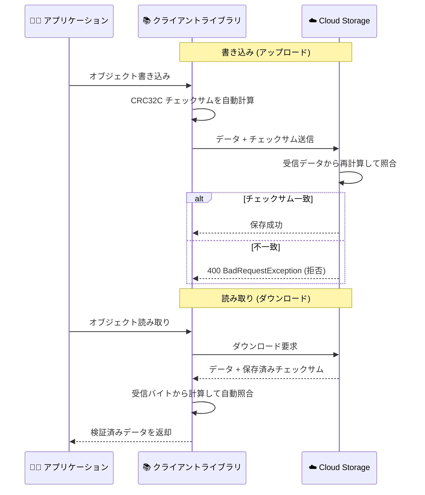

# Cloud Storage: クライアントライブラリによる自動エンドツーエンドチェックサム検証がデフォルトで有効に

**リリース日**: 2026-09-30

**サービス**: Cloud Storage

**機能**: クライアントライブラリの自動エンドツーエンドチェックサム検証 (automated, end-to-end checksumming)

**ステータス**: 一般提供 (GA)

📊 [このアップデートのインフォグラフィックを見る](https://takech9203.github.io/google-cloud-news-summary/20260930-cloud-storage-client-libraries-e2e-checksumming.html)

## 概要

Cloud Storage のクライアントライブラリが、オブジェクトの読み取り (ダウンロード) および書き込み (アップロード) 操作に対して、デフォルトで自動的なエンドツーエンドのチェックサム検証を提供するようになった。クライアントからストレージまでの経路全体でデータ整合性を維持することを目的としたアップデートである。

データは、ソフトウェアやハードウェアのバグ、メモリやルーターのエラー、電気的障害、長時間アップロード中のソースデータの変更などにより、クラウドとの転送中に破損することがある。Cloud Storage はこうしたデータ破損から保護するために CRC32C と MD5 チェックサムによる整合性検証をサポートしており、CRC32C が推奨される検証方式とされている。今回のアップデートにより、各言語のクライアントライブラリを利用するアプリケーションは、追加実装なしでこの検証をデフォルトで利用できる。

対象ユーザーは、Cloud Storage クライアントライブラリ (C++、Go、Java、Node.js、PHP、Python、Ruby、.NET など) を使用してオブジェクトの読み書きを行うすべての開発者であり、特にデータ整合性要件が厳しいデータパイプライン、バックアップ、分析基盤の運用者にとって重要な改善となる。

**アップデート前の課題**

- 公式ドキュメントに「一部のクライアントライブラリはダウンロードしたオブジェクトのチェックサム検証を自動的に実行しない」と記載されており、アプリケーション側で受信バイトからチェックサムを独自に計算し、サーバー提供のハッシュと比較する実装が必要になる場合があった
- アップロードの検証も、オブジェクトのメタデータを取得してハッシュ値を期待値と比較し、不一致時にオブジェクトを削除するといったクライアント側の追加実装が必要になるケースがあった
- 検証ロジックを言語・ライブラリごとに自前で実装すると、実装漏れや検証タイミングの差異によりサイレントなデータ破損を見逃すリスクがあった

**アップデート後の改善**

- クライアントライブラリがオブジェクトの読み取り・書き込みの両方で、デフォルトでエンドツーエンドのチェックサム検証を自動実行するようになった
- アプリケーション側でチェックサム計算・比較コードを個別に実装する必要がなくなり、クライアントからストレージまでのデータ整合性が標準で担保される
- 書き込み時はサーバー側検証により、チェックサム不一致のアップロードは `BadRequestException: 400` エラーで拒否され、破損データの保存を防止できる

## アーキテクチャ図

クライアントライブラリが書き込み時・読み取り時の両方でチェックサムを自動計算・照合し、クライアントからストレージまでのエンドツーエンドでデータ破損を検出する。

## サービスアップデートの詳細

### 主要機能

1. **書き込み (アップロード) 時の自動チェックサム**
   - クライアントライブラリがオブジェクト書き込み時にデフォルトでチェックサムを計算して送信する
   - サーバー側で受信データから再計算して照合し、不一致の場合は書き込みリクエストが `BadRequestException: 400` エラーで拒否される

2. **読み取り (ダウンロード) 時の自動検証**
   - サーバーはオブジェクトとともに保存済みチェックサムをレスポンスで返す
   - クライアントは受信したバイトからチェックサムを計算し、両者を比較してデータ整合性を検証する
   - 不一致はデータが転送中に破損したことを示し、破損データを破棄して推奨リトライロジックで再試行する

3. **gRPC でのチャンク単位検証**
   - gRPC API では、オブジェクトレベルのチェックサムに加えてメッセージ単位のチェックサムをサポートする
   - 各 `WriteObject` メッセージは最大 2 MiB のデータチャンクを含み、チャンクごとに独自のチェックサムを付与できる
   - gRPC のレンジ読み取りでは、ストリームの各レスポンスチャンクに固有の CRC32C チェックサムが含まれ、転送中の破損を即座に検証できる (エンドツーエンド検証に対応)

## 技術仕様

### チェックサム方式

| 項目 | 詳細 |
|------|------|
| 推奨方式 | CRC32C (整合性チェックの推奨検証方式) |
| MD5 | 単一ファイルアップロードでサポート。チャンク分割アップロード (コンポジットオブジェクト、XML API マルチパートアップロード) では非サポート |
| 書き込み時の不一致 | サーバーが `BadRequestException: 400` でリクエストを拒否 |
| 読み取り時の不一致 | 破損データを破棄し、リトライ戦略に従って再試行 |
| gRPC | オブジェクトレベルに加え、メッセージ (チャンク、最大 2 MiB) 単位のチェックサムに対応 |

### デフォルトでチェックサムをサポートするクライアントとバージョン

公式ドキュメントに記載されている、オブジェクト書き込みのチェックサム計算をデフォルトでサポートするクライアントとバージョンは以下のとおり。

| クライアント | チェックサム対応バージョン |
|------|------|
| C++ クライアントライブラリ | 2.46 以降 |
| Go クライアントライブラリ | 1.60.0 以降 |
| Java クライアントライブラリ | 2.62 以降 |
| Node.js クライアントライブラリ | 7.19.0 以降 |
| PHP クライアントライブラリ | 1.51.0 以降 |
| Python クライアントライブラリ | 3.7.0 以降 |
| Ruby クライアントライブラリ | 1.60.0 |
| .NET クライアントライブラリ | 2.3.0 以降 (サーバー側チェックサム検証を提供する 4.15.0 を推奨) |
| Cloud Storage コネクタ | 3.0.x 系は 3.0.18 以降、3.1.x 系は 3.1.14 以降、4.0.x 系は 4.0.3 以降 |
| Cloud Storage FUSE | 3.8.0 以降 |
| Google Cloud CLI | 対応 (オブジェクトアップロード完了後に整合性検証を実行) |

### gcloud CLI の動作

- `gcloud storage` の `cp`、`mv`、`rsync` コマンドでは、Cloud Storage バケットとの間でコピーされるデータが MD5 または CRC32C チェックサムで自動検証される
- ソースとデスティネーションのチェックサムが一致しない場合、gcloud CLI は不正なコピーを削除して警告メッセージを出力する (不正オブジェクトは特定・削除されるまで 1〜3 秒間可視になる)
- 単一ファイルのアップロードでは `--content-md5` フラグで MD5 ハッシュを指定することでサーバー側検証を利用でき、この問題を回避できる

## デメリット・制約事項

### 制限事項

- **解凍トランスコーディング (decompressive transcoding)**: サーバー提供のチェックサムは圧縮状態のオブジェクトを表すため、解凍されて配信されるデータはチェックサム値が異なり、検証できない
- **Range リクエスト (JSON/XML API)**: オブジェクトの一部のみを含むレスポンスは、オブジェクト全体のサーバー提供チェックサムと照合できない。レンジ読み取りが必要な場合は、チャンクごとの検証に対応する gRPC の利用が推奨される
- **並列コンポジットアップロード**: compose リクエストはサーバー側検証の対象外のため、エンドツーエンドの整合性チェックが必要な場合は、新しいコンポジットオブジェクトに対してクライアント側検証を行う必要がある
- **XML API マルチパートアップロード**: MD5 チェックサムは非サポートで、CRC32C のみ利用できる

### 考慮すべき点

- 自動検証の恩恵を受けるには、上記の表に記載されたバージョン以降のクライアントライブラリを使用する必要がある。古いバージョンを利用している場合はアップグレードを検討する
- gcloud CLI の自動検証はオブジェクトのファイナライズ後に行われるため、検証前に処理が中断されると不正なオブジェクトが残る可能性がある (サーバー側検証の利用で回避可能)
- 読み取り時にチェックサム不一致を検出した場合は、破損データを破棄して公式のリトライ戦略に従って再試行する運用を組み込むことが推奨される

## ユースケース

### ユースケース 1: データパイプラインでの転送時破損の自動検出

**シナリオ**: 分析基盤へ大量のオブジェクトを Python / Java クライアントライブラリでアップロード・ダウンロードしており、ネットワーク機器やメモリ起因のサイレントなデータ破損を懸念している。

**効果**: 対応バージョンのクライアントライブラリを使うだけで、読み書き双方のチェックサム検証が自動で行われる。アップロード時の破損は 400 エラーで保存前に拒否され、ダウンロード時の破損も即座に検出できるため、破損データが下流の分析処理に流れ込むことを防止できる。

### ユースケース 2: 自前のチェックサム検証コードの削減

**シナリオ**: これまでアプリケーション側でダウンロードデータのチェックサムを独自に計算し、サーバー提供のハッシュと比較する検証コードを言語ごとに実装・保守していた。

**効果**: クライアントライブラリがデフォルトで検証を実行するため、自前の検証ロジックを削減でき、実装漏れによる検証抜けのリスクも低減する。

### ユースケース 3: gRPC によるレンジ読み取りの整合性検証

**シナリオ**: 大容量オブジェクトの一部だけをレンジ指定で読み取るワークロードで、部分読み取りでも整合性を担保したい。

**効果**: gRPC のレンジ読み取りでは各レスポンスチャンクに固有の CRC32C チェックサムが含まれるため、ブロック単位で転送中の破損を即座に検証できる。レンジ読み取りが必要なアプリケーションには gRPC の利用が推奨されている。

## 料金

本アップデートはクライアントライブラリの動作に関するものであり、公式リリースノートおよびドキュメントに追加料金に関する記載はない。Cloud Storage 自体の料金は料金ページを参照。

- [Cloud Storage の料金](https://cloud.google.com/storage/pricing)

## 利用可能リージョン

クライアントライブラリの機能であり、リリースノートに特定リージョンに関する記載はない。

## 関連サービス・機能

- **Storage Transfer Service**: ソースストレージでチェックサムメタデータが利用可能な場合にエンドツーエンドのチェックサム検証を行い、不一致時は転送オペレーションを失敗として記録する。チェックサムが取得できないソースでは転送中に「オンザフライ」でチェックサムを計算し、Cloud Storage 側の最終チェックサムと比較する
- **Cloud Storage FUSE**: 3.8.0 以降でチェックサム計算をデフォルトでサポートする
- **Cloud Storage コネクタ (Dataproc など)**: Hadoop/Spark ワークロードからの Cloud Storage アクセスでも対応バージョン以降でチェックサムをサポートする
- **Google Cloud CLI (gcloud storage)**: `cp`、`mv`、`rsync` でのコピーを MD5 / CRC32C チェックサムで自動検証する

## 参考リンク

- 📊 [インフォグラフィック](https://takech9203.github.io/google-cloud-news-summary/20260930-cloud-storage-client-libraries-e2e-checksumming.html)
- [公式リリースノート (2026 年 9 月 30 日)](https://docs.cloud.google.com/release-notes#September_30_2026)
- [データ検証とチェンジディテクション (Data validation)](https://docs.cloud.google.com/storage/docs/data-validation)
- [リトライ戦略](https://docs.cloud.google.com/storage/docs/retry-strategy)
- [gRPC API の有効化](https://docs.cloud.google.com/storage/docs/enable-grpc-api)
- [料金ページ](https://cloud.google.com/storage/pricing)

## まとめ

Cloud Storage クライアントライブラリが読み書き両方でエンドツーエンドのチェックサム検証をデフォルトで提供するようになり、アプリケーション側の追加実装なしに転送中のデータ破損を検出できるようになった。データ整合性要件のあるワークロードでは、公式ドキュメントの対応バージョン表を確認し、利用中のクライアントライブラリを対応バージョン以降へアップグレードすることを推奨する。あわせて、解凍トランスコーディングや並列コンポジットアップロードなど検証対象外となるケースを把握し、必要に応じてクライアント側検証や gRPC の利用を検討したい。

---

**タグ**: Cloud Storage, データ整合性, チェックサム, CRC32C, クライアントライブラリ, gRPC
