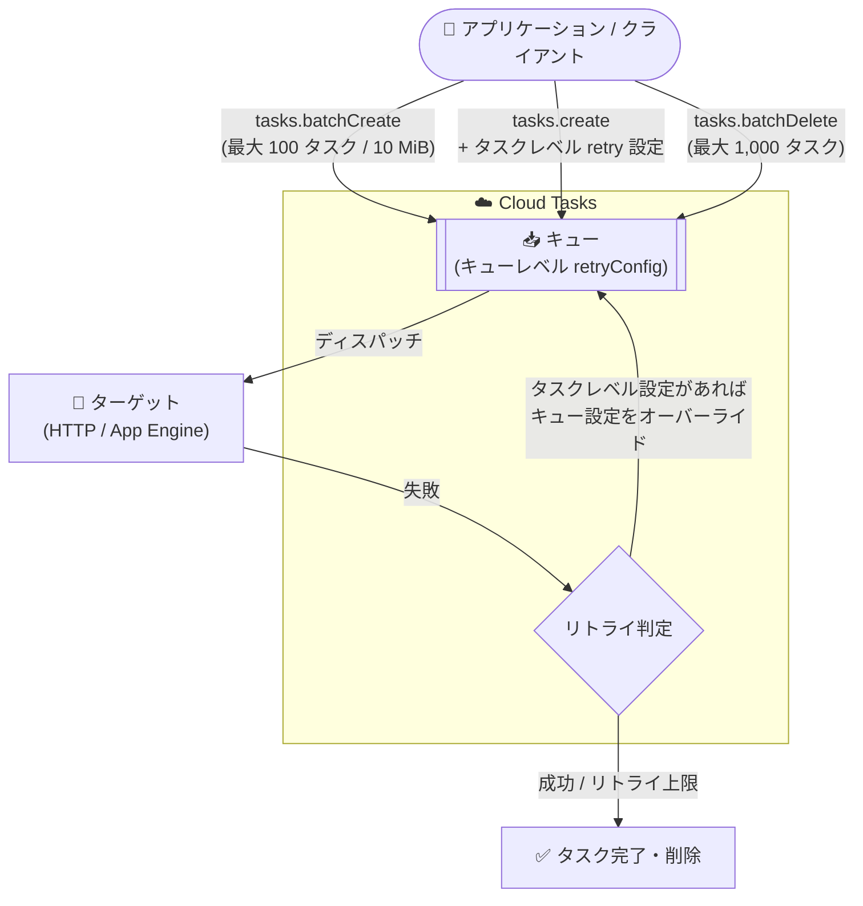

# Cloud Tasks: タスクレベルのリトライ設定とタスクのバッチ作成・削除が GA

**リリース日**: 2026-09-30

**サービス**: Cloud Tasks

**機能**: タスクレベルのリトライパラメータ設定、タスクのバッチ作成 (batchCreate)、タスクのバッチ削除 (batchDelete)

**ステータス**: GA (一般提供)

📊 [このアップデートのインフォグラフィックを見る](https://takech9203.github.io/google-cloud-news-summary/20260930-cloud-tasks-retry-batch-ga.html)

## 概要

Cloud Tasks において、以下の 3 つの機能が一般提供 (GA) となりました。

1. **タスク作成時のリトライパラメータ設定**: タスク単位でリトライパラメータを指定し、キューレベルのリトライ構成をそのタスクについてオーバーライドできます。
2. **タスクのバッチ作成 (batchCreate)**: 複数のタスクをまとめて作成し、既存のキューに一括で追加できます。
3. **タスクのバッチ削除 (batchDelete)**: キューから複数のタスクを一括で削除できます。

Cloud Tasks は大量の分散リクエストの実行を管理する非同期タスク実行サービスです。今回の GA により、タスクごとに異なるリトライ挙動が求められるワークロードや、大量のタスクを効率的に投入・整理する必要があるバッチ処理系のワークロードを、GA サポートのもとで運用できるようになります。

**アップデート前の課題**

- リトライ構成 (最大試行回数、バックオフなど) はキューレベルの設定 (`retryConfig`) に依存しており、タスクごとに異なるリトライ挙動が必要な場合は、リトライ設定の異なるキューを分けて用意するなどの対応が必要でした。
- タスクの作成は `create` メソッドによる 1 タスクずつの API 呼び出しが基本で、大量のタスク投入には多数のリクエストが必要でした。
- タスクの削除も同様に 1 タスクずつの `delete` 呼び出し、またはキュー内の全タスクを削除する `purge` しかなく、「特定の複数タスクだけをまとめて削除する」操作ができませんでした。

**アップデート後の改善**

- `tasks.create` でタスクを作成する際に、最大リトライ回数、リトライ試行の時間上限、試行間隔をタスク単位で指定でき、キューレベルのリトライ構成をタスク単位でオーバーライドできるようになりました。
- `tasks.batchCreate` により、1 リクエストで最大 100 タスク (合計 10 MiB まで) を既存キューにまとめて追加できるようになりました。
- `tasks.batchDelete` により、1 リクエストで最大 1,000 タスクをキューからまとめて削除できるようになりました。

## アーキテクチャ図



タスクは個別作成 (`create`) またはバッチ作成 (`batchCreate`) でキューに追加され、失敗時はタスクレベルのリトライ設定 (指定時) がキューレベル設定をオーバーライドして再試行されます。不要になったタスクは `batchDelete` でまとめて削除できます。

## サービスアップデートの詳細

### 主要機能

1. **タスクレベルのリトライパラメータ設定**
   - `projects.locations.queues.tasks.create` メソッドでタスクを作成する際に、失敗したタスクの最大リトライ回数、リトライ試行の時間上限、試行間隔を指定できます。
   - タスクレベルのリトライ構成は、そのタスクについてキューレベルのリトライ構成をオーバーライドします。
   - タスクが失敗した場合、Cloud Tasks は設定されたパラメータに従い指数バックオフでリトライします。タスクが正常に実行されるとキューから削除されます。いずれの場合も最大タスク保持期間 (31 日) の上限が適用されます。

2. **タスクのバッチ作成 (batchCreate)**
   - `projects.locations.queues.tasks.batchCreate` メソッドで、複数の `CreateTaskRequest` を 1 リクエストにまとめてタスクを作成し、既存のキューに追加できます。
   - 1 バッチで作成できるタスクは最大 100 個、バッチの最大サイズは 10 MiB です。
   - バッチ内のすべてのタスクは同一キュー宛てである必要があります。呼び出しはアトミックではなく、一部のタスクのみ成功する場合があります。
   - 長時間実行オペレーション (LRO) として実行され、状態は `RUNNING` / `SUCCEEDED` / `PARTIALLY_SUCCEEDED` / `FAILED` / `CANCELLED` で報告されます。失敗したリクエストは `failed_requests` にインデックスとエラーステータスのマップとして返されます。
   - `requestId` (省略時はサーバー側で UUID を生成) により、リトライ時の重複実行を回避できます。

3. **タスクのバッチ削除 (batchDelete)**
   - `projects.locations.queues.tasks.batchDelete` メソッドで、タスク名のリストを指定して複数のタスクを一括削除できます。
   - 1 バッチで削除できるタスクは最大 1,000 個です。すべてのタスクは同一キューから削除する必要があります。
   - バッチリクエストはアトミックではなく、一部の操作が失敗し他が成功する場合があります (状態 `PARTIALLY_SUCCEEDED`)。
   - 削除できるのはスケジュール済みまたはディスパッチ済みのタスクのみです。正常に完了したタスクや、失敗し続けてリトライを使い切ったタスクは削除できません。

## 技術仕様

### API メソッドと制限

| 項目 | 詳細 |
|------|------|
| タスクレベルリトライ設定 | `tasks.create` で指定 (最大リトライ回数、リトライ時間上限、試行間隔)。キューレベル `retryConfig` をオーバーライド |
| バッチ作成 API | `POST /v2/{parent}/tasks:batchCreate` |
| バッチ作成の上限 | 1 バッチ最大 100 タスク、バッチサイズ最大 10 MiB |
| バッチ削除 API | `POST /v2/{parent}/tasks:batchDelete` |
| バッチ削除の上限 | 1 バッチ最大 1,000 タスク |
| バッチ操作の重複排除期間 | 7 日間 (バッチ操作 ID と結果が重複排除のために保持される期間) |
| アトミック性 | batchCreate / batchDelete ともに非アトミック (部分的成功あり) |
| オペレーション形式 | 長時間実行オペレーション (LRO)。`failed_requests` で個別エラーを報告 |
| 最大タスク保持期間 | 31 日 |
| クォータ消費 | batchCreate / batchDelete はバッチ内のタスク数に基づき API リクエストクォータを消費 (タスク 1 個 = リクエスト 1 回分) |

### 必要な IAM 権限

| 操作 | 必要な権限 |
|------|-----------|
| タスクの作成 (create / batchCreate) | `cloudtasks.tasks.create` (対象キューに対して) |
| タスクのバッチ削除 (batchDelete) | `cloudtasks.tasks.batchDelete` (対象キューに対して) |

### リクエスト例 (batchDelete)

```json
{
  "names": [
    "projects/PROJECT_ID/locations/REGION/queues/QUEUE_ID/tasks/TASK_ID_1",
    "projects/PROJECT_ID/locations/REGION/queues/QUEUE_ID/tasks/TASK_ID_2"
  ]
}
```

## 設定方法

### 前提条件

1. Cloud Tasks API が有効化された Google Cloud プロジェクト
2. 対象のキューが作成済みであること (batchCreate / batchDelete はいずれも既存キューが対象)
3. 操作に応じた IAM 権限 (`cloudtasks.tasks.create` または `cloudtasks.tasks.batchDelete`)

### 手順

#### ステップ 1: タスクのバッチ削除 (REST API)

```bash
cat > request.json << 'EOF'
{
  "names": [
    "projects/PROJECT_ID/locations/REGION/queues/QUEUE_ID/tasks/TASK_ID"
  ]
}
EOF

curl -X POST \
  -H "Authorization: Bearer $(gcloud auth print-access-token)" \
  -H "Content-Type: application/json; charset=utf-8" \
  -d @request.json \
  "https://cloudtasks.googleapis.com/v2/projects/PROJECT_ID/locations/REGION/queues/QUEUE_ID/tasks:batchDelete"
```

削除対象のタスク名のリストをリクエストボディに指定して `tasks:batchDelete` を呼び出します。レスポンスは長時間実行オペレーションとして返され、状態と失敗したリクエストの詳細を確認できます。

#### ステップ 2: タスクのバッチ作成 (REST API)

```bash
curl -X POST \
  -H "Authorization: Bearer $(gcloud auth print-access-token)" \
  -H "Content-Type: application/json; charset=utf-8" \
  -d '{"requests": [{"task": {"httpRequest": {"url": "https://example.com/handler"}}}]}' \
  "https://cloudtasks.googleapis.com/v2/projects/PROJECT_ID/locations/REGION/queues/QUEUE_ID/tasks:batchCreate"
```

`requests` 配列に最大 100 個の `CreateTaskRequest` を含められます。各リクエストの `parent` は `batchCreate` の `parent` と同一キューである必要があります。

## メリット

### ビジネス面

- **運用の簡素化**: タスクごとのリトライ要件のためだけに複数のキューを管理する必要がなくなり、キュー構成をシンプルに保てます。
- **GA サポート**: 一般提供となったことで、本番ワークロードでの利用に対する安定性が確保されました。

### 技術面

- **柔軟なリトライ制御**: 重要度や冪等性の異なるタスクを同一キューに混在させつつ、タスク単位で最大リトライ回数や試行間隔を調整できます。
- **API 呼び出し回数の削減**: 最大 100 タスクの一括作成、最大 1,000 タスクの一括削除により、個別 API 呼び出しのオーバーヘッドとクライアント側の実装が簡素化されます。
- **重複実行の防止**: `requestId` によるバッチ操作の重複排除 (7 日間) で、クライアントのリトライ時にも安全に再送できます。

## デメリット・制約事項

### 制限事項

- batchCreate は 1 バッチ最大 100 タスク、合計 10 MiB まで。batchDelete は 1 バッチ最大 1,000 タスクまで。
- バッチ内のすべてのタスクは同一キューに属している必要があります (キューをまたぐバッチ操作は不可)。
- バッチ操作はアトミックではなく、部分的成功 (`PARTIALLY_SUCCEEDED`) が発生し得ます。`failed_requests` を確認して失敗分をハンドリングする実装が必要です。
- batchDelete で削除できるのはスケジュール済みまたはディスパッチ済みのタスクのみです。完了済みタスクやリトライを使い切ったタスクは削除対象外です。

### 考慮すべき点

- batchCreate / batchDelete のクォータ消費はバッチ内のタスク数に基づきます (タスク 1 個 = API リクエスト 1 回分としてカウント)。バッチ化してもクォータ上の消費量は変わらない点に注意が必要です。
- タスクレベルのリトライ設定を多用すると、キュー単位でのリトライ挙動の見通しが悪くなる可能性があります。デバッグには Cloud Logging でタスク実行ごとのステータスコードを記録する方法が有効です。
- タスクレベルのリトライ設定を指定しても、最大タスク保持期間 (31 日) の上限は常に適用されます。

## ユースケース

### ユースケース 1: 重要度の異なるタスクを同一キューで処理

**シナリオ**: 決済通知のような確実に届けたいタスクと、ベストエフォートで良い分析イベント送信タスクを同じキューで処理したい。

**実装例**:
```
- キューレベル: 標準的な retryConfig (例: maxAttempts、minBackoff/maxBackoff) を設定
- 決済通知タスク: tasks.create でリトライ回数・リトライ期間を長めにオーバーライド
- 分析イベントタスク: リトライ回数を少なくオーバーライドし、早期に打ち切り
```

**効果**: キューを分割せずに、タスクの重要度に応じたリトライポリシーを適用でき、キュー管理コストを削減できます。

### ユースケース 2: バッチジョブからの大量タスク投入とキャンセル

**シナリオ**: 夜間バッチで数千件の処理タスクを Cloud Tasks に投入し、上流データの不備が判明した場合は未実行分をまとめて取り消したい。

**効果**: `batchCreate` で 100 タスクずつまとめて投入することで API 呼び出しを削減し、取り消し時は `batchDelete` で最大 1,000 タスクを一括削除できるため、1 件ずつ delete を呼び出す実装が不要になります。部分的成功時も `failed_requests` で失敗分のみ再処理できます。

## 料金

Cloud Tasks の料金は API 呼び出し (オペレーション) に基づきます。batchCreate / batchDelete では、バッチ内の各タスクが API リクエストクォータに対して 1 リクエストとしてカウントされます。最新の料金体系は公式料金ページを参照してください。

- [Cloud Tasks 料金ページ](https://cloud.google.com/tasks/pricing)

## 利用可能リージョン

Cloud Tasks が利用可能なロケーションは公式ドキュメントを参照してください。

- [Cloud Tasks のロケーション](https://docs.cloud.google.com/tasks/docs/locations)

## 関連サービス・機能

- **Cloud Logging**: キューのログを有効化し、タスク実行ごとのステータスコードを記録することで、リトライパラメータのデバッグに活用できます。
- **Cloud Run / App Engine**: Cloud Tasks のディスパッチ先となる代表的なターゲットサービス (HTTP ターゲット / App Engine ターゲット)。
- **Pub/Sub**: 同じく非同期メッセージングを担うサービス。Cloud Tasks は個々のタスクの実行制御 (スケジュール、リトライ、レート制限) を明示的に管理したい場合に適しています。
- **Cloud KMS (CMEK)**: Cloud Tasks は CMEK に対応していますが、キューレベルルーティングとは併用できないなどの制約があります。

## 参考リンク

- 📊 [インフォグラフィック](https://takech9203.github.io/google-cloud-news-summary/20260930-cloud-tasks-retry-batch-ga.html)
- [公式リリースノート](https://docs.cloud.google.com/release-notes#September_30_2026)
- [タスクのリトライパラメータの設定](https://docs.cloud.google.com/tasks/docs/configure-retry-task)
- [タスクのバッチ作成 (Create a batch of tasks)](https://docs.cloud.google.com/tasks/docs/create-tasks#create-batch-tasks)
- [タスクのバッチ削除 (Delete a batch of tasks)](https://docs.cloud.google.com/tasks/docs/manage-queues-and-tasks#delete-batch-tasks)
- [Cloud Tasks のクォータと上限](https://docs.cloud.google.com/tasks/docs/quotas)
- [Cloud Tasks REST API リファレンス](https://docs.cloud.google.com/tasks/docs/reference/rest)
- [料金ページ](https://cloud.google.com/tasks/pricing)

## まとめ

Cloud Tasks のタスクレベルリトライ設定とタスクのバッチ作成・削除が GA となり、タスク単位のきめ細かなリトライ制御と、大量タスクの効率的な投入・整理が本番環境で利用できるようになりました。リトライ要件ごとにキューを分割している場合はタスクレベル設定への集約を、大量タスクを個別 API で操作している場合は batchCreate / batchDelete への移行を検討することを推奨します。その際は、バッチ操作が非アトミックである点と、クォータがタスク数ベースで消費される点に留意してください。

---

**タグ**: #CloudTasks #GA #リトライ #バッチ処理 #非同期処理 #API
