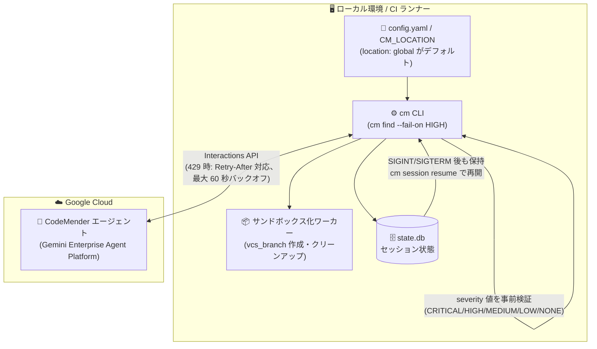

# Gemini Enterprise Agent Platform: CodeMender v0.11.0 リリース

**リリース日**: 2026-09-30

**サービス**: Gemini Enterprise Agent Platform (CodeMender)

**機能**: CodeMender v0.11.0 (階層型ロケーション設定、CI ゲート severity 検証、サンドボックス VCS ハードニング、バグ修正)

**ステータス**: Fixed / Feature (CodeMender は Preview)

📊 [このアップデートのインフォグラフィックを見る](https://takech9203.github.io/google-cloud-news-summary/20260930-codemender-v0-11-0.html)

## 概要

Gemini Enterprise Agent Platform 上でホストされる AI コードセキュリティエージェント「CodeMender」の v0.11.0 がリリースされた。CodeMender は、コードベースの脆弱性をスキャン (`cm find`)・検証 (`cm verify`)・修正 (`cm fix`) する自律型エージェントで、推論エンジンは Google Cloud 上で動作し、コードの読み取りやビルド・PoC エクスプロイト実行はローカルの `cm` CLI がユーザー環境内で行う「ローカルファースト実行モデル」を採用している。

v0.11.0 では、(1) `CM_LOCATION` 環境変数または `config.yaml` の `location` によるサービスロケーションの階層型設定 (デフォルト: `global`、従来の `--location` コマンドラインフラグを置き換え)、(2) `cm find` の `--fail-on` に指定する severity 値 (`CRITICAL` / `HIGH` / `MEDIUM` / `LOW` / `NONE`) の事前検証、(3) `--architecture` セッションにおけるサンドボックス内 VCS ブランチ作成とコマンドインジェクション対策のハードニングが導入された。あわせて、重複検出の防止、HTTP 429 時のリトライバックオフ拡張、割り込み時のセッション保持など、スキャンの信頼性を高めるバグ修正が含まれる。

CI/CD パイプラインに CodeMender を組み込んでいるチームや、大規模リポジトリのスキャンでレート制限や中断に悩まされていたユーザーにとって、運用安定性と設定の一貫性が向上するアップデートである。

**アップデート前の課題**

- サービスロケーションの指定は `--location` コマンドラインフラグで行う必要があり、コマンド実行ごとに指定する運用だった
- `cm find` の `--fail-on` に誤った severity 値 (スペルミスなど) を指定しても黙って無視され、CI ゲートが意図せず機能しないリスクがあった
- 脆弱性タイプの大文字小文字や相対ファイルパスの表記ゆれにより、`cm find` やコンセンサス実行で同一脆弱性が重複して報告されることがあった
- レート制限 (HTTP 429) 発生時のリトライが不十分で、大規模スキャンが失敗しやすかった
- `cm find` / `cm verify` / `cm fix` の実行中に SIGINT / SIGTERM で割り込むと、セッションが保持されず再開できなかった

**アップデート後の改善**

- `CM_LOCATION` 環境変数または `config.yaml` の `location` でロケーションを一元設定できるようになった (デフォルト: `global`)
- `--fail-on` の severity 値が実行前に検証され、無効な値は即座にエラーとなるため、CI ゲートの設定ミスを早期に検出できるようになった
- `--architecture` セッションで `vcs_branch` の作成と候補ブランチのクリーンアップがデフォルトのサンドボックス化ワーカー内で実行され、VCS テンプレート展開がシェルメタ文字・コマンドインジェクションに対して強化された
- 脆弱性タイプの正規化と相対パスの正規化により重複検出が防止された
- `Retry-After` ヘッダー対応と最大 60 秒のクォータ回復待機を含むリトライバックオフ拡張、およびストリーム自動再接続により、レート制限下でのスキャン耐性が向上した
- 割り込み時 (SIGINT / SIGTERM) に単独実行の `cm find` / `cm verify` / `cm fix` セッションが保持され、`cm session resume` で再開可能になった (並列コンセンサスワーカーの処理はキャンセルされる)

## アーキテクチャ図



v0.11.0 の主要な変更点を CodeMender のローカルファースト実行モデル上にマッピングした図。ロケーション設定の階層化、CI ゲートの事前検証、サンドボックス内 VCS 操作、割り込み後のセッション再開がそれぞれどのコンポーネントに関係するかを示している。

## サービスアップデートの詳細

### 主要機能

1. **階層型ロケーション設定 (Tiered location configuration)**
   - サービスロケーションを `CM_LOCATION` 環境変数、または `config.yaml` の `location` で設定できるようになった
   - デフォルト値は `global`
   - 従来の `--location` コマンドラインフラグを置き換える変更であり、環境変数や設定ファイルによる一元管理が可能になった

2. **CI ゲートの severity 検証 (CI gate severity validation)**
   - `cm find` の `--fail-on` に指定する severity 値 (`CRITICAL`、`HIGH`、`MEDIUM`、`LOW`、`NONE`) を実行前に検証するようになった
   - 従来はスペルミスした severity が黙って無視されており、CI パイプラインのゲートが実質無効になる危険があった
   - なお、severity ベースの CI ゲーティング (`--fail-on`) と SARIF v2.1.0 エクスポートは v0.10.0 (2026-09-24) で導入されており、今回はその堅牢化にあたる

3. **サンドボックス化された VCS ブランチ作成とハードニング**
   - `--architecture` セッションにおいて、`vcs_branch` の作成と候補ブランチのクリーンアップがデフォルトのサンドボックス化ワーカー内で実行されるようになった
   - VCS テンプレート展開がシェルメタ文字およびコマンドインジェクションに対して強化された

4. **バグ修正**
   - **重複検出の防止**: `cm find` およびコンセンサス実行時に脆弱性タイプの大文字小文字と相対ファイルパスを正規化し、重複する検出結果を防止
   - **レート制限耐性の向上**: HTTP 429 リトライバックオフを拡張 (`Retry-After` ヘッダー対応、最大 60 秒のクォータ回復待機) し、ストリームの自動再接続によりスキャンの耐性を改善
   - **割り込み時のセッション保持**: 単独実行の `cm find` / `cm verify` / `cm fix` セッションを SIGINT / SIGTERM 時に保持し、`cm session resume` で再開可能に (並列コンセンサスワーカーの処理はキャンセル)

## 技術仕様

### v0.11.0 の変更点サマリー

| 項目 | 変更内容 |
|------|---------|
| ロケーション設定 | `CM_LOCATION` 環境変数 / `config.yaml` の `location` (デフォルト: `global`)。`--location` フラグを置き換え |
| `--fail-on` 検証 | `CRITICAL` / `HIGH` / `MEDIUM` / `LOW` / `NONE` を実行前に検証。無効値は事前にエラー |
| VCS 操作 | `--architecture` セッションの `vcs_branch` 作成・クリーンアップをサンドボックス化ワーカー内で実行。テンプレート展開のインジェクション対策 |
| 429 リトライ | `Retry-After` 対応、最大 60 秒のクォータ回復待機、ストリーム自動再接続 |
| セッション保持 | SIGINT / SIGTERM 時に `cm find` / `cm verify` / `cm fix` セッションを保持し `cm session resume` で再開 |
| 重複検出防止 | 脆弱性タイプの casing と相対ファイルパスを正規化 |

### CodeMender のアーキテクチャとセキュリティモデル (ドキュメントより)

| 項目 | 詳細 |
|------|------|
| 実行モデル | ローカルファースト。推論・オーケストレーションは Gemini Enterprise Agent Platform 上、ファイル読み取り・ビルド・PoC 実行はローカルの `cm` CLI |
| データ送信 | 必要最小限のコードスニペットとツール実行結果のみを Interactions API 経由で送信。リポジトリ全体のアップロードは不要 |
| データ保持 | セッションデータは再開のため暗号化して最大 7 日間保持。ソースコード・プロンプト・パッチはモデル学習に使用されない |
| セッション管理 | ローカル SQLite (`state.db`) によるステートフルセッション。`cm session list` / `resume` / `cancel` |
| severity レベル | `CRITICAL` / `HIGH` / `MEDIUM` / `LOW` (exploitability と影響度で分類) |
| プラットフォーム統制 | VPC Service Controls、VPC 経由のセキュアなトラフィックルーティングに対応 |

### 設定例 (config.yaml)

```yaml
# ~/.codemender/config.yaml (CM_HOME でディレクトリを変更可能)
location: global          # v0.11.0: サービスロケーション (デフォルト: global)
human_confirmation: true  # 対話的な承認 (CI/CD では false に設定可能)
confirm_writes: true      # ファイル書き込み前の確認
```

```bash
# 環境変数での指定 (config.yaml より簡易な一時的切り替えに)
export CM_LOCATION=global
```

## 設定方法

### 前提条件

1. CodeMender へのアクセス (Preview。Pre-GA Offerings Terms が適用される)
2. CodeMender CLI (`cm`) のダウンロードとワークスペースの初期化 ([環境セットアップガイド](https://docs.cloud.google.com/gemini-enterprise-agent-platform/codemender/set-up-environment)参照)

### 手順

#### ステップ 1: ロケーションを設定する

```bash
# 方法 1: 環境変数で指定
export CM_LOCATION=global

# 方法 2: config.yaml に記載 (~/.codemender/config.yaml)
# location: global
```

v0.11.0 以降は `--location` フラグではなく、環境変数または `config.yaml` で設定する。未設定時は `global` が使用される。

#### ステップ 2: CI ゲート付きスキャンを実行する

```bash
# severity 値は実行前に検証される (無効値は即エラー)
cm find ./src/auth/ --fail-on HIGH -y
```

`--fail-on` に `CRITICAL` / `HIGH` / `MEDIUM` / `LOW` / `NONE` 以外を指定すると、スキャン開始前にエラーとなる。

#### ステップ 3: 中断されたセッションを再開する

```bash
# セッション一覧を確認
cm session list

# SIGINT/SIGTERM で中断されたセッションを再開
cm session resume SESSION_ID
```

v0.11.0 では、単独実行の `cm find` / `cm verify` / `cm fix` が割り込みで中断されてもセッションが保持されるため、長時間スキャンを途中から再開できる。

## メリット

### ビジネス面

- **CI ゲートの信頼性向上**: severity 値の事前検証により、設定ミスでセキュリティゲートが無効化されたまま運用されるリスクを排除できる
- **スキャン運用コストの削減**: レート制限耐性の向上とセッション再開により、大規模コードベースの長時間スキャンの失敗・やり直しが減る

### 技術面

- **設定の一元管理**: ロケーションを環境変数・設定ファイルで管理でき、CI/CD テンプレートやチーム共有設定に組み込みやすくなった
- **エージェントの安全性強化**: VCS ブランチ操作のサンドボックス化とテンプレート展開のインジェクション対策により、エージェントがローカル環境で VCS を操作する際の安全性が高まった
- **検出結果の正確性向上**: 脆弱性タイプとファイルパスの正規化により、重複した検出結果によるノイズが減少した

## デメリット・制約事項

### 制限事項

- CodeMender は Preview であり、Pre-GA Offerings Terms が適用される (限定サポートの可能性あり)
- `--location` コマンドラインフラグは `CM_LOCATION` / `config.yaml` に置き換えられたため、既存のスクリプトで同フラグを使用している場合は移行が必要
- 割り込み時のセッション保持は単独実行の `cm find` / `cm verify` / `cm fix` が対象で、並列コンセンサスワーカーの処理はキャンセルされる

### 考慮すべき点

- `--fail-on` の事前検証により、これまで黙って無視されていた無効な severity 値を指定していた既存の CI パイプラインは、v0.11.0 以降エラーで失敗するようになる。アップグレード時に CI 設定を確認すること
- CodeMender はローカルでコマンド実行やファイル変更を行うため、サンドボックスを無効化する場合 (`--sandbox=false` / `--unrestricted`) は分離された VM やコンテナでの実行が推奨される

## ユースケース

### ユースケース 1: CI/CD パイプラインでのセキュリティゲート

**シナリオ**: プルリクエストごとに CodeMender でスキャンを実行し、HIGH 以上の脆弱性が検出された場合はマージをブロックしたい。

**実装例**:
```bash
# CI ランナー上 (非対話モード)
export CM_LOCATION=global
cm find --diff --fail-on HIGH -y
# 無効な severity 値 (例: --fail-on HIHG) は実行前にエラーとなり、
# ゲートが無効なまま成功してしまう事故を防げる
```

**効果**: severity 値の事前検証により、CI ゲートの設定ミスを即座に検出できる。レート制限時も `Retry-After` 対応のバックオフで自動リトライされるため、パイプラインの安定性が向上する。

### ユースケース 2: 大規模コードベースの長時間スキャンの中断と再開

**シナリオ**: 大規模リポジトリの深いスキャンを実行中に、CI ランナーのタイムアウトやオペレーターの割り込み (Ctrl+C) でスキャンが中断された。

**実装例**:
```bash
cm find ./monorepo/services/ --deep
# ... Ctrl+C (SIGINT) で中断 ...
cm session list
cm session resume SESSION_ID
```

**効果**: v0.11.0 では中断時にセッションが保持されるため、最初からやり直すことなくチェックポイントから再開でき、時間とトークン消費を節約できる。

## 料金

CodeMender の個別の料金情報は、本レポート作成時点で公式に確認できなかった。CodeMender は Gemini Enterprise Agent Platform 上の Preview 機能として提供されている。詳細は以下を参照のこと。

- [CodeMender 製品ページ](https://cloud.google.com/security/codemender)
- [Gemini Enterprise Agent Platform ドキュメント](https://docs.cloud.google.com/gemini-enterprise-agent-platform)

## 利用可能リージョン

サービスロケーションのデフォルトは `global`。`CM_LOCATION` 環境変数または `config.yaml` の `location` で設定できる。指定可能なロケーションの一覧は公式ドキュメントを参照のこと。

## 関連サービス・機能

- **Gemini Enterprise Agent Platform**: CodeMender のホスト基盤。エージェントの推論・オーケストレーションを実行し、ガバナンス機能 (ゼロデータ保持、VPC Service Controls など) を提供する
- **Gemini 3.8 Flash / Gemini 3.8 Flash Cyber**: CodeMender CLI セッションで使用されるモデル。v0.8.0 以降 Gemini 3.8 Flash がデフォルト。Flash Cyber はサイバーセキュリティ用途に特化したポストトレーニング版
- **VPC Service Controls**: エージェント通信の周囲にネットワーク境界を設定し、データ漏えいリスクを低減する
- **外部静的解析ツール / SARIF 対応ツール**: CodeMender は外部ツールの検出結果のインポートや、SARIF v2.1.0 形式でのエクスポート (v0.10.0 で追加) に対応し、既存のコードスキャンワークフローと統合できる

## 参考リンク

- 📊 [インフォグラフィック](https://takech9203.github.io/google-cloud-news-summary/20260930-codemender-v0-11-0.html)
- [公式リリースノート](https://docs.cloud.google.com/release-notes#September_30_2026)
- [Google Cloud Blog: Find and fix software vulnerabilities with CodeMender](https://cloud.google.com/blog/products/identity-security/find-and-fix-software-vulnerabilities-with-codemender)
- [CodeMender ドキュメント](https://docs.cloud.google.com/gemini-enterprise-agent-platform/codemender)
- [CodeMender 環境セットアップ](https://docs.cloud.google.com/gemini-enterprise-agent-platform/codemender/set-up-environment)
- [CodeMender セッション管理](https://docs.cloud.google.com/gemini-enterprise-agent-platform/codemender/manage-sessions)
- [CodeMender スキャンと検証](https://docs.cloud.google.com/gemini-enterprise-agent-platform/codemender/scan-and-verify)
- [CodeMender 製品ページ](https://cloud.google.com/security/codemender)

## まとめ

CodeMender v0.11.0 は、ロケーション設定の階層化、CI ゲートの severity 事前検証、VCS 操作のサンドボックス化・ハードニング、そしてレート制限耐性やセッション再開などのバグ修正により、CI/CD での実運用に向けた堅牢性を大きく高めるリリースである。既存ユーザーは `--location` フラグから `CM_LOCATION` / `config.yaml` への移行と、CI パイプラインの `--fail-on` 設定値の確認を行うことを推奨する。

---

**タグ**: #GeminiEnterpriseAgentPlatform #CodeMender #Security #AIAgent #CICD #DevSecOps #Preview
