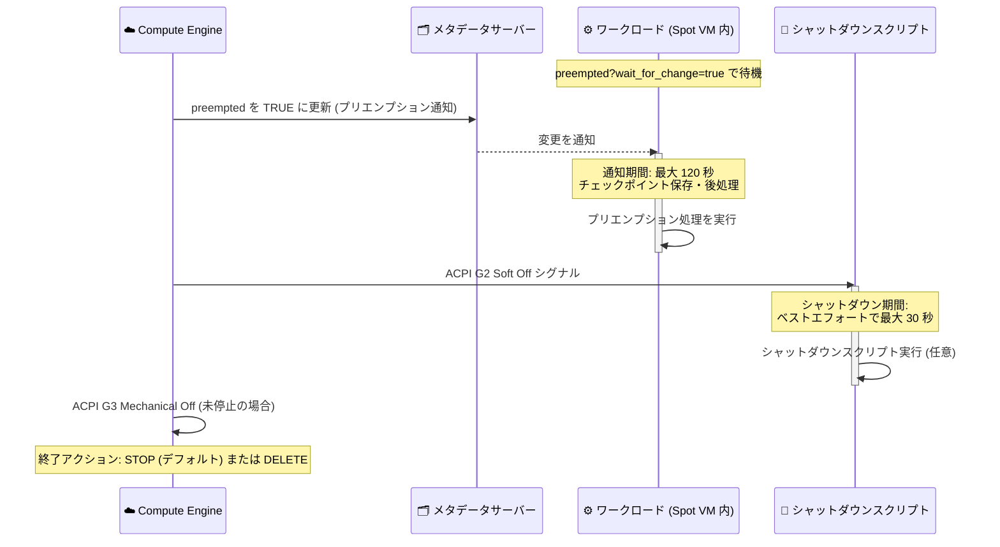

# Compute Engine: Spot VM の 120 秒プリエンプション通知期間 (GA)

**リリース日**: 2026-09-30

**サービス**: Compute Engine

**機能**: Spot VM 作成時の 120 秒プリエンプション通知期間の指定

**ステータス**: GA (Generally Available)

📊 [このアップデートのインフォグラフィックを見る](https://takech9203.github.io/google-cloud-news-summary/20260930-compute-engine-spot-vm-120s-preemption-notice.html)

## 概要

Compute Engine の Spot VM で、作成時に **120 秒のプリエンプション通知期間 (preemption notice duration)** を指定できる機能が一般提供 (GA) になりました。プリエンプション通知期間とは、Compute Engine が VM のメタデータ `preempted` を `TRUE` に更新してプリエンプションを通知してから、シャットダウン開始を示す ACPI G2 Soft Off シグナルを送信するまでの時間です。この期間を 120 秒に設定すると、従来のベストエフォートで最大 30 秒のシャットダウン期間に加えて、最大 120 秒をプリエンプション処理 (チェックポイント保存、処理中ジョブの引き渡し、グレースフルな接続クローズなど) に充てられます。

対象ユーザーは、バッチ処理、ML 学習、フォールトトレラントな分散処理など、コスト効率の高い Spot VM を活用しつつ、プリエンプション時に 30 秒を超える後処理時間を必要とするワークロードの運用者です。既存の Spot VM ワークロードを移行する場合は、シャットダウンスクリプトの外側 (ワークロード内) でプリエンプションを処理するようにコードを更新し、プリエンプションのテストを行うことが推奨されています。

**アップデート前の課題**

- プリエンプション通知期間を指定しない場合 (デフォルトの 0 秒)、メタデータでのプリエンプション検知と ACPI G2 Soft Off シグナルの間に専用の猶予はなく、プリエンプション処理はシャットダウンスクリプト内で行う必要があった
- シャットダウン期間はベストエフォートで最大 30 秒と短く、大きなチェックポイントの保存や長めのクリーンアップ処理には時間が不足するケースがあった
- 120 秒の通知期間は以前は Preview として提供されており、本番ワークロードへの適用には Pre-GA の利用条件が伴っていた

**アップデート後の改善**

- Spot VM 作成時に 120 秒のプリエンプション通知期間を指定でき、シャットダウン期間 (最大 30 秒) の前に最大 120 秒の専用処理時間を確保できるようになった
- 30 秒を超える時間を要するプリエンプション処理を、シャットダウンスクリプトではなくワークロード内のコードで実行できるようになった
- GA となったことで、一般提供の条件下で本番ワークロードに適用できるようになった

## アーキテクチャ図



120 秒のプリエンプション通知期間を設定した Spot VM のプリエンプション処理シーケンスです。メタデータ `preempted` の変更を検知したワークロードが最大 120 秒間の後処理を行い、その後 ACPI G2 Soft Off シグナルによる最大 30 秒のシャットダウン期間に移行します。

## サービスアップデートの詳細

### 主要機能

1. **120 秒のプリエンプション通知期間 (GA)**
   - Spot VM の作成時に、メタデータによるプリエンプション通知から ACPI G2 Soft Off シグナルまでの期間を 120 秒に設定可能
   - 30 秒を超える時間、または専用の時間を必要とするプリエンプション処理を持つワークロードに推奨
   - 通知期間中はワークロード内のコードでプリエンプション処理を実行し、加えてシャットダウンスクリプトも任意で併用可能

2. **デフォルト動作 (0 秒) は従来どおり**
   - 通知期間を指定しない、または 0 秒に設定した場合、メタデータでの検知と ACPI G2 Soft Off シグナルの間に専用の猶予はない
   - この場合は、ベストエフォートで最大 30 秒のシャットダウン期間中にシャットダウンスクリプトでプリエンプションを処理する

3. **ワークロード内でのプリエンプション検知**
   - メタデータサーバーの `preempted` 値を `?wait_for_change=true` 付きの HTTP GET でハングさせて監視することで、プリエンプション発生を即時に検知可能
   - シャットダウンスクリプトの外側でプリエンプション処理をトリガーする用途に適する

## 技術仕様

### プリエンプション通知期間の設定値

| 項目 | 詳細 |
|------|------|
| 設定可能な値 | `120s` または `0s` (gcloud CLI の場合) |
| デフォルト | 0 秒 (専用の通知期間なし) |
| 通知方法 | VM のデフォルトメタデータ `preempted` が `TRUE` に更新される |
| 通知期間の定義 | メタデータ更新から ACPI G2 Soft Off シグナル送信までの時間 |
| シャットダウン期間 | ACPI G2 Soft Off 後、ベストエフォートで最大 30 秒 (他のインスタンスより短い) |
| シャットダウン期間後 | 停止していない場合、ACPI G3 Mechanical Off シグナルを送信 |
| 終了アクション | `STOP` (デフォルト) または `DELETE` |
| 設定タイミング | Spot VM の作成時 (インスタンステンプレートでも指定可能) |

### API での指定 (scheduling フィールド)

```json
{
  "scheduling": {
    "provisioningModel": "SPOT",
    "preemptionNoticeDuration": { "seconds": 120 },
    "instanceTerminationAction": "STOP"
  }
}
```

## 設定方法

### 前提条件

1. Spot VM として作成すること (`--provisioning-model=SPOT`)
2. 120 秒の通知期間を使う場合、プリエンプション処理をシャットダウンスクリプトの外側 (ワークロード内) で実行するようにコードを構成すること
3. 既存の Spot VM ワークロードを移行する場合は、移行後にプリエンプションの動作をテストすること

### 手順

#### ステップ 1: 120 秒の通知期間付きで Spot VM を作成する

```bash
gcloud beta compute instances create VM_NAME \
    --provisioning-model=SPOT \
    --preemption-notice-duration=120s \
    --instance-termination-action=TERMINATION_ACTION
```

`TERMINATION_ACTION` にはプリエンプション時の動作として `STOP` (デフォルト) または `DELETE` を指定します。ドキュメントの手順では gcloud CLI の beta コマンドおよび Compute Engine API の beta `instances.insert` メソッドが案内されています。

#### ステップ 2: ワークロード内でプリエンプションを検知して処理する

```bash
# preempted が TRUE になるまで待機するハンギング GET リクエスト
curl "http://metadata.google.internal/computeMetadata/v1/instance/preempted?wait_for_change=true" \
    -H "Metadata-Flavor: Google"
```

このコマンドはメタデータが変更され VM がプリエンプトされたときにのみ返ります。返却後、通知期間 (最大 120 秒) の間にチェックポイント保存などのプリエンプション処理を実行します。

#### ステップ 3: プリエンプションをテストする

```bash
# VM の停止によりプリエンプションをシミュレート
gcloud compute instances stop VM_NAME
```

VM の停止 (終了アクションが DELETE の場合は削除) により、プリエンプションをシミュレートして処理コードの動作を確認できます。

## メリット

### ビジネス面

- **Spot VM の適用範囲拡大**: プリエンプション処理に時間を要するためこれまで Spot VM の採用が難しかったワークロードでも、低コストな Spot VM を活用しやすくなる
- **本番利用の安心感**: GA となったことで、一般提供の条件下で本番ワークロードに適用できる

### 技術面

- **処理時間の拡大**: 従来のベストエフォート最大 30 秒のシャットダウン期間に加え、最大 120 秒の専用の通知期間を確保できる
- **シャットダウンスクリプトからの脱却**: プリエンプション処理をワークロード内のコードとして実装でき、アプリケーションの状態を把握したうえでのグレースフルな後処理が可能になる
- **シャットダウンスクリプトとの併用**: 120 秒の通知期間を設定した VM でも、シャットダウン期間中に動作するシャットダウンスクリプトを任意で併用できる

## デメリット・制約事項

### 制限事項

- プリエンプション通知期間は Spot VM の作成時に指定する (gcloud CLI では `120s` または `0s` のいずれか)
- シャットダウン期間自体は従来どおりベストエフォートで最大 30 秒であり、期間内に停止しない場合は ACPI G3 Mechanical Off シグナルが送信される
- Spot VM の一般的な制約 (自動再起動やホストメンテナンスオプションを設定できない等) は引き続き適用される

### 考慮すべき点

- 既存の Spot VM ワークロードを移行する場合、シャットダウンスクリプト内ではなくワークロード内でプリエンプションを処理するようコードを更新し、プリエンプションのテストを行う必要がある
- 通知期間中の処理はワークロード側の実装に依存するため、メタデータの `preempted` 値の監視 (例: `wait_for_change=true`) を組み込む設計が前提となる

## ユースケース

### ユースケース 1: ML 学習ジョブのチェックポイント保存

**シナリオ**: Spot VM 上で長時間の ML 学習を実行しており、プリエンプション時に学習状態のチェックポイントを Cloud Storage に保存したいが、30 秒のシャットダウン期間では保存が完了しないことがある。

**実装例**:
```bash
# ワークロード内の監視プロセス
curl "http://metadata.google.internal/computeMetadata/v1/instance/preempted?wait_for_change=true" \
    -H "Metadata-Flavor: Google"
# TRUE が返ったら、120 秒の通知期間内にチェックポイントを保存
gcloud storage cp /path/to/checkpoint.out gs://BUCKET_NAME/
```

**効果**: 最大 120 秒の通知期間を使って大きなチェックポイントファイルの保存を完了でき、学習の再開時のロスを削減できる。

### ユースケース 2: バッチ処理ジョブのグレースフルな引き渡し

**シナリオ**: Spot VM ベースのワーカー群でキュー処理を行っており、プリエンプション時に処理中のジョブを完了またはキューへ戻してから終了したい。

**効果**: 通知期間中に処理中ジョブの後始末やキューへの再投入をワークロード内で実行でき、ジョブの取りこぼしや二重処理のリスクを低減できる。

## 料金

Spot VM の料金体系自体に変更はありません。なお、作成から 1 分未満でプリエンプトされた Spot VM については VM の使用料金は請求されません (プレミアム OS の料金は通常どおり計算されます)。

詳細は料金ページを参照してください。

- [Spot VM の料金](https://cloud.google.com/spot-vms/pricing)

## 利用可能リージョン

リリースノートおよび参照したドキュメントにリージョン制限の記載はありません。最新の情報は公式ドキュメントを参照してください。

## 関連サービス・機能

- **Cloud Storage**: プリエンプション処理でのチェックポイントファイルの保存先として利用される
- **マネージドインスタンスグループ (MIG)**: インスタンステンプレートで `--preemption-notice-duration` を指定することで、MIG で作成する Spot VM にも通知期間を設定できる
- **Google Kubernetes Engine (GKE)**: GKE の Spot VM ノードでは、プリエンプション通知後の Pod のグレースフル終了期間を 120 秒に延長する設定が Preview として提供されている (Standard ノードプールおよびカスタム ComputeClass)

## 参考リンク

- 📊 [インフォグラフィック](https://takech9203.github.io/google-cloud-news-summary/20260930-compute-engine-spot-vm-120s-preemption-notice.html)
- [公式リリースノート](https://docs.cloud.google.com/release-notes#September_30_2026)
- [Spot VM の概要 (プリエンプションプロセス)](https://docs.cloud.google.com/compute/docs/instances/spot)
- [Spot VM の作成と使用](https://docs.cloud.google.com/compute/docs/instances/create-use-spot)
- [Spot VM の料金](https://cloud.google.com/spot-vms/pricing)

## まとめ

Spot VM の 120 秒プリエンプション通知期間が GA となり、従来の最大 30 秒のシャットダウン期間では不足していたプリエンプション処理に、最大 120 秒の専用時間を確保できるようになりました。チェックポイント保存やジョブの引き渡しに時間を要するワークロードでは、メタデータ監視によるワークロード内でのプリエンプション処理への移行と、プリエンプションのテストを検討することを推奨します。

---

**タグ**: Compute Engine, Spot VM, プリエンプション, GA, コスト最適化, バッチ処理
