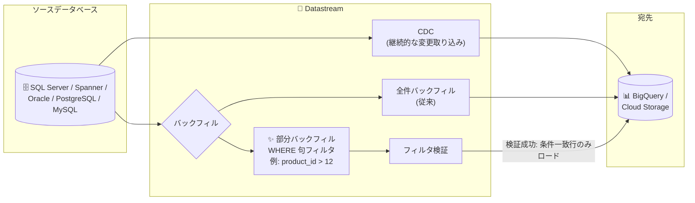

# Datastream: 部分バックフィル (Partial Backfill) のサポート

**リリース日**: 2026-09-30

**サービス**: Datastream

**機能**: SQL Server / Spanner / Oracle / PostgreSQL / MySQL ソースの部分バックフィル

**ステータス**: Feature

📊 [このアップデートのインフォグラフィックを見る](https://takech9203.github.io/google-cloud-news-summary/20260930-datastream-partial-backfill.html)

## 概要

Datastream が SQL Server、Spanner、Oracle、PostgreSQL、MySQL の各ソースに対して**部分バックフィル (Partial Backfill)** をサポートしました。部分バックフィルでは、SQL の WHERE 句をカスタムフィルタとして指定することで、ソースデータベースの特定のサブセットのみを宛先にロードできます。

Datastream はサーバーレスの変更データキャプチャ (CDC) およびレプリケーションサービスであり、データの転送方式として「CDC (継続的な変更の取り込み)」と「バックフィル (既存データのスナップショット転送)」の 2 つを提供しています。従来のバックフィルはテーブル (オブジェクト) 単位の全件転送のみでしたが、今回のアップデートにより行レベルの条件を指定した部分的なデータロードが可能になりました。

大規模テーブルの再同期や、特定期間・特定条件のデータのみを修復したいデータエンジニアリングチームにとって、ソース負荷・転送量・時間を削減できる重要な機能強化です。なお、Oracle、PostgreSQL、MySQL ソースへの部分バックフィルは段階的に提供されており、ストリームがこの機能をサポートしている場合にのみ Google Cloud コンソールにオプションが表示されます。

**アップデート前の課題**

- バックフィルはオブジェクト (テーブル) 単位の全件転送のみで、行レベルの絞り込みができなかった
- 宛先側で一部のデータが欠損・不整合になった場合でも、テーブル全体を再バックフィルする必要があり、大規模テーブルではソースデータベースへの負荷と処理データ量 (課金対象) が大きかった
- 必要なデータが一部だけの場合でも、全データの転送完了を待つ必要があり、復旧までの時間が長かった

**アップデート後の改善**

- SQL WHERE 句をカスタムフィルタとして指定し、条件に一致する行のみをバックフィルできるようになった
- データ不整合の修復時に、対象範囲 (例: 特定の日時以降、特定の ID 範囲) だけを再ロードでき、ソース負荷と転送量を最小化できる
- Google Cloud コンソールに加えて、gcloud CLI (`--sql-where-clause` フラグ) や Datastream API からも部分バックフィルを開始できる

## アーキテクチャ図



Datastream のバックフィル経路に、SQL WHERE 句によるカスタムフィルタを適用した部分バックフィルが追加されました。Datastream はフィルタを検証したうえで、条件に一致するサブセットのみを宛先へストリーミングします。

## サービスアップデートの詳細

### 主要機能

1. **SQL WHERE 句によるカスタムフィルタ**
   - バックフィル開始時に「Enable custom filter」を有効化し、WHERE 句 (WHERE キーワード自体は含めない) を入力する
   - 例: `product_id > 12 AND timestamp = '2025-01-06T22:00:00.00'`
   - Datastream がフィルタを検証し、検証に失敗した場合はエディタ上にエラーメッセージが表示される。検証に成功するとバックフィルジョブが開始される

2. **5 種類のソースデータベースに対応**
   - SQL Server、Spanner、Oracle、PostgreSQL、MySQL の各ソースで利用可能
   - Oracle、PostgreSQL、MySQL ソースについては段階的に提供 (gradual rollout)。コンソールでは、ストリームが機能をサポートしている場合にのみ部分バックフィルオプションが表示される
   - 未対応のストリームに対して gcloud CLI や Datastream API で部分バックフィルを構成した場合、リクエストは失敗する

3. **コンソール / gcloud CLI / API からの実行**
   - Google Cloud コンソールのストリームの「Objects」タブから対象オブジェクトを選択して開始
   - gcloud では `gcloud datastream objects start-backfill` コマンドの `--sql-where-clause` フラグで指定 (SQL ソースのみサポート)

## 技術仕様

### サポートされるカスタムフィルタ構文

| 要素 | サポート内容 |
|------|-------------|
| 論理演算子 | `AND`、`OR` |
| 比較演算子 | `=`、`<`、`>`、`<=`、`>=`、`!=` |
| 条件 | `IN`、`NOT IN`、`IS NULL`、`IS NOT NULL` |
| グループ化 | 括弧 `()` による条件グループの定義 |
| 文字列値 | シングルクォートで囲んだテキスト (例: `'value'`) |
| 数値 | 整数 (`123`)、小数 (`123.45`)、負数 (`-10`)、指数表記 (`1.2e3`) |
| ブール値 | `TRUE` / `FALSE` (大文字小文字を区別するキーワード)。ブール列は `is_active = TRUE` のように演算子で比較する必要がある |
| 識別子 | ドット区切りの完全修飾が可能 (例: `mySchema.myTable.myColumn`)。引用なし識別子は英字・数字・アンダースコアで構成し、先頭は英字またはアンダースコア。引用付き識別子はダブルクォート `"` で囲む |

`DATE`、`TIME`、`BYTE` などの複合型リテラルは直接サポートされません。

### バックフィルの種類

| 種類 | 説明 |
|------|------|
| 増分バックフィル (Incremental) | デフォルトのバックフィル方式。行範囲を複数バッチに分けて取得し、バッチごとに宛先へストリーミング |
| フルダンプ (Full dump) | 全データを一度に取得して宛先へストリーミング |
| 部分バックフィル (Partial) | **今回追加**。WHERE 句フィルタに一致するサブセットのみをロード |

## 設定方法

### 前提条件

1. Datastream のストリームが作成済みで、対象オブジェクト (テーブル) がストリームに含まれていること
2. ソースが SQL Server、Spanner、Oracle、PostgreSQL、MySQL のいずれかであること (Oracle / PostgreSQL / MySQL は段階的提供のため、ストリームが機能をサポートしている必要がある)

### 手順

#### ステップ 1: コンソールから部分バックフィルを開始

1. Google Cloud コンソールで「Streams」ページに移動する
2. バックフィルを開始したいオブジェクトを含むストリームをクリックする
3. 「Objects」タブをクリックし、対象オブジェクトを選択する
4. 「Initiate backfill」をクリックする
5. 表示されたパネルで「Enable custom filter」チェックボックスを選択する
6. SQL WHERE 句を入力する (例: `product_id > 12 AND timestamp = '2025-01-06T22:00:00.00'`)
7. 「Initiate backfill」をクリックする

Datastream がフィルタを検証し、成功するとバックフィルジョブが開始されます。

#### ステップ 2: gcloud CLI から部分バックフィルを開始

```bash
gcloud datastream objects start-backfill my-object \
  --stream=my-stream \
  --location=us-central1 \
  --sql-where-clause="t.key1 = 'value1' AND t.key2 = 'value2'"
```

`--sql-where-clause` には WHERE キーワード自体を含めず、条件式のみを指定します。SQL ソースのみでサポートされます。

## メリット

### ビジネス面

- **データ修復の迅速化**: 不整合が発生した範囲だけを再ロードできるため、データ品質問題からの復旧時間 (MTTR) を短縮できる
- **コスト最適化**: Datastream は宛先へ処理・ストリーミングしたデータ量 (GB) に基づいて課金されるため、必要なサブセットのみをロードすることで処理データ量を抑制できる

### 技術面

- **ソースデータベースへの負荷軽減**: 全件バックフィルと比べて読み取り範囲を限定でき、本番データベースへの影響を最小化できる
- **柔軟なフィルタリング**: `AND` / `OR`、`IN`、`IS NULL` や括弧によるグループ化など、実用的な WHERE 句サブセットで条件を表現できる
- **事前検証による安全性**: Datastream がフィルタ構文を検証してからジョブを開始するため、不正なフィルタによる意図しない動作を防げる

## デメリット・制約事項

### 制限事項

以下の構文は明示的に禁止されており、使用するとエラーになります。

- コメント (`--`、`/* */`)
- 関数 (例: `UPPER(column)`、`NOW()`)
- 算術式 (例: `column + 1 > 10`)
- `LIKE` 演算子 (ワイルドカード `%`、`_` を含む)
- `BETWEEN` 演算子 (代わりに `>=` と `<=` を使用する)
- サブクエリ (WHERE 句内の `(SELECT ...)`)
- `CASE` 文
- 列同士の比較 (例: `column1 = column2`)。比較はリテラルに対してのみ可能
- `DATE` / `TIME` 固有の型や関数
- 配列や JSON 固有の演算子
- 明示的なキャスト (例: `CAST(column AS INT)`)

### 考慮すべき点

- Oracle、PostgreSQL、MySQL ソースでは段階的提供のため、すべてのストリームで即座に利用できるとは限らない。コンソールにオプションが表示されるかで対応状況を確認できる
- 未対応ストリームに対して CLI / API で部分バックフィルを構成するとリクエストが失敗する
- 列名・テーブル名の大文字小文字の区別は、対象データベースに依存する

## ユースケース

### ユースケース 1: 宛先データの部分的な不整合の修復

**シナリオ**: BigQuery 宛先で特定日時以降のデータが誤って削除された。テーブル全体は数 TB 規模のため、全件バックフィルはソース負荷と時間の面で避けたい。

**実装例**:
```bash
gcloud datastream objects start-backfill orders-table \
  --stream=prod-stream \
  --location=us-central1 \
  --sql-where-clause="order_date >= '2026-09-01T00:00:00.00'"
```

**効果**: 欠損した期間のデータのみを再ロードでき、全件バックフィルと比較して処理データ量・ソース負荷・復旧時間を大幅に削減できる。

### ユースケース 2: 特定エンティティのデータのみを宛先に取り込む

**シナリオ**: 分析基盤には特定の商品カテゴリやアクティブなレコードのみが必要で、履歴データの初期ロード時に不要な行を除外したい。

**実装例**:
```
is_active = TRUE AND category_id IN (10, 20, 30)
```

**効果**: 必要なサブセットのみをロードすることで、宛先のストレージと Datastream の処理データ量を抑えられる。

## 料金

Datastream は、ソースから宛先へ処理されたデータ量 (GB) に基づいて課金されます。宛先へストリーミングされたデータに対してのみ課金されるため、部分バックフィルでロード対象を絞り込むことは処理データ量の削減に直結します。

なお、2026 年 6 月より、AlloyDB for PostgreSQL や Spanner などの Google Cloud ソースからの CDC 処理データについては、請求先アカウントごとに毎月最初の 100 GiB が無料になる無料枠が提供されています (CDC が対象であり、バックフィルは対象外)。

詳細は [Datastream の料金ページ](https://cloud.google.com/datastream/pricing) を参照してください。

## 関連サービス・機能

- **BigQuery**: Datastream の主要な宛先。部分バックフィルにより、BigQuery 側のデータ不整合をテーブル全体の再ロードなしで修復できる
- **Cloud Storage**: Datastream の宛先の 1 つ。変更ストリームをファイルとして出力し、イベント駆動アーキテクチャに活用できる
- **Dataflow**: Datastream のテンプレート統合により、Cloud SQL や Spanner へのレプリケーションを実現する
- **Cloud Monitoring**: ストリームおよびオブジェクト単位のバックフィル状況 (処理イベント数、処理サイズなど) のモニタリングに使用する

## 参考リンク

- 📊 [インフォグラフィック](https://takech9203.github.io/google-cloud-news-summary/20260930-datastream-partial-backfill.html)
- [公式リリースノート](https://docs.cloud.google.com/release-notes#September_30_2026)
- [ドキュメント: Initiate partial backfill](https://docs.cloud.google.com/datastream/docs/manage-backfill-for-the-objects-of-a-stream#initiatepartialbackfill)
- [gcloud datastream objects start-backfill リファレンス](https://docs.cloud.google.com/sdk/gcloud/reference/datastream/objects/start-backfill)
- [料金ページ](https://cloud.google.com/datastream/pricing)

## まとめ

Datastream の部分バックフィルは、これまで「テーブル全体の再ロード」しか選択肢がなかったバックフィル運用に、SQL WHERE 句による行レベルの柔軟性をもたらすアップデートです。データ不整合の修復やサブセットの初期ロードにおいて、ソース負荷・処理データ量・所要時間を削減できます。Datastream を利用中のチームは、まず自身のストリームでコンソールに部分バックフィルオプションが表示されるか (特に Oracle / PostgreSQL / MySQL ソースの場合) を確認し、運用手順に組み込むことを推奨します。

---

**タグ**: Datastream, CDC, バックフィル, データレプリケーション, BigQuery, SQL Server, Spanner, Oracle, PostgreSQL, MySQL
