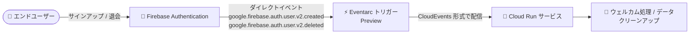

# Eventarc: Firebase Authentication のダイレクトイベントに対応したトリガー作成 (Preview)

**リリース日**: 2026-09-30

**サービス**: Eventarc

**機能**: Firebase Authentication のダイレクトイベントに対するトリガー作成のサポート

**ステータス**: Preview

📊 [このアップデートのインフォグラフィックを見る](https://takech9203.github.io/google-cloud-news-summary/20260930-eventarc-firebase-authentication-direct-events.html)

## 概要

Eventarc で、Firebase Authentication から直接送信されるイベント (ダイレクトイベント) に対するトリガーを作成できるようになりました (Preview)。Eventarc の公式ドキュメント (イベントタイプ一覧) には、Firebase Authentication (preview) のイベントタイプとして `google.firebase.auth.user.v2.created` (ユーザー作成) と `google.firebase.auth.user.v2.deleted` (ユーザー削除) が記載されています。

Eventarc はイベント駆動アーキテクチャを構築するためのフルマネージドなイベントルーティングサービスで、イベントプロバイダから発生したイベントをフィルタリングし、Cloud Run や Workflows などの宛先に CloudEvents 形式で配信します。今回のアップデートにより、Firebase Authentication のユーザーライフサイクルイベント (作成・削除) を Eventarc のトリガーとして扱い、Google Cloud 側のサービスと疎結合に連携するイベント駆動処理を構成できます。

Firebase Authentication をユーザー認証基盤として利用しつつ、バックエンドを Google Cloud (Cloud Run など) で構築しているモバイル / Web アプリケーション開発者にとって、ユーザー登録時のオンボーディング処理や退会時のデータクリーンアップ処理を Eventarc の標準的な仕組みで実装できるようになる点が主要な価値です。

**アップデート前の課題**

- Eventarc のダイレクトイベントのプロバイダ一覧に Firebase Authentication は含まれておらず、Eventarc トリガーで Firebase Authentication のユーザー作成・削除イベントを直接受け取ることができなかった
- Firebase Authentication のユーザー作成・削除イベントへの対応は、Cloud Functions for Firebase の Authentication トリガー (`functions.auth.user().onCreate()` / `onDelete()`) を使う方法が案内されており、イベントの受け口が Cloud Functions に限定されていた

**アップデート後の改善**

- Firebase Authentication のユーザー作成 (`google.firebase.auth.user.v2.created`) およびユーザー削除 (`google.firebase.auth.user.v2.deleted`) イベントに対して Eventarc トリガーを作成できるようになった (Preview)
- 他のダイレクトイベントと同様に、Eventarc の仕組み (イベントタイプによるフィルタリング、CloudEvents 形式での配信、IAM によるアクセス制御) の上で Firebase Authentication イベントを扱えるようになった

## アーキテクチャ図



Firebase Authentication でのユーザー作成・削除がダイレクトイベントとして Eventarc に送信され、トリガーがイベントタイプでフィルタリングして宛先サービスに CloudEvents 形式で配信するイベントフローです。

## サービスアップデートの詳細

### 主要機能

1. **Firebase Authentication ダイレクトイベントのサポート (Preview)**
   - Firebase Authentication から Eventarc に直接イベントが送信され、トリガーで受け取れる
   - Cloud Audit Logs を経由しない「ダイレクトイベント」としての提供

2. **対応イベントタイプ**
   - `google.firebase.auth.user.v2.created`: ユーザーの作成
   - `google.firebase.auth.user.v2.deleted`: ユーザーの削除

3. **Eventarc の標準的なイベント配信機構**
   - イベントは CloudEvents 形式で宛先に配信される
   - at-least-once (少なくとも 1 回) のイベント配信、デフォルトのメッセージ保持期間は 24 時間 (指数バックオフによるリトライ)

## 技術仕様

### Firebase Authentication イベント (Eventarc)

| 項目 | 詳細 |
|------|------|
| イベントタイプ (ユーザー作成) | `google.firebase.auth.user.v2.created` |
| イベントタイプ (ユーザー削除) | `google.firebase.auth.user.v2.deleted` |
| 提供ステータス | Preview (Pre-GA Offerings Terms が適用) |
| イベント形式 | CloudEvents 形式で宛先に配信 |
| 配信保証 | at-least-once 配信、メッセージ保持期間はデフォルト 24 時間 |
| イベントサイズ上限 (Eventarc Standard) | 512 KB |
| トリガー数の上限 (Eventarc Standard) | 500 トリガー / プロジェクト / リージョン |

## 設定方法

### 前提条件

Eventarc のダイレクトイベント向けトリガー作成のドキュメントでは、共通の前提条件として以下が案内されています。

1. Google Cloud プロジェクトで Cloud Logging、Eventarc、Eventarc Publishing の各 API を有効化する
   ```bash
   gcloud services enable logging.googleapis.com \
       eventarc.googleapis.com \
       eventarcpublishing.googleapis.com
   ```
2. ユーザー管理のサービスアカウントを作成し、Eventarc がターゲットサービスのイベントを管理するために必要なロールを付与する
3. Cloud Run サービスを認証付きで呼び出す場合は、トリガーに関連付けるサービスアカウントに `roles/run.invoker` ロールが必要

### 手順

#### ステップ 1: トリガーの作成 (例)

ダイレクトイベント向けトリガーは、`gcloud eventarc triggers create` の `--event-filters` にイベントタイプを指定して作成します。以下はユーザー作成イベントを Cloud Run サービスにルーティングする例です。

```bash
gcloud eventarc triggers create firebase-auth-user-created-trigger \
    --location=LOCATION \
    --destination-run-service=SERVICE_NAME \
    --destination-run-region=REGION \
    --event-filters="type=google.firebase.auth.user.v2.created" \
    --service-account=SERVICE_ACCOUNT_NAME@PROJECT_ID.iam.gserviceaccount.com
```

Preview 機能のため、コンソールや gcloud での具体的な作成手順・フィルタ属性の詳細は [Eventarc のドキュメント](https://cloud.google.com/eventarc/standard/docs/overview)で最新情報を確認してください。

## メリット

### ビジネス面

- **ユーザーライフサイクル処理の自動化**: ユーザー登録・退会をトリガーにした業務処理 (オンボーディング、クリーンアップなど) をイベント駆動で自動化できる
- **Firebase と Google Cloud の統合強化**: Firebase Authentication を利用するアプリケーションで、バックエンド処理を Google Cloud の標準的なイベント基盤に統合できる

### 技術面

- **疎結合なイベント駆動アーキテクチャ**: Eventarc のトリガーによるフィルタリングとルーティングにより、イベントプロバイダと宛先サービスを疎結合に保てる
- **標準化されたイベント形式**: イベントは CloudEvents 形式で配信されるため、他の Google Cloud イベントソースと同じ実装パターンでハンドリングできる
- **マネージドな配信・リトライ**: at-least-once 配信とリトライ (デフォルト保持期間 24 時間) が Eventarc / Pub/Sub のマネージド機構として提供される

## デメリット・制約事項

### 制限事項

- Preview 段階の機能であり、Pre-GA Offerings Terms が適用される (「現状のまま」提供され、サポートが限定される場合がある)
- ドキュメントに記載されているイベントタイプはユーザーの作成・削除の 2 種類で、サインインなどその他の認証イベントは含まれていない

### 考慮すべき点

- Preview 中は仕様や提供リージョンが変更される可能性があるため、本番ワークロードへの適用は慎重に判断する
- 参考として、Cloud Functions の Firebase Authentication トリガーのドキュメントでは、カスタムトークンによる初回サインインでは作成イベントが発生しないこと、Admin SDK の一括削除 (`deleteUsers`) では削除イベントが発生しないことが注意点として記載されている。Eventarc のダイレクトイベントでの挙動は公式ドキュメントで確認すること
- Eventarc の順序保証はなく (in-order / FIFO 配信の保証なし)、at-least-once 配信のため宛先側では冪等な処理の実装が推奨される

## ユースケース

### ユースケース 1: ユーザー登録時のオンボーディング処理

**シナリオ**: モバイルアプリで Firebase Authentication によるサインアップが完了したタイミングで、Cloud Run 上のバックエンドサービスがユーザープロファイルの初期化やウェルカム通知の送信を行う。

**実装例**:
```
Firebase Authentication (ユーザー作成)
  → Eventarc トリガー (type=google.firebase.auth.user.v2.created)
  → Cloud Run サービス (プロファイル初期化・通知送信)
```

**効果**: クライアント側の実装に依存せず、ユーザー作成を確実に検知してサーバーサイドの初期化処理を実行できる。

### ユースケース 2: 退会ユーザーのデータクリーンアップ

**シナリオ**: ユーザーがアカウントを削除した際に、アプリケーションデータベース上の関連データの削除や匿名化処理を自動実行し、データ保護要件に対応する。

**効果**: `google.firebase.auth.user.v2.deleted` イベントを起点に削除処理を自動化することで、消し忘れによるコンプライアンスリスクを低減できる。

## 料金

Eventarc の料金は公式の料金ページを参照してください。今回の Firebase Authentication ダイレクトイベント固有の料金情報は、リリースノートおよび確認できたドキュメントには記載されていません。

- [Eventarc の料金](https://cloud.google.com/eventarc/pricing)

## 利用可能リージョン

本機能の提供リージョンに関する公式情報は確認できませんでした。Eventarc のロケーションについては[公式ドキュメント](https://cloud.google.com/eventarc/docs/locations)を参照してください。

## 関連サービス・機能

- **Firebase Authentication**: 今回のイベントソース。ユーザーの作成・削除イベントを Eventarc に直接送信する
- **Cloud Run**: Eventarc トリガーの代表的な宛先。イベントを受けてサーバーレスにバックエンド処理を実行する
- **Cloud Functions for Firebase**: 従来から Firebase Authentication トリガー (`functions.auth.user().onCreate()` / `onDelete()`) を提供しており、本機能の代替・補完となる選択肢
- **Pub/Sub**: Eventarc Standard の配信基盤。デッドレタートピックによるエラーハンドリング (デッドレターキュー) にも利用される
- **Cloud Logging / Cloud Monitoring**: Eventarc のオブザーバビリティ (ログ・モニタリング) を提供する

## 参考リンク

- 📊 [インフォグラフィック](https://takech9203.github.io/google-cloud-news-summary/20260930-eventarc-firebase-authentication-direct-events.html)
- [公式リリースノート](https://docs.cloud.google.com/release-notes#September_30_2026)
- [Eventarc のイベントタイプ (Firebase Authentication)](https://docs.cloud.google.com/eventarc/docs/event-types)
- [Eventarc の概要](https://docs.cloud.google.com/eventarc/docs/overview)
- [Cloud Functions の Firebase Authentication トリガー (従来の方法)](https://firebase.google.com/docs/functions/1st-gen/auth-events)
- [料金ページ](https://cloud.google.com/eventarc/pricing)

## まとめ

Firebase Authentication のユーザー作成・削除イベントを Eventarc のダイレクトイベントとして扱えるようになり、Firebase を認証基盤とするアプリケーションで Google Cloud 標準のイベント駆動アーキテクチャを構成しやすくなりました。ユーザーのオンボーディングや退会時のクリーンアップを自動化したいチームは、Preview 段階の制約 (Pre-GA Offerings Terms、対応イベントタイプは作成・削除の 2 種類) を確認のうえ、開発環境での検証から始めることを推奨します。

---

**タグ**: Eventarc, Firebase Authentication, イベント駆動アーキテクチャ, Cloud Run, Preview, サーバーレス
