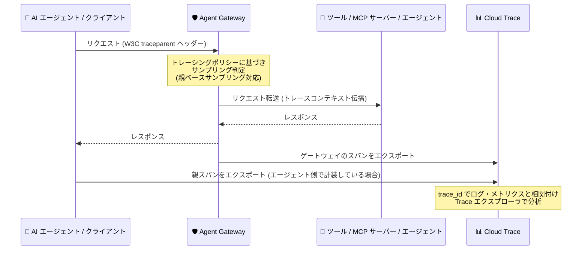

# Gemini Enterprise Agent Platform: Agent Gateway と Cloud Trace の統合 (Preview)

**リリース日**: 2026-09-30

**サービス**: Gemini Enterprise Agent Platform

**機能**: Agent Gateway と Cloud Trace の統合によるエンドツーエンドのリクエスト可観測性

**ステータス**: Preview

📊 [このアップデートのインフォグラフィックを見る](https://takech9203.github.io/google-cloud-news-summary/20260930-gemini-agent-platform-agent-gateway-cloud-trace.html)

## 概要

Gemini Enterprise Agent Platform の Agent Gateway が Cloud Trace と統合され、エージェントワークロードに対するエンドツーエンドのリクエスト可観測性が Preview として利用可能になりました。Agent Gateway は AI エージェントの中央制御ポイント (すべてのエージェント間通信のネットワーク出入口) として機能するため、Cloud Trace を有効化することで、リクエストがエージェントからゲートウェイを経由し、複数の Google Cloud サービス、ツール、エージェント、MCP サーバーへとどのように流れるかを可視化できます。

サービス境界をまたいでリクエストフローを追跡することで、Cloud Trace はエージェントアーキテクチャに対する完全な分散トレーシングを提供します。トレースは OpenTelemetry と W3C TraceContext という標準仕様の上に構築されており、AI エージェント、Agent Gateway、ターゲットの MCP サーバーやツール、サードパーティのモニタリングプラットフォームの間でトレースコンテキストがシームレスに伝播します。

対象ユーザーは、Agent Gateway を利用してエージェントワークロードを統制 (ガバナンス) している企業のプラットフォーム管理者、SRE、セキュリティチーム、およびエージェント開発者です。本機能は Preview のため、Pre-GA Offerings Terms が適用され、サポートが限定される場合があります。

**アップデート前の課題**

- エージェントのリクエストがゲートウェイを経由して複数のサービス境界 (ツール、MCP サーバー、他のエージェント) をまたぐ際、リクエスト全体の流れを一気通貫で追跡する手段が Agent Gateway に統合されておらず、レイテンシのボトルネックや失敗したバックエンド呼び出しの切り分けが困難だった
- レイテンシスパイクがゲートウェイ内部で発生したのか、宛先のツールやサーバーで発生したのかを、メトリクスだけでは判別しにくかった
- 上流のエージェントやクライアントが開始したトレースをゲートウェイ側で引き継ぐ仕組みがなく、トレースの連続性を保つことができなかった

**アップデート後の改善**

- サービス境界をまたぐリクエストの全行程を追跡し、レイテンシのボトルネックや失敗したバックエンド呼び出しを正確に切り分けられるようになった
- 親ベースサンプリング (parent-based sampling) により、上流のエージェントやクライアントがトレースを開始した場合にその sampled ビットを尊重し、ベースラインのサンプリングレートを上げることなく重要なリクエストをエンドツーエンドで確実にキャプチャできるようになった
- OpenTelemetry と W3C TraceContext 標準に基づき、エージェント、ゲートウェイ、MCP サーバー / ツール、サードパーティ監視基盤の間でトレースコンテキストが伝播するようになった
- `trace_id` を使ってトレーススパンとゲートウェイのリクエストログ・メトリクスを直接相関付けられるようになり、根本原因分析が高速化された

## アーキテクチャ図



AI エージェントからのリクエストが Agent Gateway を経由して宛先 (ツール / MCP サーバー / 他のエージェント) に到達するまでのトレーシングフローです。ゲートウェイはトレーシングポリシーに基づいてスパンを生成し Cloud Trace にエクスポートします。エージェント側が親スパンをエクスポートすれば、エンドツーエンドの分散トレースとして結合されます。

## サービスアップデートの詳細

### 主要機能

1. **エージェントインタラクションの精密なデバッグ**
   - サービス境界をまたぐリクエストの全行程 (full journey) を追跡
   - レイテンシのボトルネックや失敗したバックエンド呼び出しを分離・特定

2. **親ベースサンプリング (parent-based sampling)**
   - 上流の呼び出し元から送られる `traceparent` ヘッダーの sampled ビットを尊重するかどうかを制御可能
   - 上流のエージェントやクライアントがトレースを開始した場合にエンドツーエンドのトレース連続性を維持
   - 通常トラフィックのベースラインサンプリングレートを上げずに、優先度の高いリクエストを確実にキャプチャ

3. **オープン標準による可観測性の統一**
   - OpenTelemetry と W3C TraceContext 標準の上に構築
   - AI エージェント、Agent Gateway、ターゲットの MCP サーバーやツール、サードパーティ監視プラットフォームの間でコンテキストを伝播

4. **根本原因分析の高速化 (ログ・メトリクスとの相関)**
   - Cloud Logging に書き込まれるゲートウェイの各リクエストログエントリには `projects/PROJECT_ID/traces/TRACE_ID` 形式の trace フィールドが含まれ、ログエクスプローラから「トレースの詳細を表示」で対応するスパンに直接移動可能
   - Trace 側では「ログを表示」で該当リクエストに関連するゲートウェイリクエストログを閲覧可能
   - Cloud Monitoring のメトリクス (例: `networkservices.googleapis.com/agentgateway/total_latencies`) で観測したレイテンシスパイクをトレーススパンの内訳と比較し、スパイクがゲートウェイ内か宛先側かを特定可能

## 技術仕様

### トレーシングポリシーの構成要素

| 項目 | 詳細 |
|------|------|
| ポリシーリソース | `projects/PROJECT_ID/locations/REGION/telemetryPolicies/POLICY_NAME` |
| 対象リソース | Agent Gateway (`//networkservices.googleapis.com/projects/.../agentGateways/...`)。1 つのポリシーを複数のゲートウェイにアタッチ可能 |
| `samplingRate` | トレース対象とするリクエストの割合 (0.0〜1.0)。高トラフィックの本番環境では 1% (`0.01`) または 0.1% (`0.001`) が推奨 |
| `parentBasedSampling.enabled` | 上流からの `traceparent` ヘッダーの sampled ビットを尊重するかどうか (`true` / `false`) |
| `parentBasedSampling.samplingRate` | 事前サンプリング済みリクエストのうちトレースする割合 (0.0〜1.0)。`1.0` で事前サンプリング済みリクエストの 100% をトレース |
| 標準仕様 | OpenTelemetry、W3C TraceContext |

### 必要な IAM ロール

| 用途 | ロール |
|------|--------|
| トレーシングポリシーの構成・更新 | Compute ネットワーク管理者 (`roles/compute.networkAdmin`) または Compute 管理者 (`roles/compute.admin`) |
| Google Cloud コンソールでのトレース閲覧 | Cloud Trace ユーザー (`roles/cloudtrace.user`) |
| スパンの書き込み (サービスアカウントへの付与) | Cloud Trace エージェント (`roles/cloudtrace.agent`) |

`roles/cloudtrace.agent` は以下のサービスアカウントに付与する必要があります。

- Compute Engine サービスエージェント: `service-PROJECT_NUMBER@compute-system.iam.gserviceaccount.com`
- Network Security サービスエージェント: `service-PROJECT_NUMBER@gcp-sa-networksecurity.iam.gserviceaccount.com`
- Agent Gateway サービスエージェント: `service-PROJECT_NUMBER@gcp-sa-agentgateway.iam.gserviceaccount.com`
- エージェント / クライアントワークロードのサービスアカウント: 呼び出し元の AI エージェントがトレースを開始して親スパンを自らエクスポートする場合に必要。付与しない場合、Agent Gateway の子スパンのみが書き込まれ、親スパンが Trace 上に欠落する

## 設定方法

### 前提条件

1. Agent Gateway がセットアップ済みであること
2. プロジェクトで Cloud Trace API (`cloudtrace.googleapis.com`) が有効であること
3. 上記の必要な IAM ロールが付与されていること

### 手順

#### ステップ 1: トレーシングポリシーの YAML ファイルを作成

```yaml
# tracing-policy.yaml
name: "projects/PROJECT_ID/locations/REGION/telemetryPolicies/POLICY_NAME"
targetTelemetry:
  resources:
    # 複数のゲートウェイにポリシーをアタッチ可能
    - "//networkservices.googleapis.com/projects/PROJECT_ID/locations/REGION/agentGateways/AGENT_GATEWAY_NAME"
displayName: "Tracing policy for Agent Gateway traffic"
tracingConfiguration:
  samplingRate: SAMPLING_RATE
  parentBasedSampling:
    enabled: ENABLE_PARENT_BASED_SAMPLING
    samplingRate: PARENT_BASED_SAMPLING_RATE
```

`PROJECT_ID`、`REGION` (ゲートウェイのリージョン、例: `europe-west1`)、`POLICY_NAME`、`AGENT_GATEWAY_NAME`、各サンプリングレートを環境に合わせて置き換えます。

#### ステップ 2: ポリシーをインポート

```bash
gcloud beta network-services telemetry-policies import POLICY_NAME \
    --source=tracing-policy.yaml \
    --location=REGION
```

#### ステップ 3: トレースを表示

分散トレーシングを有効化してゲートウェイにトラフィックを流した後、Google Cloud コンソールの Trace エクスプローラページでトレースの詳細を確認します。フィルタバーでレイテンシしきい値、HTTP ステータスコード、リクエスト URI によるフィルタや、特定のトレース ID による検索が可能です。

## メリット

### ビジネス面

- **本番障害対応の高速化**: `trace_id` によるトレース・ログ・メトリクスの相関付けにより、根本原因分析にかかる時間を短縮できる
- **コストと可観測性のバランス制御**: サンプリングレートを 0.0〜1.0 の範囲で調整でき、高トラフィック環境では低いレート (0.01 / 0.001) で取り込みコストを抑えつつ必要な可視性を確保できる

### 技術面

- **エンドツーエンドの分散トレーシング**: エージェント → ゲートウェイ → ツール / MCP サーバー / 他エージェントというサービス境界をまたぐリクエストフローを完全に追跡できる
- **ベンダーニュートラルな標準準拠**: OpenTelemetry と W3C TraceContext に基づくため、Google Cloud 内外の監視基盤とシームレスに連携できる
- **レイテンシ原因の切り分け**: ゲートウェイメトリクスのレイテンシスパイクをトレーススパンの内訳と比較し、ゲートウェイ内か宛先側かを特定できる

## デメリット・制約事項

### 制限事項

- Preview 機能であり、Pre-GA Offerings Terms が適用される。サポートが限定される場合がある
- 親スパンが Trace に書き込まれるには、呼び出し元ワークロードのサービスアカウントにも `roles/cloudtrace.agent` の付与が必要。付与がない場合はゲートウェイの子スパンのみとなり、トレースが分断される
- エンドツーエンドのトレース連続性には、アプリケーション側で OpenTelemetry SDK によるトレースコンテキスト伝播 (W3C `traceparent` ヘッダー) が有効になっている必要がある

### 考慮すべき点

- サンプリングレートが低い、またはトラフィック量が少ない場合、トレースがすぐにはキャプチャされないことがある。動作確認時は一時的に `samplingRate: 1.00` に設定し、テスト後に本番レートへ戻すことが案内されている
- トレースが表示されない場合は、Cloud Trace API の有効化、IAM ロールの付与、ポリシーのリージョンと対象ゲートウェイの参照が正しいかを確認する
- トレーススパンの取り込みは Cloud Trace の課金対象となるため、本番環境ではサンプリングレートによる取り込み量の管理が重要

## ユースケース

### ユースケース 1: マルチエージェント構成でのレイテンシボトルネック調査

**シナリオ**: Agent Runtime 上のエージェントが Agent Gateway 経由で複数の MCP サーバーのツールを呼び出す構成で、特定のリクエストの応答が遅い。どの区間 (ゲートウェイ内部か、宛先の MCP サーバーか) で遅延が発生しているか特定したい。

**実装例**:
```
1. トレーシングポリシーを作成し、対象の Agent Gateway にアタッチ
2. Cloud Monitoring の networkservices.googleapis.com/agentgateway/total_latencies で
   レイテンシスパイクを検知
3. Trace エクスプローラでレイテンシしきい値によるフィルタを適用し、該当トレースを特定
4. スパンの内訳 (タイムライン表示) で遅延区間を切り分け
```

**効果**: レイテンシスパイクがゲートウェイ内で発生したのか、宛先のツールやサーバーで発生したのかをスパン単位で特定でき、調査時間を短縮できる。

### ユースケース 2: 重要リクエストのエンドツーエンドトレース捕捉

**シナリオ**: 高トラフィックの本番環境でベースラインのサンプリングレートは 0.1% に抑えつつ、上流のクライアントがトレースを開始した高優先度のリクエストだけは確実にエンドツーエンドで捕捉したい。

**実装例**:
```yaml
tracingConfiguration:
  samplingRate: 0.001          # 通常トラフィックは 0.1%
  parentBasedSampling:
    enabled: true              # 上流の sampled ビットを尊重
    samplingRate: 1.0          # 事前サンプリング済みリクエストは 100% トレース
```

**効果**: 取り込みコストを抑えながら、上流で開始されたトレースの連続性を維持し、重要なリクエストの完全な分散トレースを取得できる。

### ユースケース 3: 本番障害のログ・トレース相関による根本原因分析

**シナリオ**: ゲートウェイ経由のツール呼び出しでエラーが散発しており、エラーログから該当リクエストの全体像を素早く把握したい。

**効果**: Cloud Logging のゲートウェイリクエストログに含まれる trace フィールドから「トレースの詳細を表示」で対応するスパンへ直接移動でき、ログとトレースを行き来しながら失敗したバックエンド呼び出しを特定できる。

## 料金

Cloud Trace へのトレーススパンの取り込みは課金対象です。高トラフィックの本番環境では、サンプリングレートを 1% (`0.01`) または 0.1% (`0.001`) に設定して可観測性と取り込みコストのバランスを取ることが推奨されています。詳細な料金は以下の公式ページを参照してください。

- [Google Cloud Observability の料金 (Cloud Trace)](https://cloud.google.com/stackdriver/pricing#trace-costs)

## 利用可能リージョン

トレーシングポリシーはゲートウェイのリージョン (例: `europe-west1`) に対して作成します。利用可能なリージョンの詳細は公式ドキュメントを参照してください。

## 関連サービス・機能

- **Cloud Trace**: 分散トレースの保存・分析基盤。Trace エクスプローラでスパンのタイムライン表示やグラフ表示が可能
- **Cloud Logging**: ゲートウェイのリクエストログに trace フィールドが含まれ、ログとトレースを相互に行き来できる
- **Cloud Monitoring**: `networkservices.googleapis.com/agentgateway/total_latencies` などのゲートウェイメトリクスとトレースを突き合わせてレイテンシ分析が可能
- **Agent Registry / Agent Identity / Model Armor**: Agent Gateway のガバナンス構成要素。ゲートウェイはこれらと連携してエージェント通信の認可・コンテンツ検査を行い、その通信が本機能のトレース対象となる
- **OpenTelemetry**: トレースの計装・コンテキスト伝播の標準フレームワーク。ADK 製エージェントの計装ガイドや MCP サーバーのテレメトリ設定が別途提供されている

## 参考リンク

- 📊 [インフォグラフィック](https://takech9203.github.io/google-cloud-news-summary/20260930-gemini-agent-platform-agent-gateway-cloud-trace.html)
- [公式リリースノート](https://docs.cloud.google.com/release-notes#September_30_2026)
- [Use Cloud Trace (Agent Gateway のモニタリング)](https://docs.cloud.google.com/gemini-enterprise-agent-platform/govern/gateways/monitor-agent-gateway)
- [Agent Gateway の概要](https://docs.cloud.google.com/gemini-enterprise-agent-platform/govern/gateways/agent-gateway-overview)
- [Agent Observability の概要](https://docs.cloud.google.com/gemini-enterprise-agent-platform/optimize/observability/overview)
- [Cloud Trace の概要](https://docs.cloud.google.com/trace/docs/overview)
- [料金ページ (Cloud Trace)](https://cloud.google.com/stackdriver/pricing#trace-costs)

## まとめ

Agent Gateway と Cloud Trace の統合により、これまで把握が難しかったエージェントワークロードのサービス境界をまたぐリクエストフローを、OpenTelemetry / W3C TraceContext 標準に基づく分散トレースとして可視化できるようになりました。Agent Gateway を利用している組織は、まずステージング環境でトレーシングポリシーを作成して動作を確認し、本番環境では推奨サンプリングレート (0.01 / 0.001) と親ベースサンプリングを組み合わせてコストと可観測性のバランスを取ることを推奨します。なお Preview 機能のため、本番適用の際は Pre-GA Offerings Terms の確認が必要です。

---

**タグ**: Gemini Enterprise Agent Platform, Agent Gateway, Cloud Trace, 可観測性, 分散トレーシング, OpenTelemetry, MCP, AI エージェント, Preview
