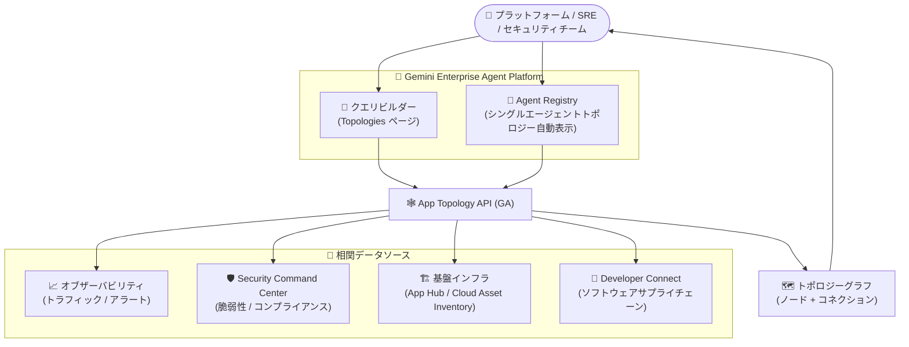

# Gemini Enterprise Agent Platform: App Topology API の一般提供開始 (GA)

**リリース日**: 2026-09-30

**サービス**: Gemini Enterprise Agent Platform

**機能**: App Topology API (エージェントトポロジー) の一般提供開始

**ステータス**: GA (一般提供)

📊 [このアップデートのインフォグラフィックを見る](https://takech9203.github.io/google-cloud-news-summary/20260930-gemini-agent-platform-app-topology-api-ga.html)

## 概要

Gemini Enterprise Agent Platform でエージェントトポロジーを提供する App Topology API が一般提供 (GA) になりました。App Topology API は、エージェントのデータをその他の Google Cloud データと相関付けるクエリを実行し、結果をトポロジーグラフとして可視化する機能です。AI アプリケーションのガバナンス、構成の検証、依存関係の分析を支援します。

今回の GA では、Topologies ページに新しいクエリビルダーが導入されました。提案されたクイッククエリをカスタマイズしたり、独自のクエリをゼロから作成したりできます。カスタムクエリにより、アイデンティティ、アラート、脆弱性、基盤インフラストラクチャなど、エージェントに関連するより多くのデータを探索できます。また、Agent Registry のシングルエージェントトポロジーのエクスペリエンスも改善され、選択したエージェントとの間のシングルホップトラフィックを示すトポロジーがページに自動的に読み込まれるようになりました。

AI エージェントを本番運用する企業のプラットフォームチーム、SRE、セキュリティチームにとって、エージェントの通信先が信頼できるエージェント・MCP サーバー・エンドポイントであるかを確認し、脆弱性や依存関係を一元的に把握するための重要な機能強化です。

**アップデート前の課題**

- エージェントと、アイデンティティ、アラート、脆弱性、基盤インフラストラクチャといった周辺データを相関付けて可視化する手段が GA として提供されておらず、複数のコンソール画面を行き来して情報を突き合わせる必要があった
- トポロジーの探索は事前定義されたクエリが中心で、調査の目的に応じてクエリを柔軟に組み立てる手段が限られていた
- Agent Registry で特定エージェントのトラフィックを確認する際、トポロジーを表示するための操作が必要だった

**アップデート後の改善**

- App Topology API が GA となり、本番環境での利用を前提としたエージェントトポロジー機能が利用可能になった
- Topologies ページのクエリビルダーで、クイッククエリのカスタマイズや独自クエリの作成が可能になり、ノード・Where 句・コネクションを組み合わせた柔軟なデータ探索ができるようになった
- Agent Registry のシングルエージェントトポロジーが自動読み込みされ、エージェントとの間のシングルホップトラフィックをすぐに確認できるようになった

## アーキテクチャ図



クエリビルダーや Agent Registry からのリクエストを App Topology API が処理し、オブザーバビリティ、セキュリティ、インフラストラクチャ、ソフトウェアサプライチェーンの各データソースを相関付けてトポロジーグラフとして返す構成です。

## サービスアップデートの詳細

### 主要機能

1. **App Topology API の GA**
   - エージェントデータをその他の Google Cloud データと相関付けるクエリを実行し、結果をトポロジーグラフとして表示
   - AI アプリケーションのガバナンス、構成の検証、依存関係の分析を支援
   - App Topology MCP server を通じて、エージェント自身がリソースデータのクエリと相関付けに利用することも可能

2. **クエリビルダー (Topologies ページ)**
   - 提案されたクイッククエリをそのまま使用、またはカスタマイズして利用可能
   - ノードの追加・編集・削除、Where 句の値の変更、Undo/Redo に対応したビジュアルなクエリ編集
   - アイデンティティ、アラート、脆弱性、基盤インフラストラクチャなど、エージェント関連データの探索が可能
   - クエリを編集するたびに、選択可能なノード・フィルター・コネクションが文脈に応じて更新される

3. **Agent Registry のシングルエージェントトポロジーの改善**
   - 選択したエージェントとの間のシングルホップトラフィックを示すトポロジーがページに自動的に読み込まれる
   - エージェントが信頼できるエージェント、MCP サーバー、エンドポイントと通信しているかを即座に確認可能

## 技術仕様

### クエリの構成要素

| 構成要素 | 説明 |
|------|------|
| ノード | 検出済みまたは登録済みの Google Cloud リソース (Compute Engine VM、Artifact Registry のコンテナイメージ、エージェント、Cloud Monitoring アラート、AI アプリケーション、脆弱性など)。サービス単位でグループ化される |
| Where 句 | ノードのプロパティに基づいてクエリを絞り込むフィルター (例: `Where Id = CVE-2026-24061`) |
| コネクション | 2 つのノード間の方向性のある関係 (contained in、sends traffic to、owns、depends on など)。選択したノードタイプに対して有効な関係のみが選択可能 |

### 必要な IAM ロールと API

| 項目 | 詳細 |
|------|------|
| IAM ロール (プロジェクトのトポロジー閲覧) | App Topology Viewer (`roles/apptopology.viewer`) |
| IAM ロール (Agent Registry でのトポロジー閲覧) | 上記に加えて Agent Registry API Viewer (`roles/agentregistry.viewer`) |
| 必要な権限 | `apptopology.discoveredResourcesTopologies.generate`、`apptopology.sreDomainTopologies.generate` |
| 有効化する API | App Hub、App Topology、Cloud Asset Inventory、Observability の各 API |

## 設定方法

### 前提条件

1. 対象の Google Cloud プロジェクトを特定する (Security Command Center によるセキュリティ・コンプライアンスデータは、Google Cloud 組織内のプロジェクトのみで利用可能)
2. Agent Registry をセットアップし、エージェントリソースを登録する
3. エージェントトラフィックを表示する場合は、AI アプリケーションをインストルメント化する
4. App Hub、App Topology、Cloud Asset Inventory、Observability の各 API を有効化する
5. プロジェクトで課金が有効になっていることを確認する
6. VPC Service Controls の境界でサービスを保護している場合は、App Topology と基盤データを提供するサービスを境界に追加する

### 手順

#### ステップ 1: 必要なロールの付与

```bash
# App Topology Viewer ロールを付与
gcloud projects add-iam-policy-binding PROJECT_ID \
  --member="user:USER_EMAIL" \
  --role="roles/apptopology.viewer"

# Agent Registry でトポロジーを閲覧する場合は追加で付与
gcloud projects add-iam-policy-binding PROJECT_ID \
  --member="user:USER_EMAIL" \
  --role="roles/agentregistry.viewer"
```

トポロジーグラフの閲覧に必要な IAM ロールを付与します。

#### ステップ 2: クエリの実行

1. Google Cloud コンソールで **Topology** ページに移動する
2. プロジェクトピッカーでエージェントを含むプロジェクトを選択する
3. **Quick Queries** からクエリを選択してプレビューを確認し、**Use suggestion** をクリックする
4. 必要に応じてノードの追加 (+)・削除 (×)、Where 句の値の変更でクエリをカスタマイズする
5. **Run query** をクリックしてトポロジーグラフを表示する

クエリ結果に Google Cloud の検出済みリソースまたは Agent Registry の登録済みリソースが含まれる場合、トポロジーグラフが表示されます。文字列やカウントなどのデータ型のみを含む結果の場合、グラフは表示されません。

## メリット

### ビジネス面

- **AI ガバナンスの強化**: エージェントの通信先が信頼できるエージェント・MCP サーバー・エンドポイントであるかを可視化でき、AI アプリケーションのガバナンスとコンプライアンス確認を支援する
- **セキュリティリスクの早期発見**: 特定の脆弱性 (CVE) を持つエージェントデプロイメントをクエリで特定でき、影響範囲の調査を迅速化できる

### 技術面

- **データの相関付けによる一元的な可視化**: オブザーバビリティ、セキュリティ、ソフトウェアサプライチェーン、インフラストラクチャの各データを 1 つのトポロジーグラフに統合して確認できる
- **柔軟なクエリ構築**: ビジュアルなクエリビルダーにより、ノード・Where 句・コネクションを組み合わせた独自の調査クエリを SQL などの知識なしで作成できる
- **Gemini Cloud Assist との連携**: App Topology はリソースとその関係のコンテキストを Gemini Cloud Assist の investigations に提供し、根本原因分析の精度向上に寄与する

## デメリット・制約事項

### 制限事項

- トレースのコネクションが示すレイテンシとエラー率は直近 1 時間のデータのみで、期間の変更はできない
- Developer Connect insights のイベントを削除しても、数日間はクエリ結果に表示される場合がある
- クエリ結果に含まれるエージェントは、functional type が `AGENT` に設定され ADK・Gemini Enterprise・Cloud Run でデプロイされたもの、または GKE でデプロイされ Agent Registry に登録されたものに限られる
- MCP サーバーは functional type が `MCP` である必要がある。ファーストパーティ MCP サーバー (OneMCP、GKE、Cloud Run でデプロイ) は含まれるが、その他の MCP サーバーは Agent Registry への登録が必要
- ツールやモデル、Workspace Agents などのコンポーネントは結果に含まれない
- Agent Registry に登録された MCP サーバーが App Hub で共有リソースに分類される場合、トポロジーグラフで他ノードへのエッジが表示されない

### 考慮すべき点

- Security Command Center が提供するセキュリティ・コンプライアンスデータは Preview 段階であり、Google Cloud 組織内のプロジェクト・アプリケーションのみで利用可能 (Security Command Center の Premium / Enterprise ティアが必要)
- 2026 年 10 月 15 日から App Topology API は使用量ベースの課金モデルに移行するため、クエリ数とノード数の使用量を事前に見積もっておく必要がある
- VPC Service Controls を利用している場合は、境界に App Topology と基盤データ提供サービスを追加する構成変更が必要

## ユースケース

### ユースケース 1: 特定の脆弱性を持つエージェントの特定

**シナリオ**: セキュリティチームが新たに公表された CVE の影響を受けるエージェントデプロイメントを組織内で特定したい。

**実装例**:
```text
クエリビルダーでの構成例:
- ノード: Agent, Vulnerability
- コネクション: Agent contains Vulnerability
- Where 句: Where Id = CVE-2026-24061
```

**効果**: 該当する脆弱性を含むエージェントがトポロジーグラフとして表示され、影響範囲の特定と対応優先度の判断を迅速化できる。

### ユースケース 2: エージェントの通信先の信頼性確認

**シナリオ**: プラットフォームチームが、本番環境のエージェントが想定外のエンドポイントや未登録の MCP サーバーと通信していないかを定期的に確認したい。

**効果**: Agent Registry でエージェントを選択するだけでシングルホップトラフィックのトポロジーが自動表示され、信頼できるエージェント・MCP サーバー・エンドポイントとの通信のみが行われているかを即座に確認できる。

## 料金

2026 年 10 月 15 日より、App Topology API は 1 日あたりの無料枠を含む使用量ベースの課金モデルに移行します。この課金モデルは、Cloud Hub、Gemini Enterprise Agent Platform、Cloud Monitoring 内で生成されるトポロジーグラフを含む、すべての App Topology API の使用に適用されます。

### 料金例

| 項目 | 1 日あたりの無料枠 (プロジェクト単位) | 追加使用料金 |
|--------|-----------------|-----------------|
| クエリ | 100 クエリ | $0.01 / クエリ |
| トポロジーグラフのノード | 15,000 ノード | $0.00075 / ノード |

詳細は [App Topology pricing](https://docs.cloud.google.com/hub/docs/app-topology#pricing) を参照してください。

## 関連サービス・機能

- **Agent Registry**: エージェントリソースの登録基盤。登録されたエージェントや MCP サーバーがトポロジーの対象となり、Agent Registry のページからシングルエージェントトポロジーを確認できる
- **App Hub / Cloud Hub**: App Topology は Cloud Hub でもオブザーバビリティ・セキュリティ・デプロイメントの各ドメインを横断したトポロジー分析を提供する。App Hub の functional type がトポロジー対象の判定に使用される
- **Cloud Monitoring**: Application topology としてテレメトリに基づくトラフィック、レイテンシ、サービス依存関係のリアルタイム可視化を提供する
- **Security Command Center**: 脆弱性やコンプライアンスなどのセキュリティデータをトポロジークエリに提供する (Premium / Enterprise ティア、Preview)
- **Developer Connect**: ビルドプロベナンスなどのソフトウェアサプライチェーンデータをトポロジークエリに提供する
- **Gemini Cloud Assist**: App Topology がリソースの関係性コンテキストを investigations に提供し、根本原因分析の品質を向上させる

## 参考リンク

- 📊 [インフォグラフィック](https://takech9203.github.io/google-cloud-news-summary/20260930-gemini-agent-platform-app-topology-api-ga.html)
- [公式リリースノート](https://docs.cloud.google.com/release-notes#September_30_2026)
- [トポロジーの概要 (Gemini Enterprise Agent Platform)](https://docs.cloud.google.com/gemini-enterprise-agent-platform/govern/topology)
- [View topologies for a project](https://docs.cloud.google.com/gemini-enterprise-agent-platform/govern/topology/view-project-topology)
- [View traffic to and from an agent (Agent Registry)](https://docs.cloud.google.com/gemini-enterprise-agent-platform/govern/topology/view-agent-registry-topology)
- [App Topology ドキュメント](https://docs.cloud.google.com/app-topology)
- [料金ページ (App Topology pricing)](https://docs.cloud.google.com/hub/docs/app-topology#pricing)

## まとめ

App Topology API の GA により、AI エージェントとアイデンティティ、アラート、脆弱性、基盤インフラストラクチャを相関付けたトポロジー分析が本番利用可能になりました。AI エージェントを運用する組織は、Agent Registry へのエージェント登録と必要な API・IAM ロールの整備を進め、クエリビルダーによるガバナンス・セキュリティ調査のワークフローを確立することを推奨します。あわせて、2026 年 10 月 15 日からの使用量ベース課金への移行に備え、クエリ数とノード数の使用量を見積もっておくとよいでしょう。

---

**タグ**: #GeminiEnterpriseAgentPlatform #AppTopology #AgentRegistry #GA #AIエージェント #ガバナンス #オブザーバビリティ
