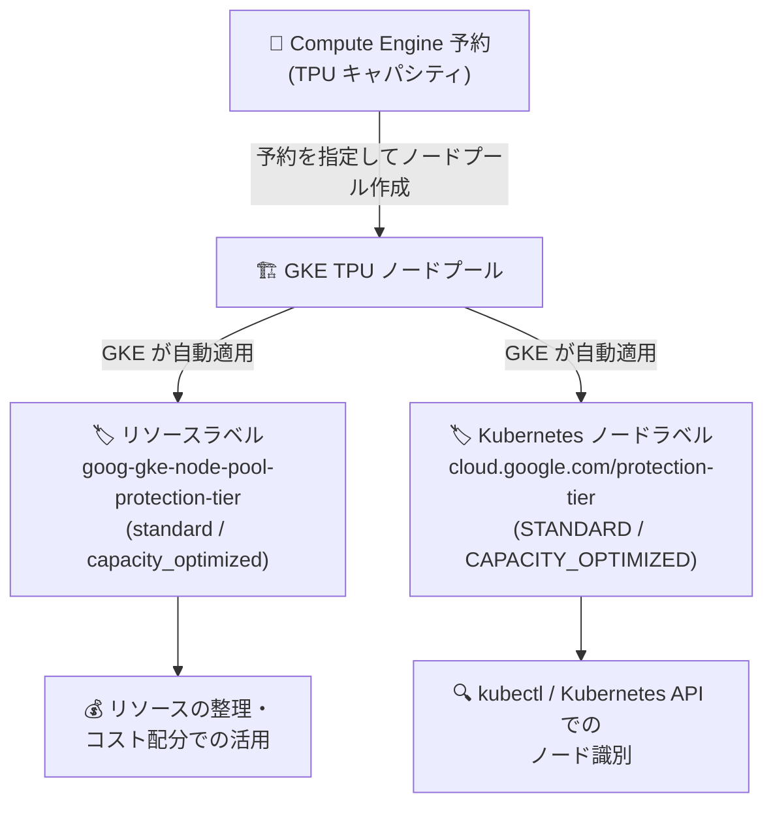

# Google Kubernetes Engine (GKE): TPU ノードプールへの保護ティアラベル自動適用

**リリース日**: 2026-09-30

**サービス**: Google Kubernetes Engine (GKE)

**機能**: Compute Engine 予約から作成された TPU ノードプールへの保護ティアラベル (protection tier labels) の自動適用

**ステータス**: Feature (リリース済み)

📊 [このアップデートのインフォグラフィックを見る](https://takech9203.github.io/google-cloud-news-summary/20260930-gke-tpu-node-pool-protection-tier-labels.html)

## 概要

GKE が、Compute Engine 予約 (reservations) から作成された TPU ノードプールに対して、保護ティアラベル (protection tier labels) を自動的に適用するようになりました。構成に応じて、GKE は以下の 2 種類のラベルを付与します。

- **ノードプールリソースラベル**: `goog-gke-node-pool-protection-tier` (値: `standard` または `capacity_optimized`)
- **Kubernetes ノードラベル**: `cloud.google.com/protection-tier` (値: `STANDARD` または `CAPACITY_OPTIMIZED`)

これにより、予約由来の TPU キャパシティがどの保護ティア (protection tier) に属するかを、Google Cloud リソースレベル (ノードプール) と Kubernetes レベル (ノード) の両方で識別できるようになります。保護ティアは、Cloud TPU のキャパシティ監視メトリクス (`compute.googleapis.com/tpu/...`) でも `protection_tier` ラベル (`STANDARD` / `CAPACITY_OPTIMIZED` / `UNKNOWN`) として使用されている属性であり、TPU キャパシティの分類・可視化の軸として一貫して利用できます。対象ユーザーは、Compute Engine 予約を利用して GKE 上で TPU ワークロード (大規模トレーニングや推論) を運用するプラットフォーム管理者・ML インフラ担当者です。

**アップデート前の課題**

- GKE が自動適用するノードプールラベルには `goog-gke-accelerator-type`、`goog-gke-tpu-node-pool-type`、`goog-gke-node-pool-provisioning-model` などがあったが、予約の保護ティアを示すラベルは自動付与されていなかった
- TPU ノードプールがどの保護ティアのキャパシティから作成されたかを、ノードプールやノードのラベルから直接識別する標準的な手段がなかった

**アップデート後の改善**

- 予約から作成された TPU ノードプールに `goog-gke-node-pool-protection-tier` リソースラベルが自動付与され、Google Cloud リソースとしてのフィルタリングや整理が可能になった
- Kubernetes ノードに `cloud.google.com/protection-tier` ラベルが自動付与され、Kubernetes レベル (例: `kubectl` でのノード確認) でも保護ティアを識別できるようになった
- ラベルはユーザーが手動で設定する必要がなく、GKE により自動的に適用・管理される

## アーキテクチャ図



Compute Engine 予約から TPU ノードプールを作成すると、GKE がノードプールのリソースラベルと Kubernetes ノードラベルの両方に保護ティア情報を自動付与する流れを示しています。

## サービスアップデートの詳細

### 主要機能

1. **ノードプールリソースラベルの自動適用**
   - ラベルキー: `goog-gke-node-pool-protection-tier`
   - 値: `standard` または `capacity_optimized`
   - 適用対象リソース: GKE ノードプール
   - GKE が自動適用するラベル一覧 (「Automatically applied labels」) に追加された

2. **Kubernetes ノードラベルの自動適用**
   - ラベルキー: `cloud.google.com/protection-tier`
   - 値: `STANDARD` または `CAPACITY_OPTIMIZED`
   - Kubernetes レベルでノードの保護ティアを識別可能

3. **適用条件**
   - Compute Engine 予約から作成された TPU ノードプールが対象
   - 構成 (configuration) に応じて GKE がラベルを追加する

## 技術仕様

### 付与されるラベル

| 項目 | ノードプールリソースラベル | Kubernetes ノードラベル |
|------|---------------------------|------------------------|
| ラベルキー | `goog-gke-node-pool-protection-tier` | `cloud.google.com/protection-tier` |
| 値 | `standard` / `capacity_optimized` | `STANDARD` / `CAPACITY_OPTIMIZED` |
| 適用対象 | GKE ノードプール | Kubernetes ノード |
| 適用方法 | GKE が自動適用 | GKE が自動適用 |

### GKE が自動適用する主なノードプールラベル (抜粋)

| ラベル | 適用対象リソース |
|--------|------------------|
| `goog-gke-accelerator-type` | GKE ノードプール |
| `goog-gke-tpu-node-pool-type` | GKE ノードプール |
| `goog-gke-node-pool-provisioning-model` | GKE ノードプール |
| `goog-gke-node-pool-protection-tier` | GKE ノードプール (今回追加) |

**注意**: 公式ドキュメントでは、GKE が自動適用する予約済みラベル (reserved labels) を編集・削除しないよう明記されています。変更しても GKE により自動的に元の状態へ調整 (reconcile) されます。

### 関連する TPU キャパシティメトリクスとの対応

Cloud TPU のキャパシティ監視メトリクス (`compute.googleapis.com/tpu/slice/capacity/committed_chips`、`compute.googleapis.com/instance/tpu/scheduled_chips` など) には、同じ概念の `protection_tier` ラベル (`STANDARD` / `CAPACITY_OPTIMIZED` / `UNKNOWN`) が含まれており、保護ティアを軸とした一貫したキャパシティの分類・監視が可能です。

## 設定方法

このラベルは GKE が自動適用するため、ユーザー側での設定は不要です。確認方法の例を示します。

### 確認手順

#### ステップ 1: ノードプールのリソースラベルを確認

```bash
gcloud container node-pools describe NODE_POOL_NAME \
    --cluster CLUSTER_NAME \
    --location LOCATION \
    --format="value(config.resourceLabels)"
```

予約から作成された TPU ノードプールであれば、`goog-gke-node-pool-protection-tier` ラベルが含まれます。

#### ステップ 2: Kubernetes ノードラベルを確認

```bash
kubectl get nodes -L cloud.google.com/protection-tier
```

各ノードの保護ティア (`STANDARD` / `CAPACITY_OPTIMIZED`) が列として表示されます。

## メリット

### ビジネス面

- **キャパシティの可視性向上**: 予約由来の TPU ノードプールがどの保護ティアに属するかをラベルで一元的に把握でき、高価な TPU キャパシティの管理・棚卸しが容易になる
- **運用の自動化**: ラベルが自動適用されるため、手動でのラベル管理やタグ付け運用のルール整備が不要

### 技術面

- **2 レイヤーでの識別**: Google Cloud リソースレベル (ノードプールラベル) と Kubernetes レベル (ノードラベル) の両方で保護ティアを識別できる
- **メトリクスとの一貫性**: Cloud TPU キャパシティメトリクスの `protection_tier` ラベルと同じ分類軸を利用でき、監視・分析での突き合わせがしやすい
- **自動リコンサイル**: 予約済みラベルは GKE が自動的に調整するため、誤編集による情報の不整合が起こりにくい

## デメリット・制約事項

### 制限事項

- 対象は Compute Engine 予約から作成された TPU ノードプールであり、ラベルの付与は構成 (configuration) に依存する
- `goog-gke-node-pool-protection-tier` などの予約済みラベルは編集・削除してはならない (変更しても GKE により自動的に元へ戻される)

### 考慮すべき点

- GKE のクラスタ/ノードプールラベル (リソースラベル) と Kubernetes ラベルは独立した仕組みであり、相互に継承・共有されない点に注意が必要
- ラベルの値の表記がレイヤーで異なる (リソースラベルは小文字スネークケース、Kubernetes ノードラベルは大文字) ため、自動化スクリプトでは使い分けが必要

## ユースケース

### ユースケース 1: 保護ティア別の TPU ノードプール棚卸し

**シナリオ**: 複数の予約から TPU ノードプールを作成している組織で、どのノードプールが `capacity_optimized` ティアのキャパシティを使用しているかを定期的に確認したい。

**実装例**:
```bash
# クラスタ内の各ノードプールの保護ティアラベルを一覧表示
for pool in $(gcloud container node-pools list \
    --cluster CLUSTER_NAME --location LOCATION --format="value(name)"); do
  tier=$(gcloud container node-pools describe "$pool" \
      --cluster CLUSTER_NAME --location LOCATION \
      --format="value(config.resourceLabels['goog-gke-node-pool-protection-tier'])")
  echo "$pool: ${tier:-N/A}"
done
```

**効果**: 保護ティアごとの TPU ノードプールの利用状況を自動的に把握でき、キャパシティ計画やコスト管理に役立つ。

### ユースケース 2: Kubernetes レベルでのノード確認・運用

**シナリオ**: クラスタ運用者が、障害調査やワークロード配置の確認時に、各ノードがどの保護ティアのキャパシティ上で動作しているかを素早く確認したい。

**実装例**:
```bash
kubectl get nodes -L cloud.google.com/protection-tier
```

**効果**: `kubectl` だけでノードの保護ティアを確認でき、Google Cloud コンソールや gcloud を往復する手間が減る。

## 料金

ラベルの自動適用機能自体に関する料金情報は、リリースノートには記載されていません。GKE および Cloud TPU の料金は以下を参照してください。

- [GKE 料金ページ](https://cloud.google.com/kubernetes-engine/pricing)
- [Cloud TPU 料金ページ](https://cloud.google.com/tpu/pricing)

## 関連サービス・機能

- **Compute Engine 予約 (Reservations)**: 今回のラベル付与の対象となる TPU キャパシティの消費オプション。GKE は予約を指定して TPU ノードプールを作成できる
- **Cloud TPU キャパシティメトリクス**: `compute.googleapis.com/tpu/...` 系メトリクスに同じ `protection_tier` ラベル (`STANDARD` / `CAPACITY_OPTIMIZED` / `UNKNOWN`) が含まれ、保護ティア別のキャパシティ監視が可能
- **GKE コスト配分 (Cost allocations)**: ノードプールラベルは請求の内訳 (billing breakdown) に活用でき、ラベル単位でのコスト分析が可能
- **Cloud TPU 予約 (カレンダーモード / 長期予約)**: TPU キャパシティを確保する予約の種類。最大 90 日のカレンダーモード予約と、CUD 付きの 1 年以上の長期予約がある

## 参考リンク

- 📊 [インフォグラフィック](https://takech9203.github.io/google-cloud-news-summary/20260930-gke-tpu-node-pool-protection-tier-labels.html)
- [公式リリースノート](https://docs.cloud.google.com/release-notes#September_30_2026)
- [ドキュメント: Automatically applied labels](https://cloud.google.com/kubernetes-engine/docs/how-to/creating-managing-labels#automatically-applied-labels)
- [ドキュメント: Cloud TPU キャパシティメトリクスの監視](https://docs.cloud.google.com/tpu/docs/monitor-capacity)
- [ドキュメント: Cloud TPU 予約について](https://docs.cloud.google.com/tpu/docs/about-tpu-reservations)
- [GKE 料金ページ](https://cloud.google.com/kubernetes-engine/pricing)

## まとめ

GKE が Compute Engine 予約から作成された TPU ノードプールに保護ティアラベルを自動適用するようになり、リソースレベルと Kubernetes レベルの両方で TPU キャパシティの保護ティアを識別できるようになりました。予約を利用して TPU ワークロードを運用しているチームは、既存のノードプール・ノードにラベルが付与されているかを確認し、棚卸しスクリプトや監視ダッシュボードの分類軸として活用することを推奨します。なお、これらは GKE の予約済みラベルであるため、編集・削除は行わないでください。

---

**タグ**: GKE, TPU, Compute Engine 予約, ラベル, protection-tier, キャパシティ管理
