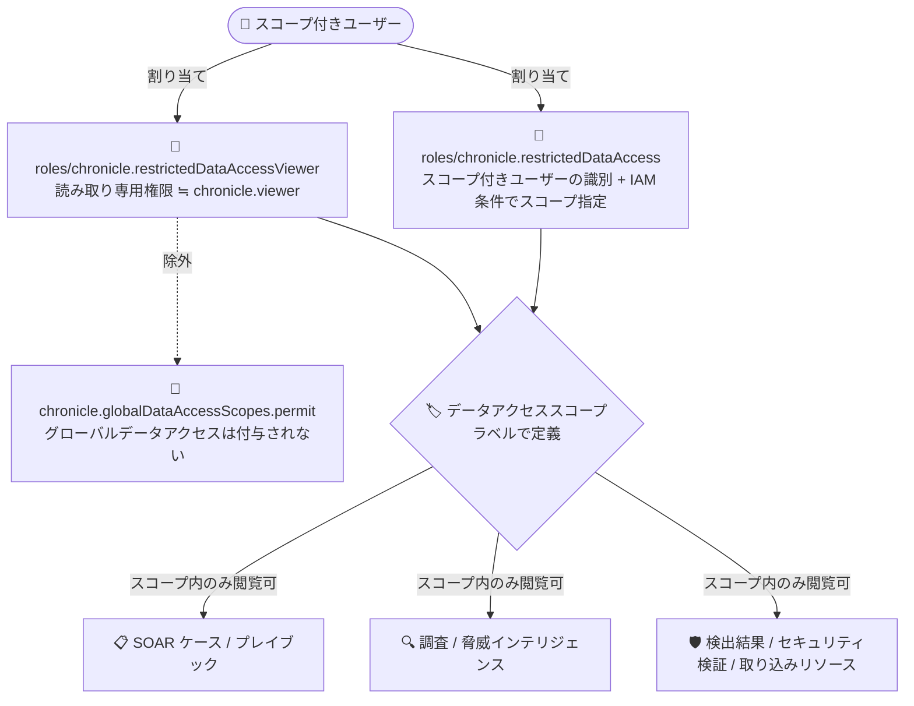

# Google SecOps: Chronicle API Restricted Data Access Viewer ロールの読み取り専用権限を拡張

**リリース日**: 2026-09-30

**サービス**: Google SecOps

**機能**: Chronicle API Restricted Data Access Viewer ロールの読み取り専用権限の拡張

**ステータス**: Feature (GA)

📊 [このアップデートのインフォグラフィックを見る](https://takech9203.github.io/google-cloud-news-summary/20260930-google-secops-restricted-data-access-viewer-permissions.html)

## 概要

Google SecOps は、事前定義 IAM ロールである Chronicle API Restricted Data Access Viewer (`roles/chronicle.restrictedDataAccessViewer`) を更新し、Chronicle API Viewer (`roles/chronicle.viewer`) ロールが持つすべての読み取り専用権限を含むように拡張しました。ただし、グローバルデータアクセスを許可する権限 (`chronicle.globalDataAccessScopes.permit`) は除外されています。

このアップデートにより、`roles/chronicle.restrictedDataAccessViewer` を割り当てられたユーザーは、割り当てられたデータアクセススコープの範囲内で、SOAR のケースとプレイブック、調査 (Investigations)、脅威コレクション (Threat Collections)、検出結果 (Findings)、セキュリティ検証 (Security Validation)、取り込み (Ingestion) リソースなど、Google SecOps の幅広い機能に対して読み取り専用アクセスが可能になります。

データ RBAC (ロールベースアクセス制御) を利用して、SOC アナリストや監査担当者などに「必要なデータスコープに限定した読み取り専用アクセス」を付与したい組織にとって、カスタムロールを作らずに事前定義ロールだけで広範な閲覧権限を実現できる重要な改善です。

**アップデート前の課題**

- `roles/chronicle.restrictedDataAccessViewer` の権限は `roles/chronicle.viewer` よりも限定的で、スコープ付きユーザーは SOAR ケースやプレイブック、セキュリティ検証など一部機能を閲覧できなかった
- スコープ付きユーザーに Viewer 相当の広い読み取り権限を与えるには、カスタムロールを作成して必要な権限を個別に付与する運用が必要だった
- 事前定義ロールの権限差分により、スコープ付きユーザーと グローバルユーザーで閲覧できる画面・機能に不整合が生じ、権限設計が複雑になりがちだった

**アップデート後の改善**

- `roles/chronicle.restrictedDataAccessViewer` に `roles/chronicle.viewer` のすべての読み取り専用権限が含まれ、SOAR ケース・プレイブック、調査、脅威インテリジェンス、検出結果、セキュリティ検証、取り込みリソースまで閲覧可能になった
- グローバルデータアクセス権限 (`chronicle.globalDataAccessScopes.permit`) は除外されているため、データアクセスは引き続き割り当てられたスコープ内に制限され、データ RBAC の境界は維持される
- 事前定義ロールの組み合わせ (`restrictedDataAccess` + `restrictedDataAccessViewer`) だけで、スコープ制限付きの包括的な読み取り専用アクセスを実現でき、カスタムロールの作成・保守が不要になった

## アーキテクチャ図



スコープ付きユーザーは `restrictedDataAccess` ロールでスコープ制限が適用され、拡張された `restrictedDataAccessViewer` ロールによりスコープ内のデータに対して Google SecOps のほぼすべての機能を読み取り専用で利用できます。グローバルデータアクセス権限は含まれないため、スコープ境界は維持されます。

## サービスアップデートの詳細

### 主要機能

1. **Viewer 相当の読み取り専用権限への拡張**
   - `roles/chronicle.restrictedDataAccessViewer` が `roles/chronicle.viewer` の持つすべての読み取り専用権限を包含するよう更新された
   - UDM 検索、イベント・エンティティの参照、ルールや検出結果の閲覧に加え、SOAR ケース・プレイブック、調査、脅威コレクション、セキュリティ検証、取り込みリソースなどへの読み取りアクセスが追加された

2. **グローバルデータアクセスの除外によるスコープ境界の維持**
   - `chronicle.globalDataAccessScopes.permit` 権限のみ意図的に除外されている
   - これにより、ロール権限が拡張されてもユーザーが閲覧できるデータは割り当てられたデータアクセススコープ内に限定され、データ RBAC によるアクセス制御が引き続き機能する

3. **事前定義ロールによるスコープ付き読み取り専用アクセスの標準化**
   - データ RBAC のドキュメントで定義される「事前定義スコープ付き読み取り専用アクセス」は、`roles/chronicle.restrictedDataAccess` と `roles/chronicle.restrictedDataAccessViewer` の組み合わせで構成される
   - 今回の拡張により、この標準的な組み合わせだけで実用上十分な閲覧範囲をカバーできるようになった

## 技術仕様

### 関連する IAM ロールの整理

| ロール | 役割 | データアクセス範囲 |
|------|------|------|
| `roles/chronicle.restrictedDataAccess` | ユーザーをスコープ付きユーザーとして識別。IAM 条件でデータアクセススコープを割り当てる | 割り当てられたスコープ内 |
| `roles/chronicle.restrictedDataAccessViewer` | スコープ付きユーザー向けの読み取り専用権限 (今回 `chronicle.viewer` 相当に拡張) | 割り当てられたスコープ内 (グローバルアクセスなし) |
| `roles/chronicle.viewer` | グローバルユーザー向けの読み取り専用ロール (`chronicle.globalDataAccessScopes.permit` を含む) | インスタンス内の全データ |

### データ RBAC におけるアクセスタイプ

| アクセスタイプ | 割り当てるロール |
|------|------|
| 事前定義グローバルアクセス | 任意の事前定義 IAM ロール (Admin / Editor / Viewer など)。スコープ割り当て不要 |
| 事前定義スコープ付き読み取り専用アクセス | `roles/chronicle.restrictedDataAccess` + `roles/chronicle.restrictedDataAccessViewer` |
| カスタムスコープ付きアクセス | `roles/chronicle.restrictedDataAccess` + カスタムロール |

注意: グローバルアクセスはスコープ付きアクセスより優先されます。ユーザーにグローバルロールとスコープ付きロールの両方が割り当てられている場合、スコープによる制限は適用されず全データにアクセスできます。

## 設定方法

### 前提条件

1. Google SecOps インスタンスがオンボーディング済みで、Google Cloud プロジェクトにバインドされていること
2. データ RBAC を設定するための管理者権限 (IAM の役割付与権限) を持っていること
3. データアクセススコープ (ラベルの組み合わせ) が Google SecOps の [Settings] > [SIEM Settings] > [Data Access] で定義済みであること

### 手順

#### ステップ 1: スコープ付き読み取り専用ロールの付与

```bash
# Chronicle API Restricted Data Access Viewer ロールを付与
gcloud projects add-iam-policy-binding PROJECT_ID \
  --member="user:analyst@example.com" \
  --role="roles/chronicle.restrictedDataAccessViewer"
```

読み取り専用権限を付与します。今回の更新により、このロールだけで SOAR ケースやプレイブック、調査などの閲覧も可能になります。

#### ステップ 2: Restricted Data Access ロールと IAM 条件によるスコープ割り当て

```bash
# Restricted Data Access ロールを IAM 条件付きで付与し、スコープを割り当てる
gcloud projects add-iam-policy-binding PROJECT_ID \
  --member="user:analyst@example.com" \
  --role="roles/chronicle.restrictedDataAccess" \
  --condition='title=scope-binding,expression=resource.name.endsWith("/SCOPE_NAME")'
```

`roles/chronicle.restrictedDataAccess` ロールの IAM 条件 (`ENDS_WITH` / `STARTS_WITH` / `EQUALS_TO`) でデータアクセススコープを割り当てます。1 つのロールバインディングには最大 12 個の条件を追加できます。

## メリット

### ビジネス面

- **権限設計の簡素化**: カスタムロールを作成・保守することなく、事前定義ロールの組み合わせだけでスコープ制限付きの包括的な閲覧権限を実現でき、IAM 運用コストを削減できる
- **最小権限の原則との両立**: アナリストや監査担当者に必要十分な可視性を与えつつ、データアクセスは担当スコープ内に限定されるため、コンプライアンス要件を満たしやすい

### 技術面

- **機能カバレッジの拡大**: SOAR ケース・プレイブック、調査、脅威コレクション、検出結果、セキュリティ検証、取り込みリソースまで、スコープ付きユーザーが読み取り専用でアクセス可能になった
- **スコープ境界の維持**: `chronicle.globalDataAccessScopes.permit` が除外されているため、権限拡張後もデータ RBAC によるスコープ制御は損なわれない

## デメリット・制約事項

### 制限事項

- グローバルデータアクセス権限 (`chronicle.globalDataAccessScopes.permit`) は含まれないため、スコープ外のデータは引き続き閲覧できない (これは意図された設計)
- あくまで読み取り専用ロールであり、ケースの更新、ルールの作成・編集、プレイブックの実行などの書き込み操作はできない

### 考慮すべき点

- 既存の `roles/chronicle.restrictedDataAccessViewer` 割り当てユーザーは、追加の設定なしに閲覧可能な機能が自動的に増える。これまでの権限設計で「見せない」前提だった機能 (SOAR ケースなど) がスコープ内で閲覧可能になるため、必要に応じてアクセスレビューを実施すべき
- グローバルロール (例: `roles/chronicle.viewer`) とスコープ付きロールを併用している場合、グローバルアクセスが優先されスコープ制限は適用されない点に注意
- より細かい権限制御が必要な場合は、引き続き `roles/chronicle.restrictedDataAccess` + カスタムロールの構成を利用する

## ユースケース

### ユースケース 1: 部門別 SOC アナリストへのスコープ限定閲覧権限

**シナリオ**: マルチテナント型の SOC で、各部門 (事業部 A、事業部 B) のアナリストには自部門のログデータに関するケース、調査、検出結果のみを閲覧させたい。

**実装例**:
```bash
# 事業部 A のアナリストグループにスコープ付き読み取り専用アクセスを付与
gcloud projects add-iam-policy-binding PROJECT_ID \
  --member="group:soc-dept-a@example.com" \
  --role="roles/chronicle.restrictedDataAccessViewer"

gcloud projects add-iam-policy-binding PROJECT_ID \
  --member="group:soc-dept-a@example.com" \
  --role="roles/chronicle.restrictedDataAccess" \
  --condition='title=dept-a-scope,expression=resource.name.endsWith("/dept-a")'
```

**効果**: 事業部 A のアナリストは自部門スコープ内の SOAR ケース、プレイブック、調査、検出結果を一元的に閲覧でき、他部門のデータは見えない。

### ユースケース 2: 監査担当者・コンプライアンスチームへの読み取り専用アクセス

**シナリオ**: 内部監査チームが、特定の規制対象システムのログに関するインシデント対応状況 (ケース、プレイブック、セキュリティ検証結果) を確認する必要があるが、設定変更やデータ全体へのアクセスは許可したくない。

**効果**: 事前定義ロール 2 つの付与だけで、監査対象スコープに限定された読み取り専用の包括的な可視性を提供でき、カスタムロールの作成やメンテナンスが不要になる。

## 料金

このアップデートは事前定義 IAM ロールの権限変更であり、追加料金は発生しません。IAM の利用自体は無料です。Google SecOps 自体の料金はライセンス (パッケージ) ベースの体系です。

- [Google SecOps の料金](https://cloud.google.com/chronicle/docs/preview/pricing)

## 利用可能リージョン

IAM ロール定義の変更であるため、特定リージョンに依存せず、Google SecOps が利用可能なすべての環境に適用されます。

## 関連サービス・機能

- **Cloud IAM**: 本アップデートの基盤。事前定義ロール、カスタムロール、IAM 条件 (CEL) を用いてスコープ割り当てを行う
- **Google SecOps データ RBAC**: ラベルで定義したデータアクセススコープにより、ユーザーのデータ可視性を制御する仕組み。本ロールはスコープ付きユーザー向けの標準的な読み取り専用ロール
- **Google SecOps SOAR**: 今回の拡張により、スコープ付きユーザーもケースとプレイブックを読み取り専用で閲覧可能になった
- **Google SecOps フィーチャー RBAC**: データ RBAC と組み合わせて、機能単位のアクセス制御を実現する事前定義ロール群 (Admin / Editor / Viewer / Limited Viewer / Restricted Data Access Viewer)

## 参考リンク

- 📊 [インフォグラフィック](https://takech9203.github.io/google-cloud-news-summary/20260930-google-secops-restricted-data-access-viewer-permissions.html)
- [公式リリースノート](https://docs.cloud.google.com/release-notes#September_30_2026)
- [データ RBAC の概要](https://docs.cloud.google.com/chronicle/docs/administration/datarbac-overview)
- [ユーザー向けデータ RBAC の構成](https://docs.cloud.google.com/chronicle/docs/administration/configure-datarbac-users)
- [Chronicle の IAM 権限とロールのリファレンス](https://docs.cloud.google.com/chronicle/docs/reference/feature-rbac-permissions-roles)
- [Chronicle API Restricted Data Access Viewer ロールの定義](https://docs.cloud.google.com/iam/docs/roles-permissions/chronicle#chronicle.restrictedDataAccessViewer)

## まとめ

今回のアップデートにより、`roles/chronicle.restrictedDataAccessViewer` はグローバルデータアクセスを除く `roles/chronicle.viewer` 相当の読み取り専用権限を持つロールとなり、スコープ付きユーザーへの権限付与が大幅に簡素化されました。データ RBAC を運用している組織は、既存のスコープ付きユーザーの閲覧範囲が自動的に広がるため、アクセスレビューを実施した上で、カスタムロールからの移行を検討することを推奨します。

---

**タグ**: #GoogleSecOps #Chronicle #IAM #DataRBAC #セキュリティ #アクセス制御 #SOAR
