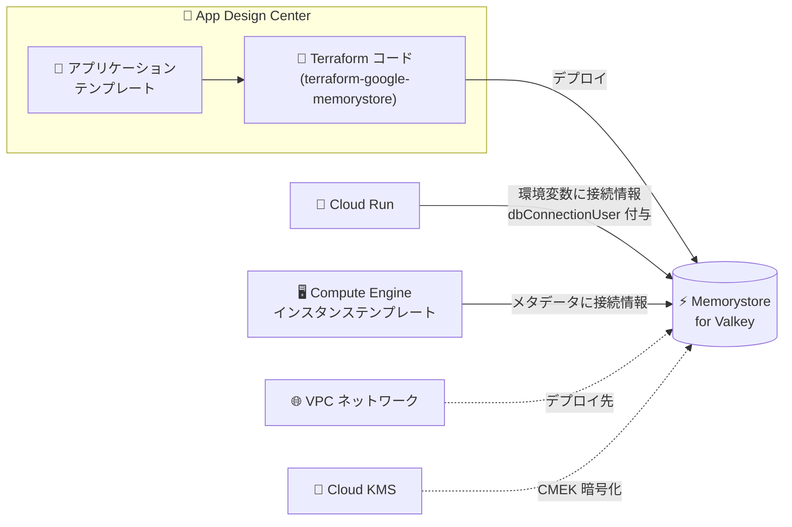

# Memorystore for Valkey: App Design Center によるインスタンス作成が GA

**リリース日**: 2026-09-30

**サービス**: Memorystore for Valkey

**機能**: App Design Center を使用したインスタンス作成

**ステータス**: GA (一般提供)

📊 [このアップデートのインフォグラフィックを見る](https://takech9203.github.io/google-cloud-news-summary/20260930-memorystore-valkey-app-design-center-ga.html)

## 概要

Memorystore for Valkey のインスタンスを App Design Center (Application Design Center) から作成する機能が一般提供 (GA) になりました。App Design Center は、アプリケーションテンプレートをビジュアルなキャンバス上で設計し、Terraform コードを自動生成してデプロイできるサービスです。今回の GA により、Memorystore for Valkey をアプリケーション設計の一コンポーネントとして扱い、Cloud Run や Compute Engine などの他コンポーネントとの接続を含めて、宣言的にプロビジョニングできるようになりました。

Memorystore for Valkey は、Cluster Mode Enabled / Cluster Mode Disabled の両方をサポートするフルマネージドの Valkey サービスです。App Design Center での構成パラメータは、公式の Terraform モジュール [terraform-google-memorystore](https://github.com/terraform-google-modules/terraform-google-memorystore/tree/main/modules/valkey) に基づいています。

対象ユーザーは、組織内で標準化されたアプリケーションテンプレートを提供するプラットフォームチームと、そのテンプレートを利用してキャッシュ付きアプリケーションをデプロイする開発チームです。

**アップデート前の課題**

- Memorystore for Valkey インスタンスの作成は、Google Cloud コンソールの Memorystore ページ、gcloud CLI、API、または自作の Terraform コードで個別に行う必要があった
- アプリケーション (Cloud Run や Compute Engine) と Valkey インスタンスの接続情報 (エンドポイント、IAM ロール) は手動で設定する必要があった
- アプリケーション全体の設計の中でキャッシュ層を含めた構成を標準化・テンプレート化する仕組みと統合されていなかった

**アップデート後の改善**

- App Design Center のテンプレートに Memorystore for Valkey コンポーネントを組み込み、GA 品質でインスタンスを作成できるようになった
- Cloud Run と接続すると、Valkey の接続情報が Cloud Run の環境変数に自動追加され、Cloud Run のサービスアカウントに `roles/memorystore.dbConnectionUser` ロールが自動付与されるようになった
- Compute Engine インスタンステンプレートと接続すると、接続情報がインスタンスメタデータに自動追加されるようになった
- VPC ネットワークや KMS キー (CMEK) との接続も設計画面上で構成でき、生成される Terraform コードに反映されるようになった

## アーキテクチャ図

App Design Center のテンプレートに Memorystore for Valkey コンポーネントを配置すると Terraform コードが自動生成され、Cloud Run や Compute Engine などの接続コンポーネントには接続情報と IAM ロールが自動構成されます。

## サービスアップデートの詳細

### 主要機能

1. **テンプレートベースのインスタンス作成**
   - App Design Center の設計キャンバスに Memorystore for Valkey コンポーネントを追加し、アプリケーションテンプレートの一部としてインスタンスを作成できる
   - 構成パラメータは公式 Terraform モジュール terraform-google-memorystore (valkey モジュール) に基づく

2. **コンポーネント接続による自動構成**
   - **Cloud Run**: Valkey の接続情報が Cloud Run の環境変数に追加され、サービスアカウントに `roles/memorystore.dbConnectionUser` が付与される
   - **Compute Engine インスタンステンプレート**: 接続情報がコンピュートインスタンスのメタデータに追加される
   - **サービスアカウント**: 接続したサービスアカウントに、インスタンス管理用の `roles/memorystore.editor` が付与される
   - **VPC ネットワーク**: 選択した VPC ネットワークにインスタンスがデプロイされ、ネットワーク情報が Valkey のネットワークパラメータに設定される
   - **KMS キー**: 接続した KMS キーで保存データが暗号化され (CMEK)、キー ID がインスタンス構成に渡される

3. **Terraform コードの自動生成と編集**
   - テンプレートの設計内容から `main.tf`、`variables.tf`、`outputs.tf`、`input.tfvars`、`providers.tf` が自動生成される
   - 生成された Terraform コードは設計画面上で直接編集・検証でき、独自の CI/CD ツールへのエクスポートも可能

## 技術仕様

### App Design Center での必須構成パラメータ

テンプレートに Memorystore for Valkey コンポーネントを含める場合、デプロイ前に以下のパラメータの構成が必要です。

| パラメータ | 説明 |
|------|------|
| Name | インスタンス名 (`name`) |
| Project ID | Memorystore for Valkey リソースをデプロイするプロジェクト |
| Region | デプロイ先リージョン (`locationId`)。Memorystore for Valkey のサポート対象リージョンから選択 |
| Network | 接続する VPC ネットワーク (`network`) |

### 接続コンポーネントと自動構成の内容

| 接続コンポーネント | 自動構成される内容 |
|------|------|
| Cloud Run | 環境変数への接続情報追加、`roles/memorystore.dbConnectionUser` の付与 |
| Compute Engine インスタンステンプレート | インスタンスメタデータへの接続情報追加 |
| サービスアカウント | `roles/memorystore.editor` の付与 |
| VPC ネットワーク | デプロイ先ネットワークの設定 |
| KMS キー | CMEK による保存データ暗号化の設定 |

## 設定方法

### 前提条件

1. App Design Center を利用できる環境 (app-enabled folder または management project) が用意されていること
2. Memorystore for Valkey のネットワーク要件 (VPC、サービス接続ポリシー) を満たしていること

### 手順

#### ステップ 1: テンプレートに Memorystore for Valkey コンポーネントを追加

App Design Center の設計キャンバスで、アプリケーションテンプレートに Memorystore for Valkey コンポーネントを追加します。

#### ステップ 2: 必須パラメータの構成とコンポーネント接続

Name、Project ID、Region、Network の必須パラメータを設定し、必要に応じて Cloud Run、Compute Engine インスタンステンプレート、KMS キーなどのコンポーネントと接続します。

#### ステップ 3: Terraform コードの確認とデプロイ

設計画面の「Code」から自動生成された Terraform コードを確認・編集し、App Design Center からデプロイします。独自の CI/CD ツールでデプロイする場合は Terraform コードをエクスポートすることもできます。

## メリット

### ビジネス面

- **標準化とガバナンス**: プラットフォームチームが承認済みテンプレートとしてキャッシュ層を含むアプリケーション構成をカタログで共有でき、組織全体で一貫した構成を展開できる
- **セットアップ時間の短縮**: 接続情報の受け渡しや IAM ロール付与が自動化され、アプリケーションとキャッシュの統合にかかる手作業が削減される

### 技術面

- **IaC との整合性**: 公式 Terraform モジュールに基づくコードが自動生成されるため、GUI 設計と Infrastructure as Code を両立できる
- **セキュアな既定構成**: Cloud Run 接続時の最小権限ロール (`roles/memorystore.dbConnectionUser`) 付与や、KMS キー接続による CMEK 暗号化を設計段階で組み込める

## デメリット・制約事項

### 考慮すべき点

- 構成パラメータは terraform-google-memorystore Terraform モジュールに基づくため、モジュールがサポートする範囲での構成となる
- Terraform をエクスポートして外部ツールでデプロイした場合、アプリケーションは「アンマネージド」として扱われ、設計時セキュリティ評価などマネージドアプリケーション限定の機能は利用できない
- Memorystore for Valkey 自体の制約 (Cluster Mode は作成後に変更不可、サポート対象リージョンなど) は従来どおり適用される

## ユースケース

### ユースケース 1: Cloud Run + Valkey キャッシュの標準テンプレート

**シナリオ**: プラットフォームチームが、Cloud Run サービスと Valkey キャッシュを組み合わせた Web アプリケーションの標準構成を、社内の複数開発チームに提供したい。

**効果**: App Design Center のカタログでテンプレートを共有することで、各チームは接続情報の環境変数設定や IAM ロール付与を意識せずに、承認済み構成のキャッシュ付きアプリケーションをデプロイできる。

### ユースケース 2: CMEK 要件のあるアプリケーションのキャッシュ層

**シナリオ**: コンプライアンス要件により、保存データを顧客管理の暗号鍵 (CMEK) で暗号化する必要がある。

**効果**: テンプレート上で KMS キーを Valkey コンポーネントに接続するだけで、CMEK 暗号化を含む構成が Terraform コードに反映され、暗号化設定の漏れを設計段階で防止できる。

## 料金

App Design Center 経由で作成した Memorystore for Valkey インスタンスの料金は、通常の Memorystore for Valkey の料金体系 (ノードタイプとシャード数に基づく) に従います。詳細は料金ページを参照してください。

- [Memorystore 料金ページ](https://cloud.google.com/memorystore/docs/valkey/pricing)

## 利用可能リージョン

Memorystore for Valkey のサポート対象リージョンについては、[サポートされているリージョン](https://docs.cloud.google.com/memorystore/docs/valkey/locations)を参照してください。

## 関連サービス・機能

- **App Design Center (Application Design Center)**: アプリケーションテンプレートの設計、Terraform 生成、カタログ共有を行う本アップデートの中核サービス
- **Cloud Run**: 接続コンポーネントとして Valkey をキャッシュに利用でき、接続情報と IAM ロールが自動構成される
- **Compute Engine**: インスタンステンプレートを接続すると、メタデータ経由で Valkey の接続情報が渡される
- **Cloud KMS**: CMEK による保存データの暗号化に使用
- **App Hub**: App Design Center からデプロイしたアプリケーションの登録・監視の基盤

## 参考リンク

- 📊 [インフォグラフィック](https://takech9203.github.io/google-cloud-news-summary/20260930-memorystore-valkey-app-design-center-ga.html)
- [公式リリースノート](https://docs.cloud.google.com/release-notes#September_30_2026)
- [App Design Center で Memorystore for Valkey を構成する](https://docs.cloud.google.com/application-design-center/docs/configure-memorystore-for-valkey)
- [App Design Center 概要](https://docs.cloud.google.com/application-design-center/docs/overview)
- [Memorystore for Valkey 概要](https://docs.cloud.google.com/memorystore/docs/valkey/product-overview)
- [Memorystore for Valkey インスタンスの作成](https://docs.cloud.google.com/memorystore/docs/valkey/create-instances)

## まとめ

Memorystore for Valkey が App Design Center のコンポーネントとして GA になり、キャッシュ層を含むアプリケーション構成をテンプレートとして標準化し、接続情報や IAM ロールの自動構成とともにデプロイできるようになりました。組織内でアプリケーション構成の標準化を進めているプラットフォームチームは、Valkey を含むテンプレートのカタログ化を検討する価値があります。

---

**タグ**: Memorystore for Valkey, App Design Center, GA, Terraform, キャッシュ, IaC
