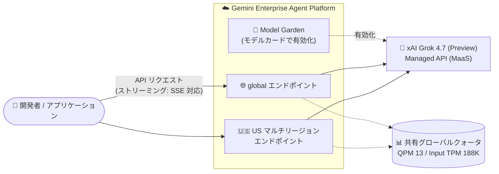

# Model Garden: xAI Grok 4.7 が Preview 提供開始

**リリース日**: 2026-09-30

**サービス**: Gemini Enterprise Agent Platform / Model Garden

**機能**: xAI Grok 4.7 (Preview)

**ステータス**: Preview

📊 [このアップデートのインフォグラフィックを見る](https://takech9203.github.io/google-cloud-news-summary/20260930-model-garden-grok-4-7-preview.html)

## 概要

2026 年 9 月 30 日、xAI の最新モデル **Grok 4.7** が Gemini Enterprise Agent Platform の Model Garden で Preview として提供開始されました。Grok 4.7 はコーディングとナレッジワークに特化した高性能モデルで、公式ドキュメントによると「難しいタスクに長時間取り組み、自身の出力を検証する」特性を持つとされています。

Grok 4.7 はマネージド API (Model as a Service、MaaS) として提供され、ユーザーはインフラの構築や管理をすることなく、Gemini Enterprise Agent Platform のエンドポイント経由で直接モデルを呼び出せます。Server-Sent Events (SSE) によるストリーミングレスポンスにも対応しており、エンドユーザーが体感するレイテンシを低減できます。

対象ユーザーは、Google Cloud 上でマルチモデル戦略を採用し、Gemini 以外のサードパーティモデルも含めて最適なモデルを選択したい企業・開発者です。なお、xAI モデルは Google 製品ではなく、Service Specific Terms の AI/ML Services セクションにおける「Separate Offerings」の条項および各モデルカードの個別規約が適用されます。

**アップデート前の課題**

- Model Garden で利用できる xAI の最上位モデルは Grok 4.6 (2026 年 8 月 21 日 GA) までであり、Grok 4.7 を利用するには xAI の API を直接利用する必要があった
- Google Cloud の統合された認証・課金・ガバナンスの枠組みの中で Grok 4.7 を評価・利用することができなかった

**アップデート後の改善**

- Grok 4.7 を Model Garden のモデルカードから有効化し、Gemini Enterprise Agent Platform のマネージド API として呼び出せるようになった
- グローバルエンドポイントおよび米国マルチリージョンエンドポイントの両方で利用可能になった
- Function calling、Structured output、Reasoning の各機能 (いずれも Preview) が利用可能になった

## アーキテクチャ図

Grok 4.7 は Model Garden のモデルカードから有効化し、グローバルまたは米国マルチリージョンのエンドポイント経由でマネージド API として呼び出します。両エンドポイントへのリクエストは、ベースモデル単位の同一グローバルクォータを共有します。

## サービスアップデートの詳細

### 主要機能

1. **高性能モデル Grok 4.7 の Preview 提供**
   - コーディングとナレッジワーク向けに構築された xAI の高性能モデル
   - 難しいタスクに長時間取り組み、自身の出力を検証する特性を持つ (公式ドキュメントの記載による)
   - 入力: テキスト・画像、出力: テキスト

2. **マネージド API (MaaS) としての提供**
   - インフラ管理不要で、Gemini Enterprise Agent Platform のエンドポイントに直接リクエストを送信
   - SSE によるストリーミングレスポンスに対応し、体感レイテンシを低減
   - モデル名には `grok-4.7` を指定

3. **エージェント構築向け機能のサポート (いずれも Preview)**
   - **Function calling**: 外部ツール・API の呼び出し
   - **Structured output**: スキーマに準拠した構造化出力
   - **Reasoning**: 推論機能

## 技術仕様

### モデル仕様

| 項目 | 詳細 |
|------|------|
| モデル ID | `grok-4.7` |
| ローンチステージ | Preview (Pre-GA Offerings Terms が適用) |
| リリース日 | 2026 年 9 月 30 日 |
| 入力 | テキスト、画像 |
| 出力 | テキスト |
| コンテキスト長 | 524,288 トークン |
| サポート機能 | Function calling、Structured output、Reasoning (いずれも Preview) |
| 非サポート機能 | Batch predictions、Standard pay-as-you-go、Provisioned Throughput |
| 利用タイプ | Fixed quota (Preview) |
| モデル提供リージョン | 米国マルチリージョン、global エンドポイント |
| ML 処理 | 米国マルチリージョン |

### クォータ制限

Grok モデルのクォータは、エンドポイント単位ではなくベースモデル単位の単一グローバルクォータとして適用されます。global エンドポイントと米国マルチリージョンエンドポイントへのリクエストは同じ上限を共有します。

| 項目 | 上限値 |
|------|--------|
| QPM (クエリ/分) | 13 |
| 入力 TPM (トークン/分) | 188,000 |
| 出力 TPM (トークン/分) | 16,000 |

関連するクォータ名:

- `global_generate_content_requests_per_minute_per_project_per_base_model` (QPM)
- `global_generate_content_input_tokens_per_minute_per_base_model` (入力 TPM)
- `global_generate_content_output_tokens_per_minute_per_base_model` (出力 TPM)

アカウントによって上限は異なる場合があり、サービス全体のパフォーマンス維持のためにアクセスが制限される場合があります。プロジェクトのクォータは Google Cloud コンソールの「割り当てとシステム上限」ページで確認できます。

## 設定方法

### 前提条件

1. Google Cloud プロジェクトと課金アカウントが設定済みであること
2. Model Garden の Grok 4.7 モデルカードでモデルを有効化していること
3. 必要なクォータ (QPM / 入力 TPM / 出力 TPM) が割り当てられていること

### 手順

#### ステップ 1: Model Garden でモデルカードを確認・有効化

Google Cloud コンソールの Model Garden で xAI の Grok 4.7 モデルカードを開き、モデルを有効化します。

- モデルカード: `https://console.cloud.google.com/agent-platform/publishers/xai/model-garden/grok-4.7`

#### ステップ 2: API を呼び出す

マネージドモデルとして、Gemini Enterprise Agent Platform のエンドポイントに curl などでリクエストを送信します。モデル名には `grok-4.7` を指定します。ストリーミング / 非ストリーミング呼び出しの詳細は公式ドキュメント「Call open model APIs」を参照してください。Responses API での呼び出しもサポートされています。

## メリット

### ビジネス面

- **マルチモデル戦略の選択肢拡大**: Gemini、Claude、Llama、Mistral などに加え、xAI の最新モデルも Google Cloud の統一された基盤上で選択可能
- **統合されたガバナンス**: Google Cloud の認証・課金・クォータ管理の枠組みの中でサードパーティモデルを利用できる

### 技術面

- **インフラ管理不要**: マネージド API (MaaS) としての提供のため、サービングインフラの構築・運用が不要
- **大規模コンテキスト**: 524,288 トークンのコンテキスト長により、大規模なコードベースや長文ドキュメントの処理が可能
- **エージェント構築機能**: Function calling、Structured output、Reasoning (いずれも Preview) によりエージェントワークフローへ組み込み可能

## デメリット・制約事項

### 制限事項

- Preview のため「Pre-GA Offerings Terms」が適用され、サポートが限定される場合がある
- Batch predictions は非サポート
- Standard pay-as-you-go および Provisioned Throughput は非サポート (利用タイプは Fixed quota のみ)
- クォータは QPM 13、入力 TPM 188,000、出力 TPM 16,000 と限定的で、global と US マルチリージョンの両エンドポイントで共有される
- ML 処理は米国マルチリージョンで行われるため、データレジデンシー要件がある場合は注意が必要

### 考慮すべき点

- xAI モデルは Google 製品ではなく、Service Specific Terms の「Separate Offerings」条項とモデルカードの個別規約が適用される
- 本番利用には GA 版である Grok 4.6 (global エンドポイントと US マルチリージョンエンドポイントで利用可能) の利用を検討する

## ユースケース

### ユースケース 1: コーディング支援・コードレビュー

**シナリオ**: 大規模なコードベースを扱う開発チームが、コード生成やリファクタリング支援に高性能モデルを評価したい。

**効果**: Grok 4.7 はコーディング向けに構築されており、524,288 トークンのコンテキスト長により大きなコードベースをまとめて渡した処理の評価が可能。難しいタスクに長時間取り組み自己検証する特性が、複雑な実装タスクに適する。

### ユースケース 2: ナレッジワークのエージェント化

**シナリオ**: 社内ドキュメントの分析・レポート作成などのナレッジワークを、Function calling と Structured output を使ったエージェントとして構築したい。

**効果**: 外部ツール呼び出しとスキーマ準拠の構造化出力 (いずれも Preview) により、後続システムと連携するエージェントワークフローを構築できる。SSE ストリーミングで応答の体感レイテンシも低減できる。

## 料金

Grok 4.7 の個別の料金は、Gemini Enterprise Agent Platform の生成 AI 料金ページを参照してください。Preview 時点の利用タイプは Fixed quota のみで、Standard pay-as-you-go と Provisioned Throughput は非サポートです。

- [料金ページ](https://cloud.google.com/gemini-enterprise-agent-platform/generative-ai/pricing)

## 利用可能リージョン

| 項目 | 対応 |
|------|------|
| モデル提供 | 米国マルチリージョン、global エンドポイント |
| ML 処理 | 米国マルチリージョン |

## 関連サービス・機能

- **Model Garden**: Google・パートナー・オープンモデルを検索・有効化・デプロイできるモデルカタログ。Grok 4.7 の有効化はここから行う
- **Grok 4.6 (GA)**: 2026 年 8 月 21 日に GA となった前世代モデル。本番利用向けには GA 版の利用が選択肢となる
- **Gen AI evaluation service**: Model Garden で有効化したパートナーモデルの評価に利用可能
- **その他のパートナーモデル**: Anthropic Claude、Meta、Mistral AI などのモデルも同じ枠組み (マネージド API) で利用可能

## 参考リンク

- 📊 [インフォグラフィック](https://takech9203.github.io/google-cloud-news-summary/20260930-model-garden-grok-4-7-preview.html)
- [公式リリースノート](https://docs.cloud.google.com/release-notes#September_30_2026)
- [Grok 4.7 モデルドキュメント](https://docs.cloud.google.com/gemini-enterprise-agent-platform/models/partner-models/grok/grok-4-7)
- [xAI Grok モデル一覧](https://docs.cloud.google.com/gemini-enterprise-agent-platform/models/partner-models/grok)
- [Call open model APIs](https://docs.cloud.google.com/gemini-enterprise-agent-platform/models/maas/call-open-model-apis)
- [料金ページ](https://cloud.google.com/gemini-enterprise-agent-platform/generative-ai/pricing)

## まとめ

xAI の最新モデル Grok 4.7 が Model Garden の Preview として追加され、Google Cloud 上のマルチモデル戦略の選択肢がさらに広がりました。コーディングやナレッジワーク向けの高性能モデルをマネージド API として手軽に評価できる一方、Preview 段階でクォータが限定的なため、まずは PoC での評価から始め、本番利用には GA 版の Grok 4.6 や GA 昇格後の採用を検討することを推奨します。

---

**タグ**: #ModelGarden #GeminiEnterpriseAgentPlatform #xAI #Grok #生成AI #Preview
