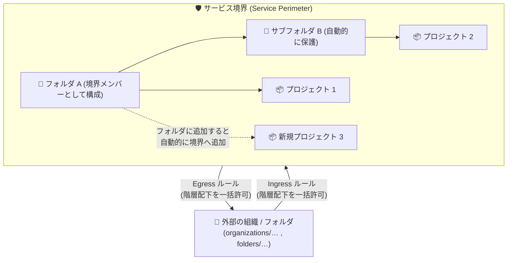

# VPC Service Controls: フォルダサポート GA (境界メンバーシップと Ingress/Egress ルール) および Universal Ledger 統合 Preview

**リリース日**: 2026-09-30

**サービス**: VPC Service Controls

**機能**: サービス境界のフォルダメンバーシップ (GA)、Ingress/Egress ルールでのフォルダ・組織リソース指定 (GA)、Universal Ledger 統合 (Preview)

**ステータス**: 一般提供 (GA) x2、プレビュー (Preview) x1

📊 [このアップデートのインフォグラフィックを見る](https://takech9203.github.io/google-cloud-news-summary/20260930-vpc-service-controls-folder-support-ga.html)

## 概要

VPC Service Controls において、Google Cloud のリソース階層 (フォルダ・組織) を活用した境界管理機能が一般提供 (GA) になりました。今回のアップデートは同日に発表された 3 つの関連機能で構成されます。

1 つ目は **Ingress/Egress ルールでのフォルダ・組織リソースのサポート (GA)** です。サービス境界で保護されたリソースへのアクセス許可 (Ingress) およびリソースからの外部アクセス許可 (Egress) を定義するルールにおいて、プロジェクトに加えてフォルダ (`folders/FOLDER_NUMBER`) や組織 (`organizations/ORGANIZATION_NUMBER`) をリソースとして指定できるようになりました。これにより、ルールにプロジェクトを 1 つずつ列挙する必要がなくなり、一般的なリソースサイズの制限 (ルールに指定できるリソース数の上限) を回避できます。

2 つ目は **サービス境界のフォルダメンバーシップ (GA)** です。Google Cloud フォルダをサービス境界のメンバー (保護対象リソース) として構成でき、そのフォルダ階層内のすべてのプロジェクトとサブフォルダが自動的に保護されます。フォルダにプロジェクトを追加すると VPC Service Controls が自動的に同じ境界へ追加し、フォルダから削除すると自動的に境界からも削除されるため、境界構成を都度更新する必要がありません。

3 つ目は **Universal Ledger 統合の Preview サポート** です。Universal Ledger API (`universalledger.googleapis.com`) をサービス境界で保護できるようになりました (Preview 段階)。

大規模な組織で多数のプロジェクトを VPC Service Controls で保護している企業のセキュリティ管理者・プラットフォームチームにとって、境界管理の運用負荷を大幅に削減できるアップデートです。

**アップデート前の課題**

- サービス境界の保護対象リソースはプロジェクト単位 (または VPC ネットワーク単位) で指定する必要があり、フォルダ内に多数のプロジェクトがある場合でも 1 つずつ境界に追加する必要があった
- 新しいプロジェクトを作成するたびに境界構成を手動で更新する必要があり、更新漏れによる保護されないプロジェクトの発生リスクがあった
- Ingress/Egress ルールのリソース指定もプロジェクト単位が基本であり、大量のプロジェクトを許可する場合にリソースサイズの制限 (ルールサイズ上限) に達しやすかった

**アップデート後の改善**

- フォルダを境界のメンバーとして構成するだけで、フォルダ階層内のすべてのプロジェクトとネストされたサブフォルダが自動的に保護されるようになった (GA)
- フォルダへのプロジェクトの追加・削除に連動して境界への追加・削除が自動化され、境界構成の手動更新が不要になった
- Ingress/Egress ルールでフォルダ・組織を指定できるようになり、そのリソース階層配下のすべてのリソースを一括で許可でき、リソースサイズ制限を回避できるようになった (GA)
- `lookup-configured-perimeter` コマンド / API により、プロジェクトやフォルダに適用されている境界 (直接構成か祖先フォルダからの継承か) を確認できる

## アーキテクチャ図



フォルダ A を境界メンバーとして構成すると、サブフォルダ B を含む階層内のすべてのプロジェクトが自動的に保護されます。また、Ingress/Egress ルールでは外部のフォルダ・組織をリソースとして指定し、その階層配下との通信を一括で許可できます。

## サービスアップデートの詳細

### 主要機能

1. **Ingress/Egress ルールでのフォルダ・組織サポート (GA)**
   - Ingress ルールの `sources.resource` および `ingressTo.resources`、Egress ルールの `egressFrom.sources.resource` および `egressTo.resources` に、プロジェクトに加えてフォルダ・組織を指定可能
   - フォルダ・組織を指定すると、そのリソース階層配下のすべてのリソースからの/へのアクセスが許可される
   - プロジェクトの個別列挙が不要になり、ルールのリソースサイズ制限を回避できる

2. **サービス境界のフォルダメンバーシップ (GA)**
   - フォルダを境界の保護対象リソースとして構成すると、フォルダ内のプロジェクトとネストされたサブフォルダを含むすべてのリソースが保護される
   - フォルダへのプロジェクトの追加・削除に連動して、境界メンバーシップが自動的に更新される
   - 境界の作成 (`perimeters create`)・更新 (`perimeters update`) の両方で、Enforced モードと Dry run モードのどちらにも対応
   - `lookup-configured-perimeter` コマンド / `LookupConfiguredServicePerimeter` API で、リソースに適用されている境界 (Enforced / Dry run、直接構成 / 祖先からの継承) を確認可能

3. **Universal Ledger 統合 (Preview)**
   - Universal Ledger API (`universalledger.googleapis.com`) をサービス境界の保護対象として構成可能
   - Universal Ledger は共有マルチテナントネットワーク上で動作するため、レジャーにコミットされたトランザクションデータ (トランザクションペイロード、公開鍵、暗号署名) は認可されたすべてのレジャー参加者からアクセス可能であり、個々の顧客の境界構成では制限できない
   - データ持ち出し防止には、`universalledger.endpoints.submitTransaction` などのデータ変更メソッドを IAM 拒否ポリシーで制限する方法が推奨されている

## 技術仕様

### リソース指定形式 (Ingress/Egress ルール)

| リソース種別 | 指定形式 |
|------|------|
| プロジェクト | `projects/PROJECT_NUMBER` |
| フォルダ | `folders/FOLDER_NUMBER` |
| 組織 | `organizations/ORGANIZATION_NUMBER` |
| VPC ネットワーク (sources のみ) | `//compute.googleapis.com/projects/PROJECT_ID/global/networks/NETWORK_NAME` |

### Ingress ルールの設定例 (YAML)

```yaml
- ingressFrom:
    identityType: ANY_IDENTITY
    sources:
    - resource: folders/12345
  ingressTo:
    operations:
    - serviceName: storage.googleapis.com
      methodSelectors:
      - method: "*"
    resources:
    - organizations/67890
  title: allow-from-folder-hierarchy
```

`sources.resource` にフォルダ・組織を指定すると、そのリソース階層配下のすべてのリソースからのアクセスが許可されます。`ingressTo.resources` にもフォルダ・組織を指定できます。

## 設定方法

### 前提条件

1. サービス境界を作成・管理するための IAM ロール (`roles/accesscontextmanager.policyAdmin`) を持っていること
2. 境界に追加するフォルダの ID を確認しておくこと
3. 境界の構成確認には `accesscontextmanager.policies.get` および `accesscontextmanager.servicePerimeters.list` 権限が必要

### 手順

#### ステップ 1: フォルダを保護対象として境界を作成

```bash
gcloud access-context-manager perimeters create NAME \
  --title=TITLE \
  --resources=folders/FOLDER_ID \
  --restricted-services=RESTRICTED_SERVICES \
  --policy=POLICY_NAME
```

Dry run モードで作成する場合は `perimeters dry-run create` コマンドを使用します。

#### ステップ 2: 既存の境界にフォルダを追加

```bash
gcloud access-context-manager perimeters update PERIMETER_ID \
  --add-resources=folders/FOLDER_ID
```

`FOLDER_ID` はカンマ区切りで複数指定できます (例: `folders/12345`)。削除する場合は `--remove-resources` を使用します。

#### ステップ 3: リソースに適用されている境界を確認

```bash
gcloud access-context-manager lookup-configured-perimeter \
  --resource=projects/PROJECT_NUMBER
```

レスポンスの `restrictedResource` フィールドで、境界がプロジェクトに直接構成されているか、祖先フォルダから継承されているかを確認できます。

## メリット

### ビジネス面

- **運用負荷の削減**: フォルダ単位の一括保護により、プロジェクトごとの境界構成更新が不要になり、大規模環境での境界管理コストを削減できる
- **セキュリティガバナンスの強化**: 新規プロジェクトがフォルダ配下に作成された時点で自動的に境界保護が適用されるため、保護漏れによるデータ持ち出しリスクを低減できる

### 技術面

- **リソースサイズ制限の回避**: Ingress/Egress ルールでフォルダ・組織を指定することで、多数のプロジェクトを列挙する必要がなくなり、ルールサイズの上限に達する問題を回避できる
- **リソース階層との整合**: フォルダの移動 (プロジェクトのフォルダへの出し入れ) によって境界メンバーシップを間接的に管理でき、組織のリソース階層設計と境界設計を一致させられる
- **可視性の向上**: `LookupConfiguredServicePerimeter` API により、Enforced / Dry run 境界の適用状況と継承元を確認できる

## デメリット・制約事項

### 制限事項

- フォルダベースのメンバーシップは境界ブリッジ (perimeter bridges) ではサポートされない (ブリッジはプロジェクトリソースのみ受け付ける)
- VPC Service Controls はフォルダレベルの API リソースをサポートしない
- 既知の問題として、Dry run 境界に VPC ネットワークプロジェクトを保護対象として構成すると、フォルダベースの適用が上書きされる (ネットワークプロジェクトを Dry run 境界に明示的に追加すると、祖先フォルダから継承した Enforced 境界の保護が失われる)
- 非 Google Cloud API および `allowed_service_patterns` で構成された境界ではフォルダメンバーシップはサポートされず、対象プロジェクトや VPC ネットワークを明示的に境界へ追加する必要がある

### 考慮すべき点

- Ingress/Egress ルールでフォルダ・組織を指定した場合、サービス境界で保護できないリソースであっても、そのフォルダ・組織を親とするリソースへのアクセスが許可される点に注意が必要
- プロジェクトをフォルダベースの境界へ移行した場合、明示的なプロジェクトバインディングを削除する前に、48 時間の階層伝搬ウィンドウが完了していることを確認することが推奨されている
- Universal Ledger 統合は Preview 段階であり、本番環境での利用は完全にはサポートされない。また、レジャーにコミット済みのトランザクションデータの可視性は境界では制御できない

## ユースケース

### ユースケース 1: 部門フォルダ単位でのデータ持ち出し防止

**シナリオ**: 金融機関で、機密データを扱う部門のプロジェクト群 (数百プロジェクト) を 1 つのフォルダ配下で管理しており、全プロジェクトを VPC Service Controls で保護したい。新規プロジェクトも自動的に保護対象にしたい。

**実装例**:
```bash
gcloud access-context-manager perimeters create finance-perimeter \
  --title="Finance Dept Perimeter" \
  --resources=folders/123456789 \
  --restricted-services=storage.googleapis.com,bigquery.googleapis.com \
  --policy=POLICY_NAME
```

**効果**: フォルダ配下の全プロジェクトとサブフォルダが自動的に境界で保護され、新規プロジェクトの作成時にも境界構成の更新が不要になる。

### ユースケース 2: 組織間データ連携の一括許可

**シナリオ**: グループ会社間 (別組織) でのデータ連携において、相手組織の多数のプロジェクトからのアクセスを許可する必要があるが、プロジェクトの個別列挙ではルールのリソースサイズ制限に達してしまう。

**効果**: Ingress ルールの `sources.resource` に `organizations/ORGANIZATION_NUMBER` を指定することで、相手組織配下のすべてのリソースからのアクセスを 1 つのエントリで許可でき、リソースサイズ制限を回避しつつルールの保守性も向上する。

## 料金

VPC Service Controls の利用にかかる料金については、公式ドキュメントを参照してください。今回のアップデートに関する追加料金の情報はリリースノートに記載されていません。

- [VPC Service Controls ドキュメント](https://cloud.google.com/vpc-service-controls/docs/overview)

## 関連サービス・機能

- **Access Context Manager**: サービス境界と Ingress/Egress ルールを定義・管理する基盤サービス。`gcloud access-context-manager` コマンドで境界を操作する
- **Resource Manager (フォルダ / 組織)**: 今回のアップデートで境界メンバーシップおよびルールのリソース指定に利用できるようになったリソース階層。プロジェクトのフォルダ間移動により境界メンバーシップを間接管理できる
- **IAM**: Universal Ledger のデータ持ち出し防止では、IAM 拒否ポリシーによるメソッド制限 (書き込みの禁止) が推奨されている
- **Cloud Audit Logs**: 境界違反のトラブルシューティングには監査ログから違反の詳細を確認する

## 参考リンク

- 📊 [インフォグラフィック](https://takech9203.github.io/google-cloud-news-summary/20260930-vpc-service-controls-folder-support-ga.html)
- [公式リリースノート](https://docs.cloud.google.com/release-notes#September_30_2026)
- [Ingress and egress rules](https://docs.cloud.google.com/vpc-service-controls/docs/ingress-egress-rules)
- [Folder support in service perimeters](https://docs.cloud.google.com/vpc-service-controls/docs/folder-membership)
- [Configure folders in service perimeters](https://docs.cloud.google.com/vpc-service-controls/docs/configure-folder)
- [Supported products (Universal Ledger)](https://docs.cloud.google.com/vpc-service-controls/docs/supported-products#table_universal_ledger)

## まとめ

フォルダメンバーシップと Ingress/Egress ルールのフォルダ・組織サポートの GA により、VPC Service Controls の境界管理をリソース階層に沿ってスケーラブルに運用できるようになりました。多数のプロジェクトを個別に境界へ登録している組織は、フォルダ単位の構成への移行を検討する価値があります。移行時は境界ブリッジ非対応や Dry run 境界での既知の問題などの制限事項を確認し、`lookup-configured-perimeter` で適用状況を検証しながら段階的に進めることを推奨します。

---

**タグ**: #VPCServiceControls #セキュリティ #GA #ServicePerimeter #フォルダ #IngressEgress #UniversalLedger #Preview
