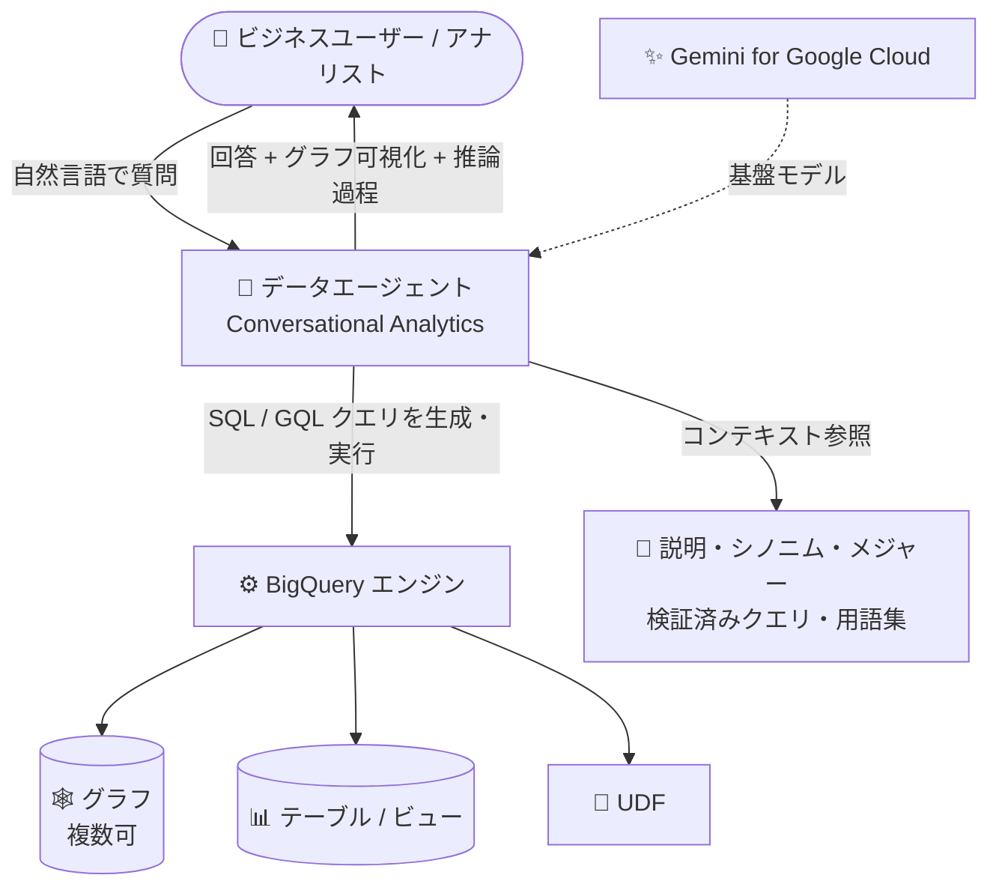

# BigQuery: Conversational Analytics の「グラフとのチャット」が GA

**リリース日**: 2026-10-01

**サービス**: BigQuery

**機能**: Conversational Analytics (会話型分析) における「グラフとのチャット (Chatting with graphs)」の一般提供 (GA)

**ステータス**: GA (一般提供)

📊 [このアップデートのインフォグラフィックを見る](https://takech9203.github.io/google-cloud-news-summary/20261001-bigquery-conversational-analytics-graph-chat.html)

## 概要

BigQuery の Conversational Analytics (会話型分析) において、グラフ (BigQuery Graph のプロパティグラフ) をデータソースとして自然言語でチャットできる「Chatting with graphs」機能が一般提供 (GA) になりました。あわせて、複数のグラフに加えて、テーブル、ビュー、UDF (ユーザー定義関数) を組み合わせてデータソースとして使用できるようになりました。

Conversational Analytics は、Gemini for Google Cloud を基盤として、データエージェントに自然言語で質問することで BigQuery のデータを分析できる機能です。グラフをデータソースとして質問すると、エージェントが SQL クエリ (Enterprise / Enterprise Plus エディションでは GQL クエリも) を構築して回答し、応答にグラフパスが含まれる場合はグラフの可視化も提供されます。

不正検知、カスタマー 360、サプライチェーン分析などでプロパティグラフを活用している組織にとって、SQL や GQL を書けないビジネスユーザーでも自然言語でグラフデータの関係性を探索できるようになる点が主要な価値です。

**アップデート前の課題**

- グラフとのチャットは GA 前の段階であり、本番利用の前提となる一般提供のステータスではなかった
- プレビュー段階のドキュメントでは、グラフをデータソースとして使う場合「エージェント / 会話ごとにグラフは最大 1 つまで」「テーブルとグラフをデータソースとして組み合わせることはできない」という制限が記載されていた
- グラフデータの関係性探索には GQL や SQL (自己結合・再帰結合) の記述スキルが必要で、ビジネスユーザーにはハードルが高かった

**アップデート後の改善**

- グラフとのチャットが一般提供 (GA) となり、本番環境での利用が可能になった
- 複数のグラフ、テーブル、ビュー、UDF を組み合わせて 1 つのデータソース群として使用できるようになった
- グラフのラベルやプロパティに定義した説明 (description) やシノニムをエージェントが活用して回答品質を向上できる
- グラフに定義したメジャー (measures) を利用した多段階の集計 (multi-level aggregation) が可能
- Enterprise / Enterprise Plus エディションでは、エージェントがグラフに対して GQL クエリを実行可能。応答にグラフパスが含まれる場合はグラフの可視化が提供される

## アーキテクチャ図



ユーザーが自然言語でデータエージェントに質問すると、エージェントが Gemini を基盤に SQL / GQL クエリを構築し、複数のグラフ・テーブル・ビュー・UDF を組み合わせたデータソースに対して実行して、テキスト回答やグラフ可視化を返します。

## サービスアップデートの詳細

### 主要機能

1. **グラフとのチャットの GA**
   - BigQuery Graph のプロパティグラフをデータソースとして、自然言語で質問できる
   - エージェントがグラフに対する SQL クエリを構築して回答。Enterprise / Enterprise Plus エディションでは GQL クエリの実行も可能
   - 応答にグラフパスが含まれる場合はグラフの可視化が提供される

2. **複数データソースの組み合わせ**
   - 複数のグラフ、テーブル、ビュー、UDF を組み合わせてデータソースとして使用可能 (今回の GA で明記)
   - エージェントはどのデータソースにクエリすべきかを判断し、パーティションや検索インデックスなどの最適化も活用する

3. **グラフメタデータによる回答品質の向上**
   - グラフのラベル・プロパティに定義した説明 (description) とシノニムをエージェントが活用
   - グラフに定義したメジャー (measures) を使った多段階集計に対応

4. **サンプルエージェントによる体験**
   - BigQuery の Agents ページにある「Look Graph」サンプルエージェントで、公開データセット `bigquery-public-data.thelook_ecommerce.graph` に対する質問を試せる
   - 例: 「25 歳のユーザーに最も人気の商品は?」「ボウタイの注文と配送センターの関係を見せて」

## 技術仕様

### Conversational Analytics の主な仕様

| 項目 | 詳細 |
|------|------|
| 基盤モデル | Gemini for Google Cloud |
| データソース (ナレッジソース) | グラフ、テーブル、ビュー、UDF (組み合わせ可) |
| ナレッジソース数の上限 | エージェントあたり最大 100 |
| GQL クエリの実行 | Enterprise / Enterprise Plus エディションのリザベーションが必要 |
| ロケーション | US MREP / EU MREP / Global (エージェント作成時に選択可、保存後は変更不可) |
| アクセス制御 | Conversational Analytics API の IAM ロールと権限で管理 |
| コンテキスト設定 | カスタムメタデータ、エージェント指示、検証済みクエリ (verified queries)、用語集 (BigQuery カスタム用語集 / Knowledge Catalog) |

### セキュリティ上の特性

- ユーザーがアクセス権を持つデータ・リソースにのみアクセス可能
- VPC Service Controls (VPC-SC) を尊重
- 書き込み操作や DML クエリは実行不可、リモート関数も実行不可
- 明示的に選択したナレッジソースにのみアクセス
- 会話履歴は本人のみに共有され、他ユーザーとの共有は不可
- エージェント作成時には、追加するすべてのナレッジソースへのクエリ権限が必要

### エージェント実行ジョブの識別ラベル

Conversational Analytics が実行する BigQuery ジョブには以下のラベルが付与され、課金レポートのフィルタリングや監査、性能分析に利用できます。

```
ca-bq-job: true           # 会話型分析によって実行されたジョブ
data-agent-id: <ID>       # ジョブを実行したデータエージェントの ID
conversation-id: <ID>     # ジョブに関連付けられた会話の ID
```

## 設定方法

### 前提条件

1. BigQuery が有効な Google Cloud プロジェクト (課金有効)
2. データソースとして使用するグラフ (`CREATE PROPERTY GRAPH` で作成)、テーブル、ビュー、UDF へのクエリ権限
3. GQL クエリをエージェントに実行させる場合は Enterprise または Enterprise Plus エディションのリザベーション
4. データエージェントおよび会話に必要な IAM ロール (Conversational Analytics API の IAM ロール)

### 手順

#### ステップ 1: データエージェントの作成

Google Cloud コンソールの BigQuery「Agent Catalog」タブからデータエージェントを作成し、ナレッジソースとしてグラフ・テーブル・ビュー・UDF を選択します。

#### ステップ 2: コンテキストの整備 (推奨)

グラフのラベル・プロパティに説明とシノニムを定義し、必要に応じてメジャー、検証済みクエリ、用語集、エージェント指示を設定して回答精度を高めます。

#### ステップ 3: 会話で質問

作成したエージェントとの会話 (または 1 つ以上のデータソースとの直接会話) で自然言語の質問を投げ、回答・生成チャート・推論過程を確認します。

## メリット

### ビジネス面

- **グラフ分析の民主化**: GQL や SQL を書けないビジネスユーザーでも、自然言語でグラフデータの関係性 (つながり・経路) を探索できる
- **本番利用への移行**: GA により、不正検知やカスタマー 360 などの本番ワークロードで安心して採用できる
- **コスト可視化**: ジョブラベル (`ca-bq-job` など) により、エージェント利用コストの追跡・監査が可能

### 技術面

- **データソースの柔軟な組み合わせ**: 複数のグラフとテーブル・ビュー・UDF を 1 つのエージェントで横断的に活用できる
- **メタデータ駆動の回答品質向上**: 説明・シノニム・メジャーの定義により、エージェントのクエリ生成と集計の精度が向上
- **可視化の自動提供**: 回答にグラフパスが含まれる場合、グラフ可視化が自動で提供される

## デメリット・制約事項

### 制限事項

- エージェントに追加できるナレッジソースは最大 100 個
- エージェントによる GQL クエリの実行には Enterprise / Enterprise Plus エディションが必要
- Conversational Analytics は書き込み操作・DML・リモート関数を実行できない (セキュリティ上の設計)
- エージェントのロケーションは保存後に変更できない

### 考慮すべき点

- Gemini for Google Cloud は、もっともらしいが事実と異なる出力を生成する可能性があるため、出力の検証が推奨されている
- 広いスコープのエージェントは指示の競合や出力のばらつきを招くため、データソースが 20 を超える場合などはエージェントの分割が推奨されている
- オンデマンド課金のプロジェクトでは `big_query_max_billed_bytes` によるクエリ単位のコスト上限設定が可能だが、スロットリザベーション利用プロジェクトには適用されない

## ユースケース

### ユースケース 1: 金融不正検知のインタラクティブ調査

**シナリオ**: ユーザー・口座・取引の関係をプロパティグラフとしてモデル化している金融機関で、不正対策チームが疑わしい資金の流れを調査する。取引明細テーブルや集計ビューも同じエージェントに組み合わせる。

**実装例**:
```
エージェントのナレッジソース:
- グラフ: fraud_graph (ユーザー・口座・取引のプロパティグラフ)
- テーブル: transactions (取引明細)
- ビュー: daily_risk_summary (日次リスク集計)

質問例: 「口座 A と口座 B の間の資金移動の経路を見せて」
       「過去 30 日で複数口座を経由した高額送金のパターンは?」
```

**効果**: GQL を書かずに関係性の探索ができ、応答にグラフパスが含まれる場合はグラフ可視化で経路を直感的に確認できる。

### ユースケース 2: EC のカスタマー 360 分析

**シナリオ**: 顧客・注文・商品・配送センターの関係をグラフ化した EC 事業者で、マーケティング担当者が「25 歳のユーザーに最も人気の商品は?」「ボウタイの注文と配送センターの関係は?」といった質問を自然言語で行う (Look Graph サンプルエージェントと同様の構成)。

**効果**: 属性テーブルとグラフを組み合わせたエージェントにより、セグメント分析と関係性分析を 1 つの会話で完結できる。

## 料金

データエージェントの作成および会話で実行されるクエリには、BigQuery のコンピューティング料金が適用されます。エージェント自体の料金は agent pricing ページを参照してください。

- エージェントがグラフに対して GQL クエリを実行するには、Enterprise または Enterprise Plus エディションのリザベーションが必要 (BigQuery の容量ベース料金)
- グラフの基盤となるテーブルのストレージ課金は 1 回のみで、テーブル上に構築したグラフモデルの数には依存しない (標準の BigQuery ストレージ料金)
- オンデマンド課金では、`big_query_max_billed_bytes` やプロジェクト / ユーザー単位のクォータでコスト上限を設定可能

詳細は [BigQuery の料金ページ](https://cloud.google.com/bigquery/pricing) および [データエージェントの料金ページ](https://cloud.google.com/products/data-agents/pricing) を参照してください。

## 利用可能リージョン

Conversational Analytics のエージェント / 会話リソースの保存と ML 処理のロケーションとして、以下の 3 つがサポートされています。

- US MREP (ナレッジソースがすべて US リージョンの場合のデフォルト)
- EU MREP (ナレッジソースがすべて EU リージョンの場合のデフォルト)
- Global (上記以外のデフォルト)

## 関連サービス・機能

- **BigQuery Graph**: 今回チャット対象となるプロパティグラフ機能。ISO GQL / SQL-PGQ 標準に準拠し、既存テーブル・ビューからノード / エッジを定義できる
- **Gemini for Google Cloud**: Conversational Analytics の基盤となる生成 AI。データガバナンスと責任ある AI のガイドラインが適用される
- **Conversational Analytics API**: コンソールで作成したデータエージェントを API 経由で呼び出し可能。Data Studio などの他サービスからも利用できる
- **Spanner Graph**: BigQuery Graph と同じグラフスキーマ・クエリ言語を共有。オペレーショナルなグラフワークロードは Spanner、分析は BigQuery という使い分けが可能
- **Knowledge Catalog**: ビジネス用語集のインポート元として、エージェントのプロンプト解釈を支援
- **VPC Service Controls**: Conversational Analytics は VPC-SC のセキュリティ制御を尊重する

## 参考リンク

- 📊 [インフォグラフィック](https://takech9203.github.io/google-cloud-news-summary/20261001-bigquery-conversational-analytics-graph-chat.html)
- [公式リリースノート](https://docs.cloud.google.com/release-notes#October_01_2026)
- [Conversational analytics overview (グラフサポート)](https://docs.cloud.google.com/bigquery/docs/conversational-analytics)
- [Introduction to BigQuery Graph](https://docs.cloud.google.com/bigquery/docs/graph-overview)
- [Create data agents](https://docs.cloud.google.com/bigquery/docs/create-data-agents)
- [BigQuery 料金ページ](https://cloud.google.com/bigquery/pricing)
- [データエージェント料金ページ](https://cloud.google.com/products/data-agents/pricing)

## まとめ

グラフとのチャットの GA により、BigQuery Graph のプロパティグラフを自然言語で探索する機能が本番利用可能なステータスに到達し、複数のグラフ・テーブル・ビュー・UDF を組み合わせた横断的な会話型分析が可能になりました。不正検知やカスタマー 360 などでグラフを活用している組織は、まずグラフのラベル・プロパティに説明とシノニムを整備し、Look Graph サンプルエージェントで動作を確認した上で、自社グラフを組み込んだデータエージェントの構築を検討することを推奨します。

---

**タグ**: BigQuery, Conversational Analytics, BigQuery Graph, GQL, データエージェント, Gemini, GA, 自然言語分析
