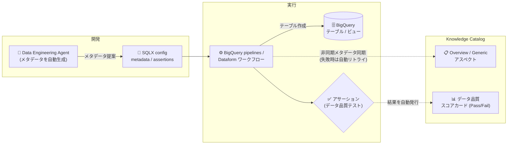

# BigQuery pipelines / Dataform: 自動メタデータエンリッチメントと Knowledge Catalog データ品質スコアカード統合 (GA)

**リリース日**: 2026-10-01

**サービス**: BigQuery (pipelines) / Dataform

**機能**: 自動メタデータエンリッチメントと Knowledge Catalog データ品質スコアカード統合

**ステータス**: GA (一般提供)

📊 [このアップデートのインフォグラフィックを見る](https://takech9203.github.io/google-cloud-news-summary/20261001-bigquery-dataform-metadata-enrichment-knowledge-catalog.html)

## 概要

BigQuery pipelines と Dataform において、自動メタデータエンリッチメント (automated metadata enrichment) と Knowledge Catalog のデータ品質スコアカード (data quality scorecard) 統合が一般提供 (GA) になりました。SQLX ファイルの config ブロックに `metadata` キーでセマンティックメタデータ (Overview や Generic アスペクト) を定義しておくと、パイプラインアクションの正常完了時に Dataform が自動的に Knowledge Catalog へメタデータ同期を開始します。さらに、パイプライン実行時に Dataform アサーション (データ品質テスト) の結果が自動的に Knowledge Catalog に発行され、エントリのデータ品質スコアカードに Pass/Fail ステータスとして反映されます。

加えて、Data Engineering Agent がテーブル構成から Knowledge Catalog 向けメタデータを自動生成し、パイプライン実行時に Knowledge Catalog へ送信できるようになっています。ユーザーの意図やコンテキストに基づき、パイプラインアセットのセマンティックメタデータをプロアクティブに生成することが可能です。

この機能は、データパイプラインのコード (Dataform SQLX) をメタデータとデータ品質の信頼できる情報源 (Source of Truth) として扱う「Governance as Code」を実現するもので、データエンジニアとデータガバナンス担当者の双方にとって、カタログ整備と品質可視化の運用負荷を大きく削減します。

**アップデート前の課題**

- BigQuery の標準的なテクニカルメタデータ (データセット、テーブル、ビューなど) は Knowledge Catalog に自動登録されるものの、ビジネス的な説明文 (Overview) などのセマンティックメタデータはカタログ側で手動管理する必要があった
- Dataform アサーションの結果はパイプライン内で確認する必要があり、Knowledge Catalog 上のデータ品質スコアカードには自動反映されなかった
- 本機能は 2026 年 8 月 13 日に Preview として提供されており、本番環境での利用には GA を待つ必要があった

**アップデート後の改善**

- SQLX の config ブロックに定義したメタデータ (Overview、Generic アスペクト) が、アクションの正常完了時に Knowledge Catalog へ自動同期されるようになった (GA)
- パイプライン実行時に Dataform アサーションの結果が Knowledge Catalog のデータ品質スコアカードへ自動発行され、Pass/Fail ステータスとしてカタログ上で可視化されるようになった (GA)
- Data Engineering Agent がテーブル構成からセマンティックメタデータを自動生成し、パイプライン実行時に Knowledge Catalog に送信できるようになった

## アーキテクチャ図



SQLX config に定義したセマンティックメタデータは、パイプラインアクションの正常完了時に非同期で Knowledge Catalog に同期されます。アサーションの実行結果はデータ品質スコアカードに Pass/Fail として自動発行されます。

## サービスアップデートの詳細

### 主要機能

1. **自動メタデータエンリッチメント**
   - SQLX ファイルの config ブロックの `metadata` キーに、Knowledge Catalog 向けのカスタムメタデータを定義できる
   - サポートされるメタデータ: **Overview** (エントリのドキュメント・サマリーテキスト)、**Generic アスペクト** (テーブルのシステムやタイプ情報などのセマンティック詳細)
   - テーブルアクションの正常完了時に、Dataform が対応する Knowledge Catalog エントリへのメタデータ書き込みを自動的に開始する

2. **Knowledge Catalog データ品質スコアカード統合**
   - パイプライン実行中に、Dataform アサーションの結果が自動的に Knowledge Catalog へ発行される
   - 結果は Knowledge Catalog のデータ品質スコアカードに Pass/Fail ステータスとして反映される
   - 各実行は、以前の Dataform 実行で発行された既存のデータ品質スコアカードを上書きするが、Knowledge Catalog のデータスキャンで作成されたスコアカードには影響しない

3. **SQL 実行から分離された同期設計**
   - **レイテンシ**: 同期は非同期で行われ、BigQuery ジョブは Knowledge Catalog の更新完了を待たない
   - **信頼性**: 同期が失敗した場合 (API レート制限など)、Dataform は自動的にリトライする。メタデータ更新の失敗が Dataform アクションやワークフローの失敗を引き起こすことはない

4. **Data Engineering Agent によるメタデータ生成**
   - エージェントがテーブル構成から Knowledge Catalog メタデータを自動生成し、パイプライン実行時に Knowledge Catalog へ送信できる
   - エージェントはアサーション追加の指示にも対応し、スキーマやサンプルデータから妥当なデータ品質チェックを推論して追加できる

## 技術仕様

### サポートされるメタデータ構成要素

| メタデータ構成要素 | 内容 | 必要な Dataform core バージョン |
|------|------|------|
| Overview | エントリのドキュメントおよびサマリーテキスト | 3.0.37 以降 |
| Generic アスペクト | テーブルのシステム・タイプ情報などのセマンティック詳細 | 3.0.52 以降 |
| データ品質スコアカード | アサーション結果の Pass/Fail ステータス | - (パイプライン実行時に自動発行) |

### SQLX config の記述例

```sqlx
config {
  type: "table",
  metadata: {
    overview: "This table provides standardized trip data.",
    extraProperties: {
      generic: {
        system: "BigQuery",
        type: "table"
      }
    }
  }
}
```

### 必要な IAM ロール (Knowledge Catalog メタデータ管理)

| 用途 | ロール |
|------|------|
| Knowledge Catalog でのメタデータの表示・管理 | Dataplex Catalog Editor (`roles/dataplex.catalogEditor`) をプロジェクトまたは `@bigquery` エントリグループに付与 |
| カスタムサービスアカウントでのパイプライン実行 | 上記に加え BigQuery Job User (`roles/bigquery.jobUser`)、BigQuery Data Editor (`roles/bigquery.dataEditor`) |

## 設定方法

### 前提条件

1. BigQuery pipeline または Dataform ワークフローを作成済みであること
2. プロジェクトで Dataplex API が有効化されていること
3. Dataform core バージョンが要件を満たしていること (Overview: 3.0.37 以降、Generic アスペクト: 3.0.52 以降)
4. 必要な IAM ロール (`roles/dataplex.catalogEditor` など) が付与されていること

### 手順

#### ステップ 1: SQLX config にメタデータを定義

```sqlx
config {
  type: "table",
  description: "Description of the table",
  metadata: {
    overview: "This table provides standardized trip data.",
    extraProperties: {
      generic: {
        system: "BigQuery",
        type: "table"
      }
    }
  }
}
```

テーブル定義 SQLX ファイルの config ブロックに `metadata` キーを追加します。

#### ステップ 2: アサーション (データ品質テスト) を定義

```sqlx
config {
  assertions: {
    uniqueKey: ["id"]
  }
}
```

config ブロック内 (または別の SQLX ファイル) でアサーションを定義すると、パイプライン実行時に結果が Knowledge Catalog のデータ品質スコアカードへ自動発行されます。

#### ステップ 3: パイプラインを実行し、同期状態を確認

アクションの正常完了後、メタデータ同期が自動的に開始されます。同期ステータスは以下で確認できます。

- Dataform ワークフロー: ワークスペース実行ログを確認 ([Inspect workspace execution logs](https://docs.cloud.google.com/dataform/docs/monitor-runs#inspect-workspace-execution-logs))
- BigQuery pipelines: 過去の手動実行を確認 ([View past manual runs](https://docs.cloud.google.com/bigquery/docs/manage-pipelines#view-manual-runs))

同期完了後は、Knowledge Catalog でアセットを検索して、エンリッチされたメタデータを確認できます。

## メリット

### ビジネス面

- **データガバナンスの自動化**: パイプラインコードにメタデータを定義するだけでカタログが自動整備され、ドキュメント管理の属人化や陳腐化を防げる
- **データ品質の可視化**: アサーション結果がカタログ上のスコアカードで Pass/Fail として一目で確認でき、データ利用者がデータの信頼性を判断しやすくなる
- **GA による本番利用**: 一般提供となったことで、本番環境のガバナンスプロセスに組み込める

### 技術面

- **コードとメタデータの一元管理 (Governance as Code)**: SQLX ファイルでテーブル定義・品質テスト・メタデータをまとめて管理でき、Git によるバージョン管理の対象にできる
- **パイプラインへの影響なし**: メタデータ同期は非同期で行われ、同期失敗はワークフローの失敗を引き起こさない。失敗時は自動リトライされる
- **AI による省力化**: Data Engineering Agent がメタデータやデータ品質チェックをプロアクティブに生成するため、手作業での記述を削減できる

## デメリット・制約事項

### 制限事項

- Overview には Dataform core 3.0.37 以降、Generic アスペクトには 3.0.52 以降が必要
- 各パイプライン実行は、以前の Dataform 実行で発行されたデータ品質スコアカードを上書きする (履歴としては保持されない)。ただし Knowledge Catalog データスキャン由来のスコアカードには影響しない
- Knowledge Catalog でのパイプラインメタデータ管理は、Knowledge Catalog のクォータと制限、および料金の対象となる

### 考慮すべき点

- メタデータ同期は非同期のため、アクション完了直後は Knowledge Catalog に反映されていない場合がある。同期ステータスは実行ログで確認する
- カスタムサービスアカウントでパイプラインを実行する場合は、サービスアカウントにも `roles/dataplex.catalogEditor` の付与が必要

## ユースケース

### ユースケース 1: パイプラインコードによるデータカタログの自動整備

**シナリオ**: データエンジニアリングチームが数百のテーブルを Dataform / BigQuery pipelines で管理しており、Knowledge Catalog 上の説明文やビジネスコンテキストが手動更新のため古くなりがちである。

**実装例**:
```sqlx
config {
  type: "table",
  description: "This table joins orders information from OnlineStore & payment information from PaymentApp",
  columns: {
    order_date: "The date when a customer placed their order",
    id: "Order ID as defined by OnlineStore",
    payment_status: "The status of a payment, for example, pending, paid"
  },
  metadata: {
    overview: "This table provides joined orders and payment data.",
    extraProperties: {
      generic: {
        system: "BigQuery",
        type: "table"
      }
    }
  }
}
```

**効果**: パイプラインの実行のたびに最新のメタデータが Knowledge Catalog へ同期され、カタログの説明文とコードの乖離がなくなる。コードレビューを通じてメタデータの品質も担保できる。

### ユースケース 2: データ品質ステータスのカタログ上での可視化

**シナリオ**: データ利用者 (アナリストや AI エージェント) が、テーブルを利用する前にそのデータが品質チェックを通過しているかを確認したい。

**実装例**: Data Engineering Agent に「Add data quality checks for bigquery-public-data.thelook_ecommerce.users」のようにプロンプトし、スキーマとサンプルに基づくアサーションを自動生成。パイプライン実行時に結果が Knowledge Catalog のデータ品質スコアカードへ発行される。

**効果**: データ利用者は Knowledge Catalog のエントリを見るだけで、最新実行のアサーション結果 (Pass/Fail) を確認でき、信頼できるデータかどうかを判断できる。

## 料金

本機能自体の追加料金に関する記載はリリースノートにありませんが、Knowledge Catalog でのパイプラインメタデータ管理は Knowledge Catalog (Dataplex) の料金の対象となります。詳細は以下の料金ページを参照してください。

- [Dataplex (Knowledge Catalog) の料金](https://cloud.google.com/dataplex/pricing)
- [BigQuery の料金](https://cloud.google.com/bigquery/pricing)

## 利用可能リージョン

Knowledge Catalog によるパイプラインのメタデータ管理は、すべての[パイプラインロケーション](https://docs.cloud.google.com/bigquery/docs/locations)で利用できます。

## 関連サービス・機能

- **Knowledge Catalog (Dataplex)**: メタデータの保存・検索・エンリッチメント先。エントリ、アスペクト、データ品質スコアカードを提供する
- **Dataform**: BigQuery pipelines の実行基盤。SQLX によるテーブル定義・アサーション・メタデータの一元管理を提供する
- **Data Engineering Agent (Gemini in BigQuery)**: 自然言語によるパイプライン構築に加え、Knowledge Catalog メタデータの自動生成・送信、データ品質チェックの推論・追加が可能
- **Knowledge Catalog データスキャン**: Dataform アサーションとは独立したデータ品質スコアカードのソース。Dataform 実行による上書きの影響を受けない

## 参考リンク

- 📊 [インフォグラフィック](https://takech9203.github.io/google-cloud-news-summary/20261001-bigquery-dataform-metadata-enrichment-knowledge-catalog.html)
- [公式リリースノート](https://docs.cloud.google.com/release-notes#October_01_2026)
- [Metadata enrichment and data quality scorecard integration (Manage pipelines)](https://docs.cloud.google.com/bigquery/docs/manage-pipelines)
- [Add metadata for Knowledge Catalog (Dataform)](https://docs.cloud.google.com/dataform/docs/create-tables#add-metadata)
- [Knowledge Catalog データ品質スコアカード](https://docs.cloud.google.com/knowledge-catalog/docs/enrich-entries-metadata#data-quality-scorecard)
- [Data Engineering Agent の概要](https://docs.cloud.google.com/gemini/data-agents/data-engineering-agent/agent-overview)
- [料金ページ (Dataplex / Knowledge Catalog)](https://cloud.google.com/dataplex/pricing)

## まとめ

BigQuery pipelines と Dataform の自動メタデータエンリッチメントと Knowledge Catalog データ品質スコアカード統合が GA となり、パイプラインコードを起点にしたメタデータ管理とデータ品質の可視化を本番環境で利用できるようになりました。Dataform / BigQuery pipelines を利用中のチームは、SQLX config への `metadata` キー追加とアサーション定義から始めることで、Knowledge Catalog の整備を自動化できます。Data Engineering Agent を併用すれば、メタデータ記述の省力化も図れます。

---

**タグ**: BigQuery, Dataform, Knowledge Catalog, Dataplex, データガバナンス, データ品質, メタデータ, Data Engineering Agent, GA
