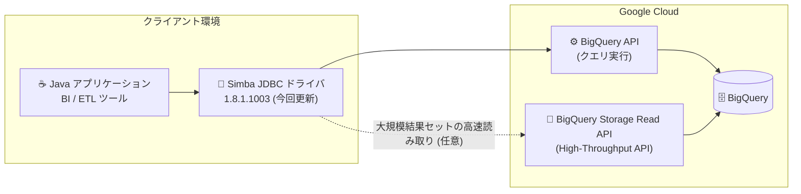

# BigQuery: Simba JDBC ドライバの更新版 (1.8.1.1003) リリース

**リリース日**: 2026-10-01

**サービス**: BigQuery

**機能**: Simba JDBC ドライバ更新 (バージョン 1.8.1.1003)

**ステータス**: リリース済み (Change)

📊 [このアップデートのインフォグラフィックを見る](https://takech9203.github.io/google-cloud-news-summary/20261001-bigquery-simba-jdbc-driver-update.html)

## 概要

BigQuery 用 Simba JDBC ドライバの更新版 (バージョン 1.8.1.1003) が利用可能になりました。Simba JDBC ドライバは、insightsoftware (Google Cloud Ready - BigQuery パートナー) が開発する JDBC ドライバで、Java アプリケーションや BI ツール、ETL ツールなどから標準の JDBC インターフェースで BigQuery に接続するために広く利用されています。

公式ドキュメントのダウンロードページは 1.8.1.1003 を現行バージョンとして案内しており、従来の 1.8.0.1001 は「以前のバージョン」の一覧に移動しました。1.8.1.1003 に同梱されるリリースノート (release-notes_1.8.1.1003.txt) には 1.8.1 固有の変更点を記載した個別セクションはなく、最新の変更履歴は 1.8.0 系の内容 (Analytics Hub リンクされたデータセットのエラー修正、デフォルト OAuth クライアント ID / シークレットの更新、PCNT テーブルのメタデータ対応、Default Dataset 区切り文字の変更など) です。ただし、同梱サードパーティライブラリの記載は 1.8.0.1001 のリリースノートから更新されており、Jackson 系が 2.21.6、google-cloud-bigquerystorage が 3.33.0 と記載されています。

1.7.x 以前から直接アップグレードする場合は、1.8.0 で導入された破壊的変更 (OAuth クライアントの更新、Default Dataset の区切り文字変更) の影響を受けるため、設定の見直しが必要です。

**アップデート前の課題**

- 現行版として案内されていた 1.8.0.1001 では、リリースノート上の同梱ライブラリが Jackson 2.21.5 系 / google-cloud-bigquerystorage 3.20.0 と記載されていた
- 1.7.x 以前のバージョンを利用している場合、Analytics Hub のリンクされたデータセットを `getTables` で取得するとエラーが発生する可能性があった
- 1.7.x 以前のバージョンでは PCNT テーブルに対するメタデータ呼び出し (`getSchemas`、`getTables` など) に対応していなかった

**アップデート後の改善**

- 公式ドキュメントが案内する現行バージョンが 1.8.1.1003 に更新され、最新のメンテナンスビルドを取得できるようになった
- リリースノート上の同梱ライブラリ記載が Jackson 2.21.6 系、google-cloud-bigquerystorage 3.33.0 に更新された
- 1.7.x 以前からのアップグレードでは、1.8.0 系の修正 (Analytics Hub リンクされたデータセットのエラー修正、PCNT テーブルのメタデータ対応など) をあわせて取り込める

## アーキテクチャ図



Java アプリケーションは Simba JDBC ドライバ経由で BigQuery API に接続し、オプションで Storage Read API (High-Throughput API) による大規模結果セットの高速読み取りが可能です。今回、公式ドキュメントが案内する現行ドライバが 1.8.1.1003 に更新されました。

## サービスアップデートの詳細

### 主要な変更点

1. **現行バージョンが 1.8.1.1003 に更新**
   - 公式ドキュメントのダウンロードリンクが 1.8.1.1003 に差し替えられ、1.8.0.1001 は「以前のバージョン」一覧に移動
   - インストール / 構成ガイド (PDF) も 1.8.1.1003 版が公開

2. **リリースノート上の同梱ライブラリ記載の更新**
   - jackson-core / jackson-databind / jackson-datatype-jsr310: 2.21.6 (1.8.0.1001 のリリースノートでは 2.21.5)
   - jackson-annotations: 2.21
   - google-cloud-bigquerystorage: 3.33.0 (従来記載: 3.20.0)

3. **1.8.1 固有の機能追加の記載はなし**
   - release-notes_1.8.1.1003.txt の最新セクションは 1.8.0 (Released 2026-08-23) であり、1.8.1 固有の「Enhancements & New Features」「Resolved Issues」セクションは記載されていない

### 1.8.0 系で導入された主な変更 (1.7.x 以前からのアップグレード時に関係)

1. **デフォルト OAuth クライアント ID / シークレットの更新 (GBQJ-915)**
   - ユーザーアカウント認証 (User Account Authentication) を使用している場合、アップグレード後に新しいリフレッシュトークンの再生成が必要

2. **Default Dataset の区切り文字変更 (GBQJ-951)**
   - 区切り文字が `.` から `:` に変更。サポートされる形式は `project:dataset`、および PCNT 環境向けの `project:dataset.namespace`
   - Default Dataset を使用している場合は設定の更新が必要

3. **PCNT テーブルのメタデータサポート (GBQJ-949)**
   - `getSchemas` や `getTables` などのメタデータ呼び出しで PCNT テーブルが表示されるようになった

4. **Analytics Hub リンクされたデータセットのエラー修正 (GBQJ-911)**
   - Analytics Hub の共有データセットを `getTables` で取得した際にエラーが発生する問題を解消

## 技術仕様

### ドライバ情報

| 項目 | 詳細 |
|------|------|
| 最新バージョン | 1.8.1.1003 |
| Google Cloud リリースノート掲載日 | 2026-10-01 |
| 対応 Java プラットフォーム | JRE 8、11、21 |
| JDBC 仕様 | JDBC 4.2 互換 |
| 開発元 | insightsoftware (Google Cloud Ready - BigQuery パートナー) |
| 前バージョン | 1.8.0.1001 |
| ダウンロード | [SimbaJDBCDriverforGoogleBigQuery42_1.8.1.1003.zip](https://storage.googleapis.com/simba-bq-release/jdbc/SimbaJDBCDriverforGoogleBigQuery42_1.8.1.1003.zip) |

### High-Throughput API (Storage Read API) 利用時に必要なロール

大規模な結果セットを標準の BigQuery API ではなく Storage Read API で読み取る場合、以下のロールが必要です。

| 項目 | 詳細 |
|------|------|
| 必要な IAM ロール | BigQuery Read Session User (`roles/bigquery.readSessionUser`) |
| 主な必要権限 | `bigquery.readsessions.create` / `bigquery.readsessions.getData` / `bigquery.readsessions.update` |

## 設定方法

### 前提条件

1. JRE 8、11、または 21 の実行環境
2. BigQuery へのアクセス権限 (High-Throughput API を使用する場合は `roles/bigquery.readSessionUser`)

### 手順

#### ステップ 1: ドライバのダウンロード

```bash
curl -O https://storage.googleapis.com/simba-bq-release/jdbc/SimbaJDBCDriverforGoogleBigQuery42_1.8.1.1003.zip
```

insightsoftware のインストール / 構成ガイド (1.8.1.1003 版) の手順に従ってセットアップします。

#### ステップ 2: アップグレード時の設定確認 (1.7.x 以前からの場合)

```text
# ユーザーアカウント認証を使用している場合
→ 新しいリフレッシュトークンを再生成する (1.8.0 の OAuth Client ID / Secret 更新のため)

# Default Dataset を設定している場合
→ 区切り文字を `.` から `:` に変更する
   例: myproject:mydataset (PCNT 環境では myproject:mydataset.namespace)
```

1.8.0.1001 からのアップグレードであれば上記の破壊的変更は適用済みのため、JAR の差し替えと接続テスト・メタデータ取得の回帰確認を行います。

## メリット

### ビジネス面

- **サポートされる最新ビルドの利用**: 公式ドキュメントが案内する現行バージョンを利用することで、Cloud Customer Care を通じたサポートを受けやすい状態を維持できる
- **依存ライブラリの最新化**: リリースノート記載の Jackson 2.21.6 系 / google-cloud-bigquerystorage 3.33.0 により、依存関係の脆弱性管理・コンプライアンス対応の観点で最新状態を維持できる

### 技術面

- **メンテナンスビルドの適用**: 機能面の挙動変更を伴わずにビルドを最新化できる (1.8.1 固有の機能変更はリリースノートに記載されていない)
- **1.7.x 以前からの一括更新**: Analytics Hub リンクされたデータセットのエラー修正や PCNT テーブルのメタデータ対応など、1.8.0 系の修正をまとめて取り込める

## デメリット・制約事項

### 破壊的変更 (1.7.x 以前からのアップグレード時の注意)

- ユーザーアカウント認証を利用している場合、リフレッシュトークンの再生成が必要 (GBQJ-915)
- Default Dataset の区切り文字が `.` から `:` に変更されたため、既存の Default Dataset 設定の更新が必要 (GBQJ-951)

### Simba ドライバ共通の制限事項

- BigQuery のロード機能・エクスポート機能はサポートされない
- クエリプレフィックスはサポートされない (SQL 方言は `QueryDialect` 接続プロパティで指定)
- DML の制限事項がすべて適用される
- パラメータ化クエリはクエリ検証のみでパフォーマンスには影響しない
- BigQuery 専用であり、他のプロダクトには使用できない

### 既知の問題 (抜粋)

- カタログ関数の結果が適切にソートされない (GBQJ-788)
- Workforce / Workload Identity Federation の executable-sourced credentials は未サポート (GBQJ-594)
- 同一 LogPath で複数接続を LogLevel=6 に設定するとコネクタが異常終了する場合がある

## ユースケース

### ユースケース 1: 既存 Java アプリケーションのドライバ更新

**シナリオ**: Simba JDBC ドライバ 1.8.0.1001 を利用中の Java アプリケーションを 1.8.1.1003 に更新し、最新のメンテナンスビルドと依存ライブラリ更新を取り込む。

**実装例**:
```text
1. 1.8.1.1003 の zip を取得しクラスパスのドライバ JAR を差し替え
2. 接続テスト・メタデータ取得 (getTables 等) の回帰確認
```

**効果**: 公式ドキュメントが案内する現行バージョンに追随し、依存ライブラリを含めて最新状態を維持できる。

### ユースケース 2: 1.7.x 以前からのまとめてアップグレード

**シナリオ**: 1.7.0.1001 以前のドライバを利用中の BI / ETL 環境を 1.8.1.1003 にアップグレードし、1.8.0 系の修正 (Analytics Hub 対応、PCNT メタデータ対応) もあわせて適用する。

**効果**: Analytics Hub 経由の共有データセットのメタデータ取得が安定し、PCNT テーブルもツールのカタログから参照できるようになる。ただし OAuth クライアント更新と Default Dataset 区切り文字変更への対応が必要。

## 料金

Simba JDBC ドライバ自体は無償でダウンロードできます (サブライセンスや OEM 再配布には別途ライセンスが必要な場合があります)。ドライバ利用時には以下の BigQuery 料金が適用されます。

| 項目 | 適用される料金 |
|------|-----------------|
| クエリ実行 | BigQuery コンピューティング料金 |
| 大規模結果セットの宛先テーブル書き込み (設定時) | BigQuery ストレージ料金 |
| High-Throughput API による読み取り | BigQuery Storage Read API 料金 |

詳細は [BigQuery の料金ページ](https://cloud.google.com/bigquery/pricing) を参照してください。

## 関連サービス・機能

- **Google 開発の JDBC / ODBC ドライバ**: Simba ドライバの代替として、Google が開発した [JDBC ドライバ](https://docs.cloud.google.com/bigquery/docs/jdbc-for-bigquery) / [ODBC ドライバ](https://docs.cloud.google.com/bigquery/docs/odbc-for-bigquery) の利用も公式に案内されている
- **BigQuery Storage Read API**: ドライバの High-Throughput API 機能で使用され、大規模結果セットの高速読み取りを実現する
- **Analytics Hub**: 組織間のデータセット共有サービス。1.8.0 系の修正でリンクされたデータセットのメタデータ取得が安定した
- **Simba ODBC ドライバ for BigQuery**: 非 Java アプリケーション向けの姉妹ドライバ

## 参考リンク

- 📊 [インフォグラフィック](https://takech9203.github.io/google-cloud-news-summary/20261001-bigquery-simba-jdbc-driver-update.html)
- [公式リリースノート (2026-10-01)](https://docs.cloud.google.com/release-notes#October_01_2026)
- [Simba ODBC / JDBC ドライバのドキュメント](https://docs.cloud.google.com/bigquery/docs/reference/odbc-jdbc-drivers#current_jdbc_driver)
- [Simba Google BigQuery JDBC Data Connector Release Notes (1.8.1.1003)](https://storage.googleapis.com/simba-bq-release/jdbc/release-notes_1.8.1.1003.txt)
- [ドライバダウンロード (1.8.1.1003)](https://storage.googleapis.com/simba-bq-release/jdbc/SimbaJDBCDriverforGoogleBigQuery42_1.8.1.1003.zip)
- [インストール / 構成ガイド (1.8.1.1003)](https://storage.googleapis.com/simba-bq-release/jdbc/Simba%20Google%20BigQuery%20JDBC%20Connector%20Install%20and%20Configuration%20Guide_1.8.1.1003.pdf)
- [料金ページ (BigQuery)](https://cloud.google.com/bigquery/pricing)

## まとめ

Simba JDBC ドライバ 1.8.1.1003 は、公式ドキュメントが案内する現行バージョンを更新するメンテナンスリリースで、リリースノート上は 1.8.1 固有の機能変更は記載されておらず、同梱ライブラリの記載更新 (Jackson 2.21.6 系、google-cloud-bigquerystorage 3.33.0) が主な差分です。1.8.0.1001 利用中であれば JAR 差し替えと回帰確認で更新でき、1.7.x 以前からのアップグレードでは OAuth クライアント更新と Default Dataset 区切り文字変更という破壊的変更への対応を計画したうえで適用することを推奨します。

---

**タグ**: #BigQuery #JDBC #SimbaDriver #insightsoftware #DataAnalytics
