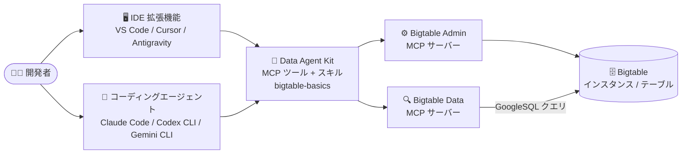

# Bigtable: Google Cloud Data Agent Kit による Bigtable 操作が GA

**リリース日**: 2026-10-01

**サービス**: Bigtable

**機能**: Google Cloud Data Agent Kit による Bigtable のブラウズ・スキーマ設計・GoogleSQL クエリ実行

**ステータス**: GA (一般提供)

📊 [このアップデートのインフォグラフィックを見る](https://takech9203.github.io/google-cloud-news-summary/20261001-bigtable-data-agent-kit-ga.html)

## 概要

Google Cloud Data Agent Kit が GA (一般提供) となり、Bigtable が正式にサポートされました。Data Agent Kit を使用すると、IDE やコーディングエージェントから Bigtable のインスタンスやテーブルの参照、スキーマ設計、GoogleSQL クエリの実行が可能になります。Google Cloud コンソール、コマンドラインツール、IDE の間でコンテキストを切り替えることなく、開発環境内でデータワークロードのライフサイクル全体を管理できます。

Data Agent Kit は 2 つのインターフェースを提供します。1 つは VS Code および VS Code 互換 IDE 向けの IDE 拡張機能で、データアセットとデータワークロードの統合ビューを IDE 内に提供します。もう 1 つはコーディングエージェント向けのプラグインで、Antigravity CLI、Claude Code、Codex CLI、Gemini CLI などのエージェントから自然言語プロンプトで Google Cloud のデータを操作できます。対象ユーザーはデータエンジニア、データサイエンティスト、データアプリケーション開発者です。

Bigtable 固有の機能として、新しい `bigtable-basics` スキルが提供されます。このスキルは読み取りパターンに基づいて行キーを設計し、テーブル作成前にホットスポットやフルスキャンのリスクを警告します。また、Bigtable リモート MCP サーバー (管理用の Admin MCP サーバーとクエリ用の Data MCP サーバー) を通じて、エージェントがインスタンス・テーブルの管理やデータのクエリを実行できます。

**アップデート前の課題**

- コーディングエージェントは SQL の記述は得意でも、どのテーブルが存在するか、スキーマがどうなっているかといった環境コンテキストを持たず、Bigtable のリソース確認には Google Cloud コンソールや cbt CLI への切り替えが必要だった
- Bigtable の行キー設計はホットスポット回避などの専門知識が必要で、ベストプラクティスの適用は開発者のスキルに依存していた
- GA 以前の Data Agent Kit では Bigtable はフルサポートの対象外だった (Spanner、AlloyDB、Cloud SQL などが先行対応)

**アップデート後の改善**

- IDE やコーディングエージェントから Bigtable のインスタンス・テーブルを直接参照し、GoogleSQL クエリを実行できるようになった
- `bigtable-basics` スキルにより、読み取りパターンに基づく行キー設計と、作成前のホットスポット・フルスキャン警告が自動化された
- サインインしてサービスを選択するだけで、必要な API の有効化、スキルのインストール、MCP サーバーの設定が自動化され、手動の設定ファイル編集が不要になった

## アーキテクチャ図



開発者は IDE 拡張機能またはコーディングエージェントのプラグインとして Data Agent Kit を利用し、Bigtable のリモート MCP サーバー (Admin / Data) 経由でインスタンス・テーブルの管理と GoogleSQL クエリを実行します。

## サービスアップデートの詳細

### 主要機能

1. **Bigtable インスタンス・テーブルのブラウズ**
   - IDE 内のカタログからインスタンスやテーブルを参照でき、Google Cloud コンソールへの切り替えが不要
   - Bigtable リモート MCP サーバーは Bigtable API を有効にすると利用可能になり、Admin MCP サーバーで管理タスク、Data MCP サーバーでデータのクエリを実行

2. **スキーマ設計支援 (`bigtable-basics` スキル)**
   - 読み取りパターンに基づいて行キーを設計
   - テーブル作成前にホットスポットやフルスキャンのリスクを警告
   - スキルは Google 製のベストプラクティス指示書としてオープンソースで公開 (GitHub: GoogleCloudPlatform/data-agent-kit-plugin)

3. **GoogleSQL クエリの実行**
   - IDE 拡張機能の統合 SQL エディタから Bigtable に対して SQL クエリを直接実行
   - コーディングエージェント利用時は、自然言語プロンプトから SQL クエリの生成・実行が可能
   - 対応データソースは BigQuery、Bigtable、Spanner、AlloyDB for PostgreSQL、Cloud SQL for MySQL / PostgreSQL

4. **セットアップの自動化 (GA での改善)**
   - サインインしてサービスを選択するだけで、API 有効化・スキルインストール・MCP サーバー設定が自動化
   - Cloud Shell と Cloud Workstations にはプリインストール済み

## 技術仕様

### 対応環境

| 項目 | 詳細 |
|------|------|
| IDE 拡張機能 | VS Code、Antigravity IDE、Cursor、その他 VS Code 互換 IDE (Visual Studio Marketplace / Open VSX から入手) |
| コーディングエージェントプラグイン | Antigravity CLI / Antigravity 2.0、Claude Code、Codex CLI、Gemini CLI |
| プリインストール環境 | Cloud Shell、Cloud Workstations |
| Bigtable で可能な操作 | インスタンス・テーブルのブラウズ、スキーマ設計、GoogleSQL クエリ実行 |
| MCP サーバー | Bigtable Admin MCP サーバー (管理)、Bigtable Data MCP サーバー (クエリ)。Bigtable API の有効化で利用可能 |
| MCP プロトコル | MCP version 2026-07-28 (ステートレス、HTTP ヘッダーベースのルーティング) |

### 必要な IAM ロール

| ロール | 用途 |
|------|------|
| `roles/mcp.toolUser` (MCP Tool User) | IDE から Google Cloud リモート MCP サーバーへアクセスするために必要 |
| サービス固有のロール | アクセスするリソースに応じて追加のロールが必要 (各サービスのガイドを参照) |

エージェントはユーザー本人またはサービスアカウントの権限で接続するため、行レベル・列レベルのセキュリティが自動的に適用されます。認証にはサービスアカウントの impersonation (権限借用) が推奨されています。

## 設定方法

### 前提条件

1. Google Cloud プロジェクトと Bigtable API の有効化
2. `roles/mcp.toolUser` などの必要な IAM ロールの付与
3. Data Agent Kit のインストールと設定

### 手順

#### ステップ 1: Data Agent Kit のインストール

```bash
# Claude Code の場合
claude plugin install data-agent-kit-starter-pack@claude-plugins-official

# Antigravity CLI の場合
agy plugin install https://github.com/GoogleCloudPlatform/data-agent-kit-plugin

# Codex CLI の場合
codex plugin marketplace add GoogleCloudPlatform/data-agent-kit-plugin
codex plugin add dak@dak-marketplace
```

VS Code / Cursor などの IDE では、拡張機能パネルで「Data Agent Kit」を検索してインストールします。Cloud Shell と Cloud Workstations にはプリインストールされています。

#### ステップ 2: MCP サーバーの設定 (IDE 拡張機能の場合)

1. アクティビティバーの Google Cloud Data Agent Kit アイコンをクリック
2. **Settings** を展開して **Settings** をクリック
3. **Service integrations** をクリック
4. 接続したいサービス (Bigtable など) を選択

サービスを選択すると、必要な API の有効化、スキルのインストール、MCP サーバーの設定が自動的に行われます。

#### ステップ 3: Bigtable のブラウズとクエリ実行

IDE のカタログから Bigtable のインスタンス・テーブルを参照し、SQL エディタで GoogleSQL クエリを実行します。コーディングエージェントの場合は、自然言語プロンプトでスキーマ設計やクエリ実行を依頼できます。

## メリット

### ビジネス面

- **開発生産性の向上**: コンソール・CLI・IDE 間のコンテキストスイッチが不要になり、データワークロードの開発からデプロイまでを単一環境で完結できる
- **追加コストなし**: Data Agent Kit 自体は無料で、エージェントが利用する Google Cloud サービスの標準料金のみが発生する
- **ベストプラクティスの標準化**: Google 製スキルにより、行キー設計などの専門知識が組織内で均質に適用される

### 技術面

- **ホットスポットの事前回避**: `bigtable-basics` スキルがテーブル作成前にホットスポットやフルスキャンのリスクを警告し、設計品質を向上させる
- **既存のセキュリティ制御の継承**: エージェントはユーザーまたはサービスアカウントの IAM 権限で接続するため、既存のアクセス制御がそのまま適用される。Model Armor、VPC Service Controls、Principal Access Boundary によるガバナンスも可能
- **マルチエージェント対応**: Claude Code、Codex CLI、Gemini CLI、Antigravity など、チームが利用している多様なコーディングエージェントで同一のツール・スキルを利用できる

## デメリット・制約事項

### 制限事項

- Google Cloud データベース連携において、AlloyDB は IAM データベース認証のみサポート、Cloud SQL は IAM 認証と組み込みデータベース認証の両方をサポート (Data Agent Kit 全体の制限)
- データエンジニアリングパイプラインのオーケストレーション自動デプロイは GitHub Actions のみ対応

### 考慮すべき点

- MCP サーバーの利用には `roles/mcp.toolUser` ロールの付与が必要で、既存の IAM 設計への組み込みを検討する必要がある
- エージェントがユーザー権限で Bigtable を操作するため、最小権限の原則に基づくロール設計とサービスアカウント impersonation の採用が推奨される
- エージェントによるクエリ実行は Bigtable 側のノード使用量などの標準料金が発生するため、コストへの影響を考慮する

## ユースケース

### ユースケース 1: コーディングエージェントによる Bigtable スキーマ設計

**シナリオ**: 新規アプリケーションの時系列データ格納用に Bigtable テーブルを設計する。開発者は Claude Code 上で読み取りパターンを説明し、エージェントに行キー設計を依頼する。

**実装例**:
```
# Claude Code にプラグインをインストール
claude plugin install data-agent-kit-starter-pack@claude-plugins-official

# 自然言語で依頼
「デバイス ID と時刻で最新データを読み取る時系列テーブルを Bigtable に設計して」
```

**効果**: `bigtable-basics` スキルが読み取りパターンに基づく行キーを提案し、タイムスタンプ先頭キーによるホットスポットなどのアンチパターンを作成前に警告するため、本番運用後のパフォーマンス問題を未然に防げる。

### ユースケース 2: IDE からの Bigtable データ探索とクエリ開発

**シナリオ**: データエンジニアが VS Code 内で Bigtable のテーブル構造を確認しながら、GoogleSQL クエリを開発・テストする。

**効果**: Google Cloud コンソールや cbt CLI への切り替えが不要になり、IDE のカタログビューと SQL エディタでデータ探索からクエリ検証までを完結できる。

## 料金

Data Agent Kit は無料で提供され、追加コストは発生しません。エージェントが利用する Google Cloud サービス (Bigtable のノード・ストレージなど) の標準料金のみが発生します。スキルにはパーティションキーの確認や BigQuery のドライランなど、コストを意識したクエリへ誘導する仕組みが組み込まれています。

- [Bigtable の料金](https://cloud.google.com/bigtable/pricing)

## 利用可能リージョン

Data Agent Kit は IDE 拡張機能およびコーディングエージェントプラグインとして提供されるため、リージョン固有の制約は Release Notes およびドキュメントに記載されていません。接続先の Bigtable インスタンスは各リージョンの提供状況に従います。

## 関連サービス・機能

- **Bigtable リモート MCP サーバー**: Data Agent Kit が利用する基盤。Admin MCP サーバーで管理タスク、Data MCP サーバーでクエリを実行。Gemini CLI、ChatGPT、Claude などの AI アプリケーションからも直接利用可能
- **BigQuery / Spanner / AlloyDB / Cloud SQL / Cloud Storage**: Data Agent Kit が対応する他の Google Data Cloud サービス。15 以上のサービスに単一のインターフェースで接続可能
- **Knowledge Catalog**: Data Agent Kit のコンテキスト検索で信頼されるテーブルの発見に利用
- **Cloud Workstations / Cloud Shell**: Data Agent Kit がプリインストールされている開発環境
- **IAM / VPC Service Controls / Model Armor**: エージェントによるデータアクセスのガバナンスを担うセキュリティサービス

## 参考リンク

- 📊 [インフォグラフィック](https://takech9203.github.io/google-cloud-news-summary/20261001-bigtable-data-agent-kit-ga.html)
- [公式リリースノート](https://docs.cloud.google.com/release-notes#October_01_2026)
- [Google Cloud Blog: Data Agent Kit is now GA: Bring Google Data Cloud to any coding agent](https://cloud.google.com/blog/topics/developers-practitioners/data-agent-kit-is-now-ga-bring-google-data-cloud-to-any-coding-agent)
- [Data Agent Kit overview](https://docs.cloud.google.com/data-agent-kit/overview)
- [Install Data Agent Kit](https://docs.cloud.google.com/data-agent-kit/install)
- [Use the Bigtable remote MCP server](https://docs.cloud.google.com/bigtable/docs/use-bigtable-mcp)
- [Data Agent Kit plugin GitHub repository](https://github.com/GoogleCloudPlatform/data-agent-kit-plugin)
- [Bigtable の料金](https://cloud.google.com/bigtable/pricing)

## まとめ

Data Agent Kit の GA により、Bigtable のブラウズ・スキーマ設計・GoogleSQL クエリ実行が IDE やコーディングエージェントから直接行えるようになり、エージェント主導のデータ開発ワークフローに Bigtable が本格的に組み込まれました。`bigtable-basics` スキルによる行キー設計支援はホットスポットの事前回避に有効であり、Bigtable を利用するチームは無料で導入できる本機能を開発環境に取り入れることを推奨します。導入時は `roles/mcp.toolUser` の付与とサービスアカウント impersonation を含む IAM 設計の確認から始めるとよいでしょう。

---

**タグ**: Bigtable, Data Agent Kit, MCP, GoogleSQL, コーディングエージェント, IDE, GA, データベース, AI エージェント
