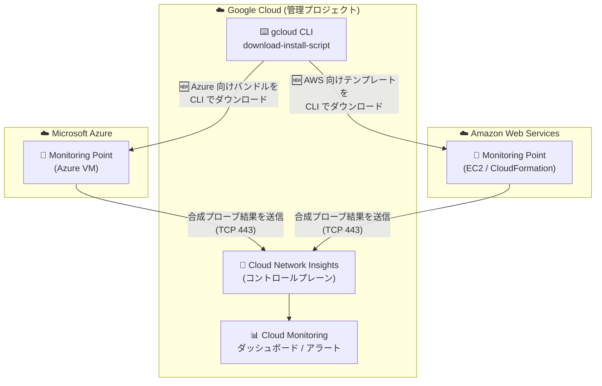

# Network Intelligence Center: Cloud Network Insights が AWS / Azure 向け Monitoring Point インストールバンドルの gcloud CLI ダウンロードに対応

**リリース日**: 2026-10-01

**サービス**: Network Intelligence Center (Cloud Network Insights)

**機能**: Google Cloud CLI による Microsoft Azure / AWS 向け Monitoring Point インストールバンドルのダウンロード

**ステータス**: Feature

📊 [このアップデートのインフォグラフィックを見る](https://takech9203.github.io/google-cloud-news-summary/20261001-cloud-network-insights-aws-azure-monitoring-point-cli.html)

## 概要

Network Intelligence Center の Cloud Network Insights において、Google Cloud CLI (gcloud) コマンドを使って Microsoft Azure および Amazon Web Services (AWS) 向けの Monitoring Point インストールバンドルをダウンロードできるようになりました。

Cloud Network Insights は、AppNeta by Broadcom とのパートナーシップで提供されるネットワーク可観測性機能で、マルチクラウド・ハイブリッド環境におけるネットワーク健全性とアプリケーションパフォーマンスの可視化を実現します。Monitoring Point は、アクティブな合成プローブ (synthetic probing) を実行する軽量ソフトウェアエージェントで、ユーザートラフィックが存在しない場合でもネットワーク経路を監視できます。

今回のアップデートにより、Azure VM や AWS EC2 に Monitoring Point を展開する際のインストールバンドル (Azure 向けインストールバンドル、AWS 向け CloudFormation プロビジョニングテンプレート) の取得を、Google Cloud コンソールだけでなく gcloud コマンドでも実行できるようになり、スクリプト化・自動化が容易になりました。マルチクラウド環境のネットワーク監視を運用するネットワークチーム・SRE チームが対象ユーザーです。

**アップデート前の課題**

- Azure / AWS 向け Monitoring Point のインストールバンドル取得は、Google Cloud コンソールからのローカルダウンロード、またはコンソールで生成したトークン付き curl コマンド (有効期間 1 時間) をターゲットホストで実行する方法に限られていた
- gcloud によるダウンロードは Google Cloud (Compute Engine VM) やコンテナ (Docker/Podman、Helm) 向けなどで提供されており、Azure / AWS 向けは CLI ベースのワークフローに組み込みにくかった

**アップデート後の改善**

- gcloud CLI がインストールされたホストから、Azure / AWS 向け Monitoring Point のインストールバンドルを直接ダウンロードできるようになった
- コンソール操作やトークン生成を介さずにバンドルを取得できるため、マルチクラウド環境への Monitoring Point 展開をスクリプトや CI/CD パイプラインで自動化しやすくなった
- Google Cloud、コンテナ、VM (VMware/KVM)、Azure、AWS の各プラットフォームで、gcloud による一貫したダウンロード手順が利用可能になった

## アーキテクチャ図



Cloud Network Insights の管理プロジェクトから gcloud CLI で Azure / AWS 向けの Monitoring Point インストールバンドルをダウンロードし、各クラウドに展開した Monitoring Point が合成プローブの結果をコントロールプレーンへ送信するマルチクラウド監視構成です。

## サービスアップデートの詳細

### 主要機能

1. **gcloud による Azure / AWS 向けインストールバンドルのダウンロード**
   - `gcloud network-management network-monitoring-providers monitoring-points download-install-script` コマンドで Monitoring Point のインストールバンドルを取得可能
   - Google Cloud コンソールの「Add Monitoring Point」フローで「Download with gcloud」を選択すると、実行すべき gcloud コマンドを自動生成できる

2. **既存のダウンロード方法との併用**
   - 従来どおり、コンソールからのローカルダウンロードや、トークン付き curl コマンド (有効期間 1 時間) をターゲットホストで実行する方法も利用可能
   - 環境や運用フローに応じてダウンロード方法を選択できる

3. **マルチクラウド Monitoring Point 展開の一貫性**
   - Azure は AppNeta の手順 (Bicep など) で Azure VM Monitoring Point として展開
   - AWS は CloudFormation プロビジョニングテンプレート、または Quick-Create Link で EC2 Monitoring Point として展開
   - インストール後 2〜5 分で Google Cloud コンソールの Monitoring Point 一覧に「Active」ステータスで表示される

## 技術仕様

### Monitoring Point の概要

| 項目 | 詳細 |
|------|------|
| 提供形態 | AppNeta by Broadcom とのパートナーシップによる提供 |
| 監視方式 | アクティブ合成プローブ (ユーザートラフィック不要) |
| 対応プラットフォーム | Google Cloud (Compute Engine)、Docker/Podman、Kubernetes (Helm)、VMware (OVA)、KVM (QCOW2)、Microsoft Azure、Amazon EC2 |
| Azure 展開方式 | インストールバンドルをダウンロードし、AppNeta の手順 (Bicep) で展開 |
| AWS 展開方式 | CloudFormation プロビジョニングテンプレート、または Quick-Create Link |
| 必要な IAM ロール | Cloud Network Insights Editor (`roles/networkmanagement.CloudNetworkInsightsEditor`) |

### ファイアウォール要件 (Monitoring Point のアウトバウンド通信)

| プロトコル | ポート | 用途 |
|------|------|------|
| TCP | 443 (HTTPS) | 必須。Cloud Network Insights コントロールプレーンへの接続 |
| UDP | 123 (NTP) | 必須。時刻同期 (未同期の場合は接続に失敗) |
| UDP/TCP | 53 (DNS) | 必須。Cloud Network Insights エンドポイントの名前解決 |
| UDP | 3239, 33434 | テストトラフィック。標準の Network Path 監視 (dual-ended) に必要 |
| ICMP | Type 8 (echo request) | テストトラフィック。single-ended パス (例: 8.8.8.8 への ping) に必要 |

## 設定方法

### 前提条件

1. Cloud Network Insights を有効化したプロジェクトがあること
2. プロジェクトに対して Cloud Network Insights Editor (`roles/networkmanagement.CloudNetworkInsightsEditor`) ロールが付与されていること
3. ターゲットホストに Google Cloud CLI がインストールされていること (gcloud でダウンロードする場合)
4. Monitoring Point からのアウトバウンド通信 (上記ファイアウォール要件) が許可されていること

### 手順

#### ステップ 1: gcloud コマンドでインストールバンドルをダウンロード

```bash
gcloud network-management network-monitoring-providers \
  monitoring-points download-install-script \
  --project="PROJECT_NAME" \
  --network-monitoring-provider="PROVIDER_NAME" \
  --location="global" \
  --monitoring-point-type="MP_TYPE" \
  --hostname="HOST_NAME" \
  --output-file="OUTPUT_FILE"
```

- `PROJECT_NAME`: Cloud Network Insights を有効化したプロジェクト名
- `PROVIDER_NAME`: プロバイダー名 (デフォルトは `external`)
- `MP_TYPE`: Monitoring Point のタイプ (プラットフォームに応じて指定)
- `HOST_NAME`: Monitoring Point をインストールするホスト名
- `OUTPUT_FILE`: 出力するインストールパッケージのファイル名

Google Cloud コンソールの「Add Monitoring Point」で Platform Type に Azure または AWS を選択し、「Download with gcloud」を選ぶと、環境に合わせたコマンドを生成できます。

#### ステップ 2: Monitoring Point のインストール

ダウンロードしたバンドルをターゲットホストに配置し、AppNeta のドキュメントに従って Monitoring Point をインストールします。

- Azure: Azure VM Cloud Monitoring Point として展開
- AWS: CloudFormation スタックを作成して EC2 Monitoring Point を展開

#### ステップ 3: インストールの確認

Google Cloud コンソールで「Network Intelligence Center > Cloud Network Insights」に移動し、2〜5 分後に Monitoring Point が「Active」ステータスで表示されることを確認します。その後、[モニタリングポリシーを作成](https://docs.cloud.google.com/network-intelligence-center/docs/cloud-network-insights/configure-policies)して監視データの収集を開始します。

## メリット

### ビジネス面

- **マルチクラウド監視の展開効率化**: Azure / AWS への Monitoring Point 展開を CLI で完結でき、監視基盤の立ち上げにかかる作業時間を短縮できる
- **運用の標準化**: Google Cloud、Azure、AWS を含む全プラットフォームで一貫したダウンロード手順を採用でき、運用手順書やオンボーディングを簡素化できる

### 技術面

- **自動化・スクリプト化が容易**: gcloud コマンドベースのため、シェルスクリプトや CI/CD パイプラインに組み込める
- **コンソール操作への依存を低減**: トークン生成 (有効期間 1 時間) や手動ダウンロード・ファイル転送の手順を省略できる

## デメリット・制約事項

### 制限事項

- gcloud でのダウンロードには、ターゲットホスト (または作業ホスト) に Google Cloud CLI がインストールされている必要がある
- Monitoring Point の削除は Google Cloud コンソールではなく AppNeta 側で行う必要がある
- Monitoring Point はアウトバウンドのインターネットアクセス (TCP 443、UDP 123、DNS など) が必須

### 考慮すべき点

- Monitoring Point は Cloud Network Insights を有効化したプロジェクト上や、監視対象のワークロード上に直接インストールすることは推奨されていない (中央 VPC、リモート拠点、特定クラウドリージョンなどの重要なネットワークセグメントへの配置が推奨)
- ファイアウォールの背後に設置する場合は、ファイアウォールルールの変更が必要になる場合がある
- インストール後 10 分以内に Monitoring Point が表示されない場合はトラブルシューティングガイドの確認が必要

## ユースケース

### ユースケース 1: マルチクラウド環境のネットワーク監視基盤を IaC で構築

**シナリオ**: Google Cloud、AWS、Azure にまたがるアプリケーションを運用しており、クラウド間のネットワーク品質 (レイテンシ、パケットロス) を常時監視したい。監視基盤の構築はスクリプトで自動化したい。

**実装例**:
```bash
# Azure 向け Monitoring Point のバンドルを gcloud でダウンロード
gcloud network-management network-monitoring-providers \
  monitoring-points download-install-script \
  --project="my-monitoring-project" \
  --network-monitoring-provider="external" \
  --location="global" \
  --monitoring-point-type="MP_TYPE" \
  --hostname="azure-mp-eastus-01" \
  --output-file="OUTPUT_FILE"
# ダウンロード後、AppNeta の手順に従って Azure VM に展開
```

**効果**: コンソール操作なしで Azure / AWS への Monitoring Point 展開準備が完了し、マルチクラウド監視基盤の構築を自動化・再現可能にできる。

### ユースケース 2: クラウド間通信のパフォーマンス劣化の切り分け

**シナリオ**: AWS 上のサービスと Google Cloud 上のサービス間でパフォーマンス劣化が発生した際に、原因がネットワークかアプリケーションかを切り分けたい。

**効果**: AWS / Azure に展開した Monitoring Point の合成プローブにより、ユーザートラフィックがない状態でもホップバイホップの経路とネットワークメトリクスを可視化でき、劣化原因が Google Cloud、サードパーティクラウド、ISP のいずれにあるかを特定しやすくなる。

## 料金

Network Intelligence Center の料金はモジュールごとに異なります。Cloud Network Insights の料金の詳細は公式料金ページを参照してください。

- [Network Intelligence Center の料金](https://cloud.google.com/products/network-intelligence-center/pricing)

## 関連サービス・機能

- **Cloud Monitoring (Google Cloud Observability)**: Monitoring Point が収集したメトリクスのダッシュボード表示、アラートポリシーと通知チャネルの設定に使用
- **Network Intelligence Center の他モジュール**: Connectivity Tests (接続性診断)、Flow Analyzer (VPC Flow Logs 分析)、Performance Dashboard、Firewall Insights、Network Analyzer と組み合わせて包括的なネットワーク可観測性を実現
- **AppNeta by Broadcom**: Cloud Network Insights のパートナーソリューション。Monitoring Point のインストール手順や管理 (削除など) は AppNeta のドキュメントに従う

## 参考リンク

- 📊 [インフォグラフィック](https://takech9203.github.io/google-cloud-news-summary/20261001-cloud-network-insights-aws-azure-monitoring-point-cli.html)
- [公式リリースノート](https://docs.cloud.google.com/release-notes#October_01_2026)
- [Cloud Network Insights 概要](https://docs.cloud.google.com/network-intelligence-center/docs/cloud-network-insights/overview)
- [Monitoring Point の追加](https://docs.cloud.google.com/network-intelligence-center/docs/cloud-network-insights/add-monitoring-points)
- [Microsoft Azure Monitoring Point のデプロイ](https://docs.cloud.google.com/network-intelligence-center/docs/cloud-network-insights/deploy-azure-monitoring-points)
- [AWS Monitoring Point のデプロイ](https://docs.cloud.google.com/network-intelligence-center/docs/cloud-network-insights/deploy-aws-monitoring-points)
- [料金ページ](https://cloud.google.com/products/network-intelligence-center/pricing)

## まとめ

Cloud Network Insights の Azure / AWS 向け Monitoring Point インストールバンドルが gcloud CLI でダウンロード可能になり、マルチクラウド監視基盤の展開を自動化しやすくなりました。マルチクラウド環境でネットワーク品質を監視している、または監視を検討しているチームは、既存のコンソールベースの手順を gcloud ベースのワークフローに置き換えることで、展開作業の標準化と効率化を図ることを推奨します。

---

**タグ**: Network Intelligence Center, Cloud Network Insights, Monitoring Point, マルチクラウド, AWS, Azure, gcloud CLI, ネットワーク監視, AppNeta
