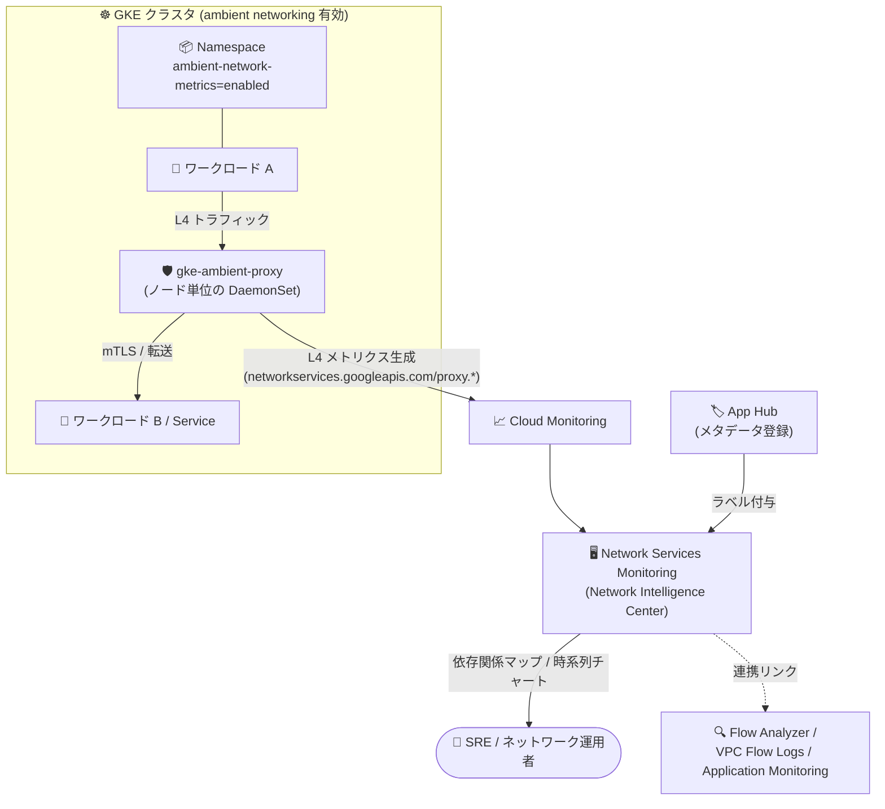

# Network Intelligence Center: Network Services Monitoring (Preview)

**リリース日**: 2026-10-01

**サービス**: Network Intelligence Center

**機能**: Network Services Monitoring

**ステータス**: Preview

📊 [このアップデートのインフォグラフィックを見る](https://takech9203.github.io/google-cloud-news-summary/20261001-network-intelligence-center-network-services-monitoring.html)

## 概要

Network Intelligence Center の新モジュール「Network Services Monitoring」が Preview として提供開始された。Network Services Monitoring は、ambient networking を有効化した環境で稼働する Google Kubernetes Engine (GKE) のサービスとワークロードに対するオブザーバビリティを提供する。ネットワークレベル (Layer 4) のメトリクスを可視化することで、サービス間の通信経路のモニタリング、高スループットなサービスの特定、コネクションの健全性分析が可能になる。

このモジュールは、GKE ambient networking (サイドカー不要のマネージドなサービスメッシュ型データプレーン) と連携して動作する。namespace に `networking.gke.io/ambient-network-metrics=enabled` ラベルを付与して Layer 4 メトリクス生成を有効化すると、ワークロードのメトリクスが Cloud Monitoring 経由で Network Services Monitoring に表示される。

対象ユーザーは、GKE 上でマイクロサービスを運用するプラットフォームエンジニアや SRE、ネットワーク運用チームである。App Hub、Application Monitoring、Flow Analyzer、VPC Flow Logs、アクセスログとの連携により、アプリケーションの健全性とネットワークの健全性を関連付けた分析ができる。

**アップデート前の課題**

- GKE のサービス間通信 (ambient networking 環境) の通信経路やネットワークメトリクスを一元的に可視化する専用コンソールがなかった
- コネクションのタイムアウト、リセット、TLS ハンドシェイク失敗といった Layer 4 レベルの異常を、サービス単位の依存関係と対応付けて確認する手段が限られていた
- VPC Flow Logs や Flow Analyzer などのツールを個別に行き来して、アプリケーションの問題かネットワークの問題かを切り分ける必要があった

**アップデート後の改善**

- GKE サービス・ワークロードのインバウンド / アウトバウンド接続をサービス依存関係マップとして Google Cloud コンソール上で可視化できるようになった
- スループット、コネクション数、コネクション継続時間、リセット、タイムアウト、TLS ハンドシェイクエラーなどの Layer 4 メトリクスを時系列チャートで確認できるようになった
- App Hub に登録したサービス・ワークロードのアプリケーションメタデータ (アプリケーション ID、criticality、environment など) でメトリクスを分析できるようになった
- Flow Analyzer への事前入力済みクエリ連携により、トラフィックフローの深掘り分析にシームレスに移行できるようになった

## アーキテクチャ図



ambient networking のノードプロキシが生成する Layer 4 メトリクスを Cloud Monitoring 経由で収集し、Network Services Monitoring がサービス依存関係マップと時系列チャートとして可視化する。App Hub のメタデータでメトリクスが補強され、Flow Analyzer などへの連携リンクで深掘り分析につなげられる。

## サービスアップデートの詳細

### 主要機能

1. **サービス可視化と Layer 4 テレメトリの表示**
   - GKE サービスの通信経路 (インバウンド / アウトバウンド接続) とメトリクスを Google Cloud コンソールで表示
   - サービス依存関係マップで、選択したリソースの接続をトラフィック表示・エラー表示で切り替えて確認可能
   - Active Discovered Resources タブで期間内にトラフィックを生成したリソースを、Inactive Discovered Resources タブで App Hub API により検出されたがトラフィックのないリソースを一覧表示

2. **時系列チャート**
   - インバウンド / アウトバウンドトラフィック、オープンコネクション数、コネクション健全性の時系列データを Dashboard タブで表示
   - パフォーマンストレンドのモニタリングやメトリクススパイクの相関分析に利用可能
   - 接続テーブルの「Show more」やトポロジグラフの接続線クリックで追加チャートを表示

3. **App Hub 統合**
   - App Hub に登録されたサービス・ワークロードのアプリケーションメタデータで分析を強化
   - 送信元 / 宛先それぞれにアプリケーション ID、criticality type、environment type などのラベルが自動付与される

4. **Flow Analyzer 統合**
   - 事前入力済みの Flow Analyzer クエリを使用してトラフィックフローを分析
   - Additional Diagnostics セクションからアクセスログ、Application Monitoring、App Hub、VPC Flow Logs へのリンクも提供

## 技術仕様

### ネットワークメトリクス (Layer 4)

Network Services Monitoring が使用するメトリクスは以下のとおり。

| メトリクス | 種類 | 説明 |
|------|------|------|
| `networkservices.googleapis.com/proxy.network.connection.count` | UpDownCounter | プロキシが管理するネットワークコネクション数 |
| `networkservices.googleapis.com/proxy.network.connection.duration` | Histogram | コネクション確立からクローズまでの継続時間の分布 |
| `networkservices.googleapis.com/proxy.network.connection.resets` | Counter | RST パケットにより終了したコネクションの累積数 |
| `networkservices.googleapis.com/proxy.network.connection.timeouts` | Counter | タイムアウトによりプロキシが終了させたコネクションの累積数 |
| `networkservices.googleapis.com/proxy.network.errors` | Counter | プロキシが検出した内部エラーの累積数 |
| `networkservices.googleapis.com/proxy.network.io` | Counter | プロキシが送受信したバイト数の累積 |
| `networkservices.googleapis.com/proxy.network.tls.handshake.errors` | Counter | TLS ハンドシェイク失敗の累積数 |

### メトリクスの分析指針

| 目的 | 使用するメトリクス |
|------|------|
| リソースのネットワークスループット把握 | `proxy.network.io` |
| エラー・タイムアウト・リセット・TLS 失敗の特定 | `proxy.network.errors`、`proxy.network.connection.timeouts`、`proxy.network.connection.resets`、`proxy.network.tls.handshake.errors` |

### 必要な IAM ロール

| 用途 | ロール |
|------|------|
| 検出済みリソースの表示 | Monitoring Viewer (`roles/monitoring.viewer`) |
| App Hub 詳細の表示 | App Hub Viewer (`roles/apphub.viewer`) |
| GKE 詳細の表示 | Kubernetes Engine Viewer (`roles/container.viewer`) |

## 設定方法

### 前提条件

1. GKE クラスタで ambient networking が有効であること (GKE ambient networking 自体も Preview であり、利用には allowlist への登録申請が必要)
2. GKE バージョン 1.36.4-gke.1391000 以上、GKE Dataplane V2 有効、マシンタイプ e2-standard-4 以上、フリート登録、Gateway API と Workload Identity の有効化 (ambient networking の要件)
3. 閲覧者に Monitoring Viewer などの必要な IAM ロールが付与されていること

### 手順

#### ステップ 1: ambient networking の有効化

```bash
gcloud beta container clusters update CLUSTER_NAME \
    --enable-ambient-networking \
    --location=CLUSTER_LOCATION \
    --enable-fleet
```

既存クラスタで ambient networking を有効化する。`gke-managed-ambient` namespace に 2 つの DaemonSet (`gke-ambient-nriplugin`、`gke-ambient-proxy`) が起動する。新規クラスタの場合は `gcloud beta container clusters create` に `--enable-ambient-networking` を指定する。

#### ステップ 2: namespace のトラフィックリダイレクトとメトリクス生成の有効化

```bash
# ambient プロキシ経由のトラフィックリダイレクトを有効化
kubectl label namespace NAMESPACE networking.gke.io/dataplane-mode=ambient

# Layer 4 メトリクス生成を有効化
kubectl label namespace NAMESPACE networking.gke.io/ambient-network-metrics=enabled
```

メトリクス生成を有効化すると、ワークロードのメトリクスが Cloud Monitoring 経由で Network Services Monitoring から利用可能になる。

#### ステップ 3: Network Services Monitoring でリソースとメトリクスを表示

Google Cloud コンソールで「Network Services Monitoring」ページに移動し、Active Discovered Resources タブで時間間隔を選択してリソースを表示する。リソース名をクリックすると、サービス依存関係マップ、Inbound / Outbound 接続テーブル、リソース詳細、Dashboard タブの時系列チャートを確認できる。

## メリット

### ビジネス面

- **障害切り分けの迅速化**: アプリケーションの劣化がネットワーク起因かアプリケーション起因かを、サービス依存関係マップとコネクション健全性メトリクスで素早く切り分けられる
- **運用ツールの一元化**: GKE サービス間通信の可視化が Google Cloud コンソールに統合され、サードパーティ製の可観測性ツールを別途導入せずにサービス間トラフィックを把握できる

### 技術面

- **サイドカー不要の L4 テレメトリ**: ambient networking のノードプロキシがメトリクスを生成するため、アプリケーション Pod への計装やサイドカー注入なしで通信メトリクスを取得できる
- **App Hub メタデータによる文脈付け**: メトリクスに送信元 / 宛先のアプリケーション ID や criticality などのラベルが自動付与され、ビジネス上重要なサービスに絞った分析が可能
- **既存オブザーバビリティツールとの連携**: Access logs、Application Monitoring、App Hub、Flow Analyzer、VPC Flow Logs への診断リンクで深掘り調査に移行できる

## デメリット・制約事項

### 制限事項

- Preview 段階であり、Pre-GA Offerings Terms が適用される (「現状有姿」での提供、サポートが限定される可能性あり)
- 前提となる GKE ambient networking も Preview であり、利用には allowlist への登録申請 (サインアップフォーム経由、処理に 2〜3 営業日) が必要
- ambient networking の要件として、GKE 1.36.4-gke.1391000 以上、Regional Cloud Service Mesh がサポートされるリージョン、Dataplane V2、e2-standard-4 以上のマシンタイプなどが必要
- ambient networking に登録したワークロードは、Preview 期間中サイドカー注入済みワークロードや proxyless gRPC と相互運用できない。Kubernetes Service の `trafficDistribution` フィールド、Headless Service、GKE Sandbox (gVisor) は未サポート

### 考慮すべき点

- 可視化されるのは Layer 4 (ネットワークレベル) のメトリクスであり、HTTP ステータスコードなどのアプリケーション層の分析には Application Monitoring 等の併用が必要
- App Hub 統合のメタデータラベルを活用するには、サービス・ワークロードを App Hub に登録しておく必要がある
- メトリクス生成は namespace 単位のラベル付与 (`ambient-network-metrics=enabled`) で明示的に有効化する必要がある

## ユースケース

### ユースケース 1: マイクロサービス間の通信障害のトラブルシューティング

**シナリオ**: GKE 上のマイクロサービスでレスポンス遅延が発生しており、原因がアプリケーションかネットワークか不明。

**実装例**:
```bash
# 対象 namespace でメトリクス生成を有効化
kubectl label namespace prod-services networking.gke.io/ambient-network-metrics=enabled
```
コンソールの Network Services Monitoring で対象サービスを選択し、サービス依存関係マップを Errors 表示に切り替え、`proxy.network.connection.timeouts` や `proxy.network.connection.resets`、`proxy.network.tls.handshake.errors` の時系列チャートを確認する。

**効果**: コネクションレベルの異常 (タイムアウト、リセット、TLS 失敗) の有無と発生箇所を特定し、ネットワーク起因かアプリケーション起因かの切り分けを迅速化できる。

### ユースケース 2: 高スループットサービスの特定とキャパシティ把握

**シナリオ**: クラスタ内で最もトラフィックを処理しているサービスを特定し、スケーリングやコスト最適化の判断材料にしたい。

**効果**: `proxy.network.io` メトリクスとサービス依存関係マップにより、高スループットなサービスと接続を特定できる。App Hub の criticality ラベルと組み合わせれば、重要度の高いサービスのトラフィック傾向を優先的に監視できる。

## 料金

Network Services Monitoring 固有の料金情報は、Preview 発表時点の公式ドキュメントでは確認できなかった。Network Intelligence Center の料金はモジュールごとに異なるため、詳細は料金ページを参照。

- [Network Intelligence Center 料金ページ](https://cloud.google.com/products/network-intelligence-center/pricing)
- メトリクスは Cloud Monitoring を通じて提供されるため、[Google Cloud Observability の料金](https://cloud.google.com/stackdriver/pricing)も参照

## 利用可能リージョン

Network Services Monitoring 固有のリージョン情報は公式ドキュメントで確認できなかった。前提となる GKE ambient networking は、Regional Cloud Service Mesh がサポートされるリージョンのクラスタが必要である。

## 関連サービス・機能

- **GKE ambient networking (Preview)**: 本機能の前提。サイドカーなしでトラフィックリダイレクト、mTLS、L4 認可、メトリクス生成を提供するノードプロキシ型データプレーン
- **Cloud Monitoring**: Layer 4 メトリクス (`networkservices.googleapis.com/proxy.*`) の収集・保存基盤。Metrics Explorer やアラートにも利用可能
- **App Hub**: サービス・ワークロードを登録すると、メトリクスにアプリケーションメタデータラベルが自動付与される
- **Flow Analyzer**: 事前入力済みクエリ連携により、VPC Flow Logs ベースのトラフィックフロー分析へ移行できる
- **Application Monitoring / VPC Flow Logs / アクセスログ**: リソース詳細ページの Additional Diagnostics からリンクされ、アプリケーションとネットワークの健全性を相関分析できる

## 参考リンク

- 📊 [インフォグラフィック](https://takech9203.github.io/google-cloud-news-summary/20261001-network-intelligence-center-network-services-monitoring.html)
- [公式リリースノート](https://docs.cloud.google.com/release-notes#October_01_2026)
- [Network Services Monitoring overview](https://docs.cloud.google.com/network-intelligence-center/docs/network-services-monitoring/overview)
- [View resources and metrics](https://docs.cloud.google.com/network-intelligence-center/docs/network-services-monitoring/view-resources)
- [Metrics reference](https://docs.cloud.google.com/network-intelligence-center/docs/network-services-monitoring/metrics-reference)
- [Prepare GKE ambient networking](https://docs.cloud.google.com/kubernetes-engine/docs/how-to/prepare-ambient-networking)
- [料金ページ](https://cloud.google.com/products/network-intelligence-center/pricing)

## まとめ

Network Services Monitoring は、ambient networking を採用した GKE 環境におけるサービス間通信の可視化を、サイドカーや追加計装なしで実現する Network Intelligence Center の新モジュールである。GKE でマイクロサービスを運用しているチームは、ambient networking (Preview、allowlist 申請が必要) とあわせて検証環境で試し、依存関係マップと Layer 4 メトリクスによるトラブルシューティングフローを評価することを推奨する。

---

**タグ**: Network Intelligence Center, Network Services Monitoring, GKE, ambient networking, オブザーバビリティ, Preview
