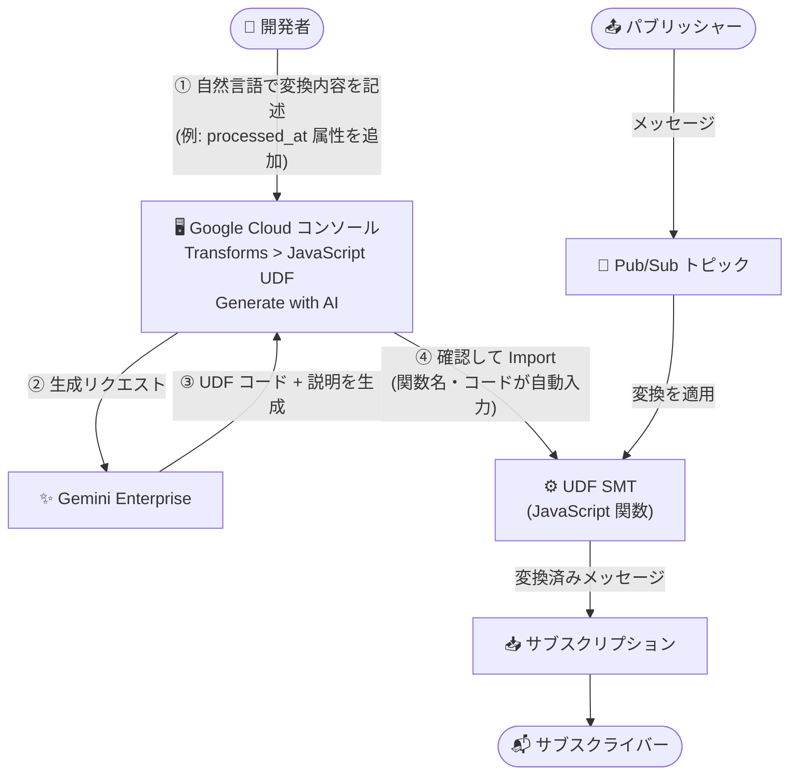

# Pub/Sub: Gemini Enterprise による UDF SMT コード生成

**リリース日**: 2026-10-01

**サービス**: Pub/Sub

**機能**: Gemini Enterprise を使用したユーザー定義関数 (UDF) シングルメッセージ変換 (SMT) のコード生成

**ステータス**: Feature

📊 [このアップデートのインフォグラフィックを見る](https://takech9203.github.io/google-cloud-news-summary/20261001-pubsub-gemini-udf-smt-code-generation.html)

## 概要

Pub/Sub において、Gemini Enterprise を使用してユーザー定義関数 (UDF: User-Defined Function) によるシングルメッセージ変換 (SMT: Single Message Transforms) の JavaScript コードを生成できるようになりました。Google Cloud コンソールでトピックまたはサブスクリプションに JavaScript UDF 変換を追加する際に「Generate with AI」をクリックし、関数にさせたい処理を自然言語で記述するだけで、Gemini Enterprise が UDF のコードとその説明を生成します。

SMT は、Dataflow や Apache Flink などの追加のデータ処理ステップを使わずに、Pub/Sub 内部でメッセージのデータと属性に対する軽量な変換を直接実行できる機能です。UDF は SMT の一種で、BigQuery の JavaScript UDF と同様に、単一メッセージを入力として受け取り、カスタム変換ロジックを適用して結果を返します。今回のアップデートにより、この UDF の JavaScript コード作成のハードルが大きく下がり、ストリーミングパイプラインにおけるデータマスキング、フォーマット変換、フィルタリングなどの変換処理をより迅速に実装できるようになります。

対象ユーザーは、Pub/Sub でストリーミングデータパイプラインを構築するデータエンジニアやアプリケーション開発者で、特に JavaScript の記述に慣れていないユーザーでも UDF SMT を活用しやすくなります。

**アップデート前の課題**

- UDF SMT を利用するには、Pub/Sub メッセージの入出力仕様 (`message`、`metadata` 引数や戻り値の形式) に準拠した JavaScript コードを手動で記述する必要があった
- 変換ロジックの実装には JavaScript の知識と UDF の関数シグネチャの理解が必要で、導入の障壁となっていた

**アップデート後の改善**

- コンソールの「Generate with AI」から、実現したい変換内容を自然言語で記述するだけで Gemini Enterprise が UDF コードを生成できるようになった
- 生成されたコードにはコードの説明が併せて表示され、内容を確認・修正しながら利用できる
- 「Import」をクリックすると生成コードが取り込まれ、関数名フィールドとコード入力欄が自動的に入力される

## アーキテクチャ図



開発者が自然言語で変換内容を記述すると Gemini Enterprise が UDF コードを生成し、生成されたコードをインポートしてトピックまたはサブスクリプションの SMT として構成する流れを示しています。

## サービスアップデートの詳細

### 主要機能

1. **自然言語からの UDF コード生成**
   - コンソールで Transform type に「JavaScript UDF」を選択後、「Generate with AI」をクリック
   - テキストフィールドに関数の処理内容を記述 (例: "Add a processed_at attribute with the current time") して Submit
   - 生成されたコードが説明とともに「Generate with AI」ペインに表示される

2. **生成コードのレビューとインポート**
   - 生成されたコードの正しさをユーザー自身が確認する (必要に応じて記述を修正して再生成)
   - 「Import」をクリックすると、関数名フィールドとコード入力欄が自動入力される

3. **トピック / サブスクリプション双方の SMT に対応**
   - トピック SMT: メッセージが Pub/Sub に保存される前に実行され、変換結果はすべてのサブスクライバーで利用可能
   - サブスクリプション SMT: メッセージ配信前に実行され、変換結果はそのサブスクリプションでのみ利用可能
   - トピック・サブスクリプションの新規作成時に Transforms セクションから構成できる

## 技術仕様

### UDF の関数シグネチャ

UDF のコードには、以下のシグネチャを持つ関数を含める必要があります。

```javascript
/**
 * Transforms a Pub/Sub message.
 * @param {Object} message - Pub/Sub メッセージ (data: 必須, attributes: 任意)
 * @param {Object} metadata - メッセージメタデータ (message_id, publish_time, ordering_key)
 * @return {Object|null} - 変換後のメッセージ。フィルタリングする場合は null を返す
 */
function <function_name>(message, metadata) {
  // カスタム変換ロジック
  return message;
}
```

### UDF SMT の仕様

| 項目 | 詳細 |
|------|------|
| 言語 | JavaScript (ECMAScript 標準ビルトインのみサポート) |
| 入力 | `message` (data、attributes) と `metadata` (message_id、publish_time、ordering_key) |
| 出力 | 変換後のメッセージオブジェクト、またはフィルタリングの場合は `null` |
| コードサイズ上限 | UDF あたり最大 20 KB |
| 実行時間上限 | メッセージあたり最大 500 ms |
| 外部アクセス | 外部 API の呼び出し、外部ライブラリのインポートは不可 |
| SMT 数の上限 | トピックまたはサブスクリプションあたり最大 5 個 |
| エンコーディング | ペイロードを変換する場合、入出力は UTF-8 文字列である必要がある |

## 設定方法

### 前提条件

1. Pub/Sub の基本概念と SMT の概要を理解していること
2. 必要な IAM ロールが付与されていること (例: サブスクリプション作成には Pub/Sub Editor (`roles/pubsub.editor`) ロールまたは `pubsub.subscriptions.create` 権限)

### 手順

#### ステップ 1: コンソールでトピックまたはサブスクリプションの作成を開始

Google Cloud コンソールの Pub/Sub「Topics」ページで「Create topic」をクリックするか、既存トピックから「Create subscription」をクリックします。

#### ステップ 2: 変換を追加して Gemini Enterprise でコードを生成

1. 「Transforms」で「Add a transform」をクリック
2. 「Transform type」で「JavaScript UDF」を選択
3. 「Generate with AI」をクリックし、テキストフィールドに関数の処理内容を記述 (例: "Add a processed_at attribute with the current time")
4. 「Submit」をクリックすると、生成コードと説明が表示される
5. コードの正しさを確認し、必要なら記述を修正して再生成
6. 「Import」をクリックすると、関数名とコードが自動入力される

#### ステップ 3: トピック / サブスクリプションを作成

すぐに SMT を有効化したくない場合は「Disable transform」を選択できます。最後に「Create」をクリックして作成します。

なお、gcloud CLI では YAML/JSON の定義ファイルを使用して UDF SMT を構成できます。

```bash
# 定義ファイルを使用してトピックを作成
gcloud pubsub topics create TOPIC_ID \
  --message-transforms-file=TRANSFORMS_FILE
```

## メリット

### ビジネス面

- **開発スピードの向上**: 自然言語の記述から変換コードを生成できるため、ストリーミングデータ変換の実装までの時間を短縮できる
- **スキル障壁の低減**: JavaScript や UDF の関数シグネチャに不慣れなメンバーでも、SMT によるデータマスキングやフォーマット変換を導入しやすくなる

### 技術面

- **仕様準拠コードの生成**: UDF 固有の入出力仕様 (message/metadata 引数、戻り値形式) に沿ったコードが生成され、関数名フィールドも自動入力される
- **説明付きの生成結果**: 生成コードに説明が添えられるため、レビューと修正のサイクルを回しやすい
- **追加パイプライン不要**: SMT 自体の利点として、Dataflow などの別途のデータ変換基盤を構築せずに Pub/Sub 内で軽量変換を完結できる

## デメリット・制約事項

### 制限事項

- UDF のコードは最大 20 KB、実行時間はメッセージあたり最大 500 ms
- ECMAScript 標準ビルトインのみサポートされ、外部 API 呼び出しや外部ライブラリのインポートはできない
- トピックまたはサブスクリプションに有効化できる SMT は最大 5 個
- SMT は単一の Pub/Sub メッセージに対して動作し、複数メッセージの集約はできない

### 考慮すべき点

- 生成されたコードの正しさはユーザー自身が確認する必要がある (ドキュメントでも、記述を修正して再生成が必要になる場合があると明記されている)
- トピック SMT とサブスクリプション SMT のどちらに適用するかは、変換結果を全サブスクリプションで共有したいか、特定サブスクリプションのみに適用したいかで選択する

## ユースケース

### ユースケース 1: PII の自動マスキングコードの迅速な作成

**シナリオ**: EC サイトの顧客行動イベントを Pub/Sub で収集しており、下流に流す前に SSN などの個人情報フィールドを削除したい。JavaScript に不慣れな担当者が変換コードを用意する必要がある。

**実装例**:
```
Generate with AI のテキストフィールドに
「メッセージの JSON データから ssn フィールドを削除する」
のように処理内容を記述して Submit し、生成されたコードを確認して Import する。

生成されるコードのイメージ (ドキュメント記載の UDF 例):
function redactSSN(message, metadata) {
  const data = JSON.parse(message.data);
  delete data['ssn'];
  message.data = JSON.stringify(data);
  return message;
}
```

**効果**: UDF の仕様を学習しなくても、プライバシー保護のための変換を短時間でトピックに適用でき、全サブスクライバーがマスキング済みデータを受け取れる。

### ユースケース 2: 属性付与・フォーマット統一の変換を自然言語で定義

**シナリオ**: 複数のパブリッシャーから届くメッセージに処理時刻の属性を付与したり、タイムスタンプのフォーマットを下流システム互換の形式に統一したりしたい。

**効果**: 「Add a processed_at attribute with the current time」のような記述から変換コードを生成でき、Dataflow などの追加パイプラインを構築せずに Pub/Sub 内でデータ整形を完結できる。

## 料金

今回のリリースノートおよび参照ドキュメントには、Gemini Enterprise による UDF コード生成に関する個別の料金情報は記載されていません。Pub/Sub および Gemini Enterprise の料金は公式料金ページを参照してください。

- [Pub/Sub の料金](https://cloud.google.com/pubsub/pricing)

## 利用可能リージョン

リリースノートおよび参照ドキュメントに、本機能のリージョンに関する個別の記載はありません。詳細は公式ドキュメントを参照してください。

## 関連サービス・機能

- **Gemini Enterprise**: UDF のコード生成を担う。SMT のユースケースとしては、Gemini Enterprise Agent Platform モデルによる推論結果 (分類、予測、センチメント、エンベディングなど) をイベントデータに付加する活用も挙げられている
- **AI Inference SMT**: UDF と並ぶ SMT の一種で、Agent Platform モデルから Pub/Sub メッセージに対する推論を取得する
- **BigQuery JavaScript UDF**: Pub/Sub の UDF は BigQuery の JavaScript UDF と同様のカスタム変換の仕組み
- **Dataflow / Apache Flink**: 従来、ストリーミングデータ変換に必要とされていた処理基盤。軽量な変換であれば SMT で代替でき、パイプラインを簡素化できる
- **デッドレタートピック**: サブスクリプション SMT と組み合わせることで、変換に失敗したメッセージを指定のデッドレタートピックにルーティングできる

## 参考リンク

- 📊 [インフォグラフィック](https://takech9203.github.io/google-cloud-news-summary/20261001-pubsub-gemini-udf-smt-code-generation.html)
- [公式リリースノート](https://docs.cloud.google.com/release-notes#October_01_2026)
- [JavaScript ユーザー定義関数 (UDF) の概要 / Create a UDF SMT](https://docs.cloud.google.com/pubsub/docs/smts/udfs-overview)
- [シングルメッセージ変換 (SMT) の概要](https://docs.cloud.google.com/pubsub/docs/smts/smts-overview)
- [トピック SMT とサブスクリプション SMT の選択](https://docs.cloud.google.com/pubsub/docs/smts/choose-smts)
- [SMT 付きトピックの作成](https://docs.cloud.google.com/pubsub/docs/smts/create-topic-smt)
- [SMT 付きサブスクリプションの作成](https://docs.cloud.google.com/pubsub/docs/smts/create-subscription-smt)
- [料金ページ](https://cloud.google.com/pubsub/pricing)

## まとめ

Pub/Sub の UDF SMT に Gemini Enterprise によるコード生成が加わり、自然言語の記述からメッセージ変換の JavaScript コードを生成・インポートできるようになりました。ストリーミングパイプラインでのデータマスキングやフォーマット変換を素早く実装したいチームは、コンソールの「Generate with AI」を試し、生成コードをレビューした上で SMT として適用することを推奨します。

---

**タグ**: Pub/Sub, SMT, UDF, Gemini Enterprise, JavaScript, ストリーミング, データ変換, AI コード生成
