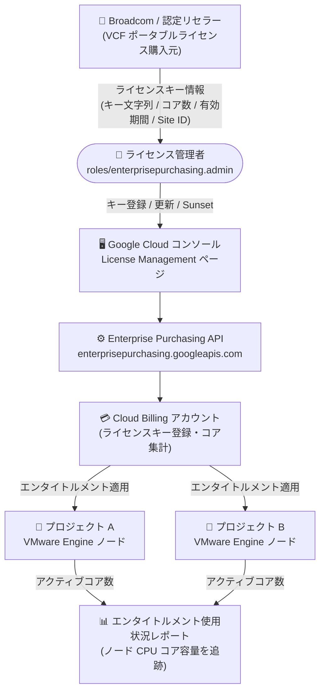

# Google Cloud VMware Engine: BYOL (Bring Your Own License) ライセンス管理が GA

**リリース日**: 2026-10-01

**サービス**: Google Cloud VMware Engine

**機能**: BYOL ライセンス管理 (VCF ポータブルライセンスキーの登録・管理)

**ステータス**: GA (一般提供)

📊 [このアップデートのインフォグラフィックを見る](https://takech9203.github.io/google-cloud-news-summary/20261001-vmware-engine-byol-license-management-ga.html)

## 概要

Google Cloud VMware Engine の BYOL (Bring Your Own License) ライセンス管理が一般提供 (GA) になりました。Broadcom または認定リセラーから直接購入したポータブルな VMware Cloud Foundation (VCF) ライセンスキーを、Google Cloud コンソールの「License Management」ページで登録・管理できます。登録したライセンスキーは、エンタイトルメント使用状況レポートでノードの CPU コア容量を追跡するために使用されます。

ライセンス管理はプロジェクト単位ではなく **Cloud Billing アカウントレベル** で行われる点が特徴です。エンタイトルメントは、その Cloud Billing アカウントに紐づくすべてのプロジェクトを横断してノード CPU コア容量をカバーし、VMware Engine がリンクされたプロジェクト全体のアクティブコア数を集計して合計コア使用量を計算します。

背景として、Broadcom による VCF のライセンスモデル変更 (「Bring Your Own」サブスクリプションモデルへの移行) があります。2025 年 10 月 15 日以降、Google Cloud は VCF ライセンス込みの VMware Engine ノードを新規販売できなくなり、新規キャパシティには Broadcom から購入した VCF サブスクリプションを持ち込む BYOL ノードを使用する方式に移行しています。今回の GA により、この BYOL 運用に必要なライセンスキー管理の仕組みが Google Cloud コンソールで正式に利用可能になりました。

**アップデート前の課題**

- Broadcom のライセンスモデル変更により VMware Engine は VCF ポータブルライセンスの持ち込み (BYOL) が前提となったが、持ち込んだライセンスキーを Google Cloud 上で一元的に登録・管理する GA の仕組みが必要だった
- 複数プロジェクトで VMware Engine を利用する場合、ライセンスエンタイトルメントとノード CPU コア使用量の対応関係をプロジェクト横断で追跡する手段が求められていた

**アップデート後の改善**

- Google Cloud コンソールの License Management ページで VCF ポータブルライセンスキーの登録 (Add)・更新 (Update)・退役 (Sunset)・ダッシュボード表示が可能になった
- ライセンスは Cloud Billing アカウントレベルで管理され、紐づくすべてのプロジェクトのノード CPU コア容量にエンタイトルメントが適用されるようになった
- 登録したライセンス容量は即時に有効化され、すべてのプロジェクトのクォータリクエストに反映されるようになった

## アーキテクチャ図



Broadcom から購入した VCF ポータブルライセンスキーを Google Cloud コンソールで登録すると、Cloud Billing アカウントに紐づくすべてのプロジェクトの VMware Engine ノード CPU コア容量にエンタイトルメントが適用され、使用状況が集計されます。

## サービスアップデートの詳細

### 主要機能

1. **ライセンスキーの登録 (Add license key)**
   - プロダクトタイプ、ライセンスキー文字列、コア数、有効開始日・終了日、Broadcom Site ID を指定してキーを登録
   - 登録したライセンス容量は即時有効となり、すべてのプロジェクトのクォータリクエストに反映される
   - 登録時にはコンプライアンス確認 (Broadcom との契約に準拠していることの表明) のチェックが必要

2. **ライセンスキーの更新 (Update license key)**
   - 既存のキー文字列を更新後のパラメータとともに再入力することで、コア数の調整や有効期限の延長が可能
   - 新しいエントリが既存のレコードを置き換える (supersede)

3. **ライセンスキーの退役 (Sunset license key)**
   - アクティブなキーを恒久的に「退役済み」としてマークし、以降の使用量計算から除外
   - Sunset は恒久的な操作で取り消し不可。復元するにはキー文字列を新規エントリとして再登録する必要がある
   - コンソールでは過去の失効日を指定できないため、期限前にキーを無効化したい場合はこの Sunset プロセスを使用する

4. **ダッシュボード表示 (View dashboard)**
   - 登録済みキーの一覧、ステータス (Active / Sunsetted / Expired)、課金アカウント全体のアクティブコア容量を確認可能

## 技術仕様

### ライセンス管理の仕組み

| 項目 | 詳細 |
|------|------|
| 管理単位 | Cloud Billing アカウントレベル (プロジェクト単位ではない) |
| 適用範囲 | 課金アカウントにリンクされた全プロジェクトのノード CPU コア容量 |
| 使用量計算 | リンクされたプロジェクト全体のアクティブコア数を集計 |
| 登録に必要な情報 | プロダクトタイプ、ライセンスキー文字列、コア数、有効開始日・終了日、Broadcom Site ID |
| キーのステータス | Active / Sunsetted / Expired |
| 必要な API | Enterprise Purchasing API (`enterprisepurchasing.googleapis.com`) |
| 入力検証 | コンソールは構文・入力フォーマットを検証するが、登録時に Broadcom システムに対するリアルタイムのバックエンド検証は行わない |

### 必要な IAM ロール・権限

ライセンスキーの管理・表示には、プロジェクトに対して以下のいずれかのロールが必要です。

| ロール | できること |
|------|------|
| `roles/enterprisepurchasing.admin` | ライセンスキーの追加・更新・Sunset |
| `roles/enterprisepurchasing.viewer` | ライセンスキーの表示 |

カスタムロールを使用する場合は、以下の権限を含める必要があります。

```text
enterprisepurchasing.googleapis.com/licenseKeys.create
enterprisepurchasing.googleapis.com/licenseKeys.delete
enterprisepurchasing.googleapis.com/licenseKeys.get
enterprisepurchasing.googleapis.com/licenseKeys.list
```

## 設定方法

### 前提条件

1. Broadcom ポータルで以下のライセンスキー属性を確認しておく: プロダクトタイプ、ライセンスキー文字列、コア数、有効開始日・終了日、Broadcom Site ID
2. プロジェクトで Enterprise Purchasing API (`enterprisepurchasing.googleapis.com`) を有効化する (有効化には `roles/owner`、`roles/editor`、または `roles/serviceusage.serviceUsageAdmin` が必要)
3. `roles/enterprisepurchasing.admin` (管理) または `roles/enterprisepurchasing.viewer` (閲覧) のロールを持っていることを確認する

### 手順

#### ステップ 1: Enterprise Purchasing API の有効化

Google Cloud コンソールの API ライブラリで Enterprise Purchasing API (`enterprisepurchasing.googleapis.com`) を有効化します。

#### ステップ 2: ライセンスキーの登録

1. Google Cloud コンソールで **License Management** ページに移動する
2. **Add License Key** をクリックする
3. **License Key String** フィールドにライセンスキー文字列を入力する
4. **Product Name** リストから Broadcom プロダクトを選択する
5. **Quantity (Cores)** フィールドにこのキーに割り当てるコア数を指定する
6. **Start Date** / **End Date** フィールドで Broadcom との契約に一致する有効期間を選択する
7. **Site ID** フィールドに Broadcom Site ID を入力する
8. コンプライアンス表明のチェックボックスを選択して **Submit** をクリックする

登録されたライセンス容量は、すべてのプロジェクトのクォータリクエストに対して即時に有効になります。

## メリット

### ビジネス面

- **ライセンス資産の一元管理**: Broadcom から購入した VCF ポータブルライセンスを Cloud Billing アカウント単位で一元管理でき、プロジェクトごとの個別管理が不要
- **コンプライアンスの可視化**: エンタイトルメント使用状況レポートでノード CPU コア容量の消費を追跡でき、ライセンス契約との整合性を確認しやすい

### 技術面

- **プロジェクト横断のエンタイトルメント適用**: 課金アカウントにリンクされた全プロジェクトのアクティブコア数が自動集計され、エンタイトルメントが横断適用される
- **即時反映**: 登録したライセンス容量が即時にクォータリクエストへ反映されるため、キャパシティ拡張の流れがスムーズ
- **ライフサイクル操作の明確化**: 追加・更新・Sunset・ダッシュボード表示という明確なライフサイクル操作が提供される

## デメリット・制約事項

### 制限事項

- Sunset (退役) 操作は恒久的で取り消せない。復元するにはキー文字列を新規エントリとして再登録する必要がある
- コンソールでは過去の失効日を指定できない (期限前の無効化は Sunset プロセスを使用)
- コンソールは構文・フォーマット検証のみを行い、登録時に Broadcom システムとのリアルタイム検証は行われない
- BYOL ライセンスは以下には適用されない: Google Cloud の基盤インフラ利用料、ストレージとバックアップ、IP アドレスとネットワーク外向きデータ転送、サポート対象 VCF コンポーネント以外のサードパーティアドオン

### 考慮すべき点

- Broadcom ライセンスの有効期限が切れた場合、更新は Broadcom と直接行う必要がある
- ライセンスキー登録時にコンプライアンス表明 (Broadcom との契約への準拠確認) が必須
- ライセンス管理には Enterprise Purchasing API の有効化と専用 IAM ロール (`roles/enterprisepurchasing.admin` / `viewer`) の付与が必要
- Broadcom のライセンスモデル変更により、2025 年 11 月 1 日以降 VMware Engine ノードは VCF ポータブルライセンスの使用が前提となっている点に注意

## ユースケース

### ユースケース 1: 複数プロジェクトにまたがる VMware Engine 環境のライセンス統合管理

**シナリオ**: 本番・開発・DR 用に複数のプロジェクトで VMware Engine プライベートクラウドを運用している企業が、Broadcom から購入した VCF ポータブルライセンスを全環境に適用したい。

**実装例**:

```text
1. Broadcom ポータルでライセンスキー属性 (キー文字列、コア数、有効期間、Site ID) を確認
2. 課金管理用プロジェクトで Enterprise Purchasing API を有効化
3. License Management ページでライセンスキーを登録
4. ダッシュボードで課金アカウント全体のアクティブコア容量を確認
```

**効果**: Cloud Billing アカウントに紐づく全プロジェクトのノード CPU コア使用量に対してエンタイトルメントが横断適用され、プロジェクトごとのライセンス割り当て管理が不要になる。

### ユースケース 2: ライセンス更新・コア数変更時の運用

**シナリオ**: Broadcom との契約更新でライセンスの有効期限延長とコア数の増加が発生した。

**効果**: 既存のキー文字列を更新後のパラメータで再入力するだけで新しいエントリが既存レコードを置き換え、更新後の容量が即時にクォータリクエストへ反映される。

## 料金

BYOL ライセンス管理機能自体の料金に関する記載は、確認したドキュメントにはありません。VMware Engine の BYOL ノードのオプションと料金については、公式の料金ページを参照してください。

- [VMware Engine 料金ページ](https://cloud.google.com/vmware-engine/pricing)

なお、BYOL ライセンスは VCF ライセンス部分に適用されるものであり、Google Cloud の基盤インフラ、ストレージ・バックアップ、IP アドレス・ネットワーク外向きデータ転送などの費用には適用されません。

## 関連サービス・機能

- **Cloud Billing**: ライセンスキーは Cloud Billing アカウントレベルで管理され、紐づく全プロジェクトにエンタイトルメントが適用される
- **Enterprise Purchasing API**: ライセンスキーの登録・管理に必要な API (`enterprisepurchasing.googleapis.com`)
- **IAM (Identity and Access Management)**: `roles/enterprisepurchasing.admin` / `roles/enterprisepurchasing.viewer` によるアクセス制御
- **VMware Engine クォータ**: 登録されたライセンス容量はプロジェクトのクォータリクエストに即時反映される
- **VMware Engine 確約利用割引 (CUD)**: BYOL ノードのコスト最適化に関連する割引オプション

## 参考リンク

- 📊 [インフォグラフィック](https://takech9203.github.io/google-cloud-news-summary/20261001-vmware-engine-byol-license-management-ga.html)
- [公式リリースノート](https://docs.cloud.google.com/release-notes#October_01_2026)
- [License management (公式ドキュメント)](https://docs.cloud.google.com/vmware-engine/docs/license-management)
- [VMware Engine サービスアナウンスメント (ライセンスモデル変更の経緯)](https://docs.cloud.google.com/vmware-engine/docs/service-announcements)
- [料金ページ](https://cloud.google.com/vmware-engine/pricing)

## まとめ

Broadcom の VCF ライセンスモデル変更により BYOL が前提となった VMware Engine において、ポータブル VCF ライセンスキーを Google Cloud コンソールで登録・管理できる公式な仕組みが GA になりました。Cloud Billing アカウントレベルでのプロジェクト横断管理と使用量集計により、ライセンスコンプライアンスの維持が容易になります。VMware Engine を BYOL ノードで運用している、または移行を予定している組織は、Enterprise Purchasing API の有効化と IAM ロールの整備を行い、保有する VCF ライセンスキーの登録を進めることを推奨します。

---

**タグ**: #GoogleCloudVMwareEngine #BYOL #VCF #ライセンス管理 #Broadcom #CloudBilling #GA
