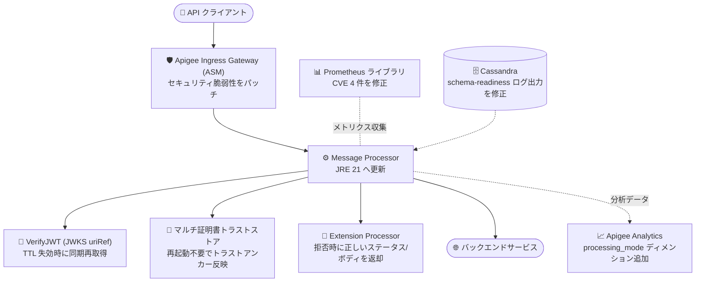

# Apigee X: 1-18-0-apigee-6 セキュリティアップデートとバグ修正

**リリース日**: 2026-10-02

**サービス**: Apigee X

**機能**: ランタイムバージョン 1-18-0-apigee-6 (セキュリティ修正 + バグ修正)

**ステータス**: リリース済み (全ゾーンへのロールアウトに 4 営業日以上を要する場合あり)

📊 [このアップデートのインフォグラフィックを見る](https://takech9203.github.io/google-cloud-news-summary/20261002-apigee-x-1-18-0-apigee-6-security-update.html)

## 概要

2026 年 10 月 2 日、Google は Apigee の更新バージョン **1-18-0-apigee-6** をリリースしました。本リリースは、Apigee Ingress Gateway (ASM) および Prometheus ライブラリに対するセキュリティ脆弱性パッチ (CVE-2026-42151、CVE-2026-42154、CVE-2026-44903、CVE-2026-40179 を含む) と、API ランタイムの信頼性に関わる 8 件のバグ修正を含むメンテナンスリリースです。

特に重要な修正として、JWKS を利用する VerifyJWT ポリシーでキャッシュ TTL 失効直後に発生していた `steps.jwt.NoMatchingPublicKey` エラーの解消、マルチ証明書トラストストアのトラストアンカー変更が Message Processor の再起動なしで反映されるようになった点、Extension Processor (ext_proc) の拒否時に常に HTTP 500 が返されていた問題の修正が含まれます。また、Apigee ランタイムの実行環境が JRE 21 に更新されました。

Apigee X はフルマネージドサービスのため、ユーザー側でのアップグレード作業は不要です。ロールアウトはすべての Google Cloud ゾーンに対して段階的に行われ、完了まで 4 営業日以上かかる場合があります。

**アップデート前の課題**

- Apigee Ingress Gateway (ASM) および Prometheus ライブラリに既知のセキュリティ脆弱性 (CVE-2026-42151 ほか 3 件) が存在していた
- マルチ証明書トラストストアのトラストアンカーを変更しても、`features.truststore.multi_cert_bundle.enabled` をランタイムで切り替えた際に Message Processor を再起動しないと反映されなかった
- IdP が新しい Key ID に鍵をローテーションした場合、JWKS キャッシュ (TTL 300 秒) の失効後の最初のリクエストで VerifyJWT ポリシーが `steps.jwt.NoMatchingPublicKey` エラーを返すことがあった
- Extension Processor (ext_proc) がリクエストを拒否した際、ポリシーや FaultRule が生成したステータス/ボディではなく常に HTTP 500 が返されていた
- バースト負荷時に EventFlow (SSE) が複数イベントを 1 回のポリシー実行に合成してしまい、不正な形式の SSE 出力が生成されることがあった
- `lookupcache.<n>.isEncrypted` / `responsecache.<n>.isEncrypted` フロー変数がエントリごとの L2 キャッシュのディスク上の暗号化状態を正しく報告していなかった
- Apigee Analytics でプロキシトラフィックと Extension Processor トラフィックを区別する手段がなかった
- `apigee-cassandra-schema-readiness` init コンテナのログが `/dev/null` にリダイレクトされており、トラブルシューティングが困難だった

**アップデート後の改善**

- Ingress Gateway (ASM) と Prometheus ライブラリがアップグレードされ、CVE-2026-42151、CVE-2026-42154、CVE-2026-44903、CVE-2026-40179 を含む脆弱性が修正された (Apigee インフラストラクチャ自体のセキュリティ修正も含む)
- トラストアンカー変更時にアウトバウンド SSL コンテキストが自動的に再構築され、Message Processor の再起動なしでマルチ証明書トラストストアが反映されるようになった
- JWKS キャッシュの TTL 失効時に同期的に再取得 (synchronous re-fetch) するようになり、鍵ローテーション直後の最初のリクエストでも JWT 検証が成功するようになった
- Extension Processor の拒否時に、ポリシーまたは FaultRule が生成したステータスコードとレスポンスボディがそのまま返却されるようになった
- Apigee ランタイムが JRE 21 上で動作するようになった
- EventFlow (SSE) のイベント合成問題が修正され、バースト負荷時も正しい SSE 出力が維持されるようになった
- Apigee Analytics に `processing_mode` ディメンションが追加され、プロキシトラフィックと Extension Processor トラフィックを区別できるようになった

## アーキテクチャ図



Apigee X ランタイムのセキュリティ境界と主要コンポーネントのうち、本リリース (1-18-0-apigee-6) で修正が適用された箇所を示しています。リクエスト経路の入口 (Ingress Gateway) から Message Processor 内のポリシー処理、監視・分析基盤まで広範囲に修正が及んでいます。

## サービスアップデートの詳細

### 主要機能

1. **セキュリティ修正**
   - **Bug 564386425**: Apigee Ingress Gateway (ASM) をアップグレードし、セキュリティ脆弱性をパッチ
   - **Bug 561666530**: Prometheus ライブラリをアップグレードし、CVE-2026-42151、CVE-2026-42154、CVE-2026-44903、CVE-2026-40179 をパッチ
   - Apigee インフラストラクチャに対するセキュリティ修正

2. **TLS / トラストストアの改善 (432315283)**
   - `features.truststore.multi_cert_bundle.enabled` をランタイムで切り替えた際、マルチ証明書トラストストアのトラストアンカーが Message Processor の再起動なしで有効化されるように修正
   - トラストアンカー変更時にアウトバウンド SSL コンテキストが自動的に再構築される

3. **VerifyJWT ポリシーの JWKS キャッシュ修正 (565072374)**
   - JWKS `uriRef` を使用する VerifyJWT ポリシーで、IdP が新しい Key ID に鍵をローテーションした場合、JWKS キャッシュ TTL (300 秒) 失効後の最初のリクエストで `steps.jwt.NoMatchingPublicKey` が返される問題を修正
   - キャッシュ失効時に同期的に JWKS を再取得するよう動作を変更

4. **Extension Processor の拒否レスポンス修正 (535395491)**
   - Extension Processor (ext_proc) による拒否時に、常に HTTP 500 を返すのではなく、ポリシーまたは FaultRule が生成したステータスとボディを返却するように修正

5. **ランタイム実行環境の更新 (558421499)**
   - Apigee ランタイムが JRE 21 上で動作

6. **キャッシュ暗号化状態のフロー変数修正 (517953321)**
   - `lookupcache.<n>.isEncrypted` および `responsecache.<n>.isEncrypted` フロー変数が、L2 キャッシュのエントリごとのディスク上の暗号化状態を報告するように修正
   - L1 キャッシュヒット時は `false` を報告

7. **EventFlow (SSE) の修正 (563557547)**
   - バースト負荷時に複数の SSE イベントが 1 回のポリシー実行に合成され、不正な形式の SSE 出力が生成される問題を修正

8. **Analytics の processing_mode ディメンション (562740573)**
   - Apigee Analytics が `processing_mode` ディメンションを設定するようになり、プロキシトラフィックと Extension Processor トラフィックを区別可能に

9. **Cassandra 運用性の改善 (357042873)**
   - `apigee-cassandra-schema-readiness` init コンテナのログが `/dev/null` にリダイレクトされないように修正 (アップグレード時にローリング再起動が発生)

## 技術仕様

### リリース情報

| 項目 | 詳細 |
|------|------|
| リリースバージョン | 1-18-0-apigee-6 |
| リリース日 | 2026 年 10 月 2 日 |
| ロールアウト期間 | 全 Google Cloud ゾーンへの展開に 4 営業日以上かかる場合あり |
| ランタイム環境 | JRE 21 |
| 対象 | Apigee X (マネージド) ランタイム |

### 修正された CVE (Prometheus ライブラリ)

| CVE | 対応 |
|-----|------|
| CVE-2026-42151 | Prometheus ライブラリのアップグレードでパッチ |
| CVE-2026-42154 | Prometheus ライブラリのアップグレードでパッチ |
| CVE-2026-44903 | Prometheus ライブラリのアップグレードでパッチ |
| CVE-2026-40179 | Prometheus ライブラリのアップグレードでパッチ |

### JWKS キャッシュの挙動 (修正後)

VerifyJWT ポリシーで JWKS を公開 URL から取得する場合、Apigee は JWKS を 300 秒間キャッシュします。本リリースにより、キャッシュ失効時は同期的に再取得されるため、IdP の鍵ローテーション直後でも最初のリクエストから新しい Key ID で検証できます。

```xml
<VerifyJWT name="JWT-Verify-RS256">
  <Algorithm>RS256</Algorithm>
  <Source>json.jwt</Source>
  <IgnoreUnresolvedVariables>false</IgnoreUnresolvedVariables>
  <PublicKey>
    <!-- uriRef 使用時に発生していた NoMatchingPublicKey エラーが修正された -->
    <JWKS uriRef="variable-containing-a-uri"/>
  </PublicKey>
</VerifyJWT>
```

## 設定方法

### 前提条件

1. Apigee X (マネージド) を利用していること — アップデートは Google により自動適用されるため、ユーザー側の作業は不要
2. ロールアウト状況を確認したい場合は、組織のインスタンス情報を参照できる権限 (`apigee.instances.get` など)

### 手順

#### ステップ 1: ランタイムバージョンの確認

```bash
# 組織内のインスタンスのランタイムバージョンを確認
curl -s -H "Authorization: Bearer $(gcloud auth print-access-token)" \
  "https://apigee.googleapis.com/v1/organizations/${ORG}/instances"
```

レスポンスの `runtimeVersion` フィールドが `1-18-0-apigee-6` になっていれば、該当インスタンスへのロールアウトは完了しています。

#### ステップ 2: 修正の影響確認

```bash
# Analytics で processing_mode ディメンションを利用したクエリ例
curl -s -H "Authorization: Bearer $(gcloud auth print-access-token)" \
  "https://apigee.googleapis.com/v1/organizations/${ORG}/environments/${ENV}/stats/processing_mode?select=sum(message_count)&timeRange=10/01/2026%2000:00~10/08/2026%2000:00"
```

Extension Processor を利用している場合、`processing_mode` ディメンションでプロキシトラフィックと Extension Processor トラフィックを区別して分析できます。

## メリット

### ビジネス面

- **セキュリティリスクの低減**: Ingress Gateway と Prometheus ライブラリの既知の脆弱性 (CVE 4 件を含む) が解消され、コンプライアンス要件への対応が容易になる
- **可用性の向上**: トラストストア変更時の Message Processor 再起動が不要になり、証明書運用に伴うサービス影響が減少する
- **運用負荷ゼロでの適用**: Apigee X はマネージドサービスのため、パッチ適用作業なしで自動的に修正が適用される

### 技術面

- **JWT 検証の信頼性向上**: IdP の鍵ローテーション時に発生していた一時的な `steps.jwt.NoMatchingPublicKey` エラーが解消され、認証エラーの誤検知が減少する
- **エラーハンドリングの正確性**: Extension Processor の拒否時にポリシー/FaultRule が意図したステータス・ボディが返るため、クライアント側のエラー処理を正しく設計できる
- **可観測性の向上**: Analytics の `processing_mode` ディメンション追加と Cassandra init コンテナのログ出力改善により、トラフィック分析とトラブルシューティングが容易になる
- **最新ランタイム基盤**: JRE 21 への更新により、最新の Java ランタイムのパフォーマンス・セキュリティ改善の恩恵を受けられる

## デメリット・制約事項

### 制限事項

- ロールアウトは段階的に行われるため、全 Google Cloud ゾーンへの展開完了まで 4 営業日以上かかる場合がある (リージョン/ゾーンによって適用タイミングが異なる)
- 修正 357042873 (Cassandra schema-readiness ログ) の適用に伴い、アップグレード時にローリング再起動が発生する

### 考慮すべき点

- `lookupcache.<n>.isEncrypted` / `responsecache.<n>.isEncrypted` フロー変数の挙動が変わり、L1 キャッシュヒット時は `false` を報告するようになったため、これらの変数に依存した条件分岐がある場合は動作を確認すること
- Extension Processor の拒否時のレスポンスが HTTP 500 固定からポリシー/FaultRule 由来のステータス・ボディに変わるため、HTTP 500 を前提にしたクライアントや監視アラートがある場合は見直しが必要
- EventFlow (SSE) を利用するプロキシでは、バースト負荷時の挙動が修正後の正しい動作に変わることを確認しておくとよい

## ユースケース

### ユースケース 1: IdP の鍵ローテーションを伴う JWT 認証 API

**シナリオ**: 外部 IdP (OIDC プロバイダー) が定期的に署名鍵をローテーションする環境で、Apigee の VerifyJWT ポリシー (JWKS `uriRef`) により API リクエストの JWT を検証している。従来は鍵ローテーション直後、JWKS キャッシュ TTL (300 秒) 失効後の最初のリクエストが `steps.jwt.NoMatchingPublicKey` で失敗することがあった。

**実装例**:
```xml
<VerifyJWT name="VJ-IdP-Token">
  <Algorithm>RS256</Algorithm>
  <Source>request.header.authorization</Source>
  <PublicKey>
    <JWKS uriRef="idp.jwks.uri"/>
  </PublicKey>
  <Issuer>https://idp.example.com</Issuer>
</VerifyJWT>
```

**効果**: 本リリース適用後は、キャッシュ失効時に JWKS が同期的に再取得されるため、鍵ローテーション直後でも認証エラーが発生せず、リトライ実装や TTL 調整などの回避策が不要になる。

### ユースケース 2: Extension Processor トラフィックの分析と拒否レスポンスのカスタマイズ

**シナリオ**: Apigee の Extension Processor を使い、サービス拡張としてトラフィックを処理している。拒否時にカスタムのエラーレスポンス (例: 403 + JSON ボディ) を返したいが、従来は常に HTTP 500 になっていた。また、プロキシ経由と Extension Processor 経由のトラフィックを分けて分析したい。

**効果**: FaultRule で定義したステータスコードとボディがそのままクライアントに返却されるようになり、API コンシューマーへのエラー通知が正確になる。さらに Analytics の `processing_mode` ディメンションにより、プロキシトラフィックと Extension Processor トラフィックを分離してレポーティングできる。

## 料金

本アップデートはセキュリティ修正とバグ修正のメンテナンスリリースであり、料金体系への変更はありません。Apigee の料金詳細は公式料金ページを参照してください。

- [Apigee 料金ページ](https://cloud.google.com/apigee/pricing)

## 利用可能リージョン

すべての Google Cloud ゾーンに段階的にロールアウトされます。全ゾーンへの展開完了には 4 営業日以上かかる場合があります。

## 関連サービス・機能

- **Cloud Service Mesh (ASM)**: Apigee Ingress Gateway の基盤。本リリースで脆弱性パッチのためにアップグレードされた
- **Google Cloud Managed Service for Prometheus / Cloud Monitoring**: Apigee ランタイムのメトリクス収集基盤。Prometheus ライブラリの CVE 修正が適用された
- **Apigee Analytics**: `processing_mode` ディメンションが追加され、トラフィック種別の分析が可能になった
- **Apigee hybrid**: Apigee X と共通のランタイムコンポーネントを持つセルフマネージド版。対応するバージョンのリリースノートも確認を推奨

## 参考リンク

- 📊 [インフォグラフィック](https://takech9203.github.io/google-cloud-news-summary/20261002-apigee-x-1-18-0-apigee-6-security-update.html)
- [公式リリースノート](https://docs.cloud.google.com/release-notes#October_02_2026)
- [Apigee リリースプロセス](https://docs.cloud.google.com/apigee/docs/release/apigee-release-process)
- [VerifyJWT ポリシー リファレンス](https://docs.cloud.google.com/apigee/docs/api-platform/reference/policies/verify-jwt-policy)
- [JWT / JWS ポリシー概要 (JWKS の利用)](https://docs.cloud.google.com/apigee/docs/api-platform/reference/policies/jwt-policies-overview)
- [料金ページ](https://cloud.google.com/apigee/pricing)

## まとめ

Apigee X 1-18-0-apigee-6 は、Ingress Gateway (ASM) と Prometheus ライブラリの脆弱性パッチ (CVE 4 件を含む) に加え、JWT 検証・トラストストア・Extension Processor など API 運用の信頼性に直結する 8 件の修正を含む重要なメンテナンスリリースです。マネージドサービスのため適用作業は不要ですが、Extension Processor の拒否レスポンスやキャッシュ暗号化フロー変数など挙動が変わる箇所があるため、該当機能を利用している場合はロールアウト完了後に動作確認を行うことを推奨します。

---

**タグ**: `Apigee X` `セキュリティ` `CVE` `VerifyJWT` `JWKS` `Extension Processor` `TLS` `JRE 21` `Apigee Analytics`
