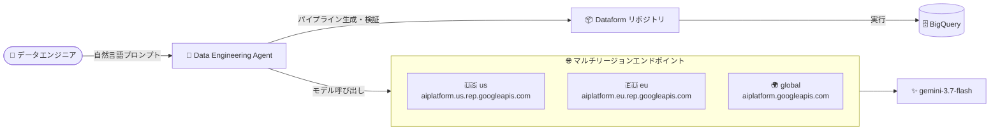

# BigQuery: Data Engineering Agent が gemini-3.7-flash モデルをサポート

**リリース日**: 2026-10-02

**サービス**: BigQuery (Data Engineering Agent)

**機能**: Data Engineering Agent での gemini-3.7-flash モデルサポート (us / eu / global マルチリージョンエンドポイント)

**ステータス**: Feature

📊 [このアップデートのインフォグラフィックを見る](https://takech9203.github.io/google-cloud-news-summary/20261002-bigquery-data-engineering-agent-gemini-3-7-flash.html)

## 概要

BigQuery の Data Engineering Agent が、Gemini 3.7 Flash (`gemini-3.7-flash`) モデルを `us`、`eu`、`global` のマルチリージョンエンドポイントでサポートしました。Data Engineering Agent は、自然言語プロンプトを使用して BigQuery のデータパイプラインを構築・変更・トラブルシューティングできるエージェントで、Dataform との統合、プラン生成、コード検証、自動データラングリングなどの機能を提供します。

gemini-3.7-flash は 2026 年 8 月 13 日に GA となった Gemini ファミリーのモデルで、`global` エンドポイントに加えて `us` (米国) / `eu` (EU) のマルチリージョンエンドポイントに対応しています。マルチリージョンエンドポイントを使用すると、機械学習処理を米国または EU といった特定の管轄区域内に留めることができるため、データレジデンシー要件を持つ組織でも新しいモデルを利用した AI 支援のデータエンジニアリングが可能になります。

対象ユーザーは、BigQuery pipelines や Dataform でデータパイプラインを構築するデータエンジニアおよび、データ処理の地理的制約 (コンプライアンス要件) を持つエンタープライズ組織です。

**アップデート前の課題**

- Data Engineering Agent では gemini-3.7-flash モデルを利用できなかった
- データレジデンシー要件のある組織では、エージェントが利用するモデルのエンドポイント対応状況によって、新しいモデル世代の恩恵を受けにくかった

**アップデート後の改善**

- Data Engineering Agent のバックエンドとして gemini-3.7-flash を `us`、`eu`、`global` のマルチリージョンエンドポイントで利用可能になった
- `us` / `eu` マルチリージョンエンドポイントにより、ML 処理を米国または EU の管轄区域内に留めたまま、新しいモデル世代を利用したパイプライン生成が可能になった
- `global` エンドポイントにより、可用性と信頼性を高めた構成でエージェントを利用できるようになった

## アーキテクチャ図

Data Engineering Agent が自然言語プロンプトを受け取り、us / eu / global のいずれかのマルチリージョンエンドポイント経由で gemini-3.7-flash を呼び出してパイプラインコードを生成し、Dataform / BigQuery pipelines で実行する流れを示しています。

## サービスアップデートの詳細

### 主要機能

1. **gemini-3.7-flash モデルのサポート**
   - Data Engineering Agent のバックエンドモデルとして gemini-3.7-flash (2026 年 8 月 13 日 GA) が利用可能に
   - Flash 系モデルの特性である低レイテンシ・高スループットを、パイプライン生成や対話的なレコメンデーションに活用できる

2. **us / eu マルチリージョンエンドポイント対応**
   - `us` (米国)、`eu` (EU) のマルチリージョンエンドポイントで ML 処理を特定の管轄区域内に留めることが可能
   - マルチリージョンエンドポイントのホスト名は `https://aiplatform.us.rep.googleapis.com` (米国) / `https://aiplatform.eu.rep.googleapis.com` (EU)

3. **global エンドポイント対応**
   - `global` エンドポイントは全世界をカバーし、単一リージョンより高い可用性と信頼性を提供
   - リージョンのクォータ枯渇 (429 エラー) の低減に有効 (ただし処理リージョンの制御は不可)

### Data Engineering Agent の提供機能 (参考)

Data Engineering Agent は自然言語プロンプトで以下を支援します。

- **Dataform 統合**: パイプラインコードを Dataform リポジトリ / ワークスペース内に生成・整理
- **プラン生成**: 実行前にエージェントのプランをレビュー・確認可能
- **コード検証**: 生成コードのコンパイルエラーを自動検証・修正
- **自動データラングリング**: 生データを構造化テーブルに変換
- **カスタム指示**: GEMINI.md ファイルによる組織共通ルールの定義
- **Knowledge Catalog 統合**: 外部コンテキストの取得とメタデータエンリッチメント
- **最適化**: パーティショニング / クラスタリング推奨、カラムプルーニング、増分モデルなど
- **トラブルシューティング**: パイプライン障害の調査とコード修正

## 技術仕様

### gemini-3.7-flash モデル

| 項目 | 詳細 |
|------|------|
| モデル ID | `gemini-3.7-flash` |
| ローンチステージ | GA (リリース日: 2026 年 8 月 13 日) |
| 対応エンドポイント | `global`、`us` (米国マルチリージョン)、`eu` (EU マルチリージョン) |
| ML 処理のデータレジデンシー | `us`、`eu` マルチリージョン |
| セキュリティコントロール | データレジデンシー、CMEK、VPC-SC、AXT (Access Transparency) |
| 課金方式 | Standard PayGo、Provisioned Throughput |

### マルチリージョンエンドポイント

| マルチリージョン | ロケーション | ホスト名 |
|------------------|--------------|----------|
| 米国 | `us` | `https://aiplatform.us.rep.googleapis.com` |
| EU | `eu` | `https://aiplatform.eu.rep.googleapis.com` |
| グローバル | `global` | `https://aiplatform.googleapis.com` |

### 利用方法

Data Engineering Agent は以下の方法で利用できます。

1. BigQuery pipelines インターフェースまたは Dataform からパイプラインを構築
2. Visual Studio Code に Google Cloud Data Agent Kit 拡張機能をインストールして IDE から利用
3. Data Engineering Agent API 経由で利用

## メリット

### ビジネス面

- **データレジデンシー要件への対応**: us / eu マルチリージョンエンドポイントにより、ML 処理を米国または EU 域内に留める必要がある規制業種 (金融、医療、公共など) でも、新しいモデルを利用した AI 支援のデータエンジニアリングを採用しやすくなる
- **生産性の向上**: 新しい世代の Flash モデルにより、自然言語からのパイプライン生成の品質・応答性の向上が期待できる

### 技術面

- **可用性の向上**: global エンドポイントの利用により、リージョン単位のクォータ枯渇 (429 エラー) を低減できる
- **セキュリティコントロール**: gemini-3.7-flash はデータレジデンシー、CMEK、VPC-SC、AXT に対応しており、エンタープライズのセキュリティ要件に組み込みやすい

## デメリット・制約事項

### 制限事項

- マルチリージョンエンドポイント (`us` / `eu`) への接続では Private Google Access がサポートされない。プライベート接続が必要な場合は、リージョナル Google API 向けの Private Service Connect エンドポイントの構成が必要
- `global` エンドポイントでは処理リージョンを制御・特定できないため、データ処理ロケーションの要件がある場合は `us` / `eu` マルチリージョンエンドポイントを使用する必要がある

### 考慮すべき点

- エージェントの挙動はモデルのアップグレードやロールアウトにより変化し得るため、GEMINI.md などのエージェント指示ファイルを継続的に見直すことが推奨される
- Data Engineering Agent がどのロケーションでデータを処理するかは「Gemini in BigQuery のデータ処理ロケーション」のドキュメントで確認が必要

## ユースケース

### ユースケース 1: EU のデータレジデンシー要件下でのパイプライン構築

**シナリオ**: EU の規制要件により、データの ML 処理を EU 域内に留める必要がある企業が、BigQuery のデータパイプライン構築に Data Engineering Agent を活用したい。

**効果**: `eu` マルチリージョンエンドポイント経由で gemini-3.7-flash を利用することで、ML 処理を EU 域内に留めたまま、自然言語プロンプトによるパイプラインの構築・変更・トラブルシューティングが可能になる。

### ユースケース 2: グローバル展開チームでの高可用性なエージェント利用

**シナリオ**: 複数リージョンで BigQuery を利用するチームが、リージョンのクォータ制限によるエラーを避けながら Data Engineering Agent を安定的に利用したい。

**効果**: `global` エンドポイントを利用することで、単一リージョンより高い可用性でエージェントを利用でき、リソース枯渇エラー (429) の発生を低減できる。

## 料金

Data Engineering Agent の利用はトークン量に基づいて課金されます (BigQuery の「Agents」料金カテゴリ)。

| 項目 | 料金 (USD) |
|------|------------|
| 入力トークン (Data Engineering Agent / Data Science Agent / Conversational Analytics Agent) | $3 / 100 万トークン |
| 出力トークン (同上) | $20 / 100 万トークン |

生成されたパイプラインの実行には、通常の BigQuery のコンピュート料金 (オンデマンド: $6.25/TiB〜、Editions: $0.04/スロット時間〜) が別途適用されます。最新の料金は [BigQuery の料金ページ](https://cloud.google.com/bigquery/pricing) を参照してください。

## 利用可能リージョン

gemini-3.7-flash は以下のエンドポイントで利用できます。

- `us` (米国マルチリージョン)
- `eu` (EU マルチリージョン)
- `global` (グローバルエンドポイント)

Data Engineering Agent のデータ処理ロケーションの詳細は [Gemini in BigQuery のデータ処理ロケーション](https://docs.cloud.google.com/bigquery/docs/gemini-locations) を参照してください。

## 関連サービス・機能

- **Dataform**: Data Engineering Agent がパイプラインコードを生成・管理するリポジトリ / ワークスペースとして統合されている
- **BigQuery pipelines**: エージェントを利用してパイプラインを構築する主要なインターフェースの 1 つ
- **Knowledge Catalog (Dataplex)**: エージェントが外部コンテキストとして参照し、セマンティックメタデータの自動生成・同期にも利用される
- **Google Cloud Data Agent Kit**: VS Code などの IDE から Data Engineering Agent を利用するための拡張機能
- **Gemini in BigQuery**: SQL 生成、データキャンバス、データインサイトなど、BigQuery における AI 支援機能群の一部として Data Engineering Agent が位置づけられる

## 参考リンク

- 📊 [インフォグラフィック](https://takech9203.github.io/google-cloud-news-summary/20261002-bigquery-data-engineering-agent-gemini-3-7-flash.html)
- [公式リリースノート](https://docs.cloud.google.com/release-notes#October_02_2026)
- [Data Engineering Agent の概要](https://docs.cloud.google.com/gemini/data-agents/data-engineering-agent/agent-overview)
- [Gemini 3.7 Flash モデル情報](https://docs.cloud.google.com/gemini-enterprise-agent-platform/models/gemini/3-7-flash)
- [モデルエンドポイントのロケーション](https://docs.cloud.google.com/gemini-enterprise-agent-platform/resources/locations)
- [Gemini in BigQuery のデータ処理ロケーション](https://docs.cloud.google.com/bigquery/docs/gemini-locations)
- [料金ページ](https://cloud.google.com/bigquery/pricing)

## まとめ

Data Engineering Agent が gemini-3.7-flash を us / eu / global のマルチリージョンエンドポイントでサポートしたことで、データレジデンシー要件を持つ組織でも新しい世代のモデルを利用した AI 支援のデータエンジニアリングが可能になりました。EU や米国でのデータ処理の地理的制約がある場合はマルチリージョンエンドポイントを、可用性を優先する場合は global エンドポイントを選択し、既存のパイプライン構築ワークフローへの適用を検討することをおすすめします。

---

**タグ**: BigQuery, Data Engineering Agent, Gemini, gemini-3.7-flash, Dataform, データレジデンシー, マルチリージョン, 生成AI
