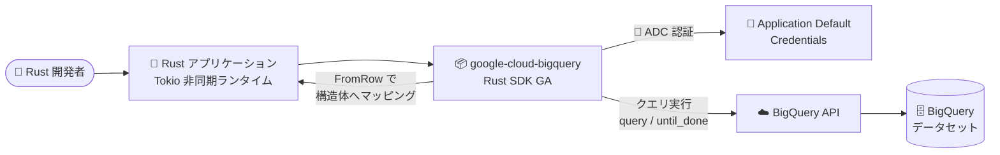

# BigQuery: Rust SDK が一般提供 (GA) 開始

**リリース日**: 2026-10-02

**サービス**: BigQuery

**機能**: Rust SDK (クライアントライブラリ) の一般提供

**ステータス**: GA (一般提供)

📊 [このアップデートのインフォグラフィックを見る](https://takech9203.github.io/google-cloud-news-summary/20261002-bigquery-rust-sdk-ga.html)

## 概要

BigQuery の Rust SDK (クライアントライブラリ `google-cloud-bigquery`) が一般提供 (GA) になりました。これにより、Rust は C#、Go、Java、Node.js、PHP、Python、Ruby と並んで、BigQuery が公式にサポートするクライアントライブラリ言語の仲間入りを果たしました。SDK は Google Cloud Client Libraries for Rust ([googleapis/google-cloud-rust](https://github.com/googleapis/google-cloud-rust)) の一部として提供され、`cargo add google-cloud-bigquery` だけで導入できます。

Rust は高いパフォーマンス、メモリ安全性、低いリソースフットプリントを特徴とし、データパイプラインのワーカーや高スループットなバックエンドサービスの実装言語として採用が拡大しています。今回の GA により、こうした Rust アプリケーションからエンタープライズのプロダクション環境でも安心して BigQuery にアクセスできるようになりました。

SDK は Tokio ベースの非同期 (async/await) API を採用し、クエリの実行、結果のストリーミング読み取り、`FromRow` derive マクロによる構造体への型安全なマッピングなど、Rust らしいイディオマティックな開発体験を提供します。

**アップデート前の課題**

- BigQuery に Rust の公式クライアントライブラリの GA 版がなく、プロダクション利用には REST API を直接呼び出す独自実装やサードパーティ製クレートに頼る必要があった
- REST API の直接利用では、認証 (Application Default Credentials)、リトライ、ページネーション、行データの型変換などを自前で実装する必要があった
- サードパーティ製クレートは API カバレッジやメンテナンス継続性の面で、エンタープライズのプロダクション採用の障壁となっていた

**アップデート後の改善**

- Google 公式サポートの Rust SDK を GA 品質 (後方互換性の保証、安定した API) でプロダクション利用できるようになった
- `cargo add google-cloud-bigquery` のみで導入でき、認証・クエリ実行・結果読み取りが数行のコードで記述可能になった
- `FromRow` derive マクロにより、クエリ結果を Rust の構造体へ型安全にマッピングできるようになった
- 公式ドキュメント (クイックスタート、API リファレンス) と Issue トラッカーによるサポート体制が整備された

## アーキテクチャ図



Rust アプリケーションが `google-cloud-bigquery` SDK を通じて BigQuery にクエリを実行し、結果を型安全な構造体として受け取るデータフローを示しています。認証は Application Default Credentials (ADC) により自動的に処理されます。

## サービスアップデートの詳細

### 主要機能

1. **イディオマティックな非同期 API**
   - Tokio ランタイム上で動作する async/await ベースの API
   - `BigQuery::builder().build().await?` でクライアントを初期化し、`query()` メソッドでクエリを実行
   - `until_done()` でジョブ完了を待機し、`read()` で結果を非同期ストリームとして読み取り

2. **型安全な結果マッピング (`FromRow` derive)**
   - `#[derive(FromRow)]` を構造体に付与するだけで、クエリ結果の行を Rust 構造体へ自動変換
   - フィールド名によるアクセス (`row.get("name")?`) もサポート
   - Rust の型システムによりコンパイル時に型の不整合を検出可能

3. **クエリオプションの柔軟な指定**
   - `with_project_id()` でクエリを実行するプロジェクトを指定
   - `set_location("US")` などでデータセットのロケーションを指定可能

4. **Cargo によるシンプルな導入**
   - `cargo add google-cloud-bigquery` の 1 コマンドで依存関係を追加
   - crates.io で公開され、docs.rs に API リファレンスを完備

## 技術仕様

### SDK の基本情報

| 項目 | 詳細 |
|------|------|
| クレート名 | `google-cloud-bigquery` |
| 導入方法 | `cargo add google-cloud-bigquery` |
| 非同期ランタイム | Tokio (`cargo add tokio --features macros`) |
| 認証 | Application Default Credentials (ADC) |
| API リファレンス | https://docs.rs/google-cloud-bigquery |
| ソースコード | https://github.com/googleapis/google-cloud-rust |
| Issue トラッカー | https://github.com/googleapis/google-cloud-rust/issues |

### コード例: クエリの実行と結果の読み取り

```rust
use google_cloud_bigquery::client::BigQuery;
use google_cloud_bigquery::query::FromRow;

pub async fn sample(project_id: &str) -> anyhow::Result<()> {
    let client = BigQuery::builder().build().await?;
    let query = r#"
        SELECT CONCAT('https://stackoverflow.com/questions/',
                      CAST(id as STRING)) as url,
               view_count
        FROM `bigquery-public-data.stackoverflow.posts_questions`
        WHERE tags like '%google-bigquery%'
        ORDER BY view_count DESC
        LIMIT 10;
    "#;
    let mut rows = client
        .query(query)
        .with_project_id(project_id)
        .until_done()
        .await?
        .read();

    #[derive(FromRow, Debug)]
    struct StackOverflowRow {
        url: String,
        view_count: i64,
    }

    while let Some(row) = rows.next().await.transpose()? {
        let row: StackOverflowRow = row.try_into()?;
        println!("url: {} views: {}", row.url, row.view_count);
    }
    Ok(())
}
```

## 設定方法

### 前提条件

1. Rust (rustup / cargo) がインストールされていること
2. Google Cloud CLI がインストールされていること
3. BigQuery API が有効化された Google Cloud プロジェクトがあること

### 手順

#### ステップ 1: Rust プロジェクトの作成と依存関係の追加

```bash
cargo new bigquery-rust-quickstart --bin
cd bigquery-rust-quickstart

# BigQuery クライアントライブラリと Tokio ランタイムを追加
cargo add google-cloud-bigquery
cargo add tokio --features macros
```

#### ステップ 2: 認証の設定 (ローカル開発環境)

```bash
gcloud auth application-default login
```

Application Default Credentials (ADC) を設定します。GCE / GKE / Cloud Run などの環境では、アタッチされたサービスアカウントが自動的に使用されます。

#### ステップ 3: コードの実装と実行

```bash
# src/main.rs にクエリ実行コードを実装後
cargo run
```

公開データセット (`bigquery-public-data`) へのクエリで動作確認できます。

## メリット

### ビジネス面

- **技術選択肢の拡大**: Rust を標準言語とする組織でも、公式サポート付きで BigQuery を中核としたデータ基盤を構築できる
- **プロダクション採用の安心感**: GA により API の安定性と後方互換性が保証され、エンタープライズでの採用リスクが低減
- **運用コストの削減**: 独自の REST API ラッパーの開発・保守が不要になる

### 技術面

- **パフォーマンスとメモリ安全性**: Rust の特性 (ゼロコスト抽象化、GC なし、メモリ安全) を活かした高効率なデータ処理アプリケーションを構築可能
- **型安全な開発体験**: `FromRow` derive によりクエリ結果の型不整合をコンパイル時に検出
- **モダンな非同期処理**: Tokio ベースの async/await により、高スループットな並行クエリ処理を自然に記述可能

## デメリット・制約事項

### 考慮すべき点

- Rust SDK は他言語の成熟した SDK (Python、Java など) と比べて歴史が浅く、周辺エコシステム (サンプル、コミュニティ知見) はまだ発展途上
- 非同期プログラミング (Tokio) の知識が前提となるため、Rust 初学者には学習コストがある
- BigQuery の全機能 (Storage Write API など周辺 API) のカバレッジは各クレートのドキュメントで確認が必要

## ユースケース

### ユースケース 1: 高スループットなデータパイプラインワーカー

**シナリオ**: IoT デバイスからのイベントデータを前処理し、集計結果を BigQuery に問い合わせて異常検知を行う常駐ワーカーを、低メモリフットプリントで多数実行したい。

**実装例**:
```rust
let client = BigQuery::builder().build().await?;
let mut rows = client
    .query("SELECT device_id, AVG(temp) AS avg_temp FROM `proj.ds.events` GROUP BY device_id")
    .with_project_id(project_id)
    .until_done()
    .await?
    .read();
```

**効果**: GC によるレイテンシスパイクがなく、少ないメモリで安定したスループットを実現。コンテナのリソース割り当てを削減できる。

### ユースケース 2: Rust 製バックエンド API からの分析データ提供

**シナリオ**: Axum / Actix Web などで構築した Rust 製 API サーバーから、ダッシュボード向けの集計データを BigQuery から取得して返却する。

**効果**: 既存の Rust コードベースに公式 SDK を自然に統合でき、独自 HTTP クライアント実装の保守が不要になる。型安全なマッピングによりレスポンス整形のバグを削減。

## 料金

Rust SDK 自体は無料のオープンソースライブラリであり、追加料金は発生しません。SDK 経由で実行するクエリやストレージには、通常の BigQuery の料金 (オンデマンドクエリ: スキャンデータ量ベース、またはエディション別のスロットベース課金) が適用されます。

詳細は [BigQuery の料金ページ](https://cloud.google.com/bigquery/pricing) を参照してください。

## 利用可能リージョン

SDK はクライアントサイドのライブラリであるため、リージョンの制約はありません。BigQuery 自体が利用可能なすべてのリージョン / マルチリージョンで使用できます。クエリ実行時に `set_location()` でデータセットのロケーションを指定します。

## 関連サービス・機能

- **Google Cloud Client Libraries for Rust**: BigQuery 以外にも Cloud Storage (`google-cloud-storage`)、Secret Manager (`google-cloud-secretmanager-v1`) など、多数のサービス向け Rust クレートが同じリポジトリで提供されている
- **BigQuery Storage API**: 大量データの高速読み書きが必要な場合に併用を検討するインターフェース
- **Application Default Credentials (ADC)**: SDK の認証基盤。ローカル開発、GCE / GKE / Cloud Run いずれの環境でも統一的に認証を処理
- **Cloud Shell / Cloud Shell Editor**: rustup がプリインストールされており、SDK のクイックスタートをブラウザだけで試せる

## 参考リンク

- 📊 [インフォグラフィック](https://takech9203.github.io/google-cloud-news-summary/20261002-bigquery-rust-sdk-ga.html)
- [公式リリースノート (October 02, 2026)](https://docs.cloud.google.com/release-notes#October_02_2026)
- [BigQuery クライアントライブラリ](https://docs.cloud.google.com/bigquery/docs/reference/libraries)
- [BigQuery クイックスタート: クライアントライブラリ](https://docs.cloud.google.com/bigquery/docs/quickstarts/quickstart-client-libraries)
- [Get started with Rust (Google Cloud)](https://docs.cloud.google.com/rust/docs/quickstart)
- [API リファレンス (docs.rs)](https://docs.rs/google-cloud-bigquery)
- [ソースコード (GitHub)](https://github.com/googleapis/google-cloud-rust)
- [料金ページ](https://cloud.google.com/bigquery/pricing)

## まとめ

BigQuery Rust SDK の GA により、Rust がプロダクション品質で BigQuery を扱える公式サポート言語になりました。高パフォーマンス・低フットプリントなデータ処理ワーカーや Rust 製バックエンドから BigQuery を利用している (または検討している) チームは、独自実装やサードパーティクレートから `google-cloud-bigquery` への移行を検討することを推奨します。まずは Cloud Shell でクイックスタートを試し、既存コードベースへの統合可否を評価するとよいでしょう。

---

**タグ**: #BigQuery #Rust #SDK #ClientLibrary #GA #データ分析
