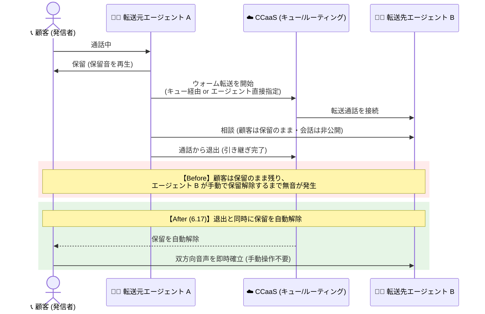

# Google Cloud CCaaS: バージョン 6.17 リリース - ウォーム転送の自動保留解除 (Auto-Resume)

**リリース日**: 2026-10-02

**サービス**: Google Cloud Contact Center as a Service (CCaaS) / Contact Center AI Platform (CCAI Platform)

**機能**: CCaaS 6.17 リリース (ウォーム転送の自動保留解除 + 多数の不具合修正)

**ステータス**: リリース済み (インスタンスへの適用時期はデプロイスケジュールに依存)

📊 [このアップデートのインフォグラフィックを見る](https://takech9203.github.io/google-cloud-news-summary/20261002-ccaas-6-17-warm-transfer-auto-resume.html)

## 概要

Google Cloud Contact Center as a Service (CCaaS) のバージョン 6.17 がリリースされました。各インスタンスへの適用タイミングは、選択しているデプロイスケジュール (Rapid / Regular / Critical) に依存します。

本リリースの目玉機能は **ウォーム転送の自動保留解除 (Warm transfers auto-resume)** です。エージェントがウォーム転送 (転送元エージェントが転送先エージェントと会話してから引き継ぐ転送方式) を行う際、転送元エージェントが通話から退出すると同時に、発信者 (顧客) の保留が自動的に解除され、転送先エージェントと顧客の双方向音声が手動操作なしで確立されるようになりました。エージェント間の相談中は顧客は保留状態のままとなるため、エージェント同士の会話のプライバシーは引き続き保たれます。この動作は、キュー経由でルーティングされるウォーム転送と、特定のエージェントへ直接送られるウォーム転送の両方に適用されます。

このほか、通話終了カードの通話時間が 00:00 と表示される問題、仮想エージェントからキューへの遷移中に発信者が切断した通話がライブダッシュボードに残り続ける問題、複数チーム所属エージェントの不適切なチャネルアクセス権付与など、20 件近い不具合修正が含まれており、コンタクトセンター運用の安定性が全般的に向上しています。

**アップデート前の課題**

- ウォーム転送では、転送元エージェントが通話を退出 (引き継ぎ完了) した後も顧客は保留状態のまま残り、転送先エージェントが手動で保留解除するまで顧客には無音 (保留音) の時間が発生していた
- 転送先エージェントが保留解除の操作を忘れたり遅れたりすると、顧客体験の低下や「電話が切れたのでは」という不安につながっていた
- セッションデータフィードの通話終了カードで通話時間が 00:00 と誤表示される、エージェントが実際には応答可能なのに Unresponsive と誤判定されるなど、運用・レポーティング上の不具合が複数存在していた

**アップデート後の改善**

- 転送元エージェントが通話を退出した瞬間に顧客の保留が自動解除され、転送先エージェントと顧客の双方向音声が手動操作なしで確立されるようになった (引き継ぎ後の無音時間を排除)
- エージェント間の相談中は顧客が保留のまま維持されるため、相談内容のプライバシーは従来どおり確保される
- キュー経由のウォーム転送と特定エージェントへの直接ウォーム転送の両方で一貫した動作となり、エージェントのトレーニング・運用手順を簡素化できる
- 通話ライフサイクル (仮想エージェントからの引き継ぎ、ラップアップタイマー、過剰容量時のディフレクションなど) に関する多数の不具合が修正され、ダッシュボードやメトリクスの正確性が向上した

## アーキテクチャ図

ウォーム転送のシーケンスを Before/After で比較した図です。6.17 では転送元エージェントの退出をトリガーに CCaaS が自動で保留を解除し、転送先エージェントと顧客の会話が途切れなく開始されます。

## サービスアップデートの詳細

### 主要機能

1. **ウォーム転送の自動保留解除 (Warm transfers auto-resume)**
   - 転送元エージェントが通話から退出すると、顧客の保留が自動的に解除され、転送先エージェントとの双方向音声が確立される
   - エージェント間の相談中は顧客が保留状態に保たれ、相談内容は顧客に聞こえない
   - キュー経由のウォーム転送と、特定エージェントへの直接ウォーム転送の両方に適用
   - 従来発生していた「引き継ぎ後に顧客が保留のまま放置される無音時間」を解消

2. **通話ライフサイクル・ルーティング関連の修正 (代表例)**
   - 仮想エージェントからキューへの遷移中に発信者が切断した通話が、ライブダッシュボードに残り続ける問題を修正
   - 仮想エージェントから人間のエージェントへエスカレーションされた通話が、タイムアウト時に元のキューのボイスメールへ誤ってディフレクトされる問題を修正
   - 過剰容量ディフレクション (over-capacity deflection) の条件を満たした通話が宛先キューに到達せず、発信者がルートなしで接続されたままになる問題、および直接内線へのコールド転送時に発信者が無期限に保留される問題を修正
   - 発信者の切断後も仮想エージェントの音声セッションが残り続け、10〜15 分後に遅延エラーログが出力される問題や、ラップアップイベント欠落により仮想エージェントの会話が開きっぱなしになる問題を修正

3. **エージェントデスクトップ・ステータス管理の修正 (代表例)**
   - セッションデータフィードの「Call ended」カードで、実際の通話時間が記録されているにもかかわらず 00:00 と誤表示される問題を修正
   - 複数チームに所属するエージェントが、チームごとの可用性設定を無視してすべてのコミュニケーションチャネルへのアクセス権を誤って付与される問題を修正
   - ノートやディスポジションコードが任意設定の場合に自動ラップアップタイマーがエージェントを解放しない問題、タイマー満了後も Wrap-up ステータスのまま固定される問題を修正
   - ブラウザが前の通話からの遷移を完了する前にコールオファーが送信され、エージェントが誤って Unresponsive と判定される問題を修正
   - クレジットカードのトークン化ハンドバック成功後に「Virtual Agent Session Variables」セクションがコールアダプタに表示されない問題を修正

4. **インテグレーション・UI の改善 (代表例)**
   - Salesforce CRM 連携に、エージェント割り当て時のチケット所有者更新を無視するチェックボックスを追加
   - 特定の書式を含むメールで全画面ローディングが表示され、エージェントがメッセージの閲覧やデスクトップ操作をできなくなる問題を修正
   - キュー間の移動やページ更新後に Agent Assist のステータスが誤って「Off」や「Not Configured」と表示される問題を修正
   - フランス語 (カナダ) ロケールでマイク許可エラーが誤訳されていた問題を修正

## 技術仕様

### ウォーム転送の仕様 (6.17 時点)

| 項目 | 詳細 |
|------|------|
| 自動保留解除のトリガー | 転送元エージェントの通話退出 |
| 適用対象 | キュー経由のウォーム転送、特定エージェントへの直接ウォーム転送 |
| 相談中の顧客の状態 | 保留 (保留音)。エージェント間の会話は顧客に聞こえない |
| 過剰容量ディフレクション | ウォーム転送はトリガーしない (コールド転送のみ対象) |
| 通話時間のカウント | 最初の通話応答時点から継続 (転送でリセットされない) |
| 転送先の指定 | エージェント、マネージャー、キュー (チームへの直接転送は非サポート) |

### デプロイスケジュール (6.17 の適用タイミング)

| スケジュール | 適用タイミング | 推奨環境 |
|------|------|------|
| Rapid | 最も早く更新を受領 | 開発・テストなどの非本番環境 |
| Regular | Rapid の少なくとも 2 日後 | - |
| Critical | Rapid の少なくとも 2 日後、ピーク営業時間外に適用 (通常 1 週間以内) | 本番環境 |

セキュリティパッチは Regular / Critical でも遅延なく即時適用されます。リリースはおよそ 3 週間ごとに行われます。

## 設定方法

ウォーム転送の自動保留解除は 6.17 の適用に伴い有効になる動作変更であり、個別の設定作業は不要です。適用時期の確認・制御は以下の手順で行います。

### 前提条件

1. Google Cloud プロジェクトで CCAI Platform API が有効化されていること
2. CCAI Platform インスタンスが作成済みであること

### 手順

#### ステップ 1: インスタンスのバージョンを確認する

Google Cloud コンソールのナビゲーションメニューで「CCAI Platform」を開き、インスタンス一覧の **Version** 列で現在のバージョンを確認します。6.17 が適用済みであれば本機能が利用できます。

#### ステップ 2: デプロイスケジュールを確認・変更する

インスタンス一覧の **Schedule** 列で現在のデプロイスケジュールを確認できます。変更する場合は、対象インスタンスの「More options」→「Edit」→「Configure deployments」から Rapid / Regular / Critical を選択します。Critical を選択する場合はピーク営業時間 (UTC) のスケジュール定義が必要です。

#### ステップ 3: エージェントの運用手順を更新する

6.17 適用後は、ウォーム転送の引き継ぎ時に転送先エージェントが手動で保留解除する必要がなくなります。従来「転送完了後に Hold ボタンで保留解除する」と案内していたトレーニング資料や運用手順を更新してください。

## メリット

### ビジネス面

- **顧客体験の向上**: 引き継ぎ直後の無音時間がなくなり、顧客が「切断されたのでは」と不安になる場面を排除できる
- **ハンドリングタイムの短縮**: 保留解除の操作待ちがなくなることで、転送後の会話開始までの時間が短縮され、平均処理時間 (AHT) の改善に寄与する
- **運用品質の均一化**: 保留解除忘れという人的ミスの余地がなくなり、エージェントのスキルに依存しない一貫した転送体験を提供できる

### 技術面

- **手動操作の自動化**: 転送元エージェントの退出イベントをトリガーとした自動処理により、転送先エージェント側の操作が不要になる
- **プライバシーの維持**: エージェント間の相談中は従来どおり顧客を保留に保つため、動作変更後も相談内容の秘匿性が確保される
- **ダッシュボード・メトリクスの正確性向上**: ライブダッシュボードの滞留通話、通話時間の誤表示、キュー滞在時間メトリクスの欠落などの修正により、レポーティングの信頼性が向上する

## デメリット・制約事項

### 制限事項

- 6.17 の適用タイミングはインスタンスのデプロイスケジュールに依存するため、全インスタンスで同時に有効になるわけではない (Critical スケジュールでは Rapid の最大 1 週間以上後になる場合がある)
- 自動保留解除はウォーム転送 (転送元エージェントが退出するまで通話に留まる転送) が対象であり、転送先が応答する前に退出するコールド転送は別の動作となる
- チームへの直接転送は引き続きサポートされない (チーム単位の割り当てが必要な場合はチーム専用キューを構成する)

### 考慮すべき点

- 転送先エージェントが退出直後に即座に顧客と接続されるため、「相談終了後にひと呼吸おいてから保留解除する」といった従来の運用を前提としたトークスクリプトは見直しが必要
- デプロイスケジュールが異なる複数インスタンス (開発/本番など) を運用している場合、一時的にインスタンス間で転送の挙動が異なる期間が発生する点に注意
- 特別なイベント期間中にアップグレードを避けたい場合は、Google Cloud サポートへのリクエストでブロック可能だが、1 リリース分 (最大約 6 週間) までに制限される

## ユースケース

### ユースケース 1: 一次受付から専門チームへのエスカレーション

**シナリオ**: 一次受付のエージェントが技術的な問い合わせを受け、専門チームのキューへウォーム転送する。転送元エージェントは専門エージェントに問い合わせ内容を口頭で引き継いでから退出する。

**効果**: 従来は退出後に専門エージェントが保留解除するまで顧客に無音時間が発生していたが、6.17 以降は退出と同時に顧客と専門エージェントの会話が自動的に開始され、スムーズなエスカレーション体験を提供できる。

### ユースケース 2: 仮想エージェントから人間のエージェントへの引き継ぎを含む運用

**シナリオ**: 仮想エージェント (Virtual Agent) で一次対応を行い、解決できない問い合わせを人間のエージェントのキューへエスカレーションするコンタクトセンター。

**効果**: 6.17 では仮想エージェントから人間のエージェントへのエスカレーションがタイムアウト時に誤ってボイスメールへディフレクトされる問題や、遷移中の切断通話がダッシュボードに残る問題、スケジュールされたコールバックのキュー滞在時間メトリクス欠落などが修正されており、仮想エージェントと人間のエージェントを組み合わせたハイブリッド運用の信頼性が向上する。

## 料金

CCaaS 6.17 へのアップデート自体に追加料金は発生しません。CCAI Platform インスタンスは月次課金で、インスタンスに割り当てられた課金モデル (同時接続エージェント数 / 指名エージェント数 / 利用分数) に基づいて請求されます。テレフォニー料金は従量課金です。詳細は料金ページを参照してください。

- [CCAI Platform の課金モデル](https://docs.cloud.google.com/contact-center/ccai-platform/docs/get-started)

## 利用可能リージョン

CCAI Platform が利用可能な国・リージョンの一覧は、[Locations ページ](https://docs.cloud.google.com/contact-center/ccai-platform/docs/localities)を参照してください。

## 関連サービス・機能

- **Agent Assist**: 通話・チャット中のエージェントをリアルタイム支援する機能。本リリースではステータス誤表示やメッセージ分析ジョブの過剰リトライが修正された
- **Dialogflow / Virtual Agent**: 仮想エージェントによる一次対応と人間のエージェントへのエスカレーション。本リリースで引き継ぎ時のライフサイクル関連の問題が複数修正された
- **Salesforce などの CRM 連携**: CCAI Platform は CRM と連携して動作するよう設計されており、本リリースで Salesforce 連携にチケット所有者更新を無視するオプションが追加された

## 参考リンク

- 📊 [インフォグラフィック](https://takech9203.github.io/google-cloud-news-summary/20261002-ccaas-6-17-warm-transfer-auto-resume.html)
- [公式リリースノート](https://docs.cloud.google.com/release-notes#October_02_2026)
- [ウォーム転送のドキュメント](https://docs.cloud.google.com/contact-center/ccai-platform/docs/call-adapter-transfer#warm-transfer)
- [デプロイスケジュール](https://docs.cloud.google.com/contact-center/ccai-platform/docs/deployment-schedules)
- [CCAI Platform の概要](https://docs.cloud.google.com/contact-center/ccai-platform/docs)

## まとめ

CCaaS 6.17 は、ウォーム転送の引き継ぎ時に顧客の保留を自動解除する機能により、コンタクトセンターで日常的に発生する「転送直後の無音時間」という顧客体験上の課題を解消するリリースです。あわせて通話ライフサイクルやステータス管理に関する多数の不具合修正が含まれており、運用の安定性とレポーティングの正確性が向上します。CCaaS を利用中の場合は、インスタンスのデプロイスケジュールから 6.17 の適用時期を確認し、転送時の保留解除操作を前提としたエージェントの運用手順・トレーニング資料を更新することを推奨します。

---

**タグ**: #GoogleCloud #CCaaS #CCAIPlatform #ContactCenter #WarmTransfer #コンタクトセンター #リリース
