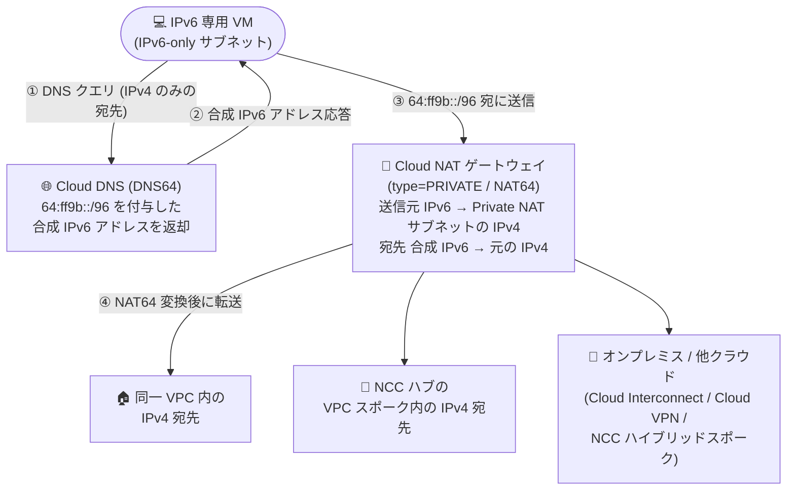

# Cloud NAT: Private NAT の NAT64 (IPv6 から IPv4 への変換) が GA

**リリース日**: 2026-10-02

**サービス**: Cloud NAT

**機能**: Private NAT における NAT64 (IPv6 → IPv4 ネットワークアドレス変換)

**ステータス**: GA (General Availability)

📊 [このアップデートのインフォグラフィックを見る](https://takech9203.github.io/google-cloud-news-summary/20261002-cloud-nat-private-nat-nat64-ga.html)

## 概要

Private NAT 用の Cloud NAT ゲートウェイが、IPv6 から IPv4 へのネットワークアドレス変換 (NAT64) を正式サポート (GA) しました。これにより、IPv6 専用 (IPv6-only) ネットワークインターフェースを持つ Compute Engine VM インスタンスが、プライベートネットワーク内の IPv4 宛先と通信できるようになります。

NAT64 がカバーする宛先は、(1) 同一 VPC ネットワーク内の IPv4 宛先、(2) 同じ Network Connectivity Center (NCC) ハブに接続された VPC スポーク内の宛先、(3) Cloud Interconnect / Cloud VPN / NCC ハイブリッドスポーク経由で接続されたオンプレミスや他クラウドのネットワーク内の宛先です。Cloud DNS の DNS64 と組み合わせることで、IPv6 専用ワークロードから既存の IPv4 インフラへの透過的なアクセスを実現します。

IPv4 アドレスの枯渇対策や、IPv6 への移行を段階的に進めたい企業にとって重要なアップデートです。IPv6 専用のアドレス体系へ移行しつつも、移行が完了していない既存の IPv4 資産 (オンプレミスのレガシーシステムや他クラウドのサービスなど) へのアクセスを維持できます。

**アップデート前の課題**

- Private NAT は IPv4 から IPv4 への変換 (NAT44) のみが GA であり、IPv6 専用 VM からプライベートな IPv4 宛先への通信は正式サポートされていなかった (NAT64 は Preview 段階)
- IPv6 専用サブネットに配置した VM が IPv4 のみのシステムと通信するには、デュアルスタック構成を維持するなど IPv4 アドレスの割り当てが必要だった
- IPv6 移行の過渡期において、オンプレミスや他クラウドに残る IPv4 資産との接続性を保つ正式サポート付きの手段が限られていた

**アップデート後の改善**

- Private NAT の NAT64 が GA となり、本番環境で正式サポートのもと IPv6 専用 VM からプライベート IPv4 宛先への通信が可能になった
- 同一 VPC 内、NCC の VPC スポーク、Cloud Interconnect / Cloud VPN / NCC ハイブリッドスポーク経由の宛先まで、プライベート接続全体で NAT64 を利用できる
- DNS64 (Cloud DNS) との組み合わせにより、アプリケーション側の変更なしで IPv4 宛先の名前解決と通信を透過的に処理できる

## アーキテクチャ図



IPv6 専用 VM は DNS64 が合成した `64:ff9b::/96` プレフィックス付きアドレスへパケットを送信し、NAT64 対応の Private NAT ゲートウェイが送信元/宛先アドレスを IPv4 に変換して、同一 VPC・NCC スポーク・ハイブリッド接続先の IPv4 宛先へ届けます。

## サービスアップデートの詳細

### 主要機能

1. **IPv6 専用 VM からプライベート IPv4 宛先への通信 (NAT64)**
   - IPv6 専用ネットワークインターフェースを持つ Compute Engine VM が IPv4 宛先と通信可能
   - 対象宛先: 同一 VPC ネットワーク内、同じ NCC ハブに接続された VPC スポーク、Cloud Interconnect / Cloud VPN / NCC ハイブリッドスポーク経由のオンプレミス・他クラウドネットワーク
   - NAT64 を有効化すると、これらすべての宛先への変換が適用される

2. **Well-Known Prefix (64:ff9b::/96) ベースの変換メカニズム**
   - 宛先アドレスが `64:ff9b::/96` 範囲の場合にゲートウェイが NAT64 を実行
   - 送信元: VM の IPv6 アドレスとポートを、ゲートウェイに割り当てられた Private NAT サブネット範囲の IPv4 アドレスとポートに変換
   - 宛先: 合成 IPv6 アドレスの下位 32 ビットを抽出して元の IPv4 アドレスに変換し、VPC の IPv4 ルーティングテーブルに従って転送
   - 応答パケットは送信元に `64:ff9b::/96` を付与し、宛先を VM の元のアドレスとポートに書き戻す

3. **DNS64 (Cloud DNS) との連携**
   - Cloud DNS の DNS64 を構成すると、IPv4 のみの宛先に対して `64:ff9b::/96` を前置した合成 IPv6 アドレスを自動的に返却
   - アプリケーションの変更なしに IPv6 専用環境から IPv4 宛先への名前解決・通信が可能

4. **ルーティングサポート**
   - NCC サブネットルート / NCC 動的ルート (NAT44・NAT64 共通)
   - ローカル動的ルート: Cloud Interconnect / Cloud VPN 経由で Cloud Router が学習したルート (Hybrid NAT)
   - ローカルサブネットルート / ローカル静的ルート (NAT64 のみ): 同一 VPC 内のトラフィックに使用

## 技術仕様

### Private NAT における NAT64 の仕様

| 項目 | 詳細 |
|------|------|
| 変換タイプ | IPv6 → IPv4 (NAT64)。1 つのゲートウェイで NAT44 と NAT64 の併用は不可 |
| 送信元 | IPv6 専用サブネットまたはデュアルスタックサブネット内の IPv6 専用 VM インスタンス |
| 宛先プレフィックス | `64:ff9b::/96` (Well-Known Prefix) |
| 対応プロトコル | TCP、UDP のみ (ICMP などは非対応) |
| 同時接続数 | エンドポイントあたり最大 64,000 接続 |
| 制御プレーン | Cloud Router に関連付け (データプレーンにはゲートウェイ・ルーターを経由しない分散型) |
| ポート割り当て | デフォルトは動的ポート割り当て (静的も選択可) |
| ログ | デフォルト無効 (有効化可能) |

### ルーティングに関する考慮事項

| ケース | 動作 |
|------|------|
| ポリシーベースルート | NAT64 は IPv4/IPv6 ポリシーベースルートを使用しない。宛先が `64:ff9b::/96` ならポリシーベースルートに一致しても NAT64 が実行される |
| VPC ネットワークピアリングルート | 埋め込まれた宛先 IPv4 アドレスがピアリングルートに一致する場合、パケットはドロップされる |
| インターネットルート | 埋め込まれた宛先 IPv4 アドレスがインターネット向けルートに一致する場合、NAT64 は実行されない (インターネット向けは Public NAT の NAT64 を使用) |

## 設定方法

### 前提条件

1. カスタムモードの VPC ネットワーク (Private NAT は自動モード VPC 非対応)
2. IPv6 専用 (または デュアルスタック) サブネットと IPv6 専用 VM インスタンス
3. 変換用の IPv4 アドレス範囲を持つ Private NAT サブネット (purpose=PRIVATE_NAT) の作成
4. IPv4 宛先の名前解決を透過的に行う場合は Cloud DNS の DNS64 構成

### 手順

#### ステップ 1: Cloud Router の作成

```bash
gcloud compute routers create ROUTER_NAME \
  --network=NETWORK \
  --region=REGION
```

Private NAT を構成するリージョンに Cloud Router を作成します。

#### ステップ 2: NAT64 用 Cloud NAT ゲートウェイ (type=PRIVATE) の作成

```bash
# すべての IPv6 サブネット範囲を対象にする場合
gcloud compute routers nats create NAT_CONFIG \
  --router=ROUTER_NAME \
  --region=REGION \
  --type=PRIVATE \
  --nat64-all-v6-subnet-ip-ranges

# カスタムの IPv6 サブネット範囲を対象にする場合
gcloud compute routers nats create NAT_CONFIG \
  --router=ROUTER_NAME \
  --region=REGION \
  --type=PRIVATE \
  --nat64-custom-v6-subnet-ip-ranges=SUBNETWORK_1,SUBNETWORK_2
```

#### ステップ 3: NAT64 用の NAT ルールの作成

```bash
gcloud beta compute routers nats rules create NAT_RULE_PRIORITY \
  --router=ROUTER_NAME \
  --region=REGION \
  --nat=NAT_CONFIG \
  --match='isIPv6(source.ip)' \
  --source-nat-active-ranges=NAT_SUBNET
```

`isIPv6(source.ip)` の一致条件で、送信元 IPv6 トラフィックに Private NAT サブネット (NAT_SUBNET) の IPv4 範囲を使った変換を適用します。

## メリット

### ビジネス面

- **IPv6 移行の加速**: IPv4 アドレスを新規割り当てせずに IPv6 専用インフラへ移行でき、IPv6 化の義務・方針 (コンプライアンス要件) に対応しやすい
- **IPv4 アドレスコストの削減**: IPv6 専用サブネットの活用により、枯渇しつつある IPv4 アドレス空間の消費を抑制できる
- **移行期のサービス継続性**: 移行が完了していない IPv4 のオンプレミス・他クラウド資産へのアクセスを維持し、クリティカルなサービスの中断を回避できる

### 技術面

- **フルマネージドかつ分散型**: ゲートウェイと Cloud Router は制御プレーンのみを提供し、データプレーンはパケットがゲートウェイを経由しない分散型アーキテクチャ。VM の帯域幅を低下させない
- **広い宛先カバレッジ**: 同一 VPC、NCC VPC スポーク、Cloud Interconnect / Cloud VPN / NCC ハイブリッドスポーク経由の宛先まで一括して NAT64 を適用可能
- **DNS64 との透過的な統合**: Cloud DNS の DNS64 と組み合わせることで、アプリケーション変更なしに IPv4 宛先へ接続可能
- **GA による本番適用**: Pre-GA 利用規約の制約がなくなり、本番ワークロードで正式サポートを受けられる

## デメリット・制約事項

### 制限事項

- NAT64 は Compute Engine VM インスタンスのみ対象。GKE ノードおよびサーバーレスエンドポイントは IPv4 アドレスの変換のみサポート
- 対応マシンシリーズは第 2 世代以前のシリーズおよび M3 シリーズ (ドキュメント記載時点)
- 同一 VPC ネットワーク内の IPv4 Private Service Connect エンドポイントには NAT64 経由で到達できない
- 1 つのゲートウェイでは NAT44 または NAT64 のどちらか一方のみ構成可能 (両方は不可)
- サポートされるプロトコルは TCP と UDP のみ (ICMP 非対応)
- 埋め込まれた宛先 IPv4 アドレスが VPC ピアリングルートに一致するパケットはドロップされる
- インターネット宛てのトラフィックには Private NAT の NAT64 は適用されない (Public NAT の NAT64 を使用)

### 考慮すべき点

- Private NAT サブネットは作成後にサイズ変更 (拡大・縮小) ができないため、必要な IPv4 変換容量を見込んだ設計が必要 (複数の Private NAT サブネット範囲の指定は可能)
- `isIPv6(source.ip)` オプションを有効化した後は、該当ゲートウェイや同じ Cloud Router 上のゲートウェイ・Cloud Router の更新に beta 版 gcloud CLI が必要
- Private NAT は接続先ネットワークからの未承諾のインバウンドリクエストを許可しない (アウトバウンド接続とその応答のみ)
- DNS64 を使用しない場合、アプリケーション側で `64:ff9b::/96` プレフィックスを付与した宛先アドレスを扱う必要がある

## ユースケース

### ユースケース 1: IPv6 専用インフラへの段階的移行 (ハイブリッド環境)

**シナリオ**: 企業が Google Cloud 上のワークロードを IPv6 専用サブネットへ移行する一方、オンプレミスのデータベースや基幹システムは IPv4 のまま残っており、Cloud Interconnect 経由でのアクセス継続が必要。

**実装例**:
```bash
# IPv6 専用サブネットの VM から、Interconnect 経由のオンプレ IPv4 システムへ
# DNS64 + NAT64 (type=PRIVATE) を構成し、Cloud Router が学習した
# 動的ルート (Hybrid NAT) 経由で通信
gcloud compute routers nats create nat64-hybrid \
  --router=my-router --region=asia-northeast1 \
  --type=PRIVATE --nat64-all-v6-subnet-ip-ranges
```

**効果**: オンプレミス側のネットワーク改修なしに、クラウド側を IPv6 専用化しつつ既存 IPv4 資産との接続を維持できる。

### ユースケース 2: NCC ハブ & スポーク構成での IPv6/IPv4 混在環境の統合

**シナリオ**: Network Connectivity Center のハブに複数の VPC スポークを接続しており、新規ワークロードは IPv6 専用 VPC に、既存ワークロードは IPv4 VPC に配置されている。

**効果**: IPv6 専用スポークの VM から IPv4 スポーク内のサービスへ NAT64 経由で通信でき、スポークごとに移行時期をずらした段階的な IPv6 化が可能になる。

## 料金

Private NAT の料金は、NAT ゲートウェイの時間課金と、ゲートウェイが処理したデータ量 (GiB 単位) の課金で構成されます。Private NAT サブネットのプライベート IP アドレスは無料です。Cloud Interconnect / Cloud VPN / NCC 経由でネットワーク外へトラフィックを送る場合は、それらのサービスのデータ転送費用が別途かかります。

### 料金例

| 項目 | 料金 |
|--------|-----------------|
| Private NAT ゲートウェイ (時間あたり) | $0.045 |
| ゲートウェイ処理データ (GiB あたり、送受信) | $0.045 (全リージョン共通) |
| 月額例: ゲートウェイ 720 時間稼働 + 200 GiB 処理 | ($0.045 × 720h) + (200 GiB × $0.045) = 約 $41.4 |

詳細は [Cloud NAT 料金ページ](https://cloud.google.com/nat/pricing) を参照してください。

## 利用可能リージョン

リージョン別の提供状況はリリースノートに個別の記載がありません。Cloud NAT のドキュメントおよび [Cloud NAT 料金ページ](https://cloud.google.com/nat/pricing) を参照してください (データ処理料金は全リージョン共通)。

## 関連サービス・機能

- **Cloud DNS (DNS64)**: IPv4 のみの宛先に対して `64:ff9b::/96` を前置した合成 IPv6 アドレスを返却し、NAT64 と組み合わせて透過的な 6to4 接続を実現
- **Network Connectivity Center (NCC)**: ハブに接続された VPC スポーク間のトラフィックに NAT64 を適用可能。ハイブリッドスポーク経由の宛先もサポート
- **Cloud Interconnect / Cloud VPN**: オンプレミスや他クラウドの IPv4 ネットワークへの接続経路。Cloud Router が学習した動的ルートを NAT64 が使用
- **Cloud Router**: Private NAT ゲートウェイの制御プレーンを提供 (BGP には非依存)
- **Public NAT の NAT64**: インターネット上の IPv4 宛先向けの変換。プライベート宛先向けの本機能と使い分ける
- **Cloud Monitoring / Cloud Logging**: NAT ゲートウェイのメトリクス監視と接続ログの記録

## 参考リンク

- 📊 [インフォグラフィック](https://takech9203.github.io/google-cloud-news-summary/20261002-cloud-nat-private-nat-nat64-ga.html)
- [公式リリースノート](https://docs.cloud.google.com/release-notes#October_02_2026)
- [ドキュメント: NAT64 in Private NAT](https://docs.cloud.google.com/nat/docs/private-nat#nat64)
- [ドキュメント: Private NAT の設定](https://docs.cloud.google.com/nat/docs/set-up-private-nat)
- [ドキュメント: DNS64 and NAT64 for 6to4 connectivity](https://docs.cloud.google.com/vpc/docs/ipv6-to-ipv4-overview)
- [料金ページ](https://cloud.google.com/nat/pricing)

## まとめ

Private NAT の NAT64 が GA となり、IPv6 専用 VM からプライベートネットワーク内の IPv4 宛先 (同一 VPC、NCC スポーク、ハイブリッド接続先) への通信を本番環境で正式サポート付きで利用できるようになりました。IPv6 移行を進める組織は、DNS64 (Cloud DNS) と組み合わせた構成を検証し、対象マシンシリーズや PSC エンドポイント非対応などの制限事項を確認したうえで、IPv6 専用サブネットの採用計画に組み込むことを推奨します。

---

**タグ**: Cloud NAT, Private NAT, NAT64, IPv6, IPv4, DNS64, Network Connectivity Center, Cloud Interconnect, Cloud VPN, GA, ネットワーキング
