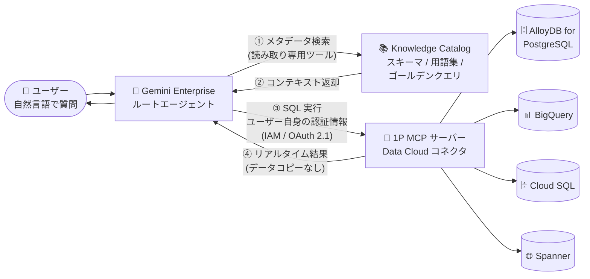

# Gemini Enterprise: Data Cloud コネクタのフェデレーテッドクエリモードと Knowledge Catalog 統合 (Preview)

**リリース日**: 2026-10-02

**サービス**: Gemini Enterprise

**機能**: Data Cloud コネクタのフェデレーテッドクエリモードと Knowledge Catalog 統合

**ステータス**: Preview

📊 [このアップデートのインフォグラフィックを見る](https://takech9203.github.io/google-cloud-news-summary/20261002-gemini-enterprise-data-cloud-federated-query-mode.html)

## 概要

Gemini Enterprise の Data Cloud コネクタに **フェデレーテッドクエリモード** が Preview として追加されました。対象コネクタは **AlloyDB for PostgreSQL、BigQuery、Cloud SQL、Spanner** の 4 つです。フェデレーテッドクエリモードでは、データを Gemini Enterprise のデータストアにコピー (取り込み) することなく、Model Context Protocol (MCP) と各ユーザー自身の認証情報を使用して、運用データ・分析データをその場 (in place) でクエリできます。

各 Data Cloud コネクタは Google が提供するファーストパーティ (1P) MCP サーバーで動作します。ユーザーが質問すると、Gemini Enterprise はそのユーザー自身の認証情報 (IAM 権限または OAuth 2.1) でリクエストを認証し、基盤となるデータソースに対して直接クエリを実行します。これにより、BigQuery の行レベルセキュリティを含む既存の IAM 権限がそのまま維持され、ガバナンスの効いたリアルタイムの結果が得られます。

あわせて **Knowledge Catalog 統合** も Preview として提供されます。フェデレーテッドクエリモードで Data Cloud コネクタをアプリにアタッチすると、アプリの Assistant タブで Knowledge Catalog が自動的に有効化されます。これにより、アシスタントはユーザーがアクセスできるデータを検索し、テーブルスキーマ・カラム説明・ビジネス用語集・検証済みサンプルクエリ (ゴールデンクエリ) などの技術的・ビジネス的コンテキストを取得する読み取り専用ツールを利用できるようになります。自然言語でデータ分析を行う会話型アナリティクスの実現を目的とした、ビジネスユーザーとアナリスト向けのアップデートです。

**アップデート前の課題**

- Data Cloud コネクタはデータ取り込みモードのみで、データソースから Gemini Enterprise のデータストアへデータをコピーする必要があり、データ移動に伴う Egress コストが発生していた
- 取り込んだデータは元のテーブルの変更を反映するために定期的なリフレッシュが必要で、リアルタイムのデータに対する分析ができなかった
- BigQuery から取り込んだデータには元の IAM 権限が複製されず、十分な Gemini Enterprise 権限を持つユーザーは BigQuery 側で閲覧権限がないデータも参照できてしまうという、アクセス制御上の課題があった
- 自己管理のカスタム MCP サーバーで同様の連携を構築する場合、MCP ミドルウェアのデプロイや OAuth クライアント設定の管理が必要だった

**アップデート後の改善**

- データをコピー・インデックス化せずにその場でクエリできるようになり、Egress コストやデータリフレッシュの運用が不要になった
- クエリがユーザー自身の認証情報で実行されるため、行レベルセキュリティを含む既存の IAM 権限がそのまま適用され、ガバナンスを維持したままリアルタイムデータへアクセスできるようになった
- Knowledge Catalog 統合が自動で有効化され、エージェントがユーザーのアクセス可能なデータ資産を意味的に検索し、スキーマやビジネス用語集などの文脈を取得して高精度な SQL を生成できるようになった
- BigQuery やデータベース向けの高度な SQL 生成など、データエンジンごとに最適化された組み込みエージェントスキルが提供され、カスタム MCP サーバーを自前で構築する必要がなくなった

## アーキテクチャ図



ユーザーの質問を受けたエージェントが Knowledge Catalog でデータ資産とビジネスコンテキストを検索し、取得したスキーマ情報をもとに SQL を生成して、ユーザー自身の認証情報で MCP 経由により各データソースをその場でクエリします。データは Gemini Enterprise のデータストアにコピーされません。

## サービスアップデートの詳細

### 主要機能

1. **フェデレーテッドクエリモード (Preview)**
   - AlloyDB for PostgreSQL、BigQuery、Cloud SQL、Spanner の 4 コネクタで利用可能
   - データを Gemini Enterprise のデータストアにコピー・インデックス化せず、その場でクエリを実行
   - 各コネクタは Google 管理のファーストパーティ MCP サーバーで動作し、ユーザー自身の認証情報 (IAM 権限または OAuth 2.1) でリクエストを認証して直接クエリを実行

2. **Knowledge Catalog 統合 (Preview)**
   - フェデレーテッドクエリモードで Data Cloud コネクタをアタッチすると、アプリの Assistant タブで自動的に有効化 (個別のデータストアとしてではなく、アシスタント機能として提供)
   - エージェントに読み取り専用ツールを提供し、ユーザーがアクセス権を持つデータ資産の検索と、テーブルスキーマ・カラム説明・ビジネス用語集・ゴールデンクエリ (検証済みサンプルクエリ) などの取得が可能
   - ゴールデンクエリにより、複雑なスキーマでの JOIN のハルシネーションを防止
   - Assistant タブからいつでも手動でオン/オフ可能 (コネクタなしで Knowledge Catalog のみ有効化することも可能)

3. **データエンジンごとの組み込みスキル**
   - BigQuery やデータベース向けの高度な SQL・AI 関数生成など、各データエンジンに最適化された事前構成済みエージェントスキルを搭載
   - クエリ計画、フィルタ値の解決、高度な分析関数の利用、エラーハンドリングをエキスパートのデータアナリストのように実行する「分析ハーネス」を Google が管理

4. **管理者向けガバナンス設定**
   - BigQuery コネクタでは課金プロジェクト ID (Billing Project ID) を指定でき、コネクタ経由のすべてのクエリジョブを指定プロジェクトで実行・課金可能
   - コネクタ作成時に有効化するアクション (読み取り/書き込み) を選択可能

### クエリ処理のワークフロー

ユーザーが「今月の防寒商品の売上件数は?」のような自然言語の質問をすると、次の流れで処理されます。

1. **意味的検索**: ルートエージェントが質問からキーワードを抽出し、Knowledge Catalog でユーザーがアクセスできるデータ資産を検索
2. **コンテキスト取得**: 一致したエントリについて、テクニカルメタデータ・利用パターン・ビジネス用語集・LLM 推論から導出された拡充メタデータを取得
3. **クエリ生成・実行**: 取得したスキーマとビジネス定義をもとに SQL を生成し、フェデレーテッドコネクタの MCP ツール経由で実行してリアルタイムの結果を返却

## 技術仕様

### 2 つのコネクタモードの比較

| 項目 | フェデレーテッドクエリモード (Preview) | データ取り込みモード |
|------|------|------|
| データの保存場所 | 元のデータソースのまま (コピーなし) | Gemini Enterprise データストアにコピー |
| データ鮮度 | リアルタイム | リフレッシュが必要 |
| 認証 | ユーザー自身の認証情報 (IAM / OAuth 2.1) | サービスアカウント |
| アクセス制御 | 元の IAM 権限を維持 (行レベルセキュリティ含む) | 元の IAM 権限は複製されない |
| Egress コスト | 発生しない | データ移動時に発生 |
| Knowledge Catalog | 自動有効化 | - |

### セキュリティ・コンプライアンス

| 項目 | 詳細 |
|------|------|
| データレジデンシー (DRZ) | データは元の保存場所から移動せず、クエリ結果のみアプリのロケーションに返却。us / eu マルチリージョンに対応 |
| CMEK | 元データは各データソース側で CMEK を構成。Gemini Enterprise 側でも会話に保存されるクエリ結果、コネクタ設定、エンドユーザー認証情報を Cloud KMS 管理鍵で保護可能 |
| VPC Service Controls | サービス境界内で保護可能。組織ポリシー `discoveryengine.managed.allowedDataSources` の `allowedDataSources` にコネクタ ID の許可が必要 |
| Knowledge Catalog の権限 | エンドユーザー認証情報で認証し、ユーザーに読み取り権限がない資産は検索結果から自動的に除外 (検索結果トリミング)。Dataplex API の有効化や追加の MCP ツール権限は不要 |

### VPC Service Controls 利用時のコネクタ識別子

```
allowedDataSources に追加する識別子:
- bigquery_mcp : BigQuery フェデレーテッドコネクタ
- spanner      : Spanner フェデレーテッドコネクタ
- cloudsql     : Cloud SQL フェデレーテッドコネクタ
- alloydb      : AlloyDB for PostgreSQL フェデレーテッドコネクタ
```

### BigQuery フェデレーテッドクエリモードで必要な主な IAM ロール (ユーザー側)

| ロール | 付与先 | 用途 |
|------|------|------|
| BigQuery Job User (`roles/bigquery.jobUser`) | クエリ実行 (課金) プロジェクト | クエリジョブの実行 |
| BigQuery Data Viewer (`roles/bigquery.dataViewer`) | データ保存プロジェクト | データ・メタデータへのアクセス (書き込みアクションを有効化する場合は `roles/bigquery.dataEditor`) |
| MCP Tool User (`roles/mcp.toolUser`) | 保存・実行の両プロジェクト | MCP ツールの利用 |

## 設定方法

### 前提条件

1. Gemini Enterprise Admin (`roles/discoveryengine.agentspaceAdmin`) または Discovery Engine Admin (`roles/discoveryengine.admin`) ロールを持っていること
2. VPC Service Controls 境界や組織ポリシー適用環境では、`discoveryengine.managed.allowedDataSources` 制約で対象コネクタ ID (例: `bigquery_mcp`) を許可しておくこと
3. クエリを実行するユーザーに、対象データソースに対する適切な IAM ロール (上記参照) が付与されていること

### 手順 (BigQuery の例)

#### ステップ 1: データストアの作成

1. Google Cloud コンソールで **Gemini Enterprise** ページに移動
2. **Data stores** ページで **Create data store** をクリック
3. データソースとして **BigQuery** を選択し、**Add data source** をクリック

#### ステップ 2: フェデレーテッドクエリモードの選択

1. コネクタモードで **Federated query (recommended)** を選択
2. 必要に応じて **Advanced options** で **Billing Project ID** を指定 (すべてのクエリジョブの実行・課金先プロジェクトを固定可能。未指定の場合はユーザーへのプロンプトまたはカスタム指示に依存)
3. **Actions** ページで有効化する BigQuery アクション (読み取り/書き込み) を選択

#### ステップ 3: アプリへのアタッチ

1. データコネクタのロケーションと名前、必要に応じて機密データ保護ポリシーを設定して **Create** をクリック
2. Gemini Enterprise アプリにデータストアをアタッチすると、Assistant タブで Knowledge Catalog が自動的に有効化される
3. Knowledge Catalog は **Configurations → Assistant** タブのトグルでいつでもオン/オフ可能

## メリット

### ビジネス面

- **会話型アナリティクスの実現**: ビジネスユーザーやアナリストが自然言語で質問するだけで、BigQuery の分析データや Spanner / Cloud SQL / AlloyDB の運用データからリアルタイムにインサイトを取得できる
- **コスト最適化**: データのコピー・移動に伴う Egress コストと、取り込みデータのインデックス維持コストが不要になる
- **ガバナンスの一元化**: データが元の場所に留まるため、既存のデータガバナンス (IAM、行レベルセキュリティ、CMEK、データレジデンシー) をそのまま活用できる

### 技術面

- **ユーザー単位の認証**: 各クエリがユーザー自身の認証情報で実行されるため、ユーザーがアクセスできないデータは検索・取得されず、最小権限の原則を自然に維持できる
- **メタデータ駆動の高精度なクエリ生成**: Knowledge Catalog のスキーマ・用語集・ゴールデンクエリにより、JOIN のハルシネーションを防ぎ、ビジネス定義に沿った正確な SQL を生成できる
- **運用レスな MCP 連携**: ファーストパーティ MCP サーバーを Google が管理するため、MCP ミドルウェアのデプロイや OAuth クライアント設定の自前管理が不要

## デメリット・制約事項

### 制限事項

- フェデレーテッドクエリモードおよび Knowledge Catalog 統合は Preview 段階であり、Pre-GA Offerings Terms が適用され、サポートが限定される可能性がある
- Data Cloud コネクタは特定のリソースにスコープされない。アタッチすると、認証されたユーザーが閲覧・クエリ可能なそのデータソース内のすべてのリソースにアクセスできる (単一のデータセットやテーブルに制限されない)
- Gemini Enterprise のデータレジデンシーは us / eu マルチリージョンに対応

### 考慮すべき点

- 特定のデータベースやテーブルセットへの厳格で決定論的なスコープが必要な高精度ワークロードでは、コネクタではなくスコープ付きデータエージェント (例: BigQuery データエージェント) を作成して Gemini Enterprise に公開することが推奨される
- エージェントを特定のデータセットや正しい指標定義に誘導するには、Knowledge Catalog のメタデータ整備 (用語集、データプロダクト、ゴールデンクエリ)、カスタム指示、エージェントスキルの併用が必要
- BigQuery では、課金プロジェクト ID を設定しない場合、クエリ時にユーザーへの課金プロジェクトの確認が発生する。ガバナンスとコスト管理のため管理者による設定が推奨される
- VPC Service Controls 環境では組織ポリシーへのコネクタ ID 追加が必要 (ファーストパーティコネクタは内部 Google API 経由で通信するため、`allowedEgressFqdns` へのドメイン追加は不要)

## ユースケース

### ユースケース 1: BigQuery に対する自然言語での売上分析

**シナリオ**: ビジネスユーザーが SQL を書かずに「今月の防寒商品の売上件数は?」と質問し、BigQuery 上の最新データから回答を得たい。

**実装例** (エージェントが内部的に実行する流れ):
```sql
-- ① Knowledge Catalog 検索: ["cold weather", "products", "orders", "sales"]
-- ② コンテキスト取得: my-project.ecomm.products,
--    用語集 "Cold Weather Products: category IN ('Sweaters', 'Coats & Jackets')"
-- ③ 生成された読み取り専用 SQL を BigQuery コネクタ経由で実行:
SELECT COUNT(order_id)
FROM `my-project.ecomm.orders`
WHERE product_id IN (
  SELECT id FROM `my-project.ecomm.products`
  WHERE category IN ('Sweaters', 'Coats & Jackets')
);
```

**効果**: ビジネス用語集に基づく正確な定義で、リアルタイムの BigQuery データから即座に回答が得られる。ユーザーの IAM 権限 (行レベルセキュリティ含む) が維持されるため、ガバナンスを損なわない。

### ユースケース 2: 運用データベースのリアルタイムインサイト

**シナリオ**: サポートチームや運用チームが、Spanner / Cloud SQL / AlloyDB for PostgreSQL 上の運用データ (注文状況、在庫、顧客情報など) に対して、ETL パイプラインを構築せずに自然言語でライブクエリを実行したい。

**効果**: データウェアハウスへの複製を待たずに最新の運用データへ直接アクセスでき、データ鮮度の問題と ETL 構築・運用の負担が解消される。許可された書き込みアクションを有効化すれば、ユーザー権限の範囲内でデータベース操作も可能。

### ユースケース 3: ガバナンス重視の組織でのセルフサービス分析

**シナリオ**: 金融・医療など規制の厳しい業界で、データのコピーを最小化しつつ全社的なセルフサービス分析を導入したい。

**効果**: データは元のソースに留まり (データレジデンシー維持)、CMEK・VPC Service Controls と組み合わせてコンプライアンス要件を満たしながら、ユーザーごとの IAM 権限に基づく安全な会話型アナリティクスを提供できる。

## 料金

フェデレーテッドクエリモードでは、データのコピーに伴う Egress コストや Gemini Enterprise 側のインデックス作成コストは発生しません。一方、ユーザーがアタッチ済みアプリ経由でクエリを実行すると、**基盤となるデータソース側のコンピュートコスト** (例: BigQuery のクエリ料金) が発生します。BigQuery コネクタでは課金プロジェクト ID を指定することで、クエリコストの計上先を一元管理できます。

参考: データ取り込みモードの場合は、アプリへのアタッチ前であってもデータインポート時に BigQuery と Gemini Enterprise のインデックス作成コストが発生します。

詳細は [Gemini Enterprise の料金ページ](https://cloud.google.com/generative-ai-app-builder/pricing) を参照してください。

## 利用可能リージョン

Gemini Enterprise は us / eu マルチリージョンでのデータレジデンシーに対応しています。詳細は [Gemini Enterprise locations](https://docs.cloud.google.com/gemini/enterprise/docs/locations) を参照してください。

## 関連サービス・機能

- **BigQuery / BigQuery MCP サーバー**: BigQuery フェデレーテッドコネクタは BigQuery MCP サーバーを利用。高度な SQL・AI 関数生成スキルを搭載
- **AlloyDB for PostgreSQL / Cloud SQL / Spanner**: フェデレーテッドクエリモード対応の運用データベース。リアルタイムの分析クエリと許可されたデータベース操作が可能
- **Knowledge Catalog (Dataplex)**: データ資産のメタデータ (スキーマ、用語集、データプロダクト、ゴールデンクエリ) を一元管理。Gemini Enterprise 以外にも BigQuery Studio や MCP クライアントなど他のプラットフォームからも再利用可能
- **IAM / Workforce Identity Federation**: ユーザー単位の認証・認可の基盤。行レベルセキュリティなどのきめ細かなアクセス制御がそのまま適用される
- **VPC Service Controls / Cloud KMS (CMEK)**: データ漏洩リスクの軽減と暗号鍵の顧客管理により、エンタープライズのセキュリティ要件に対応
- **BigQuery データエージェント**: 特定のデータセットに厳格にスコープした会話型アナリティクスが必要な場合の代替手段。Gemini Enterprise に公開可能

## 参考リンク

- 📊 [インフォグラフィック](https://takech9203.github.io/google-cloud-news-summary/20261002-gemini-enterprise-data-cloud-federated-query-mode.html)
- [公式リリースノート](https://docs.cloud.google.com/release-notes#October_02_2026)
- [Connect to Data Cloud](https://docs.cloud.google.com/gemini/enterprise/docs/connectors/connect-data-cloud)
- [Connect to Knowledge Catalog](https://docs.cloud.google.com/gemini/enterprise/docs/connectors/connect-knowledge-catalog)
- [Best practices for Data Cloud connectors](https://docs.cloud.google.com/gemini/enterprise/docs/connectors/data-cloud-best-practices)
- [Secure Data Cloud connectors](https://docs.cloud.google.com/gemini/enterprise/docs/connectors/data-cloud-security)
- [Connect to BigQuery](https://docs.cloud.google.com/gemini/enterprise/docs/connectors/connect-bigquery)
- [料金ページ](https://cloud.google.com/generative-ai-app-builder/pricing)

## まとめ

Data Cloud コネクタのフェデレーテッドクエリモードは、データをコピーせずにユーザー自身の認証情報で BigQuery や運用データベースをその場でクエリできる、ガバナンスとリアルタイム性を両立した会話型アナリティクスの基盤です。Knowledge Catalog 統合の自動有効化により、メタデータ駆動の高精度なクエリ生成が可能になります。Gemini Enterprise で全社的なデータ活用を検討している組織は、Preview 段階のうちに Knowledge Catalog のメタデータ整備 (用語集、ゴールデンクエリ) とあわせて検証を開始することを推奨します。

---

**タグ**: Gemini Enterprise, BigQuery, AlloyDB, Cloud SQL, Spanner, MCP, Knowledge Catalog, Federated Query, Preview, 会話型アナリティクス
