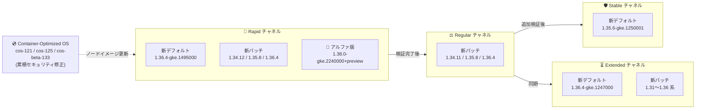

# Google Kubernetes Engine (GKE): バージョンアップデート 2026-R42

**リリース日**: 2026-10-02

**サービス**: Google Kubernetes Engine (GKE)

**機能**: クラスタバージョンの更新とセキュリティアップデート (2026-R42)

**ステータス**: Change + Security (Version Update / Security Update)

📊 [このアップデートのインフォグラフィックを見る](https://takech9203.github.io/google-cloud-news-summary/20261002-gke-2026-r42-version-updates.html)

## 概要

Google Kubernetes Engine (GKE) の全リリースチャネル (Rapid, Regular, Stable, Extended, No channel) において、クラスタバージョンが更新された。今回の 2026-R42 アップデートでは、Rapid チャネルのデフォルトバージョンが 1.36.4-gke.1495000 に、Stable チャネルのデフォルトバージョンが 1.35.6-gke.1250001 に、Extended チャネルのデフォルトバージョンが 1.36.4-gke.1247000 にそれぞれ更新された。Rapid チャネルには 1.34.12 / 1.35.8 / 1.36.4 系の新パッチ (1.34.12-gke.1011000, 1.35.8-gke.1626001, 1.35.8-gke.1796000, 1.36.4-gke.2046000) が追加され、アルファクラスタ向けには次期マイナーバージョンのアルファ版 1.38.0-gke.2240000+preview が利用可能になった。Regular チャネルには 1.34.11-gke.1102000 / 1.35.8-gke.1380001 / 1.35.8-gke.1439001 / 1.36.4-gke.1391000 が、Extended チャネルには 1.31〜1.36 系の多数の新パッチが追加されている。

セキュリティアップデート (2026-R42) として、更新された Container-Optimized OS イメージを使用する新しい GKE バージョンもリリースされた。これらのイメージは前回の GKE リリース以降に公開されたすべての Container-Optimized OS のセキュリティ修正を累積的に含んでおり、今回は cos-121 / cos-125 / cos-beta-133 のイメージが 1.31.14 / 1.32.13 / 1.33.13 / 1.34.12 / 1.35.8 / 1.38.0 系の新バージョンに適用されている。このアップデートは、GKE クラスタを運用するすべてのプラットフォーム管理者およびインフラエンジニアに影響する。

なお、同日に GKE コントロールプレーン 1.36.3-gke.1244000 以降で Cloud Storage FUSE CSI ドライバー (gcsfusecsi-node) の DaemonSet Pod が特定のノードプールで起動に失敗する既知の問題も公開されているが、こちらは別レポート ([GKE: Cloud Storage FUSE CSI ドライバー Pod 起動問題](2026-10-02-gke-gcsfuse-csi-driver-pod-startup-issue.md)) を参照されたい。

**アップデート前の課題**

- 前回までのバージョンには、直近の Container-Optimized OS セキュリティ修正が含まれていなかった
- Rapid チャネルの新規クラスタには 1.36.4 系の最新パッチ (1.36.4-gke.1495000) が標準適用されていなかった
- Stable / Extended チャネルのデフォルトは旧パッチのままで、新規クラスタに最新の修正済みバージョンが適用されていなかった
- Kubernetes 1.38 系はアルファクラスタでも検証できなかった

**アップデート後の改善**

- Rapid チャネルのデフォルトが 1.36.4-gke.1495000 に更新され、新規クラスタに 1.36.4 系の新パッチが標準適用されるようになった
- Stable チャネルのデフォルトが 1.35.6-gke.1250001 に、Extended チャネルのデフォルトが 1.36.4-gke.1247000 に更新された
- 各チャネルに 1.31〜1.36 系の新パッチが追加され、自動アップグレードターゲットも更新された
- 累積的なセキュリティ修正を含む Container-Optimized OS イメージ (cos-121 / cos-125 / cos-beta-133) が新バージョンに適用され、ノード OS の脆弱性リスクが低減された
- アルファ版 1.38.0-gke.2240000+preview により、次期マイナーバージョンの早期検証が可能になった

## アーキテクチャ図



GKE のリリースチャネルは、Rapid で導入されたバージョンが検証を経て Regular、Stable へと段階的に展開されるパイプラインとして機能する。今回は Rapid / Stable / Extended の 3 チャネルでデフォルトバージョンが引き上げられ、累積的なセキュリティ修正を含む新しい Container-Optimized OS イメージが各バージョンに組み込まれている。

## サービスアップデートの詳細

### チャネル別バージョン一覧

| チャネル | デフォルトバージョン | 新規追加バージョン | 非推奨バージョン (90 日以内に削除) |
|---------|---------------------|-------------------|-----------------|
| Rapid | 1.36.4-gke.1495000 (新デフォルト) | 1.34.12-gke.1011000, 1.35.8-gke.1626001, 1.35.8-gke.1796000, 1.36.4-gke.2046000、アルファクラスタ向け 1.38.0-gke.2240000+preview | 1.35.8-gke.1439000, 1.35.8-gke.1626000 (1.34.11-gke.1102000, 1.36.4-gke.1391000 は Rapid では提供終了) |
| Regular | 変更なし | 1.34.11-gke.1102000, 1.35.8-gke.1380001, 1.35.8-gke.1439001, 1.36.4-gke.1391000 | 1.35.8-gke.1380000, 1.36.3-gke.1767000 (1.34.11-gke.1044000 は提供終了) |
| Stable | 1.35.6-gke.1250001 (新デフォルト) | 1.34.11-gke.1044000, 1.35.6-gke.1250001 | 1.34.10-gke.1328000 (1.35.6-gke.1250000 は提供終了) |
| Extended | 1.36.4-gke.1247000 (新デフォルト) | 1.31.14-gke.2704000, 1.31.14-gke.2825000, 1.32.13-gke.2427000, 1.32.13-gke.2567000, 1.33.13-gke.1647000, 1.33.13-gke.1815000, 1.34.11-gke.1102000, 1.35.8-gke.1380001, 1.35.8-gke.1439001, 1.36.4-gke.1391000 | 1.31.14-gke.2667000, 1.31.14-gke.2759000, 1.32.13-gke.2393000, 1.32.13-gke.2504000, 1.33.13-gke.1613000, 1.33.13-gke.1721000, 1.35.8-gke.1380000, 1.36.3-gke.1767000 (1.34.11-gke.1044000, 1.35.8-gke.1225000 は提供終了) |
| No channel (非推奨) | 変更なし | 1.34.12-gke.1011000, 1.35.6-gke.1250001, 1.35.8-gke.1380001, 1.35.8-gke.1439001, 1.35.8-gke.1626001, 1.35.8-gke.1796000, 1.36.4-gke.2046000 (ノード版はさらに 1.31.14-gke.2825000, 1.32.13-gke.2567000, 1.33.13-gke.1815000) | 1.34.9-gke.1065000, 1.34.10-gke.1328000, 1.35.8-gke.1380000, 1.35.8-gke.1439000, 1.35.8-gke.1626000, 1.36.3-gke.1767000 |

### 自動アップグレードターゲット

各チャネルで、対象マイナーバージョンのクラスタに新しい自動アップグレードターゲットが設定された。

**マイナーバージョンアップグレード (メンテナンス除外や非推奨 API などの阻害要因がない場合)**

| チャネル | 現在のマイナーバージョン | アップグレード先 |
|---------|------------------------|------------------|
| Rapid | 1.33 | 1.34.11-gke.1209000 |
| Rapid | 1.34 | 1.35.8-gke.1626001 |
| Rapid | 1.35 | 1.36.4-gke.1495000 |
| Regular | 1.33 | 1.34.11-gke.1056000 |
| Regular | 1.34 | 1.35.8-gke.1380001 |
| Stable | 1.34 | 1.35.6-gke.1250001 |
| Extended | 1.30 | 1.31.14-gke.2689000 |
| Extended | 1.31 | 1.32.13-gke.2411000 |
| No channel | 1.33 | 1.34.11-gke.1056000 |
| No channel | 1.34 | 1.35.6-gke.1250001 |

**パッチバージョンアップグレード (マイナーアップグレードが利用できない、または阻害要因がある場合)**

| チャネル | 対象マイナーバージョン → アップグレード先 |
|---------|------------------------------------------|
| Rapid | 1.34 → 1.34.11-gke.1209000、1.35 → 1.35.8-gke.1626001、1.36 → 1.36.4-gke.1495000 |
| Regular | 1.34 → 1.34.11-gke.1056000、1.35 → 1.35.8-gke.1380001、1.36 → 1.36.4-gke.1247000 |
| Stable | 1.35 → 1.35.6-gke.1250001 |
| Extended | 1.31 → 1.31.14-gke.2689000、1.32 → 1.32.13-gke.2411000、1.33 → 1.33.13-gke.1636000、1.34 → 1.34.11-gke.1056000、1.35 → 1.35.8-gke.1380001、1.36 → 1.36.4-gke.1247000 |
| No channel | 1.34 → 1.34.11-gke.1056000、1.35 → 1.35.6-gke.1250001、1.36 → 1.36.4-gke.1247000 |

### セキュリティアップデート (2026-R42)

新しい GKE バージョンでは、更新された Container-Optimized OS イメージが使用される。これらのイメージは前回の GKE リリース以降のセキュリティ修正を累積的に含む。

| GKE バージョン | Container-Optimized OS バージョン |
|---------------|----------------------------------|
| 1.31.14-gke.2825000 | cos-121-18867-584-32 |
| 1.32.13-gke.2567000 | cos-121-18867-584-32 |
| 1.33.13-gke.1815000 | cos-121-18867-584-32 |
| 1.34.12-gke.1011000 | cos-125-19216-655-40 |
| 1.35.8-gke.1796000 | cos-125-19216-655-40 |
| 1.38.0-gke.2240000+preview | cos-beta-133-19999-44-28 |

解決された個別の脆弱性は、各 Container-Optimized OS イメージのセキュリティリリースノートで確認できる。

### 主要な変更点

1. **Rapid チャネルのデフォルトが 1.36.4-gke.1495000 に更新**
   - Rapid チャネルの新規クラスタが 1.36.4 系の新パッチで作成されるように
   - 新パッチ 1.34.12-gke.1011000 / 1.35.8-gke.1626001 / 1.35.8-gke.1796000 / 1.36.4-gke.2046000 が追加され、1.35.8-gke.1439000 / 1.35.8-gke.1626000 は非推奨化

2. **アルファ版 1.38.0-gke.2240000+preview が利用可能に**
   - Rapid チャネルのアルファクラスタで Kubernetes 1.38 系の早期検証が可能に
   - アルファパッチバージョンは、全クラスタへのマイナーバージョン提供の最大 4 か月前からアルファクラスタ専用で利用できる

3. **Stable チャネルのデフォルトが 1.35.6-gke.1250001 に更新**
   - 安定性重視の環境でも 1.35 系が新規クラスタの標準バージョンに
   - 1.34.10-gke.1328000 が非推奨化され、1.34.11-gke.1044000 が追加

4. **Extended チャネルのデフォルトが 1.36.4-gke.1247000 に更新**
   - 長期サポート向けチャネルに 1.31〜1.36 系の多数の新パッチが追加
   - 旧パッチ群 (1.31.14-gke.2667000 / 1.32.13-gke.2393000 / 1.33.13-gke.1613000 など) が非推奨化

5. **Container-Optimized OS のセキュリティ修正を累積適用**
   - cos-121 (M121) / cos-125 (M125) / cos-beta-133 (M133 ベータ) のイメージを更新
   - 1.31 / 1.32 / 1.33 / 1.34 / 1.35 / 1.38 系の新バージョンにそれぞれ適用

## 技術仕様

### バージョンロールアウトの注意点

- リリースノート公開時点でロールアウトは進行中であり、全ゾーンへの展開完了まで数日を要する場合がある
- 非推奨バージョンは 90 日後、またはサポート終了時のいずれか早い時点で削除される
- Rapid チャネルのバージョンは GKE SLA の対象外
- No channel (リリースチャネル未登録) 構成は非推奨であり、2027 年 6 月 14 日に削除予定
- アルファ版 (1.38.0-gke.2240000+preview) はアルファクラスタ専用

## 設定方法

### 前提条件

1. Google Cloud プロジェクトで GKE API が有効であること
2. `gcloud` CLI がインストール・認証済みであること
3. クラスタに対する適切な IAM 権限 (`container.admin` ロールなど) を保持していること

### 手順

#### ステップ 1: 現在のクラスタバージョンとチャネルを確認

```bash
gcloud container clusters list \
  --format="table(name,location,currentMasterVersion,releaseChannel.channel)"
```

#### ステップ 2: 利用可能なバージョンを確認

```bash
gcloud container get-server-config \
  --flatten="channels" \
  --filter="channels.channel=RAPID" \
  --format="yaml(channels.channel,channels.defaultVersion,channels.validVersions)" \
  --location=asia-northeast1
```

#### ステップ 3: 手動アップグレード (必要な場合)

```bash
# コントロールプレーンのアップグレード
gcloud container clusters upgrade CLUSTER_NAME \
  --master \
  --cluster-version=1.36.4-gke.1495000 \
  --location=LOCATION

# ノードプールのアップグレード
gcloud container clusters upgrade CLUSTER_NAME \
  --node-pool=NODE_POOL_NAME \
  --cluster-version=1.36.4-gke.1495000 \
  --location=LOCATION
```

## メリット

### ビジネス面

- **セキュリティリスクの低減**: 累積的なセキュリティ修正を含む Container-Optimized OS イメージへの更新により、ノード OS の脆弱性露出時間を短縮
- **運用コストの削減**: 自動アップグレードにより、手動でのバージョン管理・パッチ適用作業が不要

### 技術面

- **3 チャネルでデフォルトバージョンを更新**: Rapid (1.36.4-gke.1495000)、Stable (1.35.6-gke.1250001)、Extended (1.36.4-gke.1247000) の新規クラスタに修正済みパッチが標準適用
- **1.38 系の早期検証**: アルファ版 1.38.0-gke.2240000+preview により、次期マイナーバージョンの機能・互換性を本番導入前に検証可能
- **累積的なセキュリティ修正**: COS イメージは前回リリース以降の修正をすべて含むため、途中のパッチをスキップしても最新のセキュリティ状態に到達可能

## デメリット・制約事項

### 制限事項

- ロールアウトは段階的に行われるため、一部のゾーンでは新バージョンがまだ利用できない場合がある
- コントロールプレーンのマイナーバージョンのスキップアップグレードは不可 (1 バージョンずつ順次アップグレードが必要)
- Rapid チャネルの最新バージョンは GKE SLA の対象外であり、既知の回避策がない問題を含む可能性がある
- アルファ版 1.38.0-gke.2240000+preview はアルファクラスタ専用で、本番ワークロードには使用できない

### 考慮すべき点

- Regular / Extended チャネルで 1.36.3-gke.1767000 と 1.35.8-gke.1380000 が非推奨化されており、対象クラスタは 90 日以内に後継パッチへの移行が必要
- Stable チャネルで 1.34.10-gke.1328000 が非推奨化されており、対象クラスタは 1.34.11-gke.1044000 以降への移行計画を早期に策定すること
- Extended チャネルでは 1.31 / 1.32 / 1.33 系の複数の旧パッチが非推奨化されており、新パッチ (1.31.14-gke.2704000 / 1.32.13-gke.2427000 / 1.33.13-gke.1647000 以降) への移行が必要
- Rapid チャネルの 1.35 系クラスタは 1.36.4-gke.1495000 への自動アップグレード対象となるため、Kubernetes 1.36 の非推奨 API への対応状況を事前に確認すること
- コントロールプレーン 1.36.3-gke.1244000 以降では、古いカーネルのノードプールとのバージョンスキューにより Cloud Storage FUSE CSI ドライバー Pod が起動に失敗する既知の問題が報告されている (詳細は別レポートを参照)
- ノードのバージョンスキューポリシー (コントロールプレーンとノードの差は最大 2 マイナーバージョン) に注意

## ユースケース

### ユースケース 1: セキュリティ修正の迅速な適用

**シナリオ**: セキュリティポリシーにより、ノード OS の脆弱性修正を速やかに適用する必要があるプロダクションクラスタを運用している。

**実装例**:
```bash
# 該当ノードプールを COS 更新済みバージョンへ手動アップグレード (Rapid チャネルの例)
gcloud container clusters upgrade my-prod-cluster \
  --node-pool=default-pool \
  --cluster-version=1.35.8-gke.1796000 \
  --location=asia-northeast1
```

**効果**: cos-125-19216-655-40 の累積セキュリティ修正が適用されたノードイメージに更新され、脆弱性の露出時間を最小化できる。

### ユースケース 2: アルファクラスタでの Kubernetes 1.38 早期検証

**シナリオ**: 次期マイナーバージョン 1.38 の新機能と非推奨 API の影響を、本番環境への展開前に検証したい。

**実装例**:
```bash
# アルファクラスタを 1.38 のプレビュー版で作成
gcloud container clusters create test-138-alpha \
  --enable-kubernetes-alpha \
  --release-channel=rapid \
  --cluster-version=1.38.0-gke.2240000 \
  --location=us-central1
```

**効果**: 1.38 系が全クラスタに提供される前にワークロードの互換性を確認でき、将来のアップグレード計画を前倒しで策定できる。

### ユースケース 3: 非推奨バージョンからの計画的移行

**シナリオ**: Regular チャネルで 1.36.3-gke.1767000 を使用しており、90 日以内の削除に備えて移行が必要。

**実装例**:
```bash
# Regular チャネルの後継パッチへアップグレード
gcloud container clusters upgrade my-cluster \
  --master \
  --cluster-version=1.36.4-gke.1391000 \
  --location=us-central1
```

**効果**: 削除期限前に計画的にアップグレードすることで、強制アップグレードによる予期しない業務影響を回避できる。

## 料金

GKE のバージョンアップデート自体には追加料金は発生しない。

| 項目 | 料金 |
|------|------|
| GKE クラスタ管理費 (Standard) | $0.10 / クラスタ / 時間 |
| GKE クラスタ管理費 (Autopilot) | 管理費無料 (Pod リソース課金) |
| Extended サポート追加料金 | 拡張サポート期間に入ったクラスタに追加費用が発生 |
| ノードのコンピューティング費用 | 通常の Compute Engine 料金 |

詳細は [GKE 料金ページ](https://cloud.google.com/kubernetes-engine/pricing) を参照。

## 利用可能リージョン

GKE バージョンアップデートは全リージョンで利用可能。ただし、新バージョンのロールアウトはゾーンごとに段階的に行われ、完了まで数日を要する場合がある。

```bash
gcloud container get-server-config --location=LOCATION
```

## 関連サービス・機能

- **Container-Optimized OS**: GKE ノードの OS イメージ。今回のセキュリティアップデートの中核であり、GKE バージョンと連動して更新される
- **Cloud Monitoring / Cloud Logging**: クラスタのアップグレード状態やイベントの監視・記録
- **GKE Security Posture**: クラスタのセキュリティ状態の継続的評価とバージョン推奨
- **GKE Rollout Sequencing**: 複数クラスタ間でのバージョンロールアウトの順序制御
- **メンテナンスウィンドウ / メンテナンス除外**: 自動アップグレードのタイミング制御に利用
- **Cloud Storage FUSE CSI ドライバー**: 同日に公開された既知の問題の対象コンポーネント (別レポート参照)

## 参考リンク

- 📊 [このアップデートのインフォグラフィック](https://takech9203.github.io/google-cloud-news-summary/20261002-gke-2026-r42-version-updates.html)
- [公式リリースノート](https://docs.cloud.google.com/release-notes#October_02_2026)
- [GKE リリースノート](https://docs.cloud.google.com/kubernetes-engine/docs/release-notes)
- [GKE バージョニングとサポート](https://docs.cloud.google.com/kubernetes-engine/versioning)
- [リリースチャネルの概要](https://docs.cloud.google.com/kubernetes-engine/docs/concepts/release-channels)
- [クラスタアップグレードのベストプラクティス](https://docs.cloud.google.com/kubernetes-engine/docs/best-practices/upgrading-clusters)
- [Container-Optimized OS リリースノート (M121)](https://docs.cloud.google.com/container-optimized-os/docs/release-notes/m121)
- [Container-Optimized OS リリースノート (M125)](https://docs.cloud.google.com/container-optimized-os/docs/release-notes/m125)
- [料金ページ](https://cloud.google.com/kubernetes-engine/pricing)

## まとめ

GKE 2026-R42 アップデートにより、Rapid チャネルのデフォルトが 1.36.4-gke.1495000 に、Stable チャネルのデフォルトが 1.35.6-gke.1250001 に、Extended チャネルのデフォルトが 1.36.4-gke.1247000 に更新され、各チャネルに 1.31〜1.36 系の新パッチが追加された。あわせて累積的なセキュリティ修正を含む Container-Optimized OS イメージ (cos-121 / cos-125 / cos-beta-133) が新バージョンに適用され、アルファクラスタ向けには Kubernetes 1.38 系のプレビュー版も利用可能になった。クラスタ管理者は、Regular / Extended チャネルで非推奨化された 1.36.3-gke.1767000 / 1.35.8-gke.1380000 や Stable チャネルの 1.34.10-gke.1328000 などからの移行計画を早期に策定し、メンテナンスウィンドウの設定を確認したうえで、セキュリティ修正済みバージョンへの計画的なアップグレードを推奨する。

---

**タグ**: #GKE #Kubernetes #VersionUpdate #SecurityUpdate #ReleaseChannel #ContainerOptimizedOS #2026-R42
