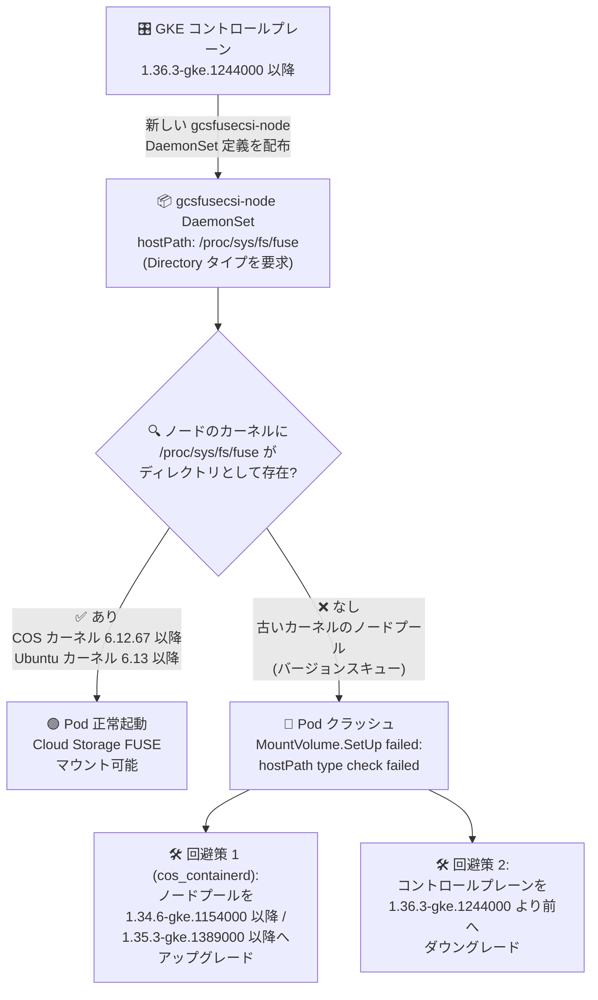

# Google Kubernetes Engine: Cloud Storage FUSE CSI driver (gcsfusecsi-node) Pod が特定ノードプールで起動に失敗する既知の問題

**リリース日**: 2026-10-02

**サービス**: Google Kubernetes Engine (GKE)

**機能**: Cloud Storage FUSE CSI driver (gcsfusecsi-node DaemonSet)

**ステータス**: Issue (既知の問題)

📊 [このアップデートのインフォグラフィックを見る](https://takech9203.github.io/google-cloud-news-summary/20261002-gke-gcsfuse-csi-driver-pod-startup-issue.html)

## 概要

GKE コントロールプレーンのバージョン **1.36.3-gke.1244000 以降** において、Cloud Storage FUSE CSI driver の DaemonSet Pod (`gcsfusecsi-node`) が特定のノードプール上で起動に失敗する既知の問題が公表されました。該当する Pod はクラッシュし、以下のエラーをログに出力します。

```
MountVolume.SetUp failed for volume "host-proc-sys-fs-fuse" :
hostPath type check failed: /proc/sys/fs/fuse is not a directory
```

この問題は、コントロールプレーンとノードプールの間に **バージョンスキュー (version skew)** が存在し、ノードプールが必要なホストパス (`/proc/sys/fs/fuse`) を持たない古いカーネルで動作している場合に発生します。具体的には、Container-Optimized OS では **カーネル 6.12.67 より前**、Ubuntu では **カーネル 6.13 より前** が該当します。GKE 上で Cloud Storage バケットをファイルシステムとしてマウントしている AI/ML ワークロードやデータ処理ワークロードの運用者は、クラスタのアップグレード計画において本問題の影響を確認する必要があります。

**問題の発生条件**

- コントロールプレーンが 1.36.3-gke.1244000 以降にアップグレードされ、新しい `gcsfusecsi-node` DaemonSet 定義 (ホストパス `/proc/sys/fs/fuse` をディレクトリとして要求) がデプロイされる
- 一方で、ノードプールが当該ホストパスをディレクトリとして提供しない古いカーネルのまま稼働している
- この組み合わせ (バージョンスキュー) により、hostPath のタイプチェックが失敗し Pod が起動できない

**影響**

- `gcsfusecsi-node` DaemonSet Pod が該当ノード上で起動せず、Cloud Storage FUSE CSI ボリュームのマウント操作が失敗する
- Cloud Storage バケットを Pod にマウントするワークロード (AI/ML の学習データ・モデル読み込みなど) が影響を受ける可能性がある

## アーキテクチャ図



コントロールプレーンのバージョンとノードプールのカーネルバージョンの組み合わせ (バージョンスキュー) によって hostPath のタイプチェックが失敗し、Pod が起動できなくなる流れと回避策を示しています。

## 問題の詳細

### 発生条件と影響を受ける構成

1. **トリガーとなるコントロールプレーンバージョン**
   - GKE コントロールプレーン 1.36.3-gke.1244000 以降
   - このバージョン以降の `gcsfusecsi-node` DaemonSet が、ホストパス `/proc/sys/fs/fuse` をディレクトリタイプとして要求する

2. **必要なカーネルバージョン**
   - Container-Optimized OS (COS): カーネル 6.12.67 以降
   - Ubuntu: カーネル 6.13 以降
   - これより古いカーネルでは `/proc/sys/fs/fuse` がディレクトリとして存在せず、hostPath のタイプチェックが失敗する

3. **影響を受けるノードプール構成**
   - **すべての Ubuntu with containerd (`ubuntu_containerd`) ノードプール**
   - **Container-Optimized OS with containerd (`cos_containerd`) ノードプール** のうち、以下のバージョン:
     - GKE 1.33 以前のすべてのバージョン
     - GKE 1.34 系で 1.34.6-gke.1154000 より前のバージョン
     - GKE 1.35 系で 1.35.3-gke.1389000 より前のバージョン

### エラーの内容

該当ノード上の `gcsfusecsi-node` Pod は起動に失敗し、以下のイベント/ログが記録されます。

```
MountVolume.SetUp failed for volume "host-proc-sys-fs-fuse" :
hostPath type check failed: /proc/sys/fs/fuse is not a directory
```

Kubernetes の hostPath ボリュームはタイプ (`Directory` など) を指定でき、指定したタイプとホスト上の実体が一致しない場合、kubelet がボリュームのセットアップを拒否します。本問題はこのタイプチェックが古いカーネル上で失敗することに起因します。

## 技術仕様

### 影響範囲まとめ

| 項目 | 詳細 |
|------|------|
| 問題のあるコントロールプレーン | 1.36.3-gke.1244000 以降 |
| 影響コンポーネント | Cloud Storage FUSE CSI driver (`gcsfusecsi-node` DaemonSet) |
| エラー内容 | `hostPath type check failed: /proc/sys/fs/fuse is not a directory` |
| 必要なカーネル (COS) | 6.12.67 以降 |
| 必要なカーネル (Ubuntu) | 6.13 以降 |
| 影響ノードプール (Ubuntu) | すべての `ubuntu_containerd` ノードプール |
| 影響ノードプール (COS) | 1.33 以前 / 1.34.6-gke.1154000 より前 / 1.35.3-gke.1389000 より前の `cos_containerd` |
| 根本原因 | コントロールプレーンとノードプール間のバージョンスキューにより、必要なホストパスが存在しない |

### 修正済み (カーネル要件を満たす) ノードプールバージョン

| OS イメージ | 必要なノードプールバージョン |
|------|------|
| `cos_containerd` (1.34 系) | 1.34.6-gke.1154000 以降 |
| `cos_containerd` (1.35 系) | 1.35.3-gke.1389000 以降 |
| `cos_containerd` | コントロールプレーンとバージョンを一致させる方法も有効 |
| `ubuntu_containerd` | 修正は対応中 (fix is in progress) |

## 回避策 (Workaround)

### cos_containerd ノードプールの場合

必要なカーネルサポートを含むバージョンへノードプールをアップグレードします。

```bash
# ノードプールを修正済みバージョンへアップグレードする例
gcloud container clusters upgrade CLUSTER_NAME \
  --node-pool=NODE_POOL_NAME \
  --cluster-version=1.34.6-gke.1154000 \
  --location=LOCATION
```

- 1.34.6-gke.1154000 以降、または 1.35.3-gke.1389000 以降へアップグレードする
- もしくはノードプールのバージョンをコントロールプレーンと一致させる

### ubuntu_containerd ノードプールの場合

- Ubuntu ノードプール向けの修正は現在対応中 (fix is in progress) です
- 代替手段として、**コントロールプレーンを 1.36.3-gke.1244000 より前のバージョンへダウングレード** することで問題を回避できます

### 影響確認の方法

```bash
# gcsfusecsi-node Pod の状態を確認
kubectl get pods -n kube-system -l k8s-app=gcs-fuse-csi-driver -o wide

# クラッシュしている Pod のイベントを確認
kubectl describe pod -n kube-system POD_NAME

# ノードプールのバージョンと OS イメージを確認
gcloud container node-pools list --cluster=CLUSTER_NAME --location=LOCATION \
  --format="table(name,version,config.imageType)"
```

## 考慮すべき点

### 運用上の注意

- コントロールプレーンの自動アップグレード (リリースチャンネル) により 1.36.3-gke.1244000 以降へ更新された場合、古いバージョンのままのノードプールで本問題が顕在化する可能性がある
- Cloud Storage FUSE CSI ボリュームを使用するワークロード (AI/ML 学習、モデルサービング、データ分析など) のマウント失敗として現れるため、アプリケーション側のエラーから原因を特定しにくい
- Ubuntu ノードプールはノードプール側のアップグレードでは解決できず、現時点ではコントロールプレーンのダウングレードが唯一の回避策となる
- コントロールプレーンのダウングレードは他の新機能や修正の適用にも影響するため、影響範囲を評価してから実施する

### 推奨アクション

- Cloud Storage FUSE CSI driver を使用しているクラスタで、コントロールプレーンとノードプールのバージョンスキューを確認する
- `cos_containerd` ノードプールは修正済みバージョンへ計画的にアップグレードする
- `ubuntu_containerd` ノードプールを使用している場合は、コントロールプレーンの 1.36.3-gke.1244000 以降へのアップグレードを修正提供まで保留することを検討する
- 最新の状況は [GKE リリースノート](https://docs.cloud.google.com/release-notes#October_02_2026) で確認する

## 関連サービス・機能

- **Cloud Storage**: Cloud Storage FUSE CSI driver がマウント対象とするオブジェクトストレージ。バケットを Pod のファイルシステムとして公開する
- **Cloud Storage FUSE**: Cloud Storage バケットをファイルシステムとしてマウントするための FUSE ベースのツール。CSI driver のバックエンドとして動作する
- **GKE リリースチャンネル / クラスタアップグレード**: コントロールプレーンとノードプールのバージョン管理。本問題の発生条件 (バージョンスキュー) に直接関係する
- **Cloud Logging / Cloud Monitoring**: `gcsfusecsi-node` Pod のクラッシュログやイベントの確認、`gcsfusecsi/*` メトリクスによるマウント状態の監視に利用できる

## 参考リンク

- 📊 [インフォグラフィック](https://takech9203.github.io/google-cloud-news-summary/20261002-gke-gcsfuse-csi-driver-pod-startup-issue.html)
- [公式リリースノート (2026-10-02)](https://docs.cloud.google.com/release-notes#October_02_2026)
- [Cloud Storage FUSE CSI driver の概要](https://docs.cloud.google.com/kubernetes-engine/docs/concepts/cloud-storage-fuse-csi-driver)
- [Cloud Storage FUSE CSI driver のセットアップ](https://docs.cloud.google.com/kubernetes-engine/docs/how-to/cloud-storage-fuse-csi-driver-setup)
- [Cloud Storage FUSE CSI driver トラブルシューティングガイド (GitHub)](https://github.com/GoogleCloudPlatform/gcs-fuse-csi-driver/blob/main/docs/troubleshooting.md)

## まとめ

GKE コントロールプレーン 1.36.3-gke.1244000 以降と古いカーネルのノードプールの組み合わせで、Cloud Storage FUSE CSI driver の Pod が起動に失敗する既知の問題が公表されました。Cloud Storage FUSE を利用するクラスタの運用者は、`cos_containerd` ノードプールであれば修正済みバージョン (1.34.6-gke.1154000 以降 / 1.35.3-gke.1389000 以降) へのアップグレードを、`ubuntu_containerd` ノードプールであれば修正提供までコントロールプレーンのアップグレード保留またはダウングレードを検討してください。

---

**タグ**: #GKE #CloudStorageFUSE #CSIDriver #KnownIssue #Kubernetes #DaemonSet #トラブルシューティング
