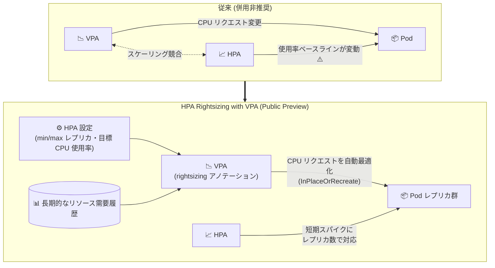

# Google Kubernetes Engine: VPA と HPA の併用による HPA ワークロードのライトサイジング (Public Preview)

**リリース日**: 2026-10-02

**サービス**: Google Kubernetes Engine (GKE)

**機能**: HPA Rightsizing with VPA (VPA と HPA の併用による CPU リクエスト自動最適化)

**ステータス**: Public Preview

📊 [このアップデートのインフォグラフィックを見る](https://takech9203.github.io/google-cloud-news-summary/20261002-gke-vpa-hpa-rightsizing-preview.html)

## 概要

Google Kubernetes Engine (GKE) で、Vertical Pod Autoscaler (VPA) と Horizontal Pod Autoscaler (HPA) を同一ワークロードに対して協調動作させ、CPU 使用率に基づいてレプリカ数をスケールするワークロードのコンテナ CPU リクエストを自動的に最適化できる「HPA Rightsizing with VPA」が Public Preview として利用可能になりました。GKE バージョン 1.36.3-gke.1630000 以降を実行するクラスタで使用できます。

従来、HPA と VPA を同じメトリクス (CPU など) に対して併用すると、VPA が Pod の CPU リクエストを変更した際に HPA がスケーリング判断の基準とする使用率ベースラインが変動し、予期しないスケーリング動作や過剰プロビジョニングを引き起こすため、推奨されていませんでした。今回のアップデートにより、HPA は短期的なトラフィックスパイクへのレプリカ数スケーリングを担当し続け、VPA は HPA の設定 (最小/最大レプリカ数、目標 CPU 使用率) を考慮したライトサイジングロジックで、ワークロードの長期的な集約リソース需要に基づいて CPU リクエストを調整します。これにより、低トラフィック時のコスト効率と高負荷時の回復力を両立できます。

CPU ベースの HPA を利用している Web アプリケーションや API サーバーなど、レプリカ数が動的に変化するワークロードを運用し、リソースリクエストのチューニングを手動で行ってきたプラットフォームチーム・SRE にとって、コスト最適化の自動化を大きく前進させるアップデートです。

**アップデート前の課題**

- HPA と VPA を同一メトリクス (CPU) に対して併用すると、VPA による CPU リクエスト変更が HPA の使用率ベースラインを変化させ、スケーリングの競合 (予期しないスケールアウト/インや過剰プロビジョニング) が発生するため、併用は推奨されていなかった
- CPU ベースの HPA を使うワークロードでは、CPU リクエストの適正化 (ライトサイジング) を手動で分析・調整する必要があった
- リクエストが過大なまま放置されるとノードリソースの無駄が生じ、過小だと高負荷時の安定性が損なわれるというトレードオフを人手で管理する必要があった

**アップデート後の改善**

- VPA が HPA の構成 (minReplicas、maxReplicas、目標 CPU 使用率) を考慮したライトサイジングロジックで動作し、HPA と競合せずに同一ワークロードの CPU リクエストを自動調整できるようになった
- HPA は短期的なトラフィックスパイクにレプリカ数で対応し、VPA は長期的な需要傾向に基づいて CPU リクエストを最適化する役割分担が実現した
- `InPlaceOrRecreate` モードにより、Pod を再起動せずに CPU リクエストを非破壊的に更新できる

## アーキテクチャ図



従来は VPA の CPU リクエスト変更が HPA のスケーリング判断を乱すため併用が非推奨でしたが、今回のアップデートで VPA が HPA 設定を考慮して協調動作し、レプリカスケーリングと CPU リクエスト最適化を同時に実現します。

## サービスアップデートの詳細

### 主要機能

1. **HPA 設定を考慮した VPA ライトサイジングロジック**
   - VPA が HPA の最小レプリカ数・最大レプリカ数・目標 CPU 使用率を考慮して、コンテナの CPU リクエストを調整
   - ワークロードの長期的な集約リソース需要の履歴を分析し、低トラフィック時はコスト効率的に、高負荷時は回復力を維持するようにサイジング

2. **アノテーションによる有効化**
   - VerticalPodAutoscaler リソースに `gke.io/autoscaling-hpa-rightsizing-mode: "gke-hpa-rightsizing-mode-policy"` アノテーションを付与することで有効化
   - 既存の VPA API (autoscaling.k8s.io/v1) をそのまま利用可能

3. **非破壊的なリソース更新 (InPlaceOrRecreate)**
   - `updateMode: "InPlaceOrRecreate"` により、Pod を再起動せずに CPU リクエストをインプレース更新
   - メモリ変更にアプリケーションの再起動が必要な場合は、コンテナの `resizePolicy` (restartPolicy: RestartContainer) の追加、または `updateMode: "Recreate"` で対応

4. **段階的導入のための Off モード**
   - `updateMode: "Off"` でデプロイすると、Pod を変更せずに推奨値 (Recommendation) のみを生成
   - 数日間の観察で推奨値を確認してから自動適用に切り替える段階的デプロイが可能

## 技術仕様

### 要件と制限

| 項目 | 詳細 |
|------|------|
| GKE バージョン | 1.36.3-gke.1630000 以降 |
| リリースステージ | Public Preview (Pre-GA Offerings Terms が適用) |
| 前提条件 | クラスタで垂直 Pod 自動スケーリングが有効であること (Autopilot はデフォルト有効) |
| 必要な IAM ロール | roles/container.admin、roles/container.developer |
| ライトサイジング対象リソース | CPU のみ (メモリを含めた場合、メモリは標準の VPA ロジックで調整) |
| クラスタあたりの上限 | 全ワークロード合計で最大 60,000 コンテナ |
| 単一 VPA の上限 | 最大 1,000 コンテナをターゲット可能 |

### VerticalPodAutoscaler マニフェスト例

```yaml
apiVersion: autoscaling.k8s.io/v1
kind: VerticalPodAutoscaler
metadata:
  name: sample-app-vpa
  annotations:
    gke.io/autoscaling-hpa-rightsizing-mode: "gke-hpa-rightsizing-mode-policy"
spec:
  targetRef:
    apiVersion: apps/v1
    kind: Deployment
    name: sample-app
  updatePolicy:
    updateMode: "Off"   # 観察後に "InPlaceOrRecreate" へ変更
  resourcePolicy:
    containerPolicies:
      - containerName: sample-app
        controlledResources: ["cpu", "memory"]
        minAllowed:
          cpu: 100m
          memory: 200Mi
        maxAllowed:
          cpu: 1000m
          memory: 1024Mi
```

## 設定方法

### 前提条件

1. GKE バージョン 1.36.3-gke.1630000 以降のクラスタを使用していること
2. クラスタで垂直 Pod 自動スケーリングが有効であること (Autopilot クラスタではデフォルトで有効)

```bash
# Standard クラスタで垂直 Pod 自動スケーリングを有効化
gcloud container clusters update CLUSTER_NAME \
    --enable-vertical-pod-autoscaling \
    --location=LOCATION
```

### 手順

#### ステップ 1: ワークロードと HPA をデプロイ

```yaml
apiVersion: autoscaling/v2
kind: HorizontalPodAutoscaler
metadata:
  name: sample-app-hpa
spec:
  scaleTargetRef:
    apiVersion: apps/v1
    kind: Deployment
    name: sample-app
  minReplicas: 2
  maxReplicas: 10
  metrics:
    - type: Resource
      resource:
        name: cpu
        target:
          type: Utilization
          averageUtilization: 70
```

CPU 使用率をターゲットとする HorizontalPodAutoscaler を作成します。

#### ステップ 2: VPA を Off モードでデプロイし推奨値を観察

```bash
kubectl apply -f sample-app-vpa.yaml
kubectl describe vpa sample-app-vpa
```

`gke.io/autoscaling-hpa-rightsizing-mode` アノテーション付きの VPA を `updateMode: "Off"` でデプロイし、推奨値 (Target、Lower Bound、Upper Bound) を確認します。初期推奨値は数分で生成されますが、トラフィックサイクル全体を捉えるため 24 時間〜数日の観察が推奨されます。新規ワークロードや本番クリティカルでないワークロードではこのステップを省略できます。

#### ステップ 3: 自動ライトサイジングを有効化

```yaml
spec:
  updatePolicy:
    updateMode: "InPlaceOrRecreate"
```

推奨値を確認後、`updateMode` を `"InPlaceOrRecreate"` に変更して適用します。VPA がコンテナの CPU リクエストを需要に基づき最適レベルに自動調整し、HPA はレプリカ数のスケーリングを継続します。

## メリット

### ビジネス面

- **コスト最適化の自動化**: 低トラフィック時に過剰な CPU リクエストを削減し、ノードリソースの無駄を抑制。手動チューニングの運用コストも削減
- **信頼性とコストの両立**: HPA 設定を考慮したサイジングにより、高負荷時の回復力を維持しつつコスト効率を向上

### 技術面

- **スケーリング競合の解消**: 従来非推奨だった同一メトリクス (CPU) での HPA + VPA 併用が、協調動作により安全に実現
- **非破壊的な適用**: InPlaceOrRecreate モードで Pod 再起動なしに CPU リクエストを更新でき、サービス影響を最小化
- **段階的導入が可能**: Off モードで推奨値のみを観察してから自動適用へ移行できる

## デメリット・制約事項

### 制限事項

- Public Preview のため、Pre-GA Offerings Terms が適用され、サポートが限定される可能性がある
- ライトサイジング計算は CPU のみに適用される (メモリは標準 VPA ロジックで調整)
- クラスタあたり最大 60,000 コンテナ、単一 VPA あたり最大 1,000 コンテナの上限がある
- GKE 1.36.3-gke.1630000 以降が必要

### 考慮すべき点

- Argo CD などの継続的デリバリーツールは VPA によるリソース変更をマニフェスト値に戻そうとする場合があるため、`ignoreDifferences` などの設定で差分を無視する構成が必要
- 無効化する際は VerticalPodAutoscaler の削除または `updateMode: "Off"` への変更で行うこと。アノテーションのみを削除して `updateMode` を残すと標準 VPA 動作に戻り、HPA と競合してスケーリングが不安定になる
- マルチコンテナ Pod (サイドカー併用など) では、HPA を Pod 全体ではなく主要コンテナの CPU 使用率 (`ContainerResource` メトリクス) でスケールさせ、HPA と VPA が同じベースラインを評価するよう構成する必要がある
- 起動時に CPU スパイクが発生するワークロード (Java アプリなど) は、VPA CPU Startup Boost との併用が推奨される

## ユースケース

### ユースケース 1: トラフィック変動の大きい Web API のコスト最適化

**シナリオ**: 日中はトラフィックが多く夜間は少ない Web API を、CPU 使用率 70% をターゲットとする HPA (2〜10 レプリカ) で運用している。CPU リクエストは安全マージンを見込んで大きめに設定しており、夜間はノードリソースが大幅に余剰となっている。

**実装例**:
```yaml
# HPA は既存のまま、rightsizing アノテーション付き VPA を追加
metadata:
  annotations:
    gke.io/autoscaling-hpa-rightsizing-mode: "gke-hpa-rightsizing-mode-policy"
spec:
  updatePolicy:
    updateMode: "InPlaceOrRecreate"
```

**効果**: VPA が履歴需要と HPA 設定に基づいて CPU リクエストを適正化し、夜間の過剰プロビジョニングを削減。日中のスパイクには HPA のレプリカスケーリングで対応し、可用性を維持したままノードコストを削減できる。

### ユースケース 2: 多数のマイクロサービスの一括ライトサイジング

**シナリオ**: 数百のマイクロサービスを運用するプラットフォームチームが、各サービスの CPU リクエストを手動でチューニングしており、レビューが追いつかず過剰リクエストが常態化している。

**効果**: 各ワークロードに rightsizing 対応 VPA を Off モードで展開して推奨値を収集し、確認後に InPlaceOrRecreate へ切り替えることで、クラスタ全体 (最大 60,000 コンテナ) のリクエスト適正化を段階的かつ自動的に実現できる。

## 料金

Release Notes およびドキュメントに本機能固有の追加料金の記載はありません。HPA / VPA は GKE の機能として提供され、通常の GKE クラスタ料金 (Autopilot は Pod リソース課金、Standard はノードの Compute Engine 料金とクラスタ管理手数料) が適用されます。詳細は料金ページを参照してください。

- [GKE 料金ページ](https://cloud.google.com/kubernetes-engine/pricing)

## 利用可能リージョン

リージョン固有の制限は Release Notes に記載されていません。GKE バージョン 1.36.3-gke.1630000 以降を実行するクラスタで利用できます。

## 関連サービス・機能

- **Horizontal Pod Autoscaler (HPA)**: CPU 使用率などのメトリクスに基づいてレプリカ数をスケール。本機能では短期的なトラフィックスパイク対応を担当
- **Vertical Pod Autoscaler (VPA)**: コンテナのリソースリクエスト/リミットを自動調整。本機能では HPA 設定を考慮したライトサイジングロジックで動作
- **VPA CPU Startup Boost**: 起動時に一時的に追加 CPU を割り当てる機能。定常状態のライトサイジング計算に影響を与えずに起動時スパイクへ対応可能
- **Cloud Logging**: VPA の判断ログ (decision logs) やイベントを確認でき、ライトサイジングの診断に活用できる
- **Cluster Autoscaler / Node Auto-Provisioning**: Pod のリクエスト適正化と組み合わせることで、ノードレベルのリソース効率も向上

## 参考リンク

- 📊 [インフォグラフィック](https://takech9203.github.io/google-cloud-news-summary/20261002-gke-vpa-hpa-rightsizing-preview.html)
- [公式リリースノート](https://docs.cloud.google.com/release-notes#October_02_2026)
- [ドキュメント: Rightsize HPA workloads with VPA](https://docs.cloud.google.com/kubernetes-engine/docs/how-to/rightsize-hpa-workloads-with-vpa)
- [Horizontal Pod Autoscaler の概要](https://docs.cloud.google.com/kubernetes-engine/docs/concepts/horizontalpodautoscaler)
- [Vertical Pod Autoscaler の概要](https://docs.cloud.google.com/kubernetes-engine/docs/concepts/verticalpodautoscaler)
- [料金ページ](https://cloud.google.com/kubernetes-engine/pricing)

## まとめ

長らく「同一メトリクスでの HPA と VPA の併用は非推奨」とされてきた制約が、GKE の協調ライトサイジングロジックにより解消され、レプリカスケーリングと CPU リクエスト最適化を同時に自動化できるようになりました。CPU ベースの HPA を使うワークロードを運用しているチームは、まず Off モードで VPA をデプロイして推奨値を観察し、効果を確認した上で InPlaceOrRecreate モードへの移行を検討することを推奨します。Public Preview のため、本番適用時は Pre-GA 条件とサポート範囲に留意してください。

---

**タグ**: #GKE #Kubernetes #VPA #HPA #Autoscaling #CostOptimization #Rightsizing #PublicPreview
