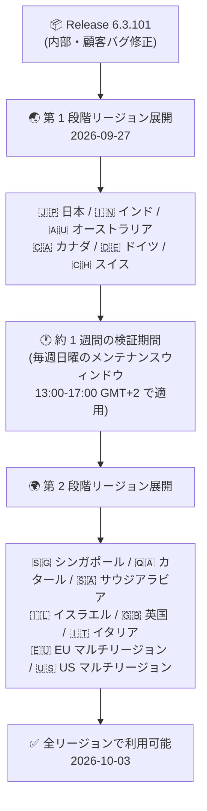

# Google SecOps SOAR: Release 6.3.101 が全リージョンで利用可能に

**リリース日**: 2026-10-03

**サービス**: Google SecOps SOAR

**機能**: Release 6.3.101 全リージョン展開

**ステータス**: Announcement (全リージョン GA)

📊 [このアップデートのインフォグラフィックを見る](https://takech9203.github.io/google-cloud-news-summary/20261003-google-secops-soar-6-3-101.html)

## 概要

Google SecOps SOAR の Release 6.3.101 が、すべてのリージョンで利用可能になりました。本リリースは 2026 年 9 月 27 日に第 1 段階 (first phase) のリージョンへのロールアウトが開始され、Google SecOps SOAR の標準的な 2 段階リリースプロセスを経て、2026 年 10 月 3 日に全リージョンへの展開が完了したものです。

Release 6.3.101 は、公式リリースノートによると「内部的なバグ修正および顧客報告によるバグ修正 (internal and customer bug fixes)」を含むメンテナンスリリースです。新機能の追加は含まれておらず、プラットフォームの安定性と品質向上を目的としたリリースとなります。

Google SecOps SOAR を利用しているすべての組織 (スタンドアロンの SOAR プラットフォーム利用者、および Google SecOps 内の SOAR コンポーネント利用者の両方) が対象です。アップデートはメンテナンスウィンドウ中に自動適用されるため、ユーザー側での対応は不要です。

## アーキテクチャ図

Google SecOps SOAR の段階的リリースプロセス。第 1 段階のリージョンに先行展開して約 1 週間の検証を行った後、第 2 段階のリージョンに展開され、今回全リージョンでの利用が可能になりました。

## サービスアップデートの詳細

### 主要内容

1. **Release 6.3.101 の全リージョン展開完了**
   - 2026 年 9 月 27 日に第 1 段階リージョンへのロールアウトを開始
   - 2026 年 10 月 3 日に全リージョンで利用可能に

2. **バグ修正**
   - 本リリースには内部的なバグ修正と、顧客から報告されたバグの修正が含まれる
   - 公式リリースノートでは個別の修正項目の詳細は公開されていない

### 段階的リリース (Gradual Release) プロセス

Google SecOps SOAR のリリースは、通常 2 段階のロールアウトで展開されます。アップデートは毎週日曜日のメンテナンスウィンドウ (13:00〜17:00 GMT+2) 中に適用され、第 2 段階のリージョンは第 1 段階のリージョンの 1 週間後にアップグレードされます。

| 段階 | 対象リージョン |
|------|----------------|
| 第 1 段階 | 日本、インド、オーストラリア、カナダ、ドイツ、スイス |
| 第 2 段階 | シンガポール、カタール、サウジアラビア、イスラエル、英国 (ロンドン)、イタリア、EU (マルチリージョン)、US (マルチリージョン) |

自身の割り当てリージョンが不明な場合は、Google SecOps の担当者に問い合わせることが推奨されています。

## 技術仕様

| 項目 | 詳細 |
|------|------|
| リリースバージョン | 6.3.101 |
| リリース内容 | 内部的なバグ修正および顧客報告によるバグ修正 |
| 第 1 段階ロールアウト開始 | 2026 年 9 月 27 日 |
| 全リージョン展開完了 | 2026 年 10 月 3 日 |
| メンテナンスウィンドウ | 毎週日曜日 13:00〜17:00 (GMT+2) |
| 適用対象 | Google SecOps SOAR スタンドアロン利用者、および Google SecOps 内の SOAR コンポーネント利用者 |
| 必要な対応 | なし (自動適用) |

## メリット

### ビジネス面

- **プラットフォームの安定性向上**: 顧客から報告されたバグの修正により、セキュリティ運用 (SOC) ワークフローの信頼性が向上する
- **運用負荷ゼロの適用**: アップデートはメンテナンスウィンドウ中に自動適用されるため、ユーザー側の作業は不要

### 技術面

- **段階的ロールアウトによるリスク低減**: 第 1 段階リージョンでの先行検証を経てから全リージョンに展開されるため、リリース起因の問題が全環境に波及するリスクが抑えられる
- **予測可能なリリースサイクル**: 毎週日曜日の固定メンテナンスウィンドウで適用されるため、運用計画を立てやすい

## デメリット・制約事項

### 考慮すべき点

- 公式リリースノートでは、6.3.101 に含まれる個別のバグ修正内容 (修正 ID など) は公開されていない
- リージョンの段階によって新バージョンが適用されるタイミングが最大 1 週間程度異なるため、複数リージョンにまたがる環境を運用している場合はバージョン差異が一時的に発生し得る
- メンテナンスウィンドウ中は短時間のダウンタイムが発生する場合がある (過去のメンテナンス告知より)

## 利用可能リージョン

全リージョンで利用可能です (2026 年 10 月 3 日時点)。リージョンの詳細は [Release plan for Google SecOps](https://docs.cloud.google.com/chronicle/docs/soar/overview-and-introduction/soar-gradual-release) を参照してください。

なお、2026 年 10 月 4 日には次のリリースである 6.3.102 の第 1 段階リージョンへのロールアウトが開始されています (こちらも内部・顧客バグ修正を含むリリース)。

## 関連サービス・機能

- **Google SecOps (Google Security Operations)**: SOAR は Google SecOps プラットフォームの対応 (Response) コンポーネントとして、SIEM 機能と統合してセキュリティ運用を自動化する
- **Google SecOps SOAR プレイブック**: ケースやアラートへの自動対応を定義する中核機能。直近の機能リリース (6.3.100) ではリアクショントリガーやケースプレイブック (いずれも Preview) が追加されている

## 参考リンク

- 📊 [インフォグラフィック](https://takech9203.github.io/google-cloud-news-summary/20261003-google-secops-soar-6-3-101.html)
- [公式リリースノート (Google Cloud)](https://docs.cloud.google.com/release-notes#October_03_2026)
- [Google SecOps SOAR リリースノート](https://docs.cloud.google.com/chronicle/docs/soar/release-notes#September_27_2026)
- [Release plan for Google SecOps (段階的リリースプラン)](https://docs.cloud.google.com/chronicle/docs/soar/overview-and-introduction/soar-gradual-release)

## まとめ

Google SecOps SOAR Release 6.3.101 は、内部および顧客報告のバグ修正を含むメンテナンスリリースで、段階的ロールアウトを経て全リージョンで利用可能になりました。適用は自動で行われるためユーザー側の対応は不要ですが、SOC 運用に関わるチームは自環境のバージョン (Settings > License ページで確認可能) と、既知の不具合が解消されているかを確認しておくとよいでしょう。

---

**タグ**: Google SecOps, SOAR, セキュリティ運用, バグ修正, リリース 6.3.101, Announcement
