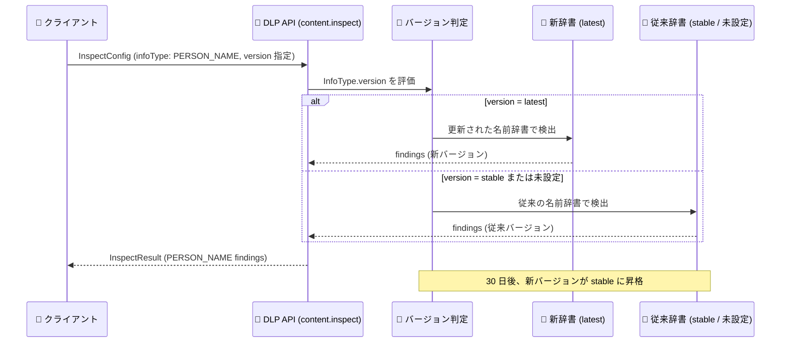

# Sensitive Data Protection: PERSON_NAME infoType 検出器の新バージョン (名前辞書更新) 提供開始

**リリース日**: 2026-10-03

**サービス**: Sensitive Data Protection

**機能**: PERSON_NAME infoType 検出器の名前辞書更新版 (`InfoType.version: latest`)

**ステータス**: Change

📊 [このアップデートのインフォグラフィックを見る](https://takech9203.github.io/google-cloud-news-summary/20261003-sensitive-data-protection-person-name-infotype-update.html)

## 概要

Sensitive Data Protection (旧 Cloud DLP) の組み込み infoType 検出器である **PERSON_NAME** に、名前辞書 (name dictionary) を更新した新バージョンが提供されました。`InspectConfig` で PERSON_NAME infoType を指定する際に、`InfoType.version` フィールドを `latest` に設定することで新バージョンを試用できます。

PERSON_NAME は、単一語の名前 (例: Jane) やフルネーム (例: Jane Smith、Jane Marie Smith) を自然言語理解 (NLU) を含む複数の技術で検出するグローバル検出器です。今回の名前辞書の更新により、検出のベースとなる人名データが刷新されます。従来の動作を継続したい場合は、`InfoType.version` を `stable` に設定するか、未設定のままにします。

**30 日後に新バージョンが `stable` に昇格** します。昇格後はバージョン未指定のリクエストにも新しい辞書が適用されるため、PERSON_NAME を本番の検査・匿名化パイプラインで利用しているユーザーは、昇格前に `latest` を指定して検出結果への影響を検証しておくことが推奨されます。

**アップデート前の課題**

- PERSON_NAME 検出器の名前辞書は従来版 (現行の `stable`) のみが提供されており、新しい辞書による検出品質を事前に試す手段がなかった
- 検出モデル・辞書の更新は検出結果 (findings) の件数や内容に影響し得るため、更新内容を本番適用前に検証する仕組みが必要だった

**アップデート後の改善**

- `InfoType.version: latest` を指定するだけで、更新された名前辞書による PERSON_NAME 検出を即座に試用できるようになった
- `stable` (または未設定) と `latest` を切り替えることで、新旧バージョンの検出結果を比較検証できる
- 30 日間の移行期間が設けられており、`stable` 昇格前に影響評価を行う時間が確保されている

## アーキテクチャ図



`InspectConfig` 内の `InfoType.version` の値に応じて、PERSON_NAME 検出に使用される名前辞書が切り替わるフローを示しています。30 日後の昇格以降は、`stable`/未設定でも新辞書が使用されます。

## サービスアップデートの詳細

### 主要機能

1. **更新された名前辞書による PERSON_NAME 検出**
   - PERSON_NAME infoType 検出器のベースとなる名前辞書が更新された新バージョンが利用可能
   - PERSON_NAME は単一語の名前とフルネームの両方を対象とし、自然言語理解を含む複数の技術で検出を行う

2. **`InfoType.version` によるオプトイン方式**
   - `InspectConfig.infoTypes[]` で PERSON_NAME を指定する際、`version` フィールドに `latest` を設定すると新バージョンを使用
   - `stable` を設定するか未設定のままにすると、従来の機能 (現行辞書) を継続利用できる

3. **30 日後の `stable` 昇格**
   - リリースから 30 日後に新バージョンが `stable` に昇格し、デフォルトの動作となる
   - 過去の同種の更新 (2022 年の PERSON_NAME 検出モデル更新など) でも同様に、`latest` での試用期間を経て `stable` へ昇格するリリースプロセスが取られている

## 技術仕様

### InfoType.version の指定値と動作

| `InfoType.version` の値 | 動作 |
|------|------|
| `latest` | 更新された名前辞書 (新バージョン) を使用 |
| `stable` | 従来の名前辞書を使用 (現時点のデフォルトと同じ) |
| 未設定 | `stable` と同じ (従来の名前辞書) |
| (30 日後) | 新バージョンが `stable` に昇格し、未設定/`stable` でも新辞書が適用 |

### InspectConfig の指定例

```json
{
  "item": {
    "value": "私の名前は Jane Marie Smith です。"
  },
  "inspectConfig": {
    "infoTypes": [
      {
        "name": "PERSON_NAME",
        "version": "latest"
      }
    ],
    "includeQuote": true
  }
}
```

`projects.content.inspect` などの検査リクエストで、`infoTypes[]` の各要素に `version` を指定します。

### PERSON_NAME 検出器の特性

| 項目 | 詳細 |
|------|------|
| 検出対象 | 人名 (単一語の名前、フルネーム。例: Jane、Jane Smith、Jane Marie Smith) |
| 検出技術 | 名前辞書、自然言語理解 (NLU) を含む複数の技術 |
| 関連 infoType | FIRST_NAME / LAST_NAME は PERSON_NAME のサブセット (findings は常に PERSON_NAME の部分集合) |
| パフォーマンス | PERSON_NAME は高レイテンシ検出器に分類され、不要な場合は有効化しないことが推奨されている |

## 設定方法

### 前提条件

1. DLP API (`dlp.googleapis.com`) が有効化されたプロジェクト
2. 検査リクエストを実行できる IAM 権限 (例: DLP ユーザーロール)

### 手順

#### ステップ 1: 新バージョンで検査を試用する

```bash
curl -s -X POST \
  -H "Authorization: Bearer $(gcloud auth print-access-token)" \
  -H "Content-Type: application/json" \
  "https://dlp.googleapis.com/v2/projects/PROJECT_ID/locations/global/content:inspect" \
  -d '{
    "item": {"value": "Contact: Jane Marie Smith"},
    "inspectConfig": {
      "infoTypes": [{"name": "PERSON_NAME", "version": "latest"}],
      "includeQuote": true
    }
  }'
```

`version: "latest"` を指定し、更新された名前辞書による検出結果を確認します。

#### ステップ 2: 従来バージョンと結果を比較する

```bash
curl -s -X POST \
  -H "Authorization: Bearer $(gcloud auth print-access-token)" \
  -H "Content-Type: application/json" \
  "https://dlp.googleapis.com/v2/projects/PROJECT_ID/locations/global/content:inspect" \
  -d '{
    "item": {"value": "Contact: Jane Marie Smith"},
    "inspectConfig": {
      "infoTypes": [{"name": "PERSON_NAME", "version": "stable"}],
      "includeQuote": true
    }
  }'
```

同一データに対して `stable` で検査し、findings の件数・内容・likelihood の差分を比較します。代表的な本番データのサンプルで両バージョンを実行し、30 日後の昇格に備えて影響を評価します。

## メリット

### ビジネス面

- **検出品質の継続的な向上**: 名前辞書の更新により、PII (個人を特定できる情報) としての人名検出が最新のデータで維持・改善される
- **計画的な移行が可能**: 30 日間の試用期間により、コンプライアンス要件のある検査・匿名化パイプラインへの影響を事前に評価してから移行できる

### 技術面

- **オプトインでのリスクなし検証**: `version` フィールドの切り替えのみで新旧バージョンを比較でき、コード変更が最小限で済む
- **後方互換性の確保**: `stable` を明示指定すれば、昇格までは従来の動作を維持できる

## デメリット・制約事項

### 考慮すべき点

- 30 日後に新バージョンが `stable` に昇格すると、バージョン未指定のリクエストにも新辞書が適用されるため、検出結果 (findings の件数や対象) が変化する可能性がある
- PERSON_NAME に依存する匿名化 (de-identification) やデータプロファイリングの出力が変わり得るため、下流処理への影響を確認しておく必要がある
- PERSON_NAME は高レイテンシ検出器のため、必要な場合のみ有効化することが引き続き推奨される

## ユースケース

### ユースケース 1: 昇格前の影響評価 (リグレッションテスト)

**シナリオ**: 顧客サポートのチャットログを PERSON_NAME で検査し、人名をマスキングしてから分析基盤に投入している。辞書更新による検出結果の変化を本番適用前に把握したい。

**実装例**:
```json
{
  "inspectConfig": {
    "infoTypes": [
      {"name": "PERSON_NAME", "version": "latest"}
    ],
    "minLikelihood": "POSSIBLE",
    "includeQuote": true
  }
}
```

**効果**: 代表サンプルに対して `latest` と `stable` の findings を比較することで、昇格後の検出件数の増減やマスキング範囲の変化を事前に把握し、閾値 (minLikelihood) や除外ルールの調整を計画できる。

### ユースケース 2: 新辞書の早期採用による検出カバレッジ向上

**シナリオ**: データレイクへの取り込み時に PII スキャンを行っており、人名の検出漏れを最小化したい。

**効果**: `latest` を指定して更新された名前辞書を即座に採用し、昇格を待たずに最新の検出品質でスキャンを実行できる。

## 料金

このアップデートによる料金体系の変更はアナウンスされていません。Sensitive Data Protection の検査料金は、処理するデータ量 (バイト数) に基づきます。詳細は料金ページを参照してください。

- [Sensitive Data Protection の料金](https://cloud.google.com/sensitive-data-protection/pricing)

## 関連サービス・機能

- **FIRST_NAME / LAST_NAME infoType**: PERSON_NAME のサブセットとして名前の一部を検出する検出器。findings は常に PERSON_NAME の部分集合となる
- **検査ルール (Hotword / Exclusion / Adjustment)**: PERSON_NAME の findings を文脈 (例: 「patient」などの近接語) に基づいて調整・除外し、精度を調整できる
- **匿名化 (De-identification)**: PERSON_NAME の検出結果を用いて、Cloud Storage や BigQuery 内の人名をマスキング・置換できる
- **データプロファイリング**: 組織・プロジェクト全体のデータに対して PERSON_NAME を含む infoType の分布を把握できる

## 参考リンク

- 📊 [インフォグラフィック](https://takech9203.github.io/google-cloud-news-summary/20261003-sensitive-data-protection-person-name-infotype-update.html)
- [公式リリースノート](https://docs.cloud.google.com/release-notes#October_03_2026)
- [Sensitive Data Protection リリースノート](https://docs.cloud.google.com/sensitive-data-protection/docs/release-notes)
- [InfoType detector リファレンス](https://docs.cloud.google.com/sensitive-data-protection/docs/infotypes-reference)
- [InfoType.version (REST リファレンス)](https://docs.cloud.google.com/sensitive-data-protection/docs/reference/rest/v2/InfoType#FIELDS.version)
- [InspectConfig (REST リファレンス)](https://docs.cloud.google.com/sensitive-data-protection/docs/reference/rest/v2/InspectConfig)
- [infoType 検出器の概念](https://docs.cloud.google.com/sensitive-data-protection/docs/concepts-infotypes)
- [料金ページ](https://cloud.google.com/sensitive-data-protection/pricing)

## まとめ

PERSON_NAME infoType 検出器の名前辞書が更新され、`InfoType.version: latest` で新バージョンを試用できるようになりました。30 日後には新バージョンが `stable` に昇格しデフォルト動作が変わるため、PERSON_NAME を検査・匿名化パイプラインで利用しているチームは、昇格前に `latest` と `stable` の検出結果を比較し、下流処理への影響を評価しておくことを推奨します。

---

**タグ**: #SensitiveDataProtection #DLP #PERSON_NAME #infoType #PII #データ保護 #セキュリティ
