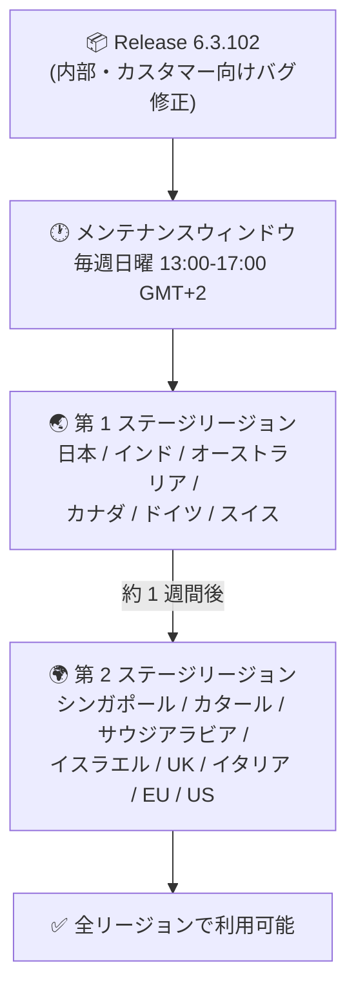

# Google SecOps SOAR: Release 6.3.102 第 1 フェーズリージョンへの段階的ロールアウト開始

**リリース日**: 2026-10-04

**サービス**: Google SecOps SOAR

**機能**: Release 6.3.102 (内部およびカスタマー向けバグ修正)

**ステータス**: Announcement (段階的ロールアウト中)

📊 [このアップデートのインフォグラフィックを見る](https://takech9203.github.io/google-cloud-news-summary/20261004-google-secops-soar-6-3-102.html)

## 概要

Google SecOps SOAR の Release 6.3.102 が、第 1 フェーズ (first phase) のリージョンへの段階的ロールアウトを開始しました。本リリースには、内部バグ修正およびカスタマーから報告された問題のバグ修正が含まれています。新機能の追加はなく、プラットフォームの安定性と品質向上を目的としたメンテナンスリリースです。

Google SecOps SOAR のリリースは、公式ドキュメント「Release plan for Google SecOps」に定義された 2 段階 (two-stage) のロールアウトプロセスに従って展開されます。アップデートは毎週日曜日のメンテナンスウィンドウ (13:00〜17:00 GMT+2) 中に実施され、第 2 ステージのリージョンは第 1 ステージのリージョンの 1 週間後にアップグレードされます。

なお、前日の 2026 年 10 月 3 日には、前バージョンの Release 6.3.101 (こちらも内部およびカスタマー向けバグ修正を含むリリース) が全リージョンで利用可能になっています。SecOps SOAR は近週、6.3.98 (8/16)、6.3.99 (8/30)、6.3.100 (9/6)、6.3.101 (9/27) と、ほぼ毎週〜隔週のペースでバグ修正リリースを継続的に展開しています。

**アップデート前の状況**

- 全リージョンで利用可能な最新リリースは 6.3.101 (2026 年 10 月 3 日に全リージョン展開完了) だった
- 6.3.101 までに修正されていない内部およびカスタマー報告のバグが残存していた

**アップデート後の改善**

- Release 6.3.102 により、内部およびカスタマー向けのバグ修正が第 1 フェーズのリージョンに適用された
- 第 1 ステージのリージョン (日本を含む) のユーザーから順次、修正の恩恵を受けられる

## アーキテクチャ図

Google SecOps SOAR の 2 段階ロールアウトの流れ。Release 6.3.102 は現在第 1 ステージのリージョンに展開中で、第 2 ステージのリージョンは通常その 1 週間後にアップグレードされます。

## サービスアップデートの詳細

### 主要内容

1. **内部およびカスタマー向けバグ修正**
   - Release 6.3.102 には内部バグ修正とカスタマーから報告された問題の修正が含まれる
   - 公式リリースノートには個別の修正項目 (バグ ID など) は記載されていない
   - 新機能の追加は含まれない

2. **段階的ロールアウト (Phased Rollout)**
   - 公式の Release plan に基づく 2 段階のリージョン展開
   - 第 1 ステージの展開が 2026 年 10 月 4 日の発表時点で開始
   - 第 2 ステージのリージョンは第 1 ステージの 1 週間後にアップグレードされる

## 技術仕様

### ロールアウトプラン

| 項目 | 詳細 |
|------|------|
| リリースバージョン | 6.3.102 |
| リリース内容 | 内部およびカスタマー向けバグ修正 |
| ロールアウト方式 | 2 段階 (two-stage) の段階的ロールアウト |
| メンテナンスウィンドウ | 毎週日曜日 13:00〜17:00 (GMT+2) |
| 第 1 ステージリージョン | 日本、インド、オーストラリア、カナダ、ドイツ、スイス |
| 第 2 ステージリージョン | シンガポール、カタール、サウジアラビア、イスラエル、UK (ロンドン)、イタリア、EU (マルチリージョン)、US (マルチリージョン) |
| 第 2 ステージの展開時期 | 第 1 ステージの 1 週間後 |
| 対象 | SOAR スタンドアロンプラットフォームの利用者、および Google SecOps 内の SOAR コンポーネントの利用者の両方 |

## デメリット・制約事項

### 考慮すべき点

- バグ修正の個別の内容 (修正されたバグ ID や事象) はリリースノートに公開されていないため、特定の既知の問題が修正されたかどうかはサポート経由での確認が必要
- 第 2 ステージのリージョンのユーザーには、修正の適用まで約 1 週間のタイムラグが発生する
- 自身のテナントが割り当てられているリージョン (ステージ) が不明な場合は、Google SecOps の担当者への問い合わせが推奨されている
- ロールアウトはメンテナンスウィンドウ中に実施されるが、メンテナンスが必ずしもサービス停止を伴うわけではない

## 利用可能リージョン

Release 6.3.102 は現在、第 1 ステージのリージョン (日本、インド、オーストラリア、カナダ、ドイツ、スイス) に展開中です。第 2 ステージのリージョン (シンガポール、カタール、サウジアラビア、イスラエル、UK (ロンドン)、イタリア、EU マルチリージョン、US マルチリージョン) へは通常 1 週間後に展開されます。

詳細は [Release plan for Google SecOps](https://docs.cloud.google.com/chronicle/docs/soar/overview-and-introduction/soar-gradual-release) を参照してください。

## 関連サービス・機能

- **Google SecOps (Chronicle SIEM)**: SOAR 機能は Google SecOps プラットフォームのコンポーネントとしても提供されており、本リリースプランはスタンドアロン SOAR と SecOps 内 SOAR の両方に適用される
- **Google Cloud Status Dashboard**: Google SecOps SOAR のステータスは [status.cloud.google.com/security](https://status.cloud.google.com/security/) で確認できる
- **Release 6.3.100 の新機能 (参考)**: 直近の機能リリースでは Reaction triggers (Preview) や Case playbooks (Preview) が追加されており、6.3.101 / 6.3.102 はその後の品質改善リリースにあたる

## 参考リンク

- 📊 [インフォグラフィック](https://takech9203.github.io/google-cloud-news-summary/20261004-google-secops-soar-6-3-102.html)
- [公式リリースノート (Google Cloud Release Notes)](https://docs.cloud.google.com/release-notes#October_04_2026)
- [Google SecOps SOAR リリースノート](https://docs.cloud.google.com/chronicle/docs/soar/release-notes)
- [Release plan for Google SecOps (段階的ロールアウトのリージョン一覧)](https://docs.cloud.google.com/chronicle/docs/soar/overview-and-introduction/soar-gradual-release)

## まとめ

Release 6.3.102 は新機能を含まないバグ修正中心のメンテナンスリリースであり、まず日本を含む第 1 ステージの 6 リージョンへ展開が開始されました。第 2 ステージのリージョンのユーザーは約 1 週間後の展開を見込んでおくとよいでしょう。自身のテナントのリージョン (ステージ) が不明な場合は、Google SecOps の担当者に確認することが推奨されます。

---

**タグ**: Google SecOps SOAR, セキュリティ, SOAR, バグ修正, 段階的ロールアウト, リリース 6.3.102
