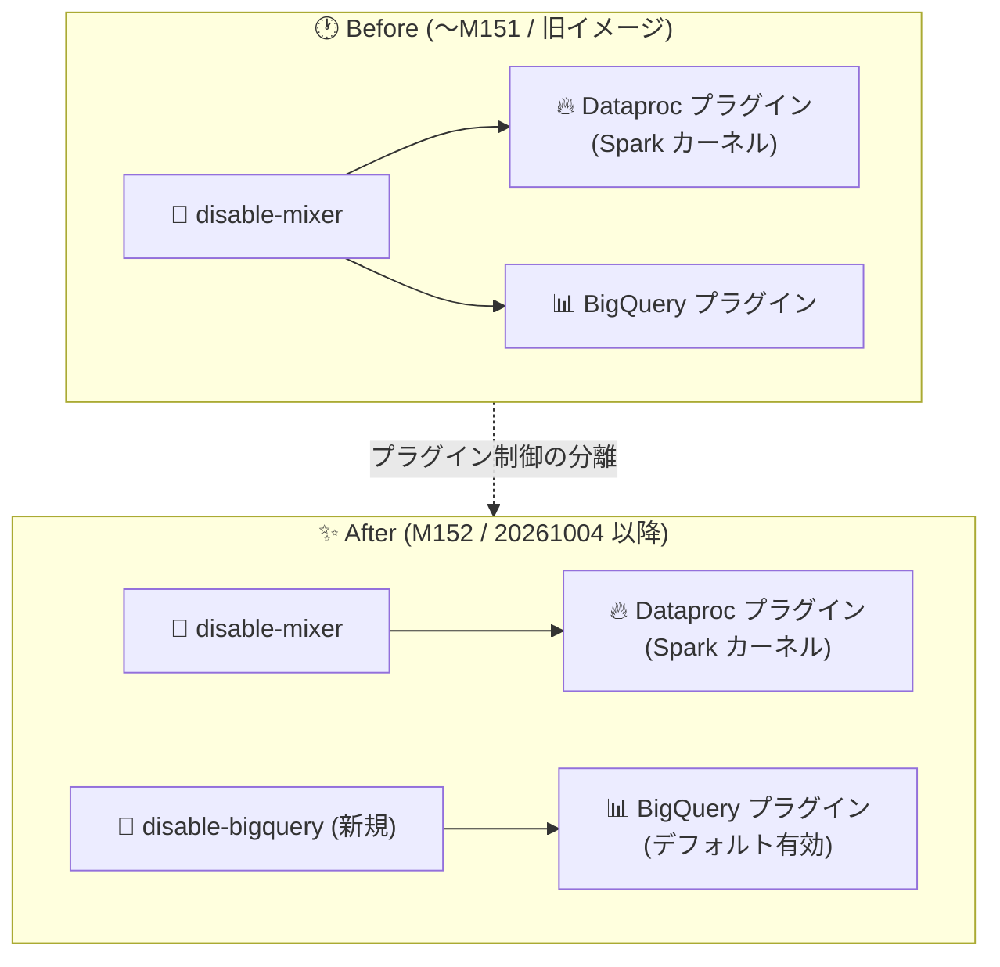

# Agent Platform Workbench: BigQuery プラグインの独立化・一括セキュリティパッチ・Pre-Turing GPU 向け CUDA ドライバ対応

**リリース日**: 2026-10-05 (一部は 2026-10-04)

**サービス**: Agent Platform Workbench

**機能**: BigQuery JupyterLab プラグインの独立有効化、カスタムコンテナイメージの一括セキュリティパッチ、Pre-Turing GPU 向け CUDA ドライバのプリインストール

**ステータス**: Change / Security / Fixed

📊 [このアップデートのインフォグラフィックを見る](https://takech9203.github.io/google-cloud-news-summary/20261005-agent-platform-workbench-plugin-and-security-updates.html)

## 概要

Agent Platform Workbench (旧 Vertex AI Workbench) の各イメージファミリーで、2026 年 10 月 4 日〜5 日にかけて 3 件の関連アップデートがリリースされました。対象は VM イメージ (`workbench-instances` / `workbench-instances-2603`) とカスタムコンテナ用ベースイメージ (`workbench-container` / `workbench-container-slim` / `workbench-container-2606`) です。

1 つ目は、**BigQuery JupyterLab プラグインが Dataproc プラグインから独立して有効化されるようになった**変更です。BigQuery プラグインはデフォルトで有効となり、新しいインスタンスメタデータキー `disable-bigquery` で個別に無効化できます。従来の `disable-mixer` キーは、今後 Dataproc プラグイン (Managed Service for Apache Spark カーネルへのアクセス) のみを制御します。

2 つ目は、**カスタムコンテナイメージに対する一括セキュリティパッチ** (2026-10-04) です。Agent Platform Workbench のカスタムコンテナイメージに含まれていた Critical および High 深刻度の CVE が修正されました。3 つ目は、**V100 などの Pre-Turing 世代 GPU 向け CUDA ドライバのプリインストール** (2026-10-04、`workbench-instances-2603` Debian 12 イメージ) で、旧世代 GPU を利用するインスタンスでのドライバ問題が修正されました。ノートブック環境を管理するデータサイエンスチームや、セキュリティコンプライアンスを担当するプラットフォーム管理者に関係するアップデートです。

**アップデート前の課題**

- BigQuery JupyterLab プラグインの有効/無効が Dataproc プラグインと同じ `disable-mixer` メタデータキーに連動しており、個別に制御できなかった (Dataproc プラグインを無効化すると BigQuery プラグインも使えなくなる)
- カスタムコンテナイメージに Critical / High 深刻度の CVE を含むパッケージが残っていた
- Debian 12 ベースの `workbench-instances-2603` イメージでは、V100 などの Pre-Turing 世代 GPU 向け CUDA ドライバがプリインストールされていなかった

**アップデート後の改善**

- BigQuery プラグインがデフォルトで有効になり、新しい `disable-bigquery` メタデータキーで BigQuery プラグインのみを個別に無効化できるようになった
- `disable-mixer` は Dataproc プラグインのみを制御するようになり、Spark カーネルを無効化しつつ BigQuery 統合を使い続ける構成が可能になった
- カスタムコンテナイメージの Critical / High 深刻度 CVE が一括修正され、最新イメージへの更新で脆弱性を解消できるようになった
- V100 などの Pre-Turing GPU 向け CUDA ドライバがプリインストールされ、旧世代 GPU インスタンスがそのまま利用できるようになった

## アーキテクチャ図



従来は `disable-mixer` キー 1 つで Dataproc プラグインと BigQuery プラグインの両方が連動して制御されていましたが、今回の変更で BigQuery プラグインは新設の `disable-bigquery` キーにより独立して制御できるようになりました。

## サービスアップデートの詳細

### 主要機能

1. **BigQuery JupyterLab プラグインの独立有効化 (Change)**
   - BigQuery プラグインは Dataproc プラグインから独立し、デフォルトで有効になった
   - 新しいインスタンスメタデータキー `disable-bigquery` (`true` で無効化、デフォルト `false`) で個別制御が可能
   - `disable-mixer` は Dataproc プラグイン (Managed Service for Apache Spark カーネルへのアクセス) のみを制御するよう変更
   - BigQuery プラグインは JupyterLab 内でデータセットエクスプローラー、SQL クエリエディタ、クエリ履歴を提供する

2. **カスタムコンテナイメージの一括セキュリティパッチ (Security、2026-10-04)**
   - Agent Platform Workbench のカスタムコンテナイメージに含まれる Critical および High 深刻度の CVE を一括修正
   - `workbench-container` および `workbench-container-slim` (Python 3.10) ファミリーの `20261004-2230-rc0` リリースに含まれる
   - Python 3.12 ファミリー (`workbench-container-2606` / `workbench-container-slim-2606`) では、同種の一括セキュリティパッチが先行して 2026-09-28 の `20260927.00_p0` リリースで適用済み

3. **Pre-Turing GPU 向け CUDA ドライバのプリインストール (Fixed、2026-10-04)**
   - V100 などの Pre-Turing 世代 GPU 向け CUDA ドライバがイメージにプリインストールされるようになった
   - `workbench-instances-2603` (Debian 12) ファミリーの `20261004-2157-rc0` リリースに含まれる

### 対象イメージリリース

| イメージファミリー | ベース | リリース | 日付 | 含まれる変更 |
|------|------|------|------|------|
| `workbench-instances` | Debian 11 | M152 | 2026-10-04 | BigQuery プラグイン独立化 |
| `workbench-instances-2603` | Debian 12 | 20261004-2157-rc0 | 2026-10-04 | BigQuery プラグイン独立化、Pre-Turing GPU 用 CUDA ドライバ |
| `workbench-container` | Python 3.10 | 20261004-2230-rc0 | 2026-10-04 | BigQuery プラグイン独立化、一括セキュリティパッチ |
| `workbench-container-slim` | Python 3.10 (slim) | 20261004-2230-rc0 | 2026-10-04 | 一括セキュリティパッチ |
| `workbench-container-2606` | Python 3.12 | 20261004.00_p0 | 2026-10-05 | BigQuery プラグイン独立化 |

## 技術仕様

### 関連するインスタンスメタデータキー

| メタデータキー | 制御対象 | 値とデフォルト |
|------|------|------|
| `disable-bigquery` (新規) | BigQuery JupyterLab プラグイン (データセットエクスプローラー、SQL クエリエディタ、クエリ履歴) | `true`: 無効化 / `false` (デフォルト): 有効 |
| `disable-mixer` | Managed Service for Apache Spark カーネルへのアクセス (Dataproc プラグイン) のみ | `true`: 無効化 / `false` (デフォルト): 有効 |

## 設定方法

### 手順

#### BigQuery プラグインを無効化する

```bash
# インスタンス作成時にメタデータで BigQuery プラグインを無効化
gcloud workbench instances create INSTANCE_NAME \
  --location=LOCATION \
  --metadata=disable-bigquery=true
```

BigQuery プラグインのみを無効化します。Dataproc プラグインには影響しません。

#### Dataproc プラグインのみを無効化する (BigQuery プラグインは維持)

```bash
gcloud workbench instances create INSTANCE_NAME \
  --location=LOCATION \
  --metadata=disable-mixer=true
```

今回の変更により、`disable-mixer=true` を設定しても BigQuery プラグインは有効のまま利用できます。

#### セキュリティパッチ・CUDA ドライバ修正の適用

セキュリティパッチおよび CUDA ドライバの修正は最新イメージリリースに含まれるため、インスタンスのアップグレードまたは最新イメージでの再作成により適用します。カスタムコンテナを使用している場合は、最新のベースコンテナ (`us-docker.pkg.dev/workbench-images/gcr.io/` 配下) からコンテナイメージを再ビルドします。

## メリット

### ビジネス面

- **セキュリティコンプライアンスの維持**: Critical / High CVE の一括修正により、脆弱性スキャンの指摘事項を最新イメージへの更新だけで解消できる
- **既存 GPU 資産の活用**: V100 などの旧世代 GPU を使ったワークロードを最新の Debian 12 イメージ上でも継続利用できる

### 技術面

- **プラグイン制御の粒度向上**: BigQuery と Dataproc のプラグインを独立に有効/無効化でき、組織のポリシーに合わせた細かいノートブック環境構成が可能
- **BigQuery 統合がデフォルトで利用可能**: Spark カーネルを使わない環境でも、JupyterLab の BigQuery データセットエクスプローラーや SQL クエリエディタをそのまま利用できる

## デメリット・制約事項

### 考慮すべき点

- BigQuery プラグインはデフォルトで有効になるため、組織ポリシーでノートブックからの BigQuery アクセス UI を提供したくない場合は、明示的に `disable-bigquery=true` の設定が必要
- これまで `disable-mixer=true` によって BigQuery プラグインも無効化していた環境では、イメージ更新後に BigQuery プラグインが有効化されるため、挙動の変化に注意が必要
- セキュリティパッチと CUDA ドライバ修正の適用には、インスタンスのアップグレードまたは最新イメージ/ベースコンテナへの更新が必要 (既存インスタンスには自動適用されない)

## ユースケース

### ユースケース 1: Spark カーネルを使わない BigQuery 分析環境

**シナリオ**: データアナリストチームは JupyterLab から BigQuery のデータ探索と SQL クエリ実行のみを行い、Managed Service for Apache Spark のカーネルは利用しない。

**実装例**:
```bash
gcloud workbench instances create analyst-notebook \
  --location=us-central1-a \
  --metadata=disable-mixer=true
```

**効果**: 不要な Spark カーネルへのアクセスを無効化しつつ、BigQuery のデータセットエクスプローラー、SQL クエリエディタ、クエリ履歴は引き続き利用できる。

### ユースケース 2: 脆弱性指摘を受けたカスタムコンテナ環境の更新

**シナリオ**: セキュリティチームのコンテナスキャンで、Workbench カスタムコンテナに Critical / High の CVE が検出された。

**効果**: 2026-10-04 の `20261004-2230-rc0` 以降のベースコンテナイメージからカスタムコンテナを再ビルドすることで、一括パッチ済みのパッケージ構成に更新し、指摘事項を解消できる。

### ユースケース 3: V100 GPU での Debian 12 イメージ利用

**シナリオ**: 既存の V100 GPU を利用した機械学習ワークロードを、最新の Debian 12 ベースの Workbench インスタンスへ移行したい。

**効果**: `workbench-instances-2603` の `20261004-2157-rc0` 以降では Pre-Turing GPU 向け CUDA ドライバがプリインストールされているため、追加のドライバセットアップなしで V100 インスタンスを利用できる。

## 料金

このアップデートによる料金体系の変更はありません。Agent Platform Workbench インスタンスの料金は、従来どおり基盤となるコンピューティングリソースなどに基づいて課金されます。

## 関連サービス・機能

- **BigQuery**: BigQuery JupyterLab プラグインにより、JupyterLab 内からデータセットの探索、SQL クエリの実行、クエリ履歴の確認が可能
- **Managed Service for Apache Spark (Dataproc)**: `disable-mixer` キーが制御する Spark カーネルの提供元。サーバーレスの Spark セッションをノートブックから利用できる
- **Compute Engine**: Workbench インスタンスの基盤。V100 などの GPU はアタッチされた Compute Engine リソースとして提供される
- **Artifact Registry**: カスタムコンテナのベースイメージ (`us-docker.pkg.dev/workbench-images/gcr.io/` 配下) の配布元

## 参考リンク

- 📊 [インフォグラフィック](https://takech9203.github.io/google-cloud-news-summary/20261005-agent-platform-workbench-plugin-and-security-updates.html)
- [公式リリースノート (2026-10-05)](https://docs.cloud.google.com/release-notes#October_05_2026)
- [公式リリースノート (2026-10-04)](https://docs.cloud.google.com/release-notes#October_04_2026)
- [Agent Platform Workbench リリースノート](https://docs.cloud.google.com/gemini-enterprise-agent-platform/notebooks/workbench/release-notes)
- [インスタンスメタデータの管理 (disable-bigquery / disable-mixer)](https://docs.cloud.google.com/gemini-enterprise-agent-platform/notebooks/workbench/instances/manage-metadata)
- [JupyterLab から BigQuery データをクエリする](https://docs.cloud.google.com/gemini-enterprise-agent-platform/notebooks/workbench/instances/bigquery)
- [カスタムコンテナの作成](https://docs.cloud.google.com/gemini-enterprise-agent-platform/notebooks/workbench/instances/create-custom-container)
- [イメージのバージョニングとライフサイクル](https://docs.cloud.google.com/gemini-enterprise-agent-platform/notebooks/workbench/instances/image-versioning)

## まとめ

Agent Platform Workbench の BigQuery プラグインが Dataproc プラグインから独立し、`disable-bigquery` キーによる個別制御が可能になりました。あわせてカスタムコンテナイメージの Critical / High CVE 一括修正と、V100 など Pre-Turing GPU 向け CUDA ドライバのプリインストールが提供されています。`disable-mixer=true` を利用中の環境は BigQuery プラグインが有効化される挙動変化を確認し、カスタムコンテナ利用者は最新ベースイメージでの再ビルドによるセキュリティパッチ適用を推奨します。

---

**タグ**: #AgentPlatformWorkbench #VertexAIWorkbench #BigQuery #JupyterLab #Security #CVE #GPU #CUDA
