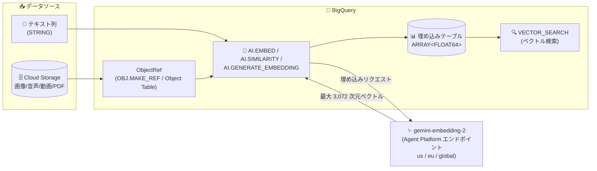

# BigQuery: gemini-embedding-2 マルチモーダル埋め込みモデルが GA

**リリース日**: 2026-10-05

**サービス**: BigQuery

**機能**: gemini-embedding-2 モデル (AI.EMBED / AI.SIMILARITY / AI.GENERATE_EMBEDDING 対応)

**ステータス**: GA (一般提供)

📊 [このアップデートのインフォグラフィックを見る](https://takech9203.github.io/google-cloud-news-summary/20261005-bigquery-gemini-embedding-2.html)

## 概要

BigQuery で `gemini-embedding-2` モデルが一般提供 (GA) になりました。gemini-embedding-2 は Google 初のマルチモーダル埋め込み (embedding) モデルで、テキスト、画像、音声、動画、PDF ファイルを単一の統合された埋め込み空間 (unified embedding space) に数値マッピングします。長い文字列、多言語データ、非構造化データの埋め込み生成に適しており、テキスト・画像・音声・動画・PDF を組み合わせた入力をサポートします。

このモデルは BigQuery の [AI.EMBED](https://docs.cloud.google.com/bigquery/docs/reference/standard-sql/bigqueryml-syntax-ai-embed)、[AI.SIMILARITY](https://docs.cloud.google.com/bigquery/docs/reference/standard-sql/bigqueryml-syntax-ai-similarity)、[AI.GENERATE_EMBEDDING](https://docs.cloud.google.com/bigquery/docs/reference/standard-sql/bigqueryml-syntax-ai-generate-embedding) の 3 つの関数から利用でき、SQL だけでクロスモーダルなセマンティック検索、ドキュメント検索、レコメンデーションシステムを構築できます。データウェアハウス内の非構造化データ (Cloud Storage 上の画像・音声・動画・PDF を参照する ObjectRef) とテキストデータを、同じ埋め込み空間で横断的に扱えるのが最大の特徴です。

対象ユーザーは、BigQuery 上でセマンティック検索・RAG・レコメンデーションを構築するデータエンジニアや、マルチモーダルデータの分析基盤を SQL 中心に構築したいデータアナリスト・ML エンジニアです。

**アップデート前の課題**

- 従来の BigQuery 用埋め込みモデルはモダリティごとに分かれており、テキストは `text-embedding-005` (英語特化、最大 768 次元、2,048 トークン) や `text-multilingual-embedding-002`、`gemini-embedding-001` (最大 3,072 次元、2,048 トークン)、画像は `multimodalembedding@001` と使い分ける必要があった
- 音声、動画、PDF ファイルの埋め込み生成に対応したモデルが BigQuery の AI 関数から利用できなかった
- 入力トークン上限が 2,048 トークンであり、長い文字列の埋め込みには分割などの工夫が必要だった
- gemini-embedding-2 は 2026 年 3 月から `gemini-embedding-2-preview` としてプレビュー提供されており、本番ワークロードでの利用には GA を待つ必要があった

**アップデート後の改善**

- テキスト・画像・音声・動画・PDF を 1 つのモデル (`gemini-embedding-2`) で単一の埋め込み空間にマッピングできるようになり、「テキストで画像を検索する」などのクロスモーダル検索が BigQuery の SQL だけで可能になった
- 入力トークン上限が 8,192 トークンに拡大し、長い文字列や非構造化データの埋め込みに対応した
- `STRUCT` 型で `STRING`、`ARRAY<STRING>`、`ObjectRef`、`ARRAY<ObjectRef>` を組み合わせた複合入力 (例: 商品説明テキスト + 商品画像) を 1 つの埋め込みとして生成できるようになった
- 出力次元数は最大 3,072 で、`dimension` / `output_dimensionality` パラメータにより柔軟に縮小可能 (MRL サポート)
- GA となったことで、SLA を含む本番ワークロードでの利用が可能になった

## アーキテクチャ図



BigQuery のテキスト列と Cloud Storage 上の非構造化データ (ObjectRef) を AI 関数経由で gemini-embedding-2 エンドポイントに送信し、統合埋め込み空間のベクトルを生成するデータフローです。生成した埋め込みはテーブルに保存して VECTOR_SEARCH による大規模なセマンティック検索に活用できます。

## サービスアップデートの詳細

### 主要機能

1. **マルチモーダル統合埋め込み空間**
   - テキスト、画像、音声、動画、PDF を単一の埋め込み空間に意味的にマッピング
   - 「テキストの説明文から画像を検索」といったクロスモーダルなタスクが可能
   - 複数の入力 (テキスト + 画像など) を 1 つの集約された埋め込みとして生成可能

2. **3 つの BigQuery AI 関数での利用**
   - **AI.EMBED**: スカラー関数。`endpoint => 'gemini-embedding-2'` を指定して埋め込みを生成。`STRUCT` によるテキスト + ObjectRef の複合入力に対応
   - **AI.SIMILARITY**: 2 つの入力のコサイン類似度 (0〜1) を直接計算するスカラー関数。埋め込みの事前計算が不要
   - **AI.GENERATE_EMBEDDING**: リモートモデル (`CREATE MODEL ... REMOTE WITH CONNECTION`) 経由のテーブル値関数。テーブル単位の一括埋め込み生成に対応

3. **柔軟な出力次元 (MRL サポート)**
   - デフォルトは 3,072 次元の FLOAT64 ベクトル
   - `model_params` の `dimension` フィールド (AI.EMBED / AI.SIMILARITY) や `output_dimensionality` (AI.GENERATE_EMBEDDING) で次元数を縮小可能
   - ストレージコストと検索速度に応じた次元数の最適化が可能

4. **拡大された入力コンテキスト**
   - 入力トークン上限 8,192 トークン (従来のテキスト埋め込みモデルは 2,048 トークン)
   - 全モダリティで 8,192 トークンのコンテキストウィンドウを共有

5. **ドキュメント OCR と音声トラック抽出**
   - PDF 入力からの OCR 読み取りに対応 (デフォルトでは無効)
   - 動画入力から音声トラックを抽出し、フレームとインターリーブして埋め込みに反映可能

## 技術仕様

### モデル仕様

| 項目 | 詳細 |
|------|------|
| モデル ID | `gemini-embedding-2` (GA)、`gemini-embedding-2-preview` (Preview) |
| 入力モダリティ | テキスト、画像、音声、動画、PDF |
| 出力 | 埋め込みベクトル (ARRAY&lt;FLOAT64&gt;) |
| 入力トークン上限 | 8,192 トークン (全モダリティで共有、超過分はサイレントに切り捨て) |
| 出力次元 | 最大 3,072 (デフォルト 3,072、128〜3,072 で調整可能、推奨: 768 / 1,536 / 3,072) |
| 画像 | 最大 6 枚/リクエスト。PNG, JPEG, WebP, BMP, HEIC, HEIF, AVIF。1 画像あたり 258 トークン |
| PDF | 1 ファイル/リクエスト、最大 6 ページ (1 ページ推奨)。1 ページあたり 258 トークン (画像としてレンダリング) |
| 動画 | 1 本/リクエスト、最大 120 秒 (音声なし) / 80 秒 (音声あり)。MP4, MOV (H264/H265/AV1/VP9)。1 フレームあたり 66 トークン |
| 音声 | 最大 180 秒/リクエスト。MP3, WAV。1 秒あたり 25 トークン。音声認識 (スピーチ) に最適化 |
| エンドポイント | マルチリージョン (`us` / `eu`) またはグローバル (`global`) のみ |
| バッチ推論 | 対応 (Provisioned Throughput は非対応) |

### エンドポイント自動選択ルール

短縮名 `gemini-embedding-2` を指定した場合、BigQuery はクエリ実行リージョンに応じてエンドポイントを自動選択します。

| クエリ実行リージョン | 使用されるエンドポイント |
|------|------|
| `us` マルチリージョンまたは米国内の単一リージョン | `us` エンドポイント |
| `eu` マルチリージョンまたは EU 内の単一リージョン (`europe-west2`, `europe-west6` を除く) | `eu` エンドポイント |
| その他すべて (`europe-west2`, `europe-west6` を含む) | `global` エンドポイント |

### gemini-embedding-2 固有の注意点 (AI.EMBED)

- `task_type` パラメータ (RETRIEVAL_QUERY, SEMANTIC_SIMILARITY など) は gemini-embedding-2 エンドポイントとは**互換性がない**
- `title` パラメータも gemini-embedding-2 エンドポイントとは**互換性がない**
- `model_params` では `dimension` フィールドのみサポート

```sql
-- テキスト + 画像の複合入力を 1 つの埋め込みとして生成する例
SELECT AI.EMBED(
  ('Made of tempered glass',
   OBJ.MAKE_REF('gs://cloud-samples-data/bigquery/tutorials/cymbal-pets/images/aquaclear-20-gallon-aquarium.png')),
  endpoint => 'gemini-embedding-2');
```

## 設定方法

### 前提条件

1. BigQuery と Agent Platform (Vertex AI) API が有効なプロジェクト
2. Cloud リソース接続 (connection) を作成し、接続のサービスアカウントに **Agent Platform User ロール** (`aiplatform.user`) を付与していること
3. 画像・音声・動画・PDF を扱う場合は、対象ファイルを Cloud Storage に配置し、ObjectRef (オブジェクトテーブルまたは `OBJ.MAKE_REF`) でアクセスできること

### 手順

#### ステップ 1: AI.EMBED でテキストの埋め込みを生成

```sql
SELECT AI.EMBED(
  'A piece of text to embed',
  endpoint => 'gemini-embedding-2') AS embedding;
```

`embedding.result` に埋め込みベクトル (ARRAY&lt;FLOAT64&gt;)、`embedding.status` に API レスポンスステータスが返ります (成功時は空文字列)。

#### ステップ 2: 非構造化データ (画像) との複合埋め込みを生成

```sql
-- オブジェクトテーブルを作成
CREATE OR REPLACE EXTERNAL TABLE cymbal_pets.product_images
WITH CONNECTION DEFAULT
OPTIONS (
  object_metadata = 'SIMPLE',
  uris = ['gs://my-bucket/product-images/*.png']
);

-- テキスト説明 + 画像を 1 つの埋め込みに
SELECT AI.EMBED(
  (description, ref),
  endpoint => 'gemini-embedding-2') AS embedding
FROM cymbal_pets.product_images;
```

#### ステップ 3: AI.SIMILARITY で類似度を直接計算

```sql
-- テキストと画像のクロスモーダル類似度を計算
SELECT uri,
  AI.SIMILARITY(
    'aquarium device',
    ref,
    endpoint => 'gemini-embedding-2') AS similarity_score
FROM cymbal_pets.product_images
ORDER BY similarity_score DESC
LIMIT 3;
```

コサイン類似度 (FLOAT64) が返り、1 に近いほど類似、0 に近いほど非類似です。

#### ステップ 4: AI.GENERATE_EMBEDDING で一括生成 (リモートモデル経由)

```sql
-- リモートモデルを作成
CREATE OR REPLACE MODEL `mydataset.gemini_embedding_2`
REMOTE WITH CONNECTION `us.example_connection`
OPTIONS (ENDPOINT = 'gemini-embedding-2');

-- テーブル全体の埋め込みを一括生成
SELECT * FROM AI.GENERATE_EMBEDDING(
  MODEL `mydataset.gemini_embedding_2`,
  (SELECT (description, image_ref) AS content FROM mydataset.products)
);
```

## メリット

### ビジネス面

- **非構造化データの活用範囲拡大**: データウェアハウスに眠る画像・音声・動画・PDF をテキストと同じ空間で検索・分析でき、商品カタログ検索やコンテンツレコメンドなどの新しいユースケースを SQL だけで実現できる
- **開発コストの削減**: 従来はモダリティごとに別モデル・別パイプラインが必要だった埋め込み処理を 1 モデルに統合でき、パイプラインの構築・運用コストを削減できる
- **GA による本番適用**: Preview から GA に昇格したことで、エンタープライズの本番ワークロードに安心して採用できる

### 技術面

- **統合埋め込み空間によるクロスモーダル検索**: テキストクエリで画像・動画・PDF を検索するなど、モダリティをまたぐセマンティック検索が可能
- **長文対応**: 入力 8,192 トークンにより、従来 (2,048 トークン) ではチャンク分割が必要だった長い文書も扱いやすくなった
- **柔軟な次元調整 (MRL)**: 128〜3,072 次元で出力を調整でき、精度とストレージ・検索コストのトレードオフを制御できる
- **BigQuery エコシステムとの統合**: 生成した埋め込みは VECTOR_SEARCH やベクトルインデックスとそのまま組み合わせられる

## デメリット・制約事項

### 制限事項

- gemini-embedding-2 はマルチリージョン (`us` / `eu`) またはグローバルエンドポイントでのみ利用可能 (単一リージョンエンドポイントは不可)
- `task_type` および `title` パラメータは gemini-embedding-2 エンドポイントと互換性がない (タスク別最適化を使っていた場合は注意)
- 入力が 8,192 トークンを超えた場合、超過分はエラーにならず**サイレントに切り捨て**られる
- モダリティごとの入力上限: 画像 6 枚、PDF 1 ファイル (最大 6 ページ)、動画 1 本 (最大 120 秒)、音声 180 秒
- 音声サポートはスピーチに最適化されており、環境音や音楽では品質が落ちる可能性がある
- Provisioned Throughput は非対応

### 考慮すべき点

- Agent Platform (Vertex AI) エンドポイントを呼び出すため、BigQuery のスロットとは別に Agent Platform 側の課金が発生する (BigQuery 内で完結する組み込みモデル `embeddinggemma-300m` とは課金体系が異なる)
- 動画で音声トラック抽出を有効にすると、音声 (25 トークン/秒) + フレーム (66 トークン/フレーム) + タイムスタンプ (10 トークン/秒) がコンテキストを消費し、実質的な最大長が約 81 秒に短縮される
- 少数の比較には AI.SIMILARITY、大規模データに対する検索には埋め込みの事前計算 + VECTOR_SEARCH (ベクトルインデックス) が適しており、使い分けの設計が必要
- 既存の `multimodalembedding@001` (1,408 次元) や `text-embedding-005` (768 次元) で生成済みの埋め込みとは互換性がないため、移行時は埋め込みの再生成が必要

## ユースケース

### ユースケース 1: EC サイトの商品画像セマンティック検索

**シナリオ**: EC サイトの商品カタログ (商品説明テキスト + Cloud Storage 上の商品画像) に対し、ユーザーの自然文クエリで最適な商品を検索したい。

**実装例**:
```sql
-- 商品説明 + 商品画像の複合埋め込みを事前計算してテーブルに保存
CREATE OR REPLACE TABLE mydataset.product_embeddings AS
SELECT
  product_id,
  AI.EMBED(
    (description, image_ref),
    endpoint => 'gemini-embedding-2').result AS embedding
FROM mydataset.products;

-- テキストクエリで商品をベクトル検索
SELECT base.product_id
FROM VECTOR_SEARCH(
  TABLE mydataset.product_embeddings,
  'embedding',
  (SELECT AI.EMBED('耐熱ガラス製の水槽', endpoint => 'gemini-embedding-2').result),
  top_k => 5);
```

**効果**: テキストと画像の両方の情報を反映した高精度な検索を、外部のベクトルデータベースを立てずに BigQuery 内で完結できる。

### ユースケース 2: 多言語ドキュメント (PDF) の重複・類似判定

**シナリオ**: 多言語で蓄積された契約書や社内ドキュメント (PDF) について、類似ドキュメントの検出や分類を行いたい。

**効果**: gemini-embedding-2 は多言語と長い文字列に強く、PDF を直接入力できるため、OCR やテキスト抽出のパイプラインを別途構築することなく、SQL のみで類似判定 (AI.SIMILARITY) やクラスタリング用埋め込みの生成が可能になる。

### ユースケース 3: コールセンター音声ログの意味検索

**シナリオ**: コールセンターの通話録音 (音声ファイル) から、特定の問い合わせ内容に類似した通話を検索したい。

**効果**: 音声 (最大 180 秒/リクエスト) をテキストと同じ埋め込み空間にマッピングできるため、「解約に関する問い合わせ」のようなテキストクエリで音声ログを横断検索できる。

## 料金

BigQuery から `gemini-embedding-2` を利用する場合、Agent Platform (Vertex AI) エンドポイントの呼び出しごとに Agent Platform 側の料金が発生します (BigQuery スロットとは別課金)。詳細は [Agent Platform の生成 AI 料金ページ](https://cloud.google.com/gemini-enterprise-agent-platform/generative-ai/pricing) を参照してください。

参考として、Gemini API (Developer API) における gemini-embedding-2 の料金 (Paid Tier) は以下のとおりです。

| 入力モダリティ | Standard (100 万トークンあたり) | Batch (100 万トークンあたり) |
|--------|-----------------|-----------------|
| テキスト | $0.20 | $0.10 |
| 画像 | $0.45 ($0.00012/画像) | $0.225 ($0.00006/画像) |
| 音声 | $6.50 ($0.00016/秒) | $3.25 ($0.00008/秒) |
| 動画 | $12.00 ($0.00079/フレーム) | $6.00 ($0.000395/フレーム) |

なお、組み込みモデル `embeddinggemma-300m` を使う場合は BigQuery スロットのみを消費し、Agent Platform 課金は発生しません (ただしテキストのみ・短い文字列向け)。

## 利用可能リージョン

- gemini-embedding-2 のエンドポイントは **グローバル (`global`)、米国マルチリージョン (`us`)、EU マルチリージョン (`eu`)** で提供されます
- BigQuery のクエリ実行リージョンに応じてエンドポイントが自動選択されます (詳細は「技術仕様」のエンドポイント自動選択ルールを参照)
- 最新のリージョン情報は [モデルの提供ロケーション](https://docs.cloud.google.com/gemini-enterprise-agent-platform/resources/locations) を参照してください

## 関連サービス・機能

- **VECTOR_SEARCH / ベクトルインデックス**: 事前計算した埋め込みに対する大規模な近似最近傍 (ANN) 検索。AI.SIMILARITY が少数比較向けなのに対し、大規模検索はこちらが適する
- **Agent Platform (Vertex AI)**: gemini-embedding-2 のモデルエンドポイントを提供。BigQuery からは接続 (connection) 経由で呼び出す
- **Cloud Storage / オブジェクトテーブル / ObjectRef**: 画像・音声・動画・PDF などの非構造化データを BigQuery から参照する仕組み。マルチモーダル埋め込みの入力に使用
- **BigQuery ML リモートモデル**: `CREATE MODEL ... REMOTE WITH CONNECTION` で gemini-embedding-2 を参照し、AI.GENERATE_EMBEDDING から利用

## 参考リンク

- 📊 [インフォグラフィック](https://takech9203.github.io/google-cloud-news-summary/20261005-bigquery-gemini-embedding-2.html)
- [公式リリースノート](https://docs.cloud.google.com/release-notes#October_05_2026)
- [AI.EMBED 関数リファレンス](https://docs.cloud.google.com/bigquery/docs/reference/standard-sql/bigqueryml-syntax-ai-embed)
- [AI.SIMILARITY 関数リファレンス](https://docs.cloud.google.com/bigquery/docs/reference/standard-sql/bigqueryml-syntax-ai-similarity)
- [AI.GENERATE_EMBEDDING 関数リファレンス](https://docs.cloud.google.com/bigquery/docs/reference/standard-sql/bigqueryml-syntax-ai-generate-embedding)
- [Gemini Embedding 2 モデル情報 (Agent Platform)](https://docs.cloud.google.com/gemini-enterprise-agent-platform/models/gemini/embedding-2)
- [マルチモーダル埋め込みの取得](https://docs.cloud.google.com/gemini-enterprise-agent-platform/models/embeddings/get-multimodal-embeddings)
- [料金ページ (Agent Platform 生成 AI)](https://cloud.google.com/gemini-enterprise-agent-platform/generative-ai/pricing)

## まとめ

gemini-embedding-2 の GA により、BigQuery はテキスト・画像・音声・動画・PDF を単一の埋め込み空間で扱えるマルチモーダル分析基盤へと進化しました。従来はモダリティごとにモデルやパイプラインを使い分ける必要があった埋め込み生成が、AI.EMBED / AI.SIMILARITY / AI.GENERATE_EMBEDDING の 3 関数と 1 つのモデルに統合されます。非構造化データのセマンティック検索や RAG を検討しているチームは、まず AI.SIMILARITY でのプロトタイピングから着手し、本番規模では埋め込みの事前計算 + VECTOR_SEARCH への移行を検討することをお勧めします。

---

**タグ**: BigQuery, BigQuery ML, Embedding, gemini-embedding-2, マルチモーダル, AI.EMBED, AI.SIMILARITY, AI.GENERATE_EMBEDDING, ベクトル検索, GA
