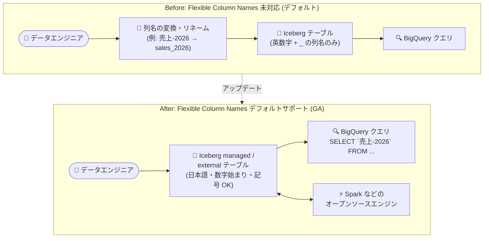

# BigQuery: Iceberg テーブルで Flexible Column Names がデフォルトサポート (GA)

**リリース日**: 2026-10-05

**サービス**: BigQuery

**機能**: Iceberg external tables / Iceberg managed tables における Flexible Column Names のデフォルトサポート

**ステータス**: GA (一般提供)

📊 [このアップデートのインフォグラフィックを見る](https://takech9203.github.io/google-cloud-news-summary/20261005-bigquery-iceberg-flexible-column-names.html)

## 概要

BigQuery の [Iceberg external tables](https://docs.cloud.google.com/bigquery/docs/iceberg-external-tables) と [Iceberg managed tables](https://docs.cloud.google.com/bigquery/docs/iceberg-tables) が、[Flexible Column Names (柔軟な列名)](https://docs.cloud.google.com/bigquery/docs/schemas#flexible-column-names) をデフォルトでサポートするようになりました。本機能は一般提供 (GA) です。

Flexible Column Names は、従来の BigQuery 列名規則 (英字・数字・アンダースコアのみ、先頭は英字またはアンダースコア) を拡張し、任意の言語の文字 (日本語を含む Unicode 文字 `\p{L}`)、任意の言語の数字 (`\p{N}`)、ハイフン、アクセント記号などの結合文字、さらに `&`、`%`、`=`、`+`、`:`、`'`、`<`、`>`、`#`、`|`、空白文字といった特殊文字を列名に使用できるようにする機能です。数字で始まる列名も許容されます。

今回のアップデートにより、Iceberg 形式のオープンレイクハウスを構築するユーザーは、追加の有効化作業なしで多言語・特殊文字を含む列名をそのまま利用できます。Spark などのオープンソースエンジンで作成された Iceberg データの列名を BigQuery 用にリネームする必要がなくなり、データレイクと BigQuery 間のスキーマ互換性が向上します。

**アップデート前の課題**

- Flexible Column Names は Iceberg テーブルではデフォルトで有効化されておらず、非 ASCII 文字や特殊文字を含む列名を持つ Iceberg データをそのまま扱えないケースがあった
- 外部エンジン (Spark など) で作成された Iceberg テーブルの列名が BigQuery の従来の列名規則 (英字・数字・アンダースコアのみ) に合わない場合、列名の変換・リネームといった回避策が必要だった

**アップデート後の改善**

- Iceberg managed tables と Iceberg external tables の両方で、Flexible Column Names がデフォルトで有効になり、追加の設定や申請なしで利用可能になった
- 日本語などの多言語文字、数字始まり、ハイフンや空白を含む列名を Iceberg テーブルでそのまま定義・参照できるようになった
- GA ステータスとなり、本番環境のレイクハウスワークロードで安心して利用できるようになった

## アーキテクチャ図



従来は Iceberg テーブルで BigQuery の列名規則に合わせたリネームが必要になるケースがありましたが、本アップデートにより多言語・特殊文字を含む列名をデフォルトでそのまま利用でき、オープンソースエンジンとの相互運用性が向上します。

## サービスアップデートの詳細

### 主要機能

1. **Iceberg managed tables / Iceberg external tables でのデフォルト有効化**
   - Flexible Column Names が両テーブルタイプでデフォルトで有効 (申請・設定不要)
   - 一方、その他の外部テーブル (Parquet、ORC、Avro、CSV、Delta Lake) ではデフォルト無効のままで、プロジェクトレベルの有効化には Cloud カスタマーケアへの依頼が必要

2. **拡張された列名文字セット**
   - 任意の言語の文字 (Unicode `\p{L}`)、任意の言語の数字 (`\p{N}`)、接続句読文字 (`\p{Pc}`、アンダースコア含む)、ハイフン/ダッシュ (`\p{Pd}`)、アクセント記号などの結合文字 (`\p{M}`) をサポート
   - 特殊文字 `&` `%` `=` `+` `:` `'` `<` `>` `#` `|` および空白文字をサポート
   - 数字で始まる列名も使用可能

3. **BigQuery Storage API との連携**
   - 拡張文字セットは BigQuery Storage Read API と BigQuery Storage Write API (gRPC) の両方でサポート
   - Storage Read API では `enable_display_name_attribute` フラグの設定が必要で、`displayName` 属性で列名を取得する
   - Storage Write API (gRPC) では `JsonStreamWriter` を使う場合を除き、`column_name` アノテーション付きのスキーマ指定が必要

## 技術仕様

### Flexible Column Names の文字サポート

| 項目 | 詳細 |
|------|------|
| サポートされる文字 | 任意の言語の文字 (`\p{L}`)、数字 (`\p{N}`)、接続句読文字 (`\p{Pc}`)、ハイフン (`\p{Pd}`)、結合文字 (`\p{M}`)、`&` `%` `=` `+` `:` `'` `<` `>` `#` `|`、空白文字 |
| サポートされない文字 | `!` `"` `$` `(` `)` `*` `,` `.` `/` `;` `?` `@` `[` `\` `]` `^` `` ` `` `{` `}` `~` |
| 列名の最大長 | 300 文字 |
| 使用できないプレフィックス | `_TABLE_`、`_FILE_`、`_PARTITION`、`_ROW_TIMESTAMP`、`__ROOT__`、`_COLIDENTIFIER`、`_CHANGE_SEQUENCE_NUMBER`、`_CHANGE_TYPE`、`_CHANGE_TIMESTAMP` |
| 重複列名 | 大文字小文字が異なっても重複とみなされる (`Column1` と `column1` は同一) |
| SQL 方言 | GoogleSQL のみ (レガシー SQL は非サポート)。引用識別子はバッククォート (`` ` ``) で囲む |

### Storage Read API での利用例 (Python)

```python
from google.cloud.bigquery_storage import types

requested_session = types.ReadSession()
# Flexible Column Names 用の Avro シリアライゼーションオプションを設定
options = types.AvroSerializationOptions()
options.enable_display_name_attribute = True
requested_session.read_options.avro_serialization_options = options
```

### Storage Write API (gRPC) での利用例 (proto2 スキーマ)

```protobuf
syntax = "proto2";
package mypackage;
import "google/cloud/bigquery/storage/v1/annotations.proto";

message FlexibleSchema {
  optional string item_name_column = 1
      [(.google.cloud.bigquery.storage.v1.column_name) = "name-列"];
  optional string item_description_column = 2
      [(.google.cloud.bigquery.storage.v1.column_name) = "description-列"];
}
```

プレースホルダー名 (`item_name_column` など) は Protocol Buffers の命名規則に準拠する必要があり、`column_name` アノテーションが常に優先されます。

## メリット

### ビジネス面

- **データレイク移行の摩擦低減**: 既存の Iceberg データの列名を BigQuery 規則に合わせてリネームする作業が不要になり、レイクハウス移行・統合プロジェクトの工数を削減できる
- **多言語環境への対応**: 日本語など各国語の列名をそのまま利用でき、ビジネス用語をスキーマに直接反映できるため、データ利用者にとっての分かりやすさが向上する

### 技術面

- **オープンソースエンジンとの相互運用性向上**: Spark などで作成された Iceberg テーブルのスキーマを変換なしで BigQuery から扱える
- **デフォルト有効による運用簡素化**: 他の外部テーブル形式で必要となるプロジェクトレベルの有効化申請が、Iceberg テーブルでは不要
- **GA 品質**: 一般提供ステータスのため、本番ワークロードでの利用が可能

## デメリット・制約事項

### 制限事項

- Flexible Column Names はレガシー SQL では利用できない (GoogleSQL が必須)
- `.` (ピリオド) や `@`、`[` `]` など一部の特殊文字は引き続き列名に使用できない
- Iceberg 以外の外部テーブル (Parquet、ORC、Avro、CSV、Delta Lake) ではデフォルト無効のままで、有効化には Cloud カスタマーケアへの依頼が必要。Delta Lake テーブルではさらに column mapping (id または name モード) の有効化も必要
- Flexible Column Names を持つ外部テーブルを `EXPORT DATA` や extract ジョブで Parquet / Avro などのオープンファイル形式にエクスポートすると、サードパーティ形式が BigQuery の表示名メタデータを保持できないため、非対応の列名は内部ハッシュ名 (`col_...`) にマッピングされる

### 考慮すべき点

- BigQuery Storage Read API で拡張文字セットを使うにはフラグ (`enable_display_name_attribute`) の設定が必要
- BigQuery Storage Write API (gRPC) では `JsonStreamWriter` を使う場合を除き、`column_name` アノテーション付きスキーマの指定が必要
- 引用識別子に該当する列名 (空白や記号を含む場合など) はバッククォートで囲む必要があるため、既存のクエリ資産やツールの対応状況を確認するとよい
- 数字で始まる列名は Storage Read / Write API で特別なハンドリングが必要となるため、使用には注意が必要

## ユースケース

### ユースケース 1: 日本語列名を使った Iceberg レイクハウス

**シナリオ**: 社内のデータ利用者向けに、ビジネス用語 (日本語) をそのまま列名としたデータマートを Iceberg managed table で構築し、BigQuery と Spark の両方から同一データを参照する。

**実装例**:
```sql
CREATE TABLE mydataset.sales_iceberg (
  `注文ID` STRING,
  `売上-金額` INT64,
  `注文日時` TIMESTAMP
)
WITH CONNECTION `myproject.us.myconnection`
OPTIONS (
  file_format = 'PARQUET',
  table_format = 'ICEBERG',
  storage_uri = 'gs://mybucket/sales_iceberg'
);

SELECT `注文ID`, `売上-金額` FROM mydataset.sales_iceberg;
```

**効果**: ビジネス用語を直接スキーマに反映でき、データ利用者が列の意味を直感的に理解できる。追加の有効化作業は不要。

### ユースケース 2: 既存 Iceberg データの BigQuery 統合

**シナリオ**: Spark で運用してきた Iceberg テーブルに、ハイフンや非 ASCII 文字を含む列名が存在する。これを Iceberg external table として BigQuery に登録し、分析基盤を統合する。

**効果**: 列名のリネームやスキーマ変換パイプラインを挟むことなく、既存の Iceberg データをそのまま BigQuery から参照できる。

## 料金

本機能自体に追加料金の記載はありません。Iceberg managed tables はデータを Cloud Storage に保存するため Cloud Storage の料金が適用され、自動ストレージ最適化 (コンパクション、クラスタリングなど) は DCU (Data Compute Units) 単位で課金されます。クエリには通常の BigQuery オンデマンドまたはキャパシティ (スロット) 料金が適用されます。詳細は以下を参照してください。

- [BigQuery の料金](https://cloud.google.com/bigquery/pricing)
- [Iceberg managed table (BigLake) の料金](https://cloud.google.com/products/biglake/pricing)
- [Cloud Storage の料金](https://cloud.google.com/storage/pricing)

## 関連サービス・機能

- **Cloud Storage**: Iceberg managed / external tables のデータ格納先。Iceberg managed tables では BigQuery が顧客所有のバケットにデータファイルを書き込み、自動最適化を行う
- **BigQuery Storage Read API / Write API (gRPC)**: 拡張文字セットの列名での読み書きをサポート (フラグ設定や `column_name` アノテーションが必要)
- **BigLake**: Iceberg テーブルを含むオープンフォーマットレイクハウスの基盤。Cloud resource connection 経由で Cloud Storage へアクセスする
- **Apache Spark / Dataflow などのオープンソースエンジン**: Iceberg V2 スナップショットのエクスポートにより、同一データを BigQuery 外のエンジンから直接クエリ可能

## 参考リンク

- 📊 [インフォグラフィック](https://takech9203.github.io/google-cloud-news-summary/20261005-bigquery-iceberg-flexible-column-names.html)
- [公式リリースノート](https://docs.cloud.google.com/release-notes#October_05_2026)
- [Flexible column names (スキーマ指定ドキュメント)](https://docs.cloud.google.com/bigquery/docs/schemas#flexible-column-names)
- [Apache Iceberg managed tables](https://docs.cloud.google.com/bigquery/docs/iceberg-tables)
- [Apache Iceberg external tables](https://docs.cloud.google.com/bigquery/docs/iceberg-external-tables)
- [BigQuery の料金](https://cloud.google.com/bigquery/pricing)

## まとめ

Iceberg managed tables と Iceberg external tables で Flexible Column Names がデフォルトサポート (GA) となり、多言語や特殊文字を含む列名を追加設定なしで利用できるようになりました。Spark などのオープンソースエンジンで作成した Iceberg データを列名変換なしで BigQuery に統合できるため、レイクハウス構築時のスキーマ互換性の課題が解消されます。Iceberg ベースのデータ基盤を運用しているチームは、列名リネームなどの既存の回避策を見直すことを推奨します。

---

**タグ**: #BigQuery #ApacheIceberg #BigLake #FlexibleColumnNames #データレイクハウス #GA
