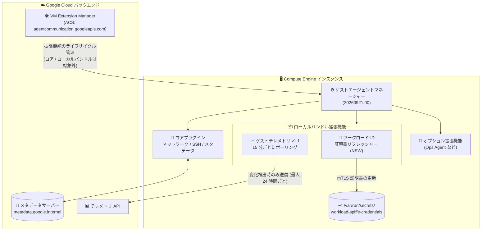

# Compute Engine (Guest Environment): ゲストエージェント バージョン 20260921.00 リリース

**リリース日**: 2026-10-05

**サービス**: Compute Engine (Guest Environment)

**機能**: ゲストエージェント バージョン 20260921.00 (新機能と修正)

**ステータス**: GA (Feature / Fixed)

📊 [このアップデートのインフォグラフィックを見る](https://takech9203.github.io/google-cloud-news-summary/20261005-compute-engine-guest-agent-20260921.html)

## 概要

Compute Engine のゲスト環境 (Guest Environment) において、ゲストエージェントのバージョン 20260921.00 がすべてのサポート対象 OS 向けにリリースされました。ゲストエージェントは、ネットワーク構成、SSH アクセス管理、メタデータアクセスなど、インスタンスが Google Cloud 上で動作するために必要な中核機能を担うコンポーネントであり、バージョン 20250901.00 以降はプラグインベースのアーキテクチャ (ゲストエージェントマネージャー + コアプラグイン + 拡張機能) を採用しています。

今回のリリースでは、マネージドワークロード ID (Managed Workload Identities) の証明書リフレッシャーがローカルバンドル拡張機能として提供されるようになったほか、ゲストテレメトリ拡張機能がバージョン 1.1 に更新され、ポーリング間隔が 24 時間ごとから 15 分ごとに短縮されました (API へのデータ送信は変化を検出しない限り 24 時間ごとのまま)。さらに、NetworkManager 環境におけるセカンダリ NIC 設定変更時のプライマリ NIC 再読み込み問題の修正や、address-manager 設定フラグの尊重、ACS (Agent Communication Service) からのコアプラグイン操作リクエストの無視など、複数の重要な修正が含まれています。

VM の運用管理を担うインフラ管理者や、mTLS によるワークロード間認証 (マネージドワークロード ID) を利用するセキュリティ管理者にとって、安定性と可観測性が向上するアップデートです。

**アップデート前の課題**

- ゲストテレメトリはポーリング間隔が 24 時間ごとであり、システム変更 (エージェントのバージョン更新や ISV アプリケーションの変更など) が反映されるまで最大 24 時間かかっていた
- NetworkManager 環境では、セカンダリ NIC のネットワーク設定変更を適用する際に、必要がない場合でもプライマリ NIC が再読み込みされ、接続への影響が生じ得た
- コアプラグインが address-manager の設定フラグおよび対応するメタデータ属性を尊重しないケースがあった
- 拡張機能マネージャーが、ACS からのコアプラグインやローカルバンドル拡張機能に対するインストール / 削除リクエストを受け付けてしまう余地があった

**アップデート後の改善**

- マネージドワークロード ID の証明書リフレッシャーがローカルバンドル拡張機能となり、プラグインベースアーキテクチャの利点 (プロセス分離、クラッシュ時の自動復旧、リソース制限) の下で mTLS 証明書のローテーションが実行される
- ゲストテレメトリ v1.1 は 15 分ごとにポーリングし、変化を検出した場合のみ即時に API へ送信するため、システム変更の反映が最大 24 時間から最短 15 分に短縮され、かつ API への送信頻度は従来どおり抑制される
- テレメトリ拡張機能が「検出されたプロセスに関連付けられたユーザーとしてのコマンド実行」と「バージョンコマンド出力に対する正規表現マッチングの構成」をサポートし、ISV アプリケーションのバージョン検出がより柔軟になった
- セカンダリ NIC の設定変更時に不要なプライマリ NIC の再読み込みが行われなくなり、ロールバック発生時は強制再読み込みによりセカンダリ NIC の DHCP リースを確実に再取得する
- コアプラグインとローカルバンドル拡張機能は ACS からのインストール / 削除リクエストの対象外となり、意図しない操作から保護される

## アーキテクチャ図



ゲストエージェントマネージャーが各プラグインを管理し、ワークロード ID 証明書リフレッシャーとゲストテレメトリがローカルバンドル拡張機能として動作します。VM Extension Manager (ACS) はオプション拡張機能のみを管理し、コアプラグインとローカルバンドル拡張機能への install / remove リクエストは無視されます。

## サービスアップデートの詳細

### 主要機能 (Feature)

1. **マネージドワークロード ID 証明書リフレッシャーのローカルバンドル拡張機能化**
   - マネージドワークロード ID は、Compute Engine VM 間の mTLS 通信を実現する SPIFFE 準拠の機能で、ゲストエージェントが X.509 証明書 (`/var/run/secrets/workload-spiffe-credentials` 配下の `private_key.pem`、`certificates.pem`、`ca_certificates.pem` など) を自動的にローテーション・更新する
   - 今回のリリースで、この証明書リフレッシャーがローカルバンドル拡張機能として提供されるようになり、プラグインベースアーキテクチャの管理下 (プロセス分離・自動クラッシュ復旧) で動作する

2. **ゲストテレメトリ拡張機能 v1.1**
   - ポーリング間隔が 24 時間ごとから 15 分ごとに短縮。ただし、前回のポーリング以降にシステムの変化を検出しない限り、API へのデータ送信は 24 時間ごとのまま維持される (ネットワーク / API 負荷を増やさずに鮮度を向上)
   - 検出されたプロセスに関連付けられたユーザーとしてコマンドを実行する機能をサポート
   - バージョンコマンドの出力に対して正規表現をマッチングさせる構成をサポートし、ISV アプリケーション (SAP HANA、Oracle Database、SQL Server など) のバージョン検出精度が向上

### 修正 (Fixed)

1. **NetworkManager セットアップの改善**
   - セカンダリ NIC のネットワーク設定変更を適用する際、必要な場合を除きプライマリ NIC を再読み込みしなくなった
   - コアプラグインが構成のロールバックに成功した場合は、構成を強制的に再読み込みし、セカンダリ NIC の DHCP リースを確実に再取得する

2. **address-manager 設定の尊重**
   - コアプラグインが address-manager の構成フラグと、対応するメタデータ属性を尊重するようになった

3. **拡張機能マネージャーの保護強化**
   - ACS からのコアプラグインおよびローカルバンドル拡張機能に対するインストール / 削除リクエストを無視するようになった
   - ローカルプラグインのインストール中に「インストールするローカルプラグインがない」と誤ってログ出力する問題を修正

4. **メタデータスクリプトランナーの修正**
   - `sysprep_specialize` 構成フラグを尊重するようになった (Windows)

## 技術仕様

### ゲストエージェントのコンポーネント構成 (プラグインベースアーキテクチャ)

| コンポーネント | 役割 |
|------|------|
| ゲストエージェントマネージャー | すべてのプラグインの起動・停止・ヘルスモニタリングを行う中央プロセス (Linux: `google-guest-agent-manager.service`、Windows: `GCEAgentManager`) |
| コアプラグイン | ネットワーク構成、SSH アクセス、メタデータアクセスなどの必須機能。無効化不可 |
| ローカルバンドル拡張機能 | エージェントパッケージに同梱される拡張機能。今回、ワークロード ID 証明書リフレッシャーとゲストテレメトリが該当。ACS からの install / remove 対象外 |
| 拡張機能 (オプションプラグイン) | Ops Agent など、VM Extension Manager 経由で管理されるプラグイン |
| VM Extension Manager | Google バックエンドで動作するマネージドサービス。ACS (`*.agentcommunication.googleapis.com`) 経由で拡張機能のライフサイクルを管理 |

注: Ubuntu および SLES は引き続きモノリシックアーキテクチャのゲストエージェントを使用します。

### ゲストテレメトリで収集される情報

- ゲストエージェントのバージョンとアーキテクチャ
- OS の名前・バージョン、カーネルのリリース・バージョン
- インスタンス上で動作するサポート対象 ISV アプリケーション (Apache Cassandra、Kubernetes、Microsoft SQL Server、MySQL、Oracle Database、PostgreSQL、Redis、SAP HANA など) とその認識バージョン

テレメトリ収集は、メタデータキー `disable-guest-telemetry` を `true` に設定することで無効化できます。

```bash
# ゲストテレメトリを無効化する例
gcloud compute instances add-metadata INSTANCE_NAME \
    --metadata disable-guest-telemetry=true \
    --zone=ZONE
```

### マネージドワークロード ID の証明書ファイル

| ファイル | 内容 |
|------|------|
| `/var/run/secrets/workload-spiffe-credentials/private_key.pem` | PEM 形式の秘密鍵 (権限 0644) |
| `/var/run/secrets/workload-spiffe-credentials/certificates.pem` | クライアント / サーバー証明書チェーンとして提示できる X.509 証明書バンドル |
| `/var/run/secrets/workload-spiffe-credentials/ca_certificates.pem` | ピア証明書検証用のトラストアンカー (ローカル SPIFFE トラストドメイン) |
| `/var/run/secrets/workload-spiffe-credentials/config_status` | エラーメッセージを含むログファイル |

## メリット

### ビジネス面

- **運用リスクの低減**: セカンダリ NIC の設定変更時にプライマリ NIC が不必要に再読み込みされなくなり、マルチ NIC 構成の本番 VM における接続断リスクが低減される
- **資産把握の迅速化**: テレメトリのポーリングが 15 分ごとになったことで、エージェントや ISV アプリケーションの変更が迅速に反映され、フリート全体の構成把握がより正確になる

### 技術面

- **プラグイン分離による信頼性向上**: ワークロード ID 証明書リフレッシャーがローカルバンドル拡張機能となり、個別プロセスとしてのクラッシュ分離・自動復旧・リソース制限の恩恵を受ける
- **効率的なテレメトリ設計**: ポーリング頻度を上げつつ、API への送信は変化検出時のみ (それ以外は 24 時間ごと) とすることで、鮮度と負荷のバランスを実現
- **構成フラグの一貫性**: address-manager フラグや `sysprep_specialize` フラグが正しく尊重されるようになり、ユーザーが意図したエージェント動作の制御が確実になった
- **拡張機能管理の安全性**: コアプラグインとローカルバンドル拡張機能が ACS 経由の install / remove 操作から保護され、インスタンスの必須機能が意図せず停止するリスクを排除

## デメリット・制約事項

### 制限事項

- Ubuntu および SLES はモノリシックアーキテクチャのゲストエージェントを引き続き使用するため、プラグインベースアーキテクチャ前提の挙動は適用されない
- ゲスト環境パッケージの更新はリージョンごとに段階的にロールアウトされ、全ロケーションに行き渡るまで最大 2 週間かかる場合がある

### 考慮すべき点

- マネージドワークロード ID の証明書を利用するアプリケーションは、秘密鍵と証明書ファイルの整合性を確認してから mTLS 接続を確立する必要がある (エージェントによる更新タイミングと読み取りタイミングの競合によるミスマッチを防ぐため)
- テレメトリを無効化している環境 (`disable-guest-telemetry=true`) では、ポーリング間隔変更の影響はない
- VPC Service Controls やファイアウォールルールを利用している場合、ゲストエージェントが必要とするエンドポイント (`metadata.google.internal`、`*.agentcommunication.googleapis.com`、`logging.googleapis.com` など) への到達性を確認する

## ユースケース

### ユースケース 1: マルチ NIC 構成 VM の安定運用

**シナリオ**: NetworkManager を使用する RHEL / Rocky Linux 系の VM で、複数の NIC (プライマリ + セカンダリ) を構成し、セカンダリ NIC の設定を変更するケース。

**効果**: 従来はセカンダリ NIC の変更適用時にプライマリ NIC まで再読み込みされる可能性があったが、本バージョンでは必要な場合を除き再読み込みされない。ロールバック時は強制再読み込みにより DHCP リースが確実に再取得されるため、ネットワーク疎通の信頼性が向上する。

### ユースケース 2: VM 間 mTLS 通信のための証明書自動管理

**シナリオ**: マネージドワークロード ID を使用して Compute Engine VM 間で SPIFFE ベースの mTLS 認証を行う環境。

**実装例**:
```bash
# アプリケーションは以下のファイルを直接読み取って mTLS 接続を確立
ls /var/run/secrets/workload-spiffe-credentials/
# private_key.pem  certificates.pem  ca_certificates.pem  config_status
```

**効果**: 証明書リフレッシャーがローカルバンドル拡張機能として動作し、証明書のローテーションと更新がプロセス分離された環境で確実に実行される。

### ユースケース 3: フリート全体の ISV アプリケーション把握

**シナリオ**: 多数の VM 上で SAP HANA、Oracle Database、SQL Server などの ISV アプリケーションを運用しており、バージョン情報を把握したいケース。

**効果**: テレメトリ v1.1 の 15 分ごとのポーリングと正規表現によるバージョン検出により、アプリケーションの変更がより迅速かつ正確に反映される。

## 利用可能リージョン

ゲスト環境パッケージの更新はリージョンごとに順次ロールアウトされます。全ロケーションに行き渡るまで最大 2 週間かかる場合があります。詳細は [Guest environment package repository rollouts](https://docs.cloud.google.com/compute/docs/images/guest-environment#package-repo-rollouts) を参照してください。

## 関連サービス・機能

- **マネージドワークロード ID (IAM / Certificate Authority Service)**: SPIFFE 準拠の X.509 証明書による VM 間 mTLS 認証。ゲストエージェントが証明書のローテーションと更新を担う
- **VM Extension Manager**: 拡張機能 (Ops Agent、Agent for SAP、Agent for Compute Workloads など) のライフサイクルを管理するマネージドサービス
- **Cloud Logging**: ゲストエージェントはデフォルトでアクティビティログを Cloud Logging に送信する
- **VM Manager (OS Config)**: ゲスト環境に含まれる OS Config エージェントにより、OS インベントリ・パッチ・ポリシーを管理
- **OS Login**: ゲスト環境のパッケージにより IAM ベースのインスタンスアクセス管理を提供

## 参考リンク

- 📊 [インフォグラフィック](https://takech9203.github.io/google-cloud-news-summary/20261005-compute-engine-guest-agent-20260921.html)
- [公式リリースノート](https://docs.cloud.google.com/release-notes#October_05_2026)
- [ゲストエージェントの概要](https://docs.cloud.google.com/compute/docs/images/guest-agent)
- [ゲストエージェントの機能](https://docs.cloud.google.com/compute/docs/images/guest-agent-functions)
- [ゲスト環境の概要](https://docs.cloud.google.com/compute/docs/images/guest-environment)
- [ゲストエージェントの管理 (構成オプション)](https://docs.cloud.google.com/compute/docs/images/manage-guest-agent)
- [マネージドワークロード ID による mTLS 認証](https://docs.cloud.google.com/compute/docs/access/authenticate-workloads-over-mtls)
- [guest-agent (GitHub)](https://github.com/GoogleCloudPlatform/guest-agent)

## まとめ

ゲストエージェント 20260921.00 は、マネージドワークロード ID 証明書リフレッシャーのローカルバンドル拡張機能化とゲストテレメトリ v1.1 (15 分ごとのポーリング) により、プラグインベースアーキテクチャの成熟度を高めるアップデートです。特にマルチ NIC 構成の VM を運用している場合、NetworkManager 関連の修正により不要なプライマリ NIC 再読み込みが解消されるため、ロールアウト状況を確認のうえ早期の更新を推奨します。

---

**タグ**: Compute Engine, Guest Environment, Guest Agent, Managed Workload Identities, mTLS, SPIFFE, Telemetry, NetworkManager, VM Extension Manager
