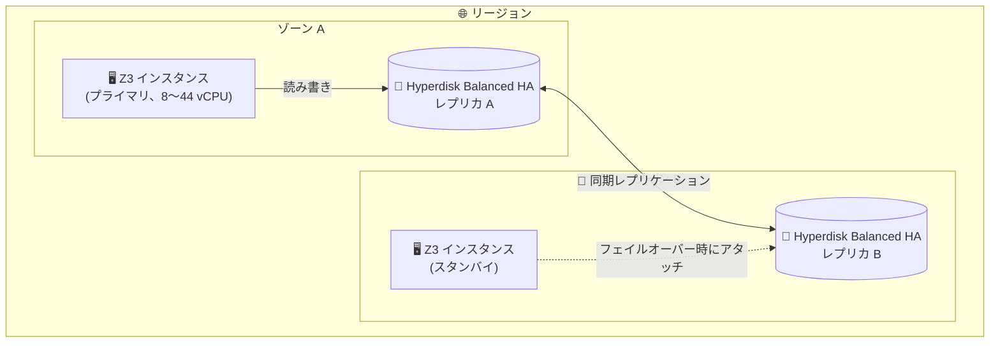

# Compute Engine: Z3 マシンタイプで Hyperdisk Balanced High Availability が GA

**リリース日**: 2026-10-05

**サービス**: Compute Engine

**機能**: Z3 マシンタイプ (8〜44 vCPU) での Hyperdisk Balanced High Availability サポート

**ステータス**: GA (一般提供)

📊 [このアップデートのインフォグラフィックを見る](https://takech9203.github.io/google-cloud-news-summary/20261005-compute-engine-z3-hyperdisk-balanced-ha.html)

## 概要

Compute Engine のストレージ最適化マシンシリーズである Z3 のうち、8〜44 vCPU のマシンタイプで Hyperdisk Balanced High Availability (HA) ボリュームが一般提供 (GA) になりました。Hyperdisk Balanced High Availability は、同一リージョン内の 2 つのゾーン間でデータを同期レプリケーションするブロックストレージで、ゾーン障害からアプリケーションを保護します。

Z3 マシンシリーズはローカル接続の Titanium SSD を標準搭載するストレージ最適化インスタンスであり、大容量・高 IOPS のストレージワークロード (データベース、分析基盤など) に適しています。今回の GA により、Z3 上で稼働するステートフルなワークロードに対して、ゾーンをまたぐ同期レプリケーションによる高可用性構成をマネージドなブロックストレージレイヤーで実現できるようになりました。

対象ユーザーは、Z3 インスタンス上で RPO ゼロ (データ損失なし) のゾーン間冗長性を必要とするワークロード (高可用性データベース、Microsoft SQL Server Failover Cluster Instances など) を運用するユーザーです。

**アップデート前の課題**

- Z3 マシンタイプで利用できる Hyperdisk はゾーナル (単一ゾーン) のディスクが中心で、ゾーン障害に対するデータ保護にはスナップショットやアプリケーションレイヤーでのレプリケーションなど追加の仕組みが必要だった
- ゾーン間のデータ冗長性をアプリケーション側で実装する場合、構築・運用の複雑さが増し、フェイルオーバー時のデータ整合性も自前で担保する必要があった

**アップデート後の改善**

- Z3 (8〜44 vCPU) のインスタンスに Hyperdisk Balanced High Availability ボリュームをアタッチし、2 ゾーン間の同期レプリケーションをストレージレイヤーで透過的に実現できるようになった
- マルチライターモード (複数インスタンスへの同時アタッチ) と組み合わせることで、RTO 1 秒未満の高速フェイルオーバー構成 (ワークロードクラスタリング) を構築できる
- 規制要件 (2 拠点でのデータレプリケーション義務) への対応をマネージドストレージで満たせるようになった

## アーキテクチャ図



Hyperdisk Balanced High Availability ボリュームは同一リージョン内の 2 ゾーンにレプリカを持ち、書き込みは両ゾーンに同期的に反映されます。ゾーン A の障害時には、ゾーン B のインスタンスがボリュームを引き継いでサービスを継続できます。

## サービスアップデートの詳細

### 主要機能

1. **2 ゾーン間の同期レプリケーション**
   - 同一リージョン内の 2 つのゾーンにデータを同期的に複製し、ゾーン障害に対する耐障害性を提供
   - 設計上の耐久性は 99.9999% 超 (Hyperdisk Balanced の 99.999% 超よりも高い)

2. **Z3 マシンタイプ (8〜44 vCPU) での GA サポート**
   - 対象: `z3-*-8` / `z3-*-14` / `z3-*-16` / `z3-*-22` / `z3-*-32` / `z3-*-44`
   - Z3 は NVMe ディスクインターフェースのみをサポートするストレージ最適化マシンシリーズ

3. **マルチライターモードによる高速フェイルオーバー**
   - 同一ボリュームを複数インスタンスに同時アタッチ可能 (各インスタンスが書き込みアクセスを保持)
   - RTO 1 秒未満の高可用性フェイルオーバーを実現 (アタッチする各インスタンスはボリュームのレプリカと同じゾーンに配置する必要あり)

4. **プロビジョンド パフォーマンス**
   - ボリューム単位で IOPS とスループットを個別にプロビジョニング可能 (作成後の変更も可能)

## 技術仕様

### ボリューム仕様 (Hyperdisk Balanced High Availability)

| 項目 | 詳細 |
|------|------|
| 容量 | 4 GiB〜64 TiB (デフォルト 100 GiB) |
| プロビジョン可能 IOPS | 3,000〜100,000 IOPS (320 GiB 未満はサイズにより上限が変動) |
| プロビジョン可能スループット | 140〜2,400 MiB/s (プロビジョンした IOPS に依存) |
| ベースライン性能 (無料枠) | 3,000 IOPS / 140 MiB/s |
| 耐久性 (設計値) | 99.9999% 超 |
| ディスクタイプ名 | `hyperdisk-balanced-high-availability` |

### Z3 マシンタイプ別の最大性能 (Hyperdisk Balanced HA アタッチ時)

| マシンタイプ | 最大 IOPS | 最大スループット (MiB/s) |
|-------------|-----------|--------------------------|
| z3-\*-8 | 50,000 | 800 |
| z3-\*-14 | 100,000 | 1,600 |
| z3-\*-16 | 100,000 | 1,600 |
| z3-\*-22 | 120,000 | 1,800 |
| z3-\*-32 | 160,000 | 2,400 |
| z3-\*-44 | 160,000 | 2,400 |

注: 1 ボリュームあたりの上限は 100,000 IOPS / 2,400 MiB/s です。インスタンス側の上限は複数ボリューム合計で適用されます。

## 設定方法

### 前提条件

1. Hyperdisk Balanced High Availability をサポートするリージョンとゾーンのペアを選択する (全リージョンで利用可能、ただし AI ゾーンでは利用不可)
2. 対象の Z3 マシンタイプ (8〜44 vCPU) でインスタンスを作成する

### 手順

#### ステップ 1: Hyperdisk Balanced High Availability ボリュームの作成

```bash
gcloud compute disks create my-ha-disk \
    --type=hyperdisk-balanced-high-availability \
    --size=500GiB \
    --region=us-central1 \
    --replica-zones=us-central1-a,us-central1-b \
    --provisioned-iops=10000 \
    --provisioned-throughput=600
```

リージョナルディスクとして作成し、`--replica-zones` で 2 つのレプリカゾーンを指定します。

#### ステップ 2: Z3 インスタンスへのアタッチ

```bash
gcloud compute instances attach-disk my-z3-instance \
    --disk=my-ha-disk \
    --disk-scope=regional \
    --zone=us-central1-a
```

詳細な手順は公式ドキュメント「[リージョナルディスクの作成と管理](https://docs.cloud.google.com/compute/docs/disks/regional-persistent-disk)」を参照してください。

## メリット

### ビジネス面

- **ゾーン障害への耐性**: 単一ゾーンの障害でデータ損失やサービス停止が発生するリスクを低減し、事業継続性を向上
- **規制要件への対応**: データを 2 拠点に複製する規制要件を、追加のアプリケーション開発なしで満たせる

### 技術面

- **ストレージレイヤーでの同期レプリケーション**: アプリケーション側のレプリケーション実装が不要になり、構成がシンプルになる
- **高速フェイルオーバー**: マルチライターモードとの組み合わせで RTO 1 秒未満のフェイルオーバーが可能
- **柔軟な性能チューニング**: IOPS / スループットを容量と独立してプロビジョニングでき、作成後の変更にも対応

## デメリット・制約事項

### 制限事項

- Hyperdisk Balanced High Availability ボリュームからマシンイメージは作成できない
- 性能 (IOPS / スループット) の変更は 4 時間ごとに 1 回まで、サイズ変更は 4 時間以内に 2 回まで
- AI ゾーンでは利用できない
- マルチライターモードには追加の制限事項がある
- Hyperdisk は確約利用割引 (リソースベース CUD) および継続利用割引 (SUD) の対象外

### 考慮すべき点

- データを 2 ゾーンに書き込むため、ストレージ料金は Hyperdisk Balanced の 2 倍になる
- 今回 GA の対象は 8〜44 vCPU の Z3 マシンタイプ。より大きなマシンタイプの利用については公式ドキュメントのサポート状況を確認すること
- Z3 のベアメタルインスタンスは Hyperdisk Balanced High Availability をサポートしない

## ユースケース

### ユースケース 1: Microsoft SQL Server Failover Cluster Instances (FCI)

**シナリオ**: Z3 インスタンス上で SQL Server FCI を構成し、ゾーン障害時にも自動フェイルオーバーでサービスを継続したい。

**実装例**: Hyperdisk Balanced High Availability ボリュームをマルチライターモードで複数ノードにアタッチし、FCI の共有ストレージとして使用する。

**効果**: ストレージレイヤーの同期レプリケーションにより、RPO ゼロ・RTO 1 秒未満の高可用性クラスタを構築できる。

### ユースケース 2: 規制要件のあるデータベースワークロード

**シナリオ**: 金融系などで「データを 2 つのロケーションに複製する」規制要件があるデータベースを Z3 で運用する。

**効果**: アプリケーション改修なしに、マネージドストレージで 2 ゾーンへの同期複製要件を満たせる。

### ユースケース 3: 高速フェイルオーバーが必要な高性能ワークロード

**シナリオ**: Titanium SSD を活用する Z3 上の分析・ストレージワークロードで、永続データ部分にゾーン障害耐性を持たせたい。

**効果**: ローカル SSD の高性能とリージョナルディスクの可用性を組み合わせた構成が可能になる。

## 料金

Hyperdisk Balanced High Availability は、プロビジョニングした容量・IOPS・スループットに対して課金されます (インスタンスにアタッチされていない場合や、インスタンスが停止中でも課金されます)。

- **容量**: GiB 単位の月額課金。データが 2 ゾーンに書き込まれるため、ストレージ料金は Hyperdisk Balanced の 2 倍
- **ベースライン性能 (無料)**: 最初の 3,000 IOPS と 140 MiB/s のスループットは無料。これを超えてプロビジョニングした分 (例: 5,000 IOPS をプロビジョニングした場合は 2,000 IOPS 分) が課金対象
- **割引**: リソースベースの確約利用割引 (CUD)、継続利用割引 (SUD) の対象外

最新の単価は [ディスク料金ページ](https://docs.cloud.google.com/compute/disks-image-pricing#disk) を参照してください。

## 利用可能リージョン

Hyperdisk Balanced High Availability はすべてのリージョンで利用可能です (AI ゾーンを除く)。

## 関連サービス・機能

- **Hyperdisk Balanced**: ゾーナル版の汎用 Hyperdisk。単一ゾーンで十分なワークロードにはこちらが低コスト
- **Z3 マシンシリーズ (ストレージ最適化)**: Titanium SSD を標準搭載。Hyperdisk Balanced / Extreme / Throughput、Persistent Disk (pd-balanced / pd-ssd) もサポート
- **ディスク共有 (マルチライター)**: 同一ボリュームを複数インスタンスにアタッチしてクラスタリング構成を実現
- **スナップショット / Backup and DR**: リージョン障害に備えたバックアップとの併用でさらに広範な障害に対応

## 参考リンク

- 📊 [インフォグラフィック](https://takech9203.github.io/google-cloud-news-summary/20261005-compute-engine-z3-hyperdisk-balanced-ha.html)
- [公式リリースノート](https://docs.cloud.google.com/release-notes#October_05_2026)
- [About Hyperdisk Balanced High Availability](https://docs.cloud.google.com/compute/docs/disks/hd-types/hyperdisk-balanced-ha)
- [ストレージ最適化マシンシリーズ (Z3)](https://docs.cloud.google.com/compute/docs/storage-optimized-machines)
- [About Hyperdisk](https://docs.cloud.google.com/compute/docs/disks/hyperdisks)
- [料金ページ (ディスク料金)](https://docs.cloud.google.com/compute/disks-image-pricing#disk)

## まとめ

Z3 マシンタイプ (8〜44 vCPU) で Hyperdisk Balanced High Availability が GA となり、ストレージ最適化インスタンス上のステートフルワークロードに対して RPO ゼロのゾーン間同期レプリケーションをマネージドに実現できるようになりました。Z3 で高可用性データベースや SQL Server FCI を運用している、または検討しているチームは、ストレージ料金が 2 倍になる点を考慮しつつ、既存のアプリケーションレベルのレプリケーション構成からの置き換えを評価することを推奨します。

---

**タグ**: Compute Engine, Hyperdisk, Z3, 高可用性, ストレージ, GA
