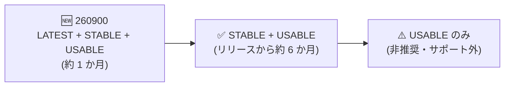

# Confidential Space: 新イメージ 260900 の提供開始

**リリース日**: 2026-10-05

**サービス**: Confidential Space

**機能**: Confidential Space イメージ 260900

**ステータス**: Announcement (提供開始)

📊 [このアップデートのインフォグラフィックを見る](https://takech9203.github.io/google-cloud-news-summary/20261005-confidential-space-image-260900.html)

## 概要

2026 年 10 月 5 日、Confidential Space の新しいイメージ **260900** が利用可能になりました。Confidential Space は、複数の組織がデータの機密性と所有権を保持したまま、合意されたワークロードで機密データ (PII、PHI、知的財産、暗号鍵など) を共有・処理できるようにする Confidential Computing のソリューションです。

今回のリリースノートには新機能の記載はなく、定期的なイメージ更新のアナウンスです。Confidential Space のイメージは毎月程度の頻度で新バージョンがリリースされており、最新イメージはサポート属性 `LATEST` が付与され、脆弱性の監視とサポートの対象となります。既存のワークロードを安全に運用し続けるためには、イメージを定期的に更新することが推奨されています。

なお、直前のイメージ 260800 (2026 年 9 月 15 日) では H100 GPU (a3-highgpu-1g) 上の Confidential Space における Intel Trust Authority (ITA) アテステーションの GA が発表されており、260900 はその後続の定期更新版にあたります。

## サービスアップデートの詳細

### イメージのサポート属性とライフサイクル

Confidential Space の本番イメージには、アテステーションポリシーで検証可能なサポート属性が付与されます。

| サポート属性 | 内容 |
|------|------|
| `LATEST` | 最新イメージ (約 1 か月間)。`STABLE` と `USABLE` も併せて付与される。脆弱性の監視・サポート対象 |
| `STABLE` | 約 6 か月間サポートされ、脆弱性が監視される。アテステーションポリシーはこの属性に基づいて記述することが推奨される |
| `USABLE` | 6 か月を超えた非推奨イメージ。利用は可能だがサポート対象外 |
| `EXPERIMENTAL` | プレビュー機能を含むテスト専用イメージ。本番利用不可 |

- 長時間実行するワークロードでは、`LATEST` をアテステーションポリシーに指定しないことが推奨されます (実行中にイメージが更新されると `LATEST` 属性が外れ、トークンのリフレッシュ時にアテステーションが失敗するため)
- ワークロードが使用しているイメージバージョンは、アテステーションアサーション `assertion.swversion` で検証できます

Confidential Space イメージのサポート属性のライフサイクル。新イメージ 260900 は `LATEST` として提供され、約 6 か月の `STABLE` 期間を経て非推奨となります。

## 考慮すべき点

- 今回のリリースノートには、260900 で追加された機能や修正の詳細は記載されていません
- アテステーションポリシーで特定のイメージバージョンや `LATEST` を固定している場合、新イメージへの移行時にポリシーの更新が必要になることがあります
- 旧イメージはリリースから約 6 か月で `STABLE` 属性が外れるため、計画的なイメージ更新を推奨します

## 関連サービス・機能

- **Confidential VM / Compute Engine**: Confidential Space のワークロードは Confidential VM 上で実行される
- **Confidential Computing API (アテステーション)**: ワークロードの身元・状態を検証するアテステーショントークンを発行

## 参考リンク

- 📊 [インフォグラフィック](https://takech9203.github.io/google-cloud-news-summary/20261005-confidential-space-image-260900.html)
- [公式リリースノート](https://docs.cloud.google.com/release-notes#October_05_2026)
- [Confidential Space リリースノート](https://docs.cloud.google.com/confidential-computing/confidential-space/docs/release-notes)
- [Confidential Space 概要](https://docs.cloud.google.com/confidential-computing/confidential-space/docs/confidential-space-overview)
- [Confidential Space イメージ (更新方法)](https://docs.cloud.google.com/confidential-computing/confidential-space/docs/confidential-space-images)

## まとめ

Confidential Space の定期イメージ更新 (260900) のアナウンスです。最新イメージはサポートと脆弱性監視の対象となるため、Confidential Space を利用中のワークロードはイメージの更新とアテステーションポリシーの確認を行うことを推奨します。

---

**タグ**: Confidential Space, Confidential Computing, セキュリティ, イメージ更新, Announcement
