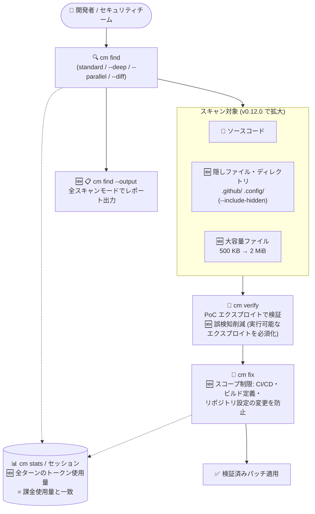

# Gemini Enterprise Agent Platform: CodeMender v0.12.0 リリース (隠しファイルスキャン・スコープ制限付き修正など)

**リリース日**: 2026-10-05

**サービス**: Gemini Enterprise Agent Platform (CodeMender)

**機能**: CodeMender v0.12.0 アップデート (隠しファイルスキャン、大容量ファイル対応、スコープ制限付き修正、トークン使用量の正確化、バグ修正)

**ステータス**: Fixed / Feature (CodeMender は Preview)

📊 [このアップデートのインフォグラフィックを見る](https://takech9203.github.io/google-cloud-news-summary/20261005-gemini-enterprise-agent-platform-codemender-v0-12-0.html)

## 概要

Gemini Enterprise Agent Platform 上のコードセキュリティエージェント **CodeMender** の v0.12.0 がリリースされました。CodeMender は Google DeepMind が開発した自律型 AI セキュリティエージェントで、CLI (`cm`) を通じてコードベースの脆弱性スキャン (`cm find`)、PoC エクスプロイト実行による検証 (`cm verify`)、自動修正 (`cm fix`) を提供します。

v0.12.0 では、スキャン対象の拡大 (隠しディレクトリ・大容量ファイル)、全スキャンモードでのレポート出力対応、`cm fix` のスコープ制限によるガバナンス強化、セッション全体のトークン使用量の正確なレポーティングなど、スキャンの網羅性と運用の信頼性を高める複数の改善とバグ修正が含まれています。CI/CD パイプラインで CodeMender を運用するセキュリティチームや、トークンコストを管理するプラットフォームチームにとって重要なアップデートです。

**アップデート前の課題**

- `cm find` は隠しディレクトリ・隠しファイル (`.github/`、`.config/` など) をスキャン対象に含められず、CI/CD 定義や設定ファイルに潜む脆弱性を見逃す可能性があった
- ファイル検出のデフォルトサイズ上限 (`max_file_size_kb`) が 500 KB で、それを超える大きなソースファイルは `cm find` にスキップされていた。また 64 KB を超えるファイルはインラインプレビューの範囲しか読めなかった
- `cm find --output` によるスキャンレポート出力は一部のスキャンモードに限られ、`--deep` / `--parallel` / `--diff` スキャンで一貫したレポートが得られなかった
- `cm fix` が修正対象の脆弱性と無関係な CI/CD パイプライン、静的解析設定、ビルド定義、リポジトリ設定ファイルまで変更してしまう可能性があった
- トークン使用量がセッションの最終ターン分のみ報告され、`cm stats` やセッションエクスポートの数値が実際の課金使用量と一致しなかった
- `cm report` / `cm stats` での検出結果の重複、同一行の異なる脆弱性タイプのマージ、マルチワーカー `--deep` スキャンでの "database is locked" エラー、具体的なエクスプロイトなしでの高信頼度報告 (誤検知) などの不具合があった

**アップデート後の改善**

- `cm find --include-hidden` フラグ (または `config.yaml` の `scan` 配下の `include_hidden`) により、隠しディレクトリ・隠しファイルを脆弱性スキャンに含められるようになった
- `max_file_size_kb` のデフォルトが 500 KB から 2 MiB に引き上げられ、大きなソースファイルがスキップされなくなった。既存の 500 KB デフォルト設定は自動的にアップグレードされ、`--deep` / `--diff` スキャンは 64 KB を超えるファイルをインラインプレビューの先まで読めるようになった
- `cm find --output` が標準・`--deep`・`--parallel`・`--diff` のすべてのスキャンモードでレポートを書き出すようになった
- `cm fix` が修正対象の脆弱性のスコープ外にある CI/CD パイプライン、静的解析設定、ビルド定義、リポジトリ設定ファイルの変更を防止するようになった
- セッションの全ターンにわたる合計トークン使用量が報告され、`cm stats` とセッションエクスポートのトークン数が課金使用量と一致するようになった
- 重複検出・脆弱性タイプのマージ・DB ロックエラーの修正に加え、高信頼度の報告には具体的で実行可能なエクスプロイトを必須とすることで誤検知が削減された。`--deep` / `--diff` ワーカーのセッションが `cm stats` に含まれるようになり、`cm verify` の相対パス解決もプロジェクトルート基準に修正された

## アーキテクチャ図



CodeMender の「スキャン → 検証 → 修正」フローにおける v0.12.0 の改善点 (🆕) を示しています。スキャン対象の拡大、全モードでのレポート出力、`cm fix` のスコープ制限、トークン使用量の正確なトラッキングが主な変更点です。

## サービスアップデートの詳細

### 主要機能

1. **隠しファイルスキャン (`--include-hidden`)**
   - `cm find` に `--include-hidden` フラグが追加され、`.github/` や `.config/` などの隠しディレクトリ・隠しファイルを脆弱性スキャンに含められる
   - `config.yaml` の `scan` 配下に `include_hidden` を設定することで永続的に有効化も可能
   - GitHub Actions ワークフローなど、CI/CD 定義ファイルに潜むセキュリティリスクの検出に有効

2. **大容量ファイルサポート**
   - ファイル検出のデフォルトサイズ上限 `max_file_size_kb` が 500 KB から 2 MiB に引き上げられ、`cm find` が大きなソースファイルをスキップしなくなった
   - 従来の 500 KB デフォルトを使用している既存設定は自動的にアップグレードされる
   - `--deep` および `--diff` スキャンは、64 KB を超えるファイルについてインラインプレビューの先まで読み取り可能になった

3. **全スキャンモードでのレポート出力**
   - `cm find --output` が standard、`--deep`、`--parallel`、`--diff` のすべてのスキャンモードでスキャンレポートを書き出すようになった
   - CI/CD パイプラインでスキャンモードを問わず一貫した成果物 (レポート) を取得できる

4. **スコープ制限付き修正 (Scoped fixes)**
   - `cm fix` 実行時に、エージェントが修正対象の脆弱性のスコープ外にある CI/CD パイプライン、静的解析設定、ビルド定義、リポジトリ設定ファイルを変更することを防止
   - 自動修正パッチのレビュー負荷を軽減し、意図しないビルド・パイプライン破壊のリスクを低減

5. **正確なセッショントークン使用量**
   - `cm` がセッションの最終ターンだけでなく全ターンにわたる合計トークン使用量を報告するようになった
   - `cm stats` およびセッションエクスポートのトークン数が課金使用量 (billed usage) と一致する

6. **バグ修正**
   - `cm report` / `cm stats` における重複した検出結果 (findings) を修正
   - 同一行で報告された異なる脆弱性タイプがマージされてしまう問題を修正
   - マルチワーカーでの `cm find --deep` スキャン時の "database is locked" エラーを修正
   - 高い信頼度で検出結果を報告する前に、具体的かつ実行可能なエクスプロイトを必須とすることで誤検知を削減
   - `cm find --deep` / `cm find --diff` のワーカーセッションが `cm stats` に含まれるようになった
   - `cm verify` が検出結果とエクスプロイト成果物の相対パスをカレントディレクトリではなくプロジェクトルート基準で解決するように修正

## 技術仕様

### v0.12.0 の主な変更点

| 項目 | 変更前 | 変更後 (v0.12.0) |
|------|--------|------------------|
| 隠しファイル・ディレクトリのスキャン | 非対応 | `--include-hidden` フラグ / `include_hidden` 設定で対応 |
| ファイル検出サイズ上限 (`max_file_size_kb`) | 500 KB | 2 MiB (既存のデフォルト設定は自動アップグレード) |
| 64 KB 超のファイルの読み取り (`--deep` / `--diff`) | インラインプレビューまで | プレビューの先まで読み取り可能 |
| `cm find --output` のレポート出力 | 一部モードのみ | standard / `--deep` / `--parallel` / `--diff` 全モード |
| `cm fix` の変更範囲 | スコープ外ファイルも変更され得る | CI/CD・静的解析設定・ビルド定義・リポジトリ設定の変更を防止 |
| トークン使用量レポート | 最終ターンのみ | セッション全ターンの合計 (課金使用量と一致) |

### CodeMender の基本仕様 (参考)

| 項目 | 詳細 |
|------|------|
| 提供形態 | Gemini Enterprise Agent Platform 上のマネージドなコードセキュリティエージェント + ローカル CLI (`cm`) |
| 主要コマンド | `cm find` (スキャン)、`cm verify` (PoC 検証)、`cm fix` (修正)、`cm report` / `cm stats` (レポート・統計)、`cm session resume` |
| デフォルトモデル | Gemini 3.8 Flash (`--model` フラグで Gemini 3.7/3.6/3.5 Flash、Gemini 3.1 Pro Preview に変更可能) |
| デフォルト対応言語 | C/C++、C#/.NET、Go、Java、JavaScript/TypeScript、Kotlin、Python、Ruby、Rust、PHP (拡張子設定で追加可能) |
| サンドボックス | デフォルトでローカルのプロセスレベルサンドボックス内で実行 (`--sandbox=false` / `--unrestricted` で無効化・バイパス可能) |
| 検出結果の状態 | OPEN / FIXED / DISMISSED / REOPENED |
| ステータス | Preview (Pre-GA Offerings Terms が適用) |

### config.yaml での隠しファイルスキャン設定例

```yaml
# ~/.codemender/config.yaml (または CM_HOME 配下)
scan:
  include_hidden: true   # v0.12.0: 隠しディレクトリ・ファイルをスキャン対象に含める
  max_file_size_kb: 2048 # v0.12.0: デフォルトが 500 KB から 2 MiB に引き上げ
  extensions:
    include:
      - .py
      - .go
      - .ts
      # 必要に応じて .sh や .yaml なども追加可能
  exclude_dirs:
    - node_modules
    - vendor
    - dist
    - build
```

## 設定方法

### 前提条件

1. Google Cloud プロジェクトで必要な API と IAM ロールをセットアップ済みであること
2. CodeMender CLI バイナリをダウンロード・インストール済みであること
3. Application Default Credentials (ADC) で認証を構成済みであること
4. スキャン対象のソースコードをワークスペースに配置し、サンドボックス (マウント、ネットワークプロファイル) を構成済みであること

### 手順

#### ステップ 1: 隠しファイルを含めたスキャンの実行

```bash
# --include-hidden フラグで .github/ や .config/ などもスキャン対象に含める
cm find ./ --include-hidden

# config.yaml に include_hidden を設定している場合は通常どおり実行
cm find ./src/auth/
```

v0.12.0 で追加された `--include-hidden` により、CI/CD 定義や設定ファイルを含めた網羅的なスキャンが可能です。

#### ステップ 2: 全スキャンモードでのレポート出力

```bash
# standard / --deep / --parallel / --diff すべてのモードでレポートを書き出せる
cm find ./ --deep --output deep-scan-report.json
cm find ./ --diff --output diff-scan-report.json
```

CI/CD パイプラインでスキャンモードに関わらず一貫してレポートを成果物として保存できます。

#### ステップ 3: 検証と修正

```bash
# cm report で finding-id を確認し、PoC エクスプロイトで検証
cm verify FINDING_ID

# スコープ制限付き修正 (v0.12.0): 脆弱性と無関係な CI/CD・ビルド定義は変更されない
cm fix FINDING_ID
```

#### ステップ 4: トークン使用量の確認

```bash
# セッション全ターンの合計トークン使用量を確認 (課金使用量と一致)
cm stats

# 実行中にライブで確認する場合
cm find ./src/auth/ --compact
```

## メリット

### ビジネス面

- **カバレッジの向上によるリスク低減**: 隠しディレクトリ (CI/CD 定義など) と大容量ファイルがスキャン対象となり、従来見逃されていた領域の脆弱性を検出できる
- **コストの透明性**: トークン使用量が課金使用量と一致するため、`cm stats` を使ったコスト管理・予算策定の精度が向上する
- **誤検知の削減によるアラート疲れの軽減**: 高信頼度の報告に実行可能なエクスプロイトが必須となり、開発者が本当に対処すべき脆弱性に集中できる

### 技術面

- **自動修正のガバナンス強化**: `cm fix` が脆弱性のスコープ外にある CI/CD パイプラインやビルド定義を変更しなくなり、パッチレビューの負荷と意図しない破壊のリスクが低減する
- **CI/CD での運用性向上**: 全スキャンモードでの `--output` 対応、マルチワーカー `--deep` スキャンの DB ロックエラー修正により、パイプラインでの安定運用が可能になる
- **既存設定の自動アップグレード**: 500 KB のデフォルト `max_file_size_kb` を使っている既存構成は自動で 2 MiB に引き上げられ、手動変更が不要

## デメリット・制約事項

### 制限事項

- CodeMender は Preview (Pre-GA) 段階であり、Pre-GA Offerings Terms が適用され、サポートが限定的な場合がある
- `cm find` のスキャン対象はデフォルトの拡張子リストに依存するため、シェルスクリプトや YAML などは `config.yaml` で明示的に追加しない限りスキャンされない

### 考慮すべき点

- 隠しファイルスキャン (`--include-hidden`) や 2 MiB までの大容量ファイル読み取りによりスキャン対象が広がるため、スキャン時間とトークン消費が増加する可能性がある
- CodeMender はローカルでコマンド実行・ファイル変更を行うため、サンドボックスを無効化 (`--sandbox=false`) またはバイパス (`--unrestricted`) する場合は、隔離された VM やコンテナでの実行が推奨される
- 誤検知削減のためのエクスプロイト必須化により、静的には疑わしいがエクスプロイトを構築できない検出結果の信頼度が下がる可能性があるため、`cm verify` と組み合わせた運用が望ましい

## ユースケース

### ユースケース 1: CI/CD 定義ファイルを含めた網羅的セキュリティスキャン

**シナリオ**: GitHub Actions ワークフロー (`.github/workflows/`) やツール設定 (`.config/`) にシークレットの扱いの不備やコマンドインジェクションの可能性があるが、従来の `cm find` では隠しディレクトリがスキャンされず見逃していた。

**実装例**:
```bash
cm find ./ --include-hidden --output full-scan-report.json
```

**効果**: アプリケーションコードに加えて CI/CD 定義・設定ファイルまでスキャン範囲が広がり、サプライチェーン観点の脆弱性検出が強化される。

### ユースケース 2: 自動修正パイプラインでの安全なパッチ適用

**シナリオ**: ナイトリービルドで `cm find --deep --parallel` を実行し、検証済みの脆弱性に `cm fix` を自動適用しているが、過去にエージェントがビルド定義まで変更してしまいレビュー負荷が高かった。

**効果**: v0.12.0 のスコープ制限により `cm fix` が CI/CD パイプライン・静的解析設定・ビルド定義・リポジトリ設定を変更しなくなり、パッチの差分が脆弱性修正に限定される。マルチワーカー `--deep` スキャンの "database is locked" エラー修正と全モードでのレポート出力により、パイプラインの安定性と可観測性も向上する。

### ユースケース 3: トークンコストの正確な把握とチャージバック

**シナリオ**: プラットフォームチームが複数の開発チームの CodeMender 利用コストを `cm stats` とセッションエクスポートで集計しているが、従来は最終ターンのみのトークン数が報告され、Cloud Billing の請求額と乖離していた。

**効果**: セッション全ターンの合計トークン使用量が報告されるため、`cm stats` の数値が課金使用量と一致し、チーム別のコスト配賦や予算管理が正確に行える。`--deep` / `--diff` ワーカーのセッションも `cm stats` に含まれるため、集計漏れもなくなる。

## 料金

CodeMender の利用はトークン使用量に基づいて課金されます。v0.12.0 では `cm stats` およびセッションエクスポートで報告されるトークン数が課金使用量と一致するようになりました。プロジェクト全体の累積課金トークン使用量とコスト傾向は Cloud Billing のレポートで確認できます。

詳細な料金は公式料金ページを参照してください。

- [Gemini Enterprise Agent Platform の料金](https://cloud.google.com/gemini-enterprise-agent-platform/generative-ai/pricing)
- [Cloud Billing レポートの表示](https://docs.cloud.google.com/billing/docs/how-to/reports)

## 利用可能リージョン

CodeMender はグローバルに利用可能です (公式ドキュメント「Supported regions」より)。

## 関連サービス・機能

- **Gemini Enterprise Agent Platform**: CodeMender をホストするエージェント基盤。モデル (Gemini 3.8 Flash など) の選択やガバナンス、課金が統合されている
- **Google AI Threat Defense**: CodeMender が主要なコードセキュリティエージェントとして組み込まれる自律型セキュリティプラットフォーム。Wiz のクラウドリスク優先度付けや Mandiant のインシデント対応と統合される
- **Wiz**: クラウドセキュリティツールからの検出結果 (findings) を CodeMender に取り込み、実環境のエクスポージャーとコード修正を直接つなげられる
- **Cloud Billing**: CodeMender のトークン使用量に基づく課金レポート・コスト傾向の確認に使用

## 参考リンク

- 📊 [インフォグラフィック](https://takech9203.github.io/google-cloud-news-summary/20261005-gemini-enterprise-agent-platform-codemender-v0-12-0.html)
- [公式リリースノート (October 05, 2026)](https://docs.cloud.google.com/release-notes#October_05_2026)
- [Google Cloud Blog: Find and fix software vulnerabilities with CodeMender](https://cloud.google.com/blog/products/identity-security/find-and-fix-software-vulnerabilities-with-codemender)
- [CodeMender ドキュメント](https://docs.cloud.google.com/gemini-enterprise-agent-platform/agents/codemender)
- [CodeMender: スキャンと検証](https://docs.cloud.google.com/gemini-enterprise-agent-platform/agents/codemender/scan-and-verify)
- [CodeMender: 環境のセットアップ (config.yaml)](https://docs.cloud.google.com/gemini-enterprise-agent-platform/agents/codemender/set-up-environment)
- [CodeMender 製品ページ](https://cloud.google.com/security/codemender)
- [料金ページ](https://cloud.google.com/gemini-enterprise-agent-platform/generative-ai/pricing)

## まとめ

CodeMender v0.12.0 は、隠しファイル・大容量ファイルへのスキャン範囲拡大と誤検知削減により検出品質を高めつつ、`cm fix` のスコープ制限とトークン使用量の正確化で CI/CD での自動修正運用とコスト管理の信頼性を大きく向上させるアップデートです。CodeMender を利用中のチームは、`--include-hidden` を有効化して CI/CD 定義を含む網羅的なスキャンを実施し、`cm stats` ベースのコスト集計を課金データと突き合わせて運用を見直すことを推奨します。

---

**タグ**: #GeminiEnterpriseAgentPlatform #CodeMender #Security #VulnerabilityScanning #AIAgent #DevSecOps #Preview
