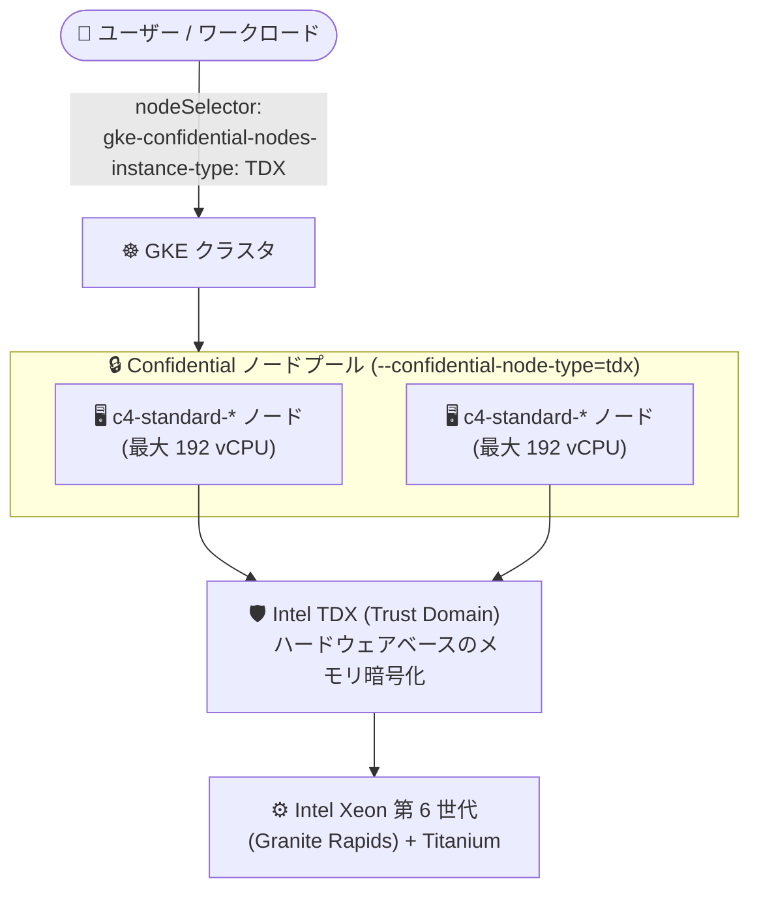

# Google Kubernetes Engine: Confidential GKE Nodes での C4 マシンタイプ (Intel TDX) サポートが GA

**リリース日**: 2026-10-05

**サービス**: Google Kubernetes Engine (GKE)

**機能**: Confidential GKE Nodes における c4-standard-* マシンタイプ (Intel TDX) のサポート

**ステータス**: GA (一般提供)

📊 [このアップデートのインフォグラフィックを見る](https://takech9203.github.io/google-cloud-news-summary/20261005-gke-confidential-nodes-c4-intel-tdx.html)

## 概要

GKE において、c4-standard-* マシンタイプ (最大 192 vCPU) を Intel TDX (Trust Domain Extensions) ベースの Confidential GKE Nodes として使用する機能が一般提供 (GA) になりました。Confidential GKE Nodes は Compute Engine の Confidential VM を利用し、ハードウェアベースのメモリ暗号化によって「使用中のデータ (data in use)」を保護する機能です。

C4 マシンシリーズは第 6 世代 Intel Xeon スケーラブルプロセッサ (Granite Rapids) と Google Titanium を組み合わせた高性能な汎用マシンシリーズで、Intel TDX による Confidential VM では最大 192 vCPU までサポートされます (Intel TDX は Granite Rapids プロセッサでのみ利用可能で、Emerald Rapids では利用できません)。今回の GA により、金融・医療・公共など機密性の高いワークロードを扱う組織が、最新世代の高性能マシンタイプ上でコンテナワークロードをメモリ暗号化付きで実行できるようになります。

このアップデートは、Compute Engine 側で 2026 年 7 月 31 日に Preview、2026 年 9 月 23 日に GA となった「Intel TDX on c4-standard-* マシンタイプ」のサポートを、GKE のノードとして正式に利用可能にするものです。

**アップデート前の課題**

- GKE で Intel TDX ベースの Confidential GKE Nodes を使う場合、GA 提供のマシンタイプは C3 シリーズ (c3-standard-*) が中心であり、最新世代の C4 シリーズを本番ワークロードで利用できなかった
- Granite Rapids 世代の性能 (全コアターボ 3.9 GHz、Intel AMX による ML 推論高速化など) と Confidential Computing を GKE 上で両立できなかった
- 大規模な機密ワークロードに対して、より大きな vCPU 構成 (最大 192 vCPU) の選択肢が限られていた

**アップデート後の改善**

- c4-standard-* マシンタイプ (最大 192 vCPU) を Confidential GKE Nodes として本番環境で利用可能になった
- Granite Rapids + Titanium による高い価格性能比と、Intel TDX によるハードウェアベースのメモリ暗号化を GKE 上で両立できるようになった
- クラスタレベル・ノードプールレベル・ワークロードレベル (ComputeClass) のいずれの有効化方法でも、C4 + TDX の組み合わせを選択できるようになった

## アーキテクチャ図



GKE クラスタのノードプールに c4-standard-* マシンタイプと Intel TDX を指定すると、各ノードが Trust Domain として分離され、メモリ上のデータがハードウェアで暗号化された状態でワークロードが実行されます。

## サービスアップデートの詳細

### 主要機能

1. **c4-standard-* マシンタイプの Confidential GKE Nodes サポート (GA)**
   - Intel TDX を使用する Confidential GKE Nodes として c4-standard-* マシンタイプが一般提供
   - Confidential VM としての Intel TDX は最大 192 vCPU までサポート
   - c4-standard は vCPU あたり 3.75 GB のメモリ構成

2. **Intel TDX によるメモリ暗号化と分離**
   - VM 内に分離された Trust Domain (TD) を作成し、ハードウェア拡張機能でメモリを管理・暗号化
   - DRAM の物理的な解析・改ざん・リプレイといった攻撃からの防御を強化
   - GKE クラスタのコントロールプレーンに対するセキュリティ対策は従来と変わらず維持される

3. **柔軟な有効化レベル**
   - **クラスタレベル**: Autopilot / Standard クラスタの作成時に有効化 (設定は取り消し不可、全ノードが Confidential GKE Nodes になる)
   - **ノードプールレベル**: Standard クラスタで特定のノードプールのみ有効化 (クラスタレベルで無効の場合のみ)
   - **ワークロードレベル**: ComputeClass で Confidential GKE Nodes を構成し、ワークロードから選択

## 技術仕様

### C4 マシンシリーズと Intel TDX

| 項目 | 詳細 |
|------|------|
| CPU | 第 6 世代 Intel Xeon スケーラブルプロセッサ (Granite Rapids)。Intel TDX は Emerald Rapids では利用不可 |
| Confidential VM の最大 vCPU | 192 vCPU (c4-standard-*) |
| メモリ | c4-standard は vCPU あたり 3.75 GB |
| 周波数 (Granite Rapids) | 全コアターボ 3.9 GHz / 最大ターボ 4.2 GHz |
| インフラ | Google Titanium IPU |
| アクセラレータ | Intel AMX (深層学習の学習・推論を CPU 上で高速化) |

### GKE バージョン要件 (Intel TDX)

| クラスタ構成 | 必要な GKE バージョン |
|------|------|
| Standard クラスタ (Container-Optimized OS) | 1.32.2-gke.1297000 以降 |
| Standard クラスタ (Ubuntu) | 1.33.5-gke.1697000 以降、または 1.34.1-gke.2909000 以降 |
| Autopilot クラスタ (クラスタレベル) | 1.35.2-gke.1485000 以降 |
| ワークロードレベル (ComputeClass) | 1.33.3-gke.1392000 以降 |

### ワークロードの配置 (node selector)

ノードプールレベルで有効化した場合は、node selector で Intel TDX ノードへの配置を宣言的に指定します。

```yaml
apiVersion: v1
kind: Pod
spec:
  nodeSelector:
    cloud.google.com/gke-confidential-nodes-instance-type: "TDX"
```

## 設定方法

### 前提条件

1. 上記の GKE バージョン要件を満たすクラスタであること
2. ノードが Intel TDX をサポートするマシンタイプ (c4-standard-* など) を使用すること
3. クラスタのコントロールプレーンとノードが、Intel TDX (c4-standard-*) をサポートするロケーションにあること

### 手順

#### ステップ 1: Confidential GKE Nodes を有効にしたノードプールを作成

```bash
gcloud container node-pools create NODE_POOL_NAME \
    --location=LOCATION \
    --cluster=CLUSTER_NAME \
    --machine-type=c4-standard-192 \
    --node-locations=ZONE1,ZONE2 \
    --confidential-node-type=tdx
```

`--confidential-node-type=tdx` を指定することで、Intel TDX を使用する Confidential GKE Nodes のノードプールが作成されます。ゾーンは c4-standard-* の Intel TDX 対応ゾーンから選択します。

#### ステップ 2: クラスタレベルで有効化する場合 (作成時のみ・取り消し不可)

```bash
gcloud container clusters create CLUSTER_NAME \
    --location=LOCATION \
    --machine-type=c4-standard-96 \
    --node-locations=ZONE1,ZONE2 \
    --confidential-node-type=tdx
```

クラスタレベルで有効化すると、すべてのワークロードが Confidential GKE Nodes 上で実行され、マニフェストの変更は不要です。この設定は取り消しできない点に注意してください。

#### ステップ 3: ワークロードを Confidential ノードに配置

```bash
kubectl apply -f - <<EOF
apiVersion: v1
kind: Pod
metadata:
  name: confidential-app
spec:
  containers:
  - name: confidential-app
    image: us-docker.pkg.dev/google-samples/containers/gke/hello-app:1.0
  nodeSelector:
    cloud.google.com/gke-confidential-nodes-instance-type: "TDX"
EOF
```

## メリット

### ビジネス面

- **コンプライアンス対応の強化**: 使用中のデータの暗号化により、機密データを扱う規制業種 (金融、医療、公共など) のコンテナワークロードをクラウドに移行しやすくなる
- **GA による本番利用**: 一般提供となったことで、SLA の対象として本番ワークロードに安心して採用できる

### 技術面

- **最新世代の性能と機密性の両立**: Granite Rapids + Titanium による高い価格性能比 (全コアターボ 3.9 GHz、Intel AMX) と、Intel TDX のハードウェアベースのメモリ暗号化を同時に享受できる
- **大規模ワークロードへの対応**: 最大 192 vCPU の大型ノードで、スケールの大きい機密ワークロードを集約できる
- **既存ワークフローとの親和性**: クラスタ / ノードプール / ComputeClass (ワークロード) の 3 レベルで有効化でき、既存クラスタにもノードプール単位で段階的に導入できる

## デメリット・制約事項

### 制限事項 (Intel TDX の Confidential VM)

- Intel TDX は最大 192 vCPU までのサポート (C4 シリーズ自体は最大 288 vCPU)
- Intel TDX は Granite Rapids プロセッサでのみ利用可能 (Emerald Rapids は非対応)
- Local SSD は c3-standard-*-lssd マシンタイプでのみサポート (C4 の -lssd は対象外)
- 標準 VM と比べてシャットダウンに時間がかかる (メモリサイズに比例して増加)
- 単一テナントノード (sole-tenant node) 上にはプロビジョニングできない
- Intel TDX の Confidential VM は予約 (reservations) をサポートしない
- セキュリティ上の制約により CPUID 命令が返す CPU アーキテクチャ情報が制限される場合があり、依存するワークロードの性能に影響する可能性がある
- kdump はサポートされない (ゲストコンソールログを使用)

### 考慮すべき点

- クラスタレベルでの有効化は取り消し不可。段階的導入にはノードプールレベルまたは ComputeClass での有効化が推奨される
- ノード自動プロビジョニング (auto-provisioned node pools) でサポートされるのは AMD SEV / SEV-SNP のみで、Intel TDX は手動作成のノードプールで使用する
- c4-standard-* の Intel TDX 対応ゾーンは限定されているため、クラスタ設計時にゾーンの対応状況を確認する必要がある
- 既存ノードプールを更新して有効化する場合、選択中のゾーンがすべて対応ゾーンである必要がある

## ユースケース

### ユースケース 1: 規制業種における機密データ処理基盤

**シナリオ**: 金融機関が顧客の取引データを処理するマイクロサービス群を GKE で運用しており、「使用中のデータ」も暗号化するというセキュリティ要件がある。高スループットが必要なため最新世代の CPU を使いたい。

**実装例**:
```bash
gcloud container node-pools create confidential-pool \
    --location=us-central1 \
    --cluster=prod-cluster \
    --machine-type=c4-standard-96 \
    --node-locations=us-central1-a,us-central1-b \
    --confidential-node-type=tdx
```

**効果**: アプリケーションを変更することなく、ノードプール単位でメモリ暗号化された実行環境を導入でき、既存の非機密ワークロードと同一クラスタで共存させられる。

### ユースケース 2: CPU ベースの機密 ML 推論

**シナリオ**: 医療データを扱う ML 推論サービスで、モデルへの入力データ (患者情報) をメモリ上でも保護したい。GPU を使わず CPU 推論でコストを抑えたい。

**効果**: C4 がサポートする Intel AMX によって CPU 上での深層学習推論を高速化しつつ、Intel TDX の Trust Domain 内で入力データとモデルをメモリ暗号化した状態で処理できる。

## 料金

Confidential VM (Intel TDX) の利用には、ベースとなる C4 マシンタイプの料金に加えて Confidential Computing の料金が適用されます。最新の料金は公式ページを参照してください。

- [Confidential VM の料金](https://docs.cloud.google.com/confidential-computing/confidential-vm/pricing)
- [Compute Engine VM インスタンスの料金 (C4)](https://cloud.google.com/compute/vm-instance-pricing)
- [GKE の料金](https://cloud.google.com/kubernetes-engine/pricing)

なお、C4 マシンシリーズは確約利用割引 (CUD)、Spot VM に対応していますが、Intel TDX の Confidential VM インスタンスは予約 (reservations) に対応していません。

## 利用可能リージョン

c4-standard-* マシンタイプでの Intel TDX は、以下のゾーンでサポートされます (公式ドキュメント「Supported configurations」より)。

| リージョン | ゾーン |
|------|------|
| asia-southeast1 | a, b, c |
| europe-west1 | b |
| europe-west3 | a, b |
| europe-west4 | a, b |
| us-central1 | a, b, f |
| us-east4 | a, b, c |
| us-west1 | a |

最新の対応ゾーンは [Supported configurations](https://docs.cloud.google.com/confidential-computing/confidential-vm/docs/supported-configurations#supported-zones) を参照してください。

## 関連サービス・機能

- **Compute Engine Confidential VM**: Confidential GKE Nodes の基盤となる技術。Intel TDX on c4-standard-* は Compute Engine 側で 2026 年 9 月 23 日に GA 済み
- **ComputeClass**: ワークロードレベルで Confidential GKE Nodes (TDX を含む) を構成するための GKE のカスタムコンピューティングクラス機能
- **Confidential mode for Hyperdisk Balanced / 機密ストレージ**: ノード作成時に `--enable-confidential-storage` と Cloud KMS キーを指定することで、ブートディスクの機密モードを有効化可能
- **cc-device-plugin**: Confidential GKE Nodes 上の Pod に整合性・セキュリティ情報 (アテステーション) を公開するデバイスプラグイン (Container-Optimized OS ノードが必要)
- **Access Transparency**: クラスタコントロールプレーンへのアクセスの可視化に利用可能

## 参考リンク

- 📊 [インフォグラフィック](https://takech9203.github.io/google-cloud-news-summary/20261005-gke-confidential-nodes-c4-intel-tdx.html)
- [公式リリースノート](https://docs.cloud.google.com/release-notes#October_05_2026)
- [Confidential GKE Nodes でワークロードを暗号化する](https://docs.cloud.google.com/kubernetes-engine/docs/how-to/confidential-gke-nodes)
- [Confidential VM の概要](https://docs.cloud.google.com/confidential-computing/confidential-vm/docs/confidential-vm-overview)
- [サポートされる構成 (マシンタイプ・ゾーン)](https://docs.cloud.google.com/confidential-computing/confidential-vm/docs/supported-configurations)
- [C4 マシンシリーズ (汎用マシンファミリー)](https://docs.cloud.google.com/compute/docs/general-purpose-machines#c4_series)
- [Confidential VM の料金](https://docs.cloud.google.com/confidential-computing/confidential-vm/pricing)

## まとめ

最新世代の C4 マシンタイプ (最大 192 vCPU) を Intel TDX ベースの Confidential GKE Nodes として GA で利用できるようになり、高性能と機密性を両立したコンテナ基盤の選択肢が広がりました。機密データを扱う GKE ワークロードを運用している場合は、まずノードプールレベルまたは ComputeClass で段階的に導入し、対応ゾーンと GKE バージョン要件を確認した上で C4 + TDX への移行を検討することをおすすめします。

---

**タグ**: #GKE #ConfidentialComputing #IntelTDX #C4 #ConfidentialVM #セキュリティ #GA
