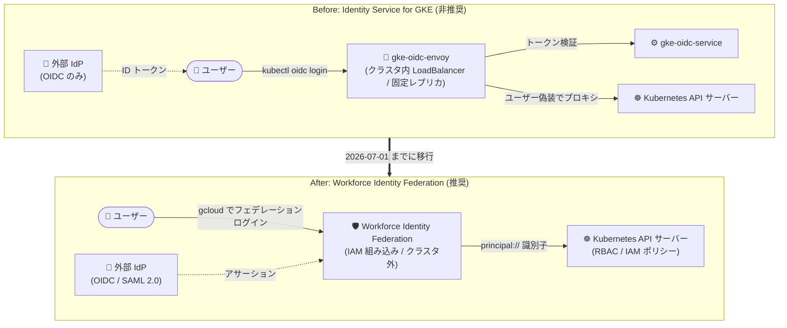

# Google Kubernetes Engine: Identity Service for GKE の非推奨化と Workforce Identity Federation への移行

**リリース日**: 2026-10-05

**サービス**: Google Kubernetes Engine (GKE)

**機能**: Identity Service for GKE の非推奨化

**ステータス**: Deprecated (非推奨)

📊 [このアップデートのインフォグラフィックを見る](https://takech9203.github.io/google-cloud-news-summary/20261005-gke-identity-service-deprecation.html)

## 概要

Google Cloud は、外部 ID プロバイダー (IdP) から GKE クラスタへの認証を提供してきた **Identity Service for GKE** の非推奨化を発表しました。2026 年 7 月 1 日より、GKE バージョン 1.36 以前において Identity Service for GKE は非推奨となります。また、2025 年 7 月 1 日以降に作成された組織では、この機能はすでに利用できません。GKE バージョン 1.37 以降では Identity Service for GKE はサポートされず、この機能を有効にしたままのクラスタは 1.37 以降へアップグレードできません。

後継として推奨されるのは IAM の機能である **Workforce Identity Federation** です。Workforce Identity Federation は OIDC に加えて SAML 2.0 もサポートし、クラスタ内へのコンポーネントのインストールが不要で、IAM と統合されています。Autopilot クラスタと Standard クラスタの両方で動作します。

この非推奨化は **Google Cloud 上で動作する GKE クラスタのみ** が対象です。Connect Gateway および Google Distributed Cloud (software only) 製品で利用可能な GKE Identity Service は非推奨の対象外です。

**アップデート前の課題 (Identity Service for GKE の制限)**

- OIDC IdP にのみ対応しており、SAML 2.0 には対応していなかった
- `gke-oidc-envoy`、`gke-oidc-service`、`gke-oidc-operator` などの追加コンポーネントをクラスタ内 (`anthos-identity-service` Namespace) にインストールする必要があった
- 認証を担う `gke-oidc-envoy` コンポーネントはレプリカ数が固定 (リージョナルクラスタで 3 レプリカ) で、トラフィック増加に応じた自動スケーリングができなかった
- GKE Standard クラスタのみの対応で、Autopilot クラスタでは利用できなかった

**アップデート後の改善 (Workforce Identity Federation への移行)**

- OIDC または SAML 2.0 をサポートする任意の外部 IdP から認証可能になる
- クラスタ内へのコンポーネントのインストールが不要になり、Google Cloud に組み込みの仕組みで認証できる
- IAM と統合され、Kubernetes RBAC と IAM 許可ポリシーの両方でアクセス制御が可能になる
- Autopilot クラスタと Standard クラスタの両方で動作する

## アーキテクチャ図



Identity Service for GKE はクラスタ内に認証プロキシ群をデプロイする方式でしたが、Workforce Identity Federation ではクラスタ内コンポーネントが不要になり、IAM に組み込まれたフェデレーション基盤経由で Kubernetes API サーバーに認証します。

## サービスアップデートの詳細

### 非推奨化のタイムラインとマイルストーン

| 日付 | マイルストーン |
|------|---------------|
| 2025 年 7 月 1 日 | この日以降に作成された Google Cloud 組織では Identity Service for GKE は利用不可 |
| 2026 年 7 月 1 日 | GKE バージョン 1.36 以前で Identity Service for GKE が非推奨化。これらのバージョンではマイナーバージョンのサポート終了日まで引き続き利用可能。バージョン 1.37 以降ではサポートされない |

### バージョン 1.37 以降へのアップグレードブロック

1. **自動・手動アップグレードのブロック**
   - Identity Service for GKE を使用しているクラスタは、バージョン 1.37 以降への自動・手動アップグレードが GKE によってブロックされる
   - 自動アップグレードは、該当マイナーバージョンの標準サポート終了まで一時停止される (Extended チャンネル登録クラスタは延長サポート終了まで)

2. **サポート終了後の強制アップグレードのリスク**
   - マイナーバージョンがサポート終了日に達すると、GKE はクラスタを次のマイナーバージョンへ自動アップグレードする
   - その時点で Identity Service for GKE が有効なままの場合、**認証ワークフローが失敗する**

3. **対象範囲**
   - 対象は Google Cloud 上で動作する GKE クラスタのみ
   - Connect Gateway および Google Distributed Cloud (software only) で利用可能な GKE Identity Service は非推奨の対象外

## 技術仕様

### プリンシパル識別子の構文の違い

Workforce Identity Federation では、RBAC ポリシーで参照するユーザー・グループの識別子構文が変わります。

| 対象 | Identity Service for GKE の構文 | Workforce Identity Federation の構文 |
|------|-------------------------------|--------------------------------------|
| 単一ユーザー | `amal@example.com` | `principal://iam.googleapis.com/locations/global/workforcePools/full-time-employees/subject/amal@example.com` |
| グループ | `sre-group` | `principalSet://iam.googleapis.com/locations/global/workforcePools/full-time-employees/group/sre-group` |

グループ識別子を使用するには、IdP トークンのアサーションを Google Cloud の `google.groups` 属性に属性マッピングする必要があります。なお、RBAC ではユーザーとグループのプリンシパル識別子のみサポートされ、IdP トークンに含まれるその他のカスタムアサーションは参照できません。

### Workforce Identity Federation を使った RBAC の例

```yaml
apiVersion: rbac.authorization.k8s.io/v1
kind: ClusterRoleBinding
metadata:
  name: users-view-secrets
subjects:
- kind: Group
  name: principalSet://iam.googleapis.com/locations/global/workforcePools/full-time-employees/group/sre
  apiGroup: rbac.authorization.k8s.io
roleRef:
  kind: ClusterRole
  name: secret-viewer
  apiGroup: rbac.authorization.k8s.io
```

## 設定方法 (移行手順)

### 前提条件

1. OIDC または SAML 2.0 をサポートする外部 IdP を利用していること
2. gcloud CLI が最新バージョンにアップデートされていること

### 手順

#### ステップ 1: Workforce Identity Federation のセットアップ

組織と外部 IdP に対して Workforce Identity Federation を構成します。手順は公式ドキュメントの [Configure Workforce Identity Federation](https://docs.cloud.google.com/iam/docs/configuring-workforce-identity-federation) を参照してください。

#### ステップ 2: RBAC バインディングの更新

クラスタ内の RoleBinding / ClusterRoleBinding のマニフェストを、Workforce Identity Federation の識別子構文に更新します。

- **プログラムによる更新**: `gke-identity-service-migrator` ツールをインストールして実行します。このツールは Identity Service for GKE の構文を使用している既存の RBAC バインディングを検出し、対応する Workforce Identity Federation プリンシパル識別子を使用する新しいマニフェストを作成します。手順は [GoogleCloudPlatform/gke-utilities リポジトリの README](https://github.com/GoogleCloudPlatform/gke-utilities/tree/main) を参照してください。
- **手動更新**: 認証済みユーザーまたはグループを参照するすべてのバインディングについて、Workforce Identity Federation の識別子構文を使用するマニフェストのコピーを作成します。

```bash
# 更新したマニフェストをクラスタに適用
kubectl apply -f updated-rolebinding.yaml
```

#### ステップ 3: 動作確認と旧バインディングの削除

Workforce Identity Federation で認証したユーザーが同じリソースにアクセスできることをテストし、不要になった旧 RBAC バインディングをクラスタから削除します。

#### ステップ 4: Identity Service for GKE の無効化

```bash
gcloud container clusters update CLUSTER_NAME \
    --no-enable-identity-service
```

無効化が完了すると、クラスタをバージョン 1.37 以降へアップグレードできるようになります。

#### ステップ 5: ユーザーのアクセス方法の案内

移行後、ユーザーは以下の手順でクラスタにアクセスします。

```bash
# フェデレーション ID で gcloud CLI にサインインした後
gcloud container clusters get-credentials CLUSTER_NAME
```

## メリット

### ビジネス面

- **運用負荷の削減**: クラスタ内の認証コンポーネント (gke-oidc-envoy など) の管理が不要になり、認証基盤の運用を Google Cloud (IAM) に任せられる
- **IdP の選択肢拡大**: OIDC に加えて SAML 2.0 ベースの IdP も利用可能になる

### 技術面

- **スケーラビリティ**: 固定レプリカの gke-oidc-envoy によるスケーリング制限が解消される
- **IAM 統合**: Kubernetes RBAC に加えて IAM 許可ポリシーでもアクセス制御が可能
- **Autopilot 対応**: Standard クラスタに限定されず、Autopilot クラスタでも利用できる
- **移行ツールの提供**: `gke-identity-service-migrator` により RBAC バインディングの書き換えを自動化できる

## デメリット・制約事項

### 制限事項

- Identity Service for GKE を有効にしたままのクラスタは、GKE 1.37 以降へアップグレードできない
- マイナーバージョンのサポート終了後に自動アップグレードされた際に Identity Service for GKE が有効なままだと、認証ワークフローが失敗する
- Workforce Identity Federation の RBAC ではユーザーとグループのプリンシパル識別子のみ参照可能で、IdP トークン内のカスタムアサーションは参照できない
- ヘッドレスシステムは Workforce Identity Federation・Identity Service for GKE のいずれでもサポートされない (ブラウザベースの認証フローが必要)

### 考慮すべき点

- RBAC バインディングの識別子構文が大きく変わるため (`principal://` / `principalSet://` 形式)、既存のすべての RoleBinding / ClusterRoleBinding の棚卸しが必要
- グループベースのバインディングを使う場合は、IdP アサーションから `google.groups` 属性への属性マッピングの設定が必要
- 2025 年 7 月 1 日以降に作成された組織ではすでに Identity Service for GKE を利用できないため、新規環境では最初から Workforce Identity Federation を採用する必要がある

## ユースケース

### ユースケース 1: 1.37 アップグレードを控えたクラスタの計画的移行

**シナリオ**: Identity Service for GKE で社内 OIDC IdP と連携している GKE Standard クラスタを運用しており、GKE 1.37 以降へのアップグレードを計画している。

**実装例**:
```bash
# 1. gke-identity-service-migrator で既存 RBAC バインディングを変換
# 2. 変換後のマニフェストを適用してテスト
kubectl apply -f migrated-bindings/

# 3. Identity Service for GKE を無効化
gcloud container clusters update my-cluster --no-enable-identity-service
```

**効果**: アップグレードブロックを解消し、サポート終了時の強制アップグレードによる認証障害を回避できる。

### ユースケース 2: SAML 2.0 IdP を使う組織の外部認証統合

**シナリオ**: SAML 2.0 のみをサポートする既存の企業 IdP から GKE クラスタへの認証を統合したい。

**効果**: Identity Service for GKE では OIDC のみだったが、Workforce Identity Federation は SAML 2.0 に対応しており、クラスタ内コンポーネントなしで企業 IdP との認証統合を実現できる。

## 関連サービス・機能

- **Workforce Identity Federation (IAM)**: Identity Service for GKE の後継として推奨される、外部 IdP (OIDC / SAML 2.0) から Google Cloud への認証を実現する IAM 機能
- **Kubernetes RBAC**: Workforce Identity Federation のプリンシパル識別子を使用してクラスタ内のアクセス制御を定義
- **IAM 許可ポリシー**: RBAC の代替・補完として、Workforce Identity Federation ユーザーに IAM ロールを付与してクラスタアクセスを制御可能
- **Connect Gateway / Google Distributed Cloud**: これらで利用される GKE Identity Service は今回の非推奨の対象外

## 参考リンク

- 📊 [インフォグラフィック](https://takech9203.github.io/google-cloud-news-summary/20261005-gke-identity-service-deprecation.html)
- [公式リリースノート](https://docs.cloud.google.com/release-notes#October_05_2026)
- [Identity Service for GKE deprecation (非推奨化ドキュメント)](https://docs.cloud.google.com/kubernetes-engine/docs/deprecations/identity-service)
- [外部 IdP からの GKE クラスタ認証 (Workforce Identity Federation / OIDC)](https://docs.cloud.google.com/kubernetes-engine/docs/how-to/oidc)
- [Configure Workforce Identity Federation](https://docs.cloud.google.com/iam/docs/configuring-workforce-identity-federation)
- [gke-identity-service-migrator (GoogleCloudPlatform/gke-utilities)](https://github.com/GoogleCloudPlatform/gke-utilities/tree/main)

## まとめ

Identity Service for GKE は 2026 年 7 月 1 日に GKE 1.36 以前で非推奨となり、1.37 以降ではサポートされません。この機能を有効にしたクラスタは 1.37 以降へのアップグレードがブロックされ、サポート終了後の強制アップグレード時には認証障害が発生するため、該当クラスタを運用している場合は `gke-identity-service-migrator` ツールなどを活用して早期に Workforce Identity Federation への移行計画を立てることを強く推奨します。

---

**タグ**: #GKE #IdentityServiceForGKE #WorkforceIdentityFederation #Deprecated #IAM #OIDC #SAML #Kubernetes #RBAC
